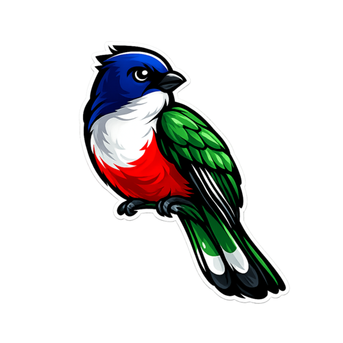

  

# TrogonAi

**TrogonAi is a fully distributed agentic platform built on event sourcing and message passing.** It provides the infrastructure for deploying, orchestrating, and scaling autonomous AI agents across distributed systems.

**Agents communicate through immutable event streams, making every interaction auditable, replayable, and composable.** The platform handles agent lifecycle management, inter-agent coordination, and durable state — so you can focus on agent behavior rather than distributed systems plumbing.

**Building reliable multi-agent systems today means stitching together queues, databases, orchestrators, and custom glue code.** TrogonAi replaces that patchwork with a single platform where event sourcing gives you a built-in audit trail, message passing gives you loose coupling, and immutability gives you correctness guarantees — all without sacrificing the ability to scale horizontally.

**TrogonAi is for teams building production AI agent systems that need to be observable, resilient, and scalable.** Whether you're running a handful of cooperating agents or coordinating thousands across a cluster, the platform provides the primitives to do it without reinventing distributed infrastructure.

---

## Getting Started

Visit [`./rsworkspace`](rsworkspace/) to explore the Rust components and their documentation.
