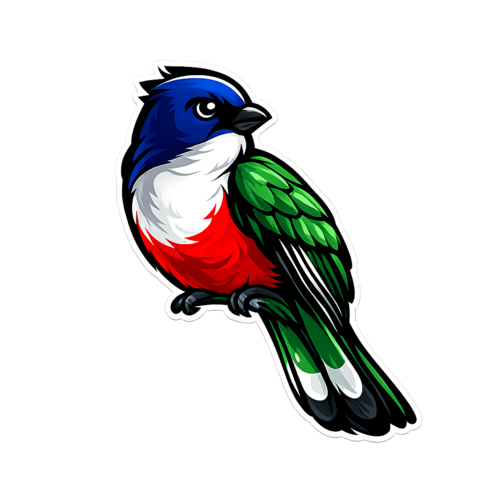

  

# TrogonAi

**TrogonAi is a distributed agentic platform for coordinating autonomous AI agents across services and runtimes.** It provides infrastructure for deploying, orchestrating, and scaling agents in systems where work crosses process and network boundaries.

**Agents communicate through explicit boundaries, making coordination observable, composable, and resilient.** The platform handles agent lifecycle management, inter-agent communication, and durable state so teams can focus on agent behavior instead of distributed systems plumbing.

**Building reliable multi-agent systems today means stitching together queues, databases, orchestrators, and custom glue code.** TrogonAi replaces that patchwork with a platform shaped around distributed architecture primitives: clear service boundaries, durable coordination, observable execution, and horizontal scale.

**TrogonAi is for teams building production AI agent systems that need to be observable, resilient, and scalable.** Whether you're running a handful of cooperating agents or coordinating thousands across a cluster, the platform provides the primitives to do it without reinventing distributed infrastructure.

---

## Project Areas

- [`docs/`](docs/) - Documentation website and contribution workflow.
- [`rsworkspace/`](rsworkspace/) - Rust components and crate documentation.
