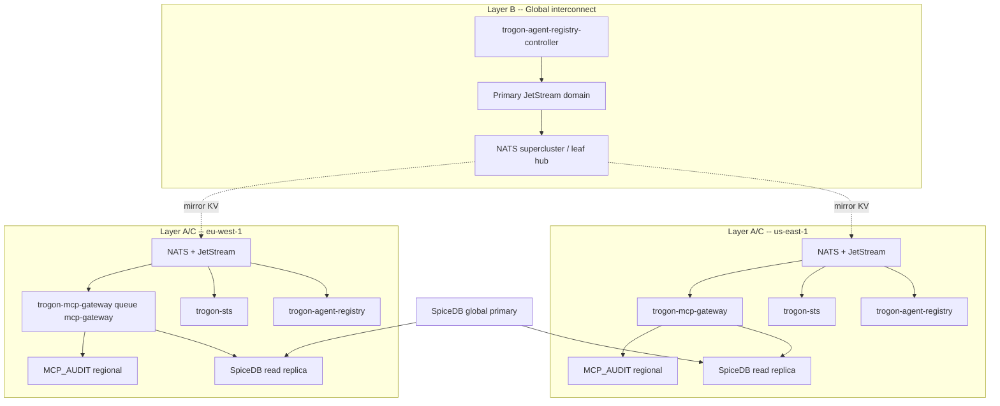

# ADR 0016: Multi-region deployment topology

| Field | Value |
|-------|-------|
| **Status** | Accepted (2026-05-28) |
| **Date** | 2026-05-28 |
| **Deciders** | *(platform security / mcp gateway -- TBD)* |
| **Blocks** | `MCP_GATEWAY_PLAN.md` Block G item 5 (multi-region story: leaf-node deployment patterns, audit-stream replication, SpiceDB topology) |
| **Related** | [multi-region.md](../identity/multi-region.md) (design context); [k8s-controller.md](../identity/k8s-controller.md); [failure-mode-matrix.md](../identity/failure-mode-matrix.md); [integration-touchpoints.md](../identity/integration-touchpoints.md); [ADR 0001](0001-tenancy-model.md); [ADR 0003](0003-bootstrap-vs-mesh-tokens.md); [ADR 0004](0004-sts-form-factor.md); [ADR 0006](0006-mesh-token-signing-keys.md) |

## Context

Production MCP gateway deployments today assume a **single NATS cluster** colocated with the gateway fleet, SpiceDB, and JetStream KV. That shape works for one geography but fails when customers operate across regions (`us-east-1`, `eu-west-1`, and similar) and need predictable latency, residency, and globally consistent policy.

**Operator constraints that must hold simultaneously:**

| Constraint | Requirement | What breaks if ignored |
|------------|-------------|------------------------|
| **In-region enforcement latency** | Gateway-added policy work (registry, SpiceDB, CEL, regional STS mint) must stay **p95 &lt; 5 ms** without cross-WAN hops on the hot path | Stretching one NATS cluster or one global queue group across continents adds RTT to every `tools/call` |
| **Global policy consistency** | Revoked agents, trust bundles, mesh JWKS, and active policy pointers must **converge everywhere** without per-region Git edits | Per-region isolation causes bundle drift and identity drift; revocation in one region does not protect another |
| **Data residency** | Audit envelopes, session KV, schema warm cache, and anomaly features must remain in the tenant's declared geography (EU-only, US-only) | Default cross-region audit mirror or shared JetStream domain copies regulated metadata across borders |
| **Tenancy** | Hard isolation remains NATS account per tenant ([ADR 0001](0001-tenancy-model.md)); region is a second axis, not a subject segment | Shared subject space plus wrong region placement leaks tenant data |

Customers declare allowed regions on Kubernetes (**proposed** `MCPTenant.spec.regions`); the controller and gateway must enforce that declaration at provision time and runtime. Residency rules that cannot be expressed in CRD form force operators into brittle firewall exceptions.

The design context, topology diagrams, consistency tables, and operator runbooks live in [multi-region.md](../identity/multi-region.md). This ADR records the **durable partitioning choice**: what is regional vs global, how NATS interconnects, and how SpiceDB and audit streams participate.

**What stays undecided if this ADR is not accepted:**

- Block G operational work (mirrors, supercluster wiring, regional gateway Helm) forks between "stretch single cluster" and "true multi-region" with no migration story.
- K8s controller v2 ([k8s-controller.md](../identity/k8s-controller.md)) cannot project `spec.regions` into NATS accounts and mirror targets.
- Failure-mode defaults ([failure-mode-matrix.md](failure-mode-matrix.md)) for STS issuer outage, SpiceDB replica staleness, and KV mirror lag lack a single topology reference.

## Decision

**Three-layer topology.**

**(a) Per-region local NATS cluster (mandatory).** Each production region runs an independent JetStream-capable NATS deployment: core NATS for request/reply (`mcp.gateway.request.>`, `mcp.sts.exchange`, `mcp.registry.agent.lookup`), regional JetStream for `MCP_AUDIT`, `mcp-sessions`, `mcp-rate-limits`, and **regional replicas** of mirrored control-plane KV. NATS accounts per tenant ([ADR 0001](0001-tenancy-model.md)) exist **only** in regions listed for that tenant. Subject grammar does not gain a `{region}` segment.

**(b) Global NATS supercluster / leafnodes (selective interconnect).** Regions peer via NATS supercluster routes or leafnode attachment to a hub. Cross-region traffic carries **only** globally consistent control-plane data via **JetStream KV mirror** from a designated primary (or hub) domain:

| Design alias (planning) | Canonical KV bucket | Mirror direction |
|-------------------------|---------------------|------------------|
| `mcp-policy-bundles` | `mcp-gateway-config` | Primary to all allowed regions |
| `mcp-trust-bundles` | `mcp-trust-bundles` | Primary to all regions that verify the trust domain |
| `agent-registry` | `mcp-agent-registry` | Primary to all regions (`trogon-agent-registry-controller` writes primary only) |
| Mesh JWKS | `mcp-jwks` / `mesh/current` | Primary to all regions ([ADR 0006](0006-mesh-token-signing-keys.md)) |

Core pub/sub for gateway ingress **never** crosses regions. Clients connect to the regional NATS URL for `mcp.gateway.request.>`; WAN RTT must not sit on the MCP hot path.

**(c) Per-region gateway fleet (mandatory).** `trogon-mcp-gateway` joins queue group `mcp-gateway` **only within its region**. `trogon-sts` uses regional queue group `trogon-sts`; `trogon-agent-registry` uses `trogon-agent-registry` regionally. Horizontal scale is per region; **one queue group must not span regions** (NATS would deliver work to the wrong continent).

**SpiceDB:** **One global primary** cluster for schema and relationship writes; **regional read replicas** serve `CheckBulkPermissions` on the gateway hot path with existing `minimize_latency` / `at_least_as_fresh` semantics ([integration-touchpoints.md](../identity/integration-touchpoints.md)).

**Audit:** Envelopes publish to **regional** JetStream stream `MCP_AUDIT` only. **Cross-region aggregation** is an **opt-in** JetStream **source** stream pulling from regional origins; default is **off** for residency. EU-only tenants must not wire sources to US streams.

**STS mesh issuer:** **Single global issuer** (one custody backend and one JWKS document per [ADR 0006](0006-mesh-token-signing-keys.md)); regional `trogon-sts` replicas sign and verify with the same `kid`. Issuer region failure: verify continues on cached JWKS until `exp`; **new mesh mint fails closed** ([ADR 0003](0003-bootstrap-vs-mesh-tokens.md) enforce path).

**Residency declaration:** **`MCPTenant.spec.regions`** (proposed CRD) is the allow-list of region IDs where the tenant's NATS accounts, gateways, and backends may run; optional `residencyPolicy` / `auditExport` gate mirror and source wiring ([k8s-controller.md](../identity/k8s-controller.md)).

## Consequences

### Positive

- **Low-latency local enforcement:** Hot path stays in-region (gateway queue, regional registry R/R, regional SpiceDB replica, regional STS exchange). Cross-region operations are control-plane and SLO'd at hundreds of milliseconds, not single-digit milliseconds.
- **Residency by default:** Regional `MCP_AUDIT`, no session KV mirror, no cross-region schema cache mirror; regulated tenants keep audit bytes in declared geography unless `auditExport` explicitly opts in.
- **Global consistency for control plane:** Policy active pointer, trust bundles, agent registry, and mesh JWKS propagate via KV mirror with bounded lag (target p95 2--5 s per bucket class in [multi-region.md](../identity/multi-region.md)).
- **Aligned with existing ADRs:** Tenancy ([0001](0001-tenancy-model.md)), NATS STS form factor ([0004](0004-sts-form-factor.md)), global mesh signing ([0006](0006-mesh-token-signing-keys.md)) extend naturally into regional replicas plus global SoT.

### Negative

- **STS issuer single-source:** One logical signing custody (KMS/Vault) and primary JWKS publisher. Issuer region outage blocks **new** mesh JWT mint everywhere while verify may continue on overlap keys -- a **single point of failure for new mesh tokens** until rehearsed failover ([failure-mode-matrix.md](../identity/failure-mode-matrix.md) row 13 class).
- **SpiceDB read-replica staleness:** Regional gateways depend on `ZedToken` freshness; `at_least_as_fresh` failure defaults **CLOSED** (`-32107` class). Staleness is bounded by replication and token propagation, not eliminated.
- **KV mirror lag vs revocation:** Registry and bundle updates are **eventual** cross-region; mirror lag incidents can briefly serve stale `active` agents until primary write and mirror catch up -- operators treat lag as an incident class ([registry-operations.md](../identity/registry-operations.md)).
- **Operational surface:** Supercluster/leaf hub, per-region JetStream domains, mirror definitions, and primary-region controller placement add SRE work beyond single-cluster bootstrap.

### Neutral

- **Cross-region audit aggregation is opt-in** via JetStream source; default denies copying audit metadata out of allow-listed regions.
- **`MCPTenant.spec.regions`** declares residency; gateway checks `MCP_GATEWAY_REGION` against projected tenant config (**proposed** runtime path).
- **Policy bucket naming:** Planning text uses `mcp-policy-bundles`; implemented bucket remains `mcp-gateway-config` until a deliberate rename migration.
- **Region is not in MCP subjects or mesh `aud`:** Enforcement is connection placement + account provisioning + gateway config, not subject parsing ([ADR 0005](0005-token-ttl-and-audience.md)).

## Alternatives considered

### Single global NATS cluster (stretch one cluster across regions)

| Assessment | Detail |
|------------|--------|
| **Rejected** | WAN RTT blows the **&lt; 5 ms** in-region p95 budget; queue group `mcp-gateway` would deliver requests to workers on the wrong continent; JetStream coupling creates a single outage domain; audit and sessions cannot satisfy EU-only residency without impossible stream semantics. |

### Pure per-region isolation (no global interconnect)

| Assessment | Detail |
|------------|--------|
| **Rejected** | Independent Git/registry/policy per region causes **bundle drift** and **identity drift**; revoking an agent in one region leaves another active; mesh JWKS and trust bundles would diverge, breaking global agent semantics and [ADR 0006](0006-mesh-token-signing-keys.md) single-trust model. |

### SpiceDB cluster per region (or per tenant per region)

| Assessment | Detail |
|------------|--------|
| **Rejected** | No portable global relationship graph; `ZedToken` and revocation meaning differ by region; federation between SpiceDB clusters is unsolved for MCP's agent/tool/tenant tuples; conflicts with **global Git SoT** for `mcp-agent-registry`. **Chosen:** global primary + regional read replicas. |

### HTTP STS / xDS per region as primary control plane

| Assessment | Detail |
|------------|--------|
| **Deferred** | [ADR 0004](0004-sts-form-factor.md) keeps v1 exchange on `mcp.sts.exchange`; multi-region adds regional STS **replicas**, not a replacement transport. Block G v2 HTTP facade remains optional. |

### Active-active registry controller in every region

| Assessment | Detail |
|------------|--------|
| **Rejected for v1** | Dual writers to `mcp-agent-registry` risk split-brain; **primary region controller + KV mirror** is the SoT path ([multi-region.md](../identity/multi-region.md) section 5.3). |

## Implementation notes

### NATS and JetStream

| Work item | Notes |
|-----------|-------|
| **Per-region cluster** | Distinct JetStream domain per region (e.g. `js-eu-west`, `js-us-east`); identical stream **names** (`MCP_AUDIT`) are not one global stream. |
| **Supercluster / leafnode** | Symmetric supercluster for few regions; leaf spoke to corporate hub when applicable. Gateway **core** traffic does not transit hub -- clients use regional URL. |
| **KV mirrors** | Configure on each regional domain with upstream on primary: `mcp-agent-registry`, `mcp-trust-bundles`, `mcp-gateway-config`, `mcp-jwks`. **Not mirrored:** `mcp-sessions`, `mcp-rate-limits`, regional discovery entries. |
| **Audit source (optional)** | JetStream **source** from regional `MCP_AUDIT` to aggregation stream; wire only when `auditExport` allows; deny for `regional_only`. |
| **ACL / export** | Tenant isolation = NATS account ([ADR 0001](0001-tenancy-model.md)); region = account exists only in `spec.regions`. Export/import for MCP data plane subjects is **not** used cross-region. |

### Gateway and services (per region)

| Component | Configuration |
|-----------|---------------|
| `trogon-mcp-gateway` | `MCP_GATEWAY_REGION={id}`; queue `mcp-gateway`; ingress `{prefix}.gateway.request.>`; audit to local `MCP_AUDIT` |
| `trogon-sts` | Queue `trogon-sts`; `mcp.sts.exchange`; global issuer custody; KV JWKS watch |
| `trogon-agent-registry` | Queue `trogon-agent-registry`; read mirrored `mcp-agent-registry` only |
| SpiceDB client | gRPC to **nearest read replica**; writes via admin/CI to **global primary** |

### STS issuer (global -- cross-ref ADR 0003)

- Bootstrap/connect JWT remains perimeter credential ([ADR 0003](0003-bootstrap-vs-mesh-tokens.md)); mesh mint is regional STS calling **global** signing key.
- Regional outage: verify path uses cached JWKS; mint path **CLOSED** in enforce mode until custody healthy or standby promoted.
- Rotation runbook: overlap window >= max mesh TTL ([ADR 0005](0005-token-ttl-and-audience.md), [ADR 0006](0006-mesh-token-signing-keys.md)); roll gateways region-by-region after mirror lag OK.

### Kubernetes controller and residency CRD

**Proposed** ([k8s-controller.md](../identity/k8s-controller.md)) `trogon-mcp-gateway-controller` responsibilities:

```yaml
apiVersion: identity.trogon.ai/v1alpha1
kind: MCPTenant
metadata:
  name: acme
spec:
  regions:
    - eu-west-1
  residencyPolicy: strict
  auditExport: regional_only
```

| Field | Effect |
|-------|--------|
| `spec.regions` | Allow-list for NATS account + gateway + backend placement |
| `residencyPolicy: strict` | Deny audit source / mirror targets outside allow-list |
| `auditExport` | Optional aggregation exception (explicit second region) |

Controller projects tenant overlays into `mcp-gateway-config` per allowed region, provisions account JWT templates with region claim, targets **primary only** for registry controller writes, and configures mirror targets **only** for regions in `spec.regions`. Gateway runtime (**proposed**): reject ingress when tenant not allowed in `MCP_GATEWAY_REGION`; audit `deny` with `residency_violation` class.

### Wire contracts (unchanged)

Subjects and queue groups per [integration-touchpoints.md](../identity/integration-touchpoints.md):

| Service | Queue group | Subject(s) |
|---------|-------------|------------|
| `trogon-mcp-gateway` | `mcp-gateway` | `{prefix}.gateway.request.>` |
| `trogon-sts` | `trogon-sts` | `mcp.sts.exchange` |
| `trogon-agent-registry` | `trogon-agent-registry` | `mcp.registry.agent.lookup` |

### Failure and consistency (runtime expectations)

| Resource | Scope | Model |
|----------|-------|-------|
| Mesh JWKS | Global | Strong at issuer; eventual at replicas (1--5 s) |
| `mcp-agent-registry` | Global SoT | Eventual via mirror |
| `mcp-gateway-config` / bundle active | Global | Eventual via mirror |
| SpiceDB checks | Global graph | Strong on primary; bounded stale on replica |
| `MCP_AUDIT` | Regional | Strong per regional stream; no default cross-region consistency |
| Approvals / sessions | Regional | No mirror |

Region partition: in-region MCP continues with last-known mirror and JWKS -- **fail-closed for new revocations**, not fail-open to anonymous access ([failure-mode-matrix.md](../identity/failure-mode-matrix.md)).

### Latency budgets (planning)

| Path | p95 target |
|------|------------|
| In-region gateway policy (excl. backend) | &lt; 5 ms |
| Regional STS exchange (colocated) | &lt; 3 ms additive |
| Mirror visibility after primary write | &lt; 200 ms |
| Cross-region MCP hot path | **Must not occur** (deny fast if misrouted) |

## Status of supporting work

| Item | Status |
|------|--------|
| Design spec [multi-region.md](../identity/multi-region.md) | **Done** (2026-05-28 paper) |
| This ADR | **Accepted** (2026-05-28) |
| Per-region NATS + supercluster/leaf provisioning | **Pending** (Block G ops) |
| JetStream KV mirror definitions (`mcp-agent-registry`, `mcp-trust-bundles`, `mcp-gateway-config`, `mcp-jwks`) | **Pending** |
| Regional gateway / STS / registry Helm (queue groups scoped per region) | **Pending** |
| SpiceDB global primary + regional read replicas | **Pending** |
| `MCPTenant.spec.regions` + controller projection | **Pending** (K8s controller v2, [k8s-controller.md](../identity/k8s-controller.md)) |
| Gateway residency enforcement (`MCP_GATEWAY_REGION`, `residency_violation` audit) | **Pending** (proposed) |
| Optional audit JetStream source + `auditExport` policy | **Pending** (opt-in) |
| Mirror lag monitoring and registry rotation runbooks | **Pending** (proposed alerts) |
| Block G latency baseline CLI (same-region only) | **Pending** (`MCP_GATEWAY_PLAN.md` Block G) |
| Multi-region code in `trogon-mcp-gateway` / `trogon-sts` | **Not started** (topology is infra + config first) |

---

## Appendix A -- Three-layer diagram



## Appendix B -- Regional vs global asset matrix

| Asset | Scope | Cross-region mechanism |
|-------|-------|------------------------|
| STS mesh signing key | Global | KMS/Vault; JWKS via `mcp-jwks` mirror + HTTPS well-known |
| Agent registry | Global SoT | Git + controller on primary; `mcp-agent-registry` mirror |
| Policy bundles | Global OCI + KV pointer | `mcp-gateway-config` mirror (`mcp-policy-bundles` alias) |
| Trust bundles | Global per trust domain | `mcp-trust-bundles` mirror |
| Audit envelopes | Regional | Local `MCP_AUDIT`; optional source aggregate |
| Sessions / rate limits | Regional | No mirror |
| Schema warm cache | Regional | Miss = local backend only |
| Anomaly features | Regional | `mcp.metrics.anomaly.features` local publish |
| SpiceDB tuples | Global | Primary write; replica read on hot path |

## Appendix C -- EU-only tenant walkthrough

**Given:** `MCPTenant.spec.regions: [eu-west-1]`, `residencyPolicy: strict`, hard tenancy account `ACME_EU` only in EU cluster.

1. Agent connects to **EU** NATS; auth callout issues bootstrap JWT for `ACME_EU`.
2. `mcp.sts.exchange` on **EU** `trogon-sts`; registry lookup uses **EU** mirror of `mcp-agent-registry`.
3. `mcp.gateway.request.*` handled by **EU** `mcp-gateway` queue member.
4. SpiceDB `CheckBulkPermissions` via **EU** read replica.
5. Audit appended to **EU** `MCP_AUDIT` only.
6. Connection attempt to US NATS: account absent or gateway **CLOSED** with residency deny (**proposed**).

Revocation in global Git propagates to EU mirror within mirror SLO; no US JetStream receives EU audit bytes.

## Appendix D -- Operator checklist (condensed)

| Scenario | First actions |
|----------|----------------|
| JWKS / trust / policy rotation | Confirm mirror lag &lt; SLO; publish on primary; wait for regional KV watch; roll one region at a time |
| Drain region from tenant | Remove region from `spec.regions`; scale regional deployments to zero; disable mirror into region; revoke regional account creds |
| Stand up new region | Join supercluster; configure mirrors; deploy SpiceDB replica; deploy gateway/STS/registry with `MCP_GATEWAY_REGION`; add region to CRD; smoke test in-region audit |
| Mirror lag alarm | Pause registry/bundle promotions; investigate JetStream pressure |
| STS mint spike in one region | Check global issuer custody and regional STS health |

## Appendix E -- Open questions (non-blocking)

| # | Question | Default |
|---|----------|---------|
| 1 | Rename `mcp-gateway-config` to `mcp-policy-bundles` at NATS layer? | Keep `mcp-gateway-config` |
| 2 | Cross-region approval bridge | Policy-driven; not v1 default |
| 3 | Active-active registry controller | Primary + mirror only |
| 4 | `mcp.jwks.mesh.{region}` vs singleton `mcp.jwks.mesh.get` | Singleton + KV watch ([ADR 0006](0006-mesh-token-signing-keys.md)) |
| 5 | Backend `cross_region_backend` label | **Proposed**; default deny |

---

*Distilled from [multi-region.md](../identity/multi-region.md). Implementation remains Block G operational work until regional NATS, mirrors, and controller land.*
