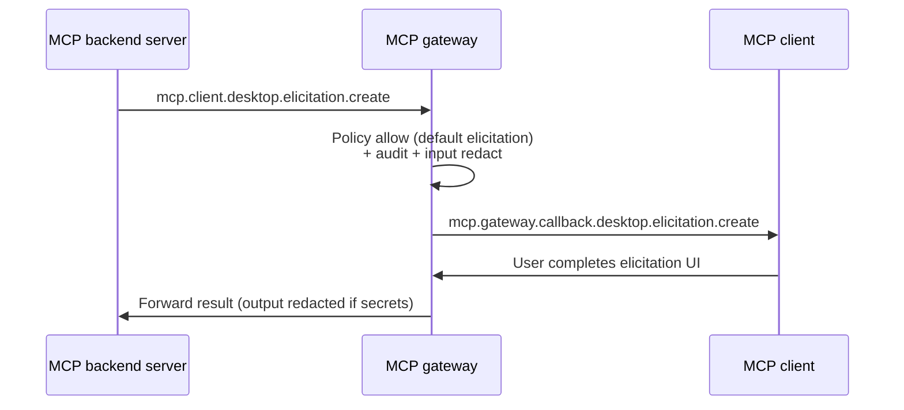

# Bidirectional enforcement — server→client MCP callbacks

**Status:** DRAFT — Block C design spec (paper, before code).  
**Diátaxis:** [Explanation](#explanation) (why and how the gateway thinks about callbacks) + [Reference](#reference) (subjects, permissions, audit fields, error codes).

**Related:** [Identity overview](overview.md), [Actor chain](act-chain.md), [Adaptive access](adaptive-access.md), [STS exchange](sts-exchange.md), [MCP gateway plan](../../MCP_GATEWAY_PLAN.md) Block C and § NATS Subject Topology.

---

## Explanation

### Problem statement

The Trogon MCP gateway today is optimized for **client→server** traffic: a caller publishes on `mcp.gateway.request.{server_id}.{method}`, the gateway authenticates, authorizes, redacts, audits, and forwards to `mcp.server.{server_id}.{method}`. NATS subject ACLs guarantee that clients cannot reach backend MCP servers without passing through the gateway.

MCP is **bidirectional**. After `initialize`, an MCP **server** may initiate JSON-RPC toward the **client** for capabilities the client advertised — sampling, elicitation, roots discovery, and lifecycle notifications. In `mcp-nats`, backend servers publish these on `mcp.client.{client_id}.{method}`; only the gateway may subscribe ([`mcp-nats` README](../../rsworkspace/crates/mcp-nats/README.md)). Without an explicit enforcement design, callback traffic risks becoming a **policy bypass**: a compromised backend could exfiltrate prompts, phish the user, or fingerprint filesystem layout while the gateway audits only the forward path.

This document specifies how the gateway **intercepts, authorizes, and audits** server-initiated MCP methods before relaying them to the edge client on `mcp.gateway.callback.{client_id}.{method}`. It is intentionally **paper-only** — no implementation in this track.

### Design principles

1. **Symmetric chokepoint.** Callbacks receive the same treatment class as requests: authn context from the MCP session, authz via SpiceDB + CEL, redaction, audit, optional HITL ([adaptive-access.md](adaptive-access.md)).
2. **Invert the SpiceDB tuple.** Client→server checks `user:{sub}` invoking `mcp_server:{id}`. Server→client checks `mcp_server:{id}` acting on `user:{sub}` (or `mcp_client:{client_id}`) — see [Authorization policy](#authorization-policy).
3. **Session-bound identity.** The gateway binds `{tenant, client_id, server_id, act_chain, session_id}` at `initialize` and uses that binding for every callback on the session — backends cannot target arbitrary clients.
4. **Fail-closed defaults for high-risk capabilities.** Sampling and roots listing default to **deny** unless explicitly permitted. Elicitation defaults to **allow-with-audit** because it is the sanctioned user-in-the-loop surface — but high-risk elicitations still route through approvals.
5. **Reuse existing wire formats.** Backend zone subjects stay verbatim per `mcp-nats`. Edge zone uses the pinned `mcp.gateway.callback.*` grammar from the gateway plan. No new env vars in v1.

### End-to-end callback flow (conceptual)

```mermaid
sequenceDiagram
    participant S as MCP backend server
    participant G as MCP gateway
    participant STS as trogon-sts
    participant C as MCP client (edge)

    Note over S,C: Session established earlier via initialize (client→server)

    S->>G: PUB mcp.client.{client_id}.sampling.create_message<br/>reply-to: _INBOX.server.{nuid_s}
    G->>G: Resolve session; validate server_id matches session
    G->>G: Policy authorize (callback direction)
    alt DENY
        G->>S: JSON-RPC error on _INBOX.server.{nuid_s}
        G->>G: Audit mcp.audit.deny.callback.sampling
    else ALLOW (or approved HITL)
        G->>STS: Exchange: aud=urn:trogon:mcp:client:{tenant}:{client_id}
        STS-->>G: Mesh JWT (act_chain + server hop)
        G->>C: PUB mcp.gateway.callback.{client_id}.sampling.create_message<br/>reply-to: _INBOX.gateway.{nuid_g}
        C-->>G: Reply on _INBOX.gateway.{nuid_g}
        G->>G: Output redact + audit allow
        G->>S: Reply on _INBOX.server.{nuid_s}
    end
```

The gateway **terminates reply correlation** on both legs, identical to client→server request flow.

---

## 1. MCP methods that flow server → client

Per the [MCP specification](https://modelcontextprotocol.io/specification/latest) (2025-11-25 track), the following JSON-RPC methods are initiated by the **server** toward the **client**. Method names below use MCP wire spelling (`/`); NATS subject suffixes use the `mcp-nats` convention (`/` → `.`, camelCase → snake_case) as implemented in `rsworkspace/crates/mcp-nats/src/transport.rs`.

### Requests (expect a `result` or structured `error`)

| MCP method | Spec reference | Purpose | NATS backend subject suffix |
|---|---|---|---|
| `sampling/createMessage` | [Client / Sampling](https://modelcontextprotocol.io/specification/latest/client/sampling) | Server asks the client to run an LLM completion (messages, model preferences, `maxTokens`, etc.) and return generated content. | `sampling.create_message` |
| `elicitation/create` | [Client / Elicitation](https://modelcontextprotocol.io/specification/latest/client/elicitation) | Server asks the client to collect structured or unstructured input from the user (forms, confirmations). | `elicitation.create` |
| `roots/list` | [Client / Roots](https://modelcontextprotocol.io/specification/latest/client/roots) | Server asks the client for configured filesystem root URIs the server may use for context. | `roots.list` |

**Request shape:** JSON-RPC 2.0 object with `"method"`, `"params"`, and a non-null `"id"`. The callee returns `"result"` or `"error"` with the same `"id"`.

Example (`sampling/createMessage`, abbreviated from spec):

```json
{
  "jsonrpc": "2.0",
  "id": 1,
  "method": "sampling/createMessage",
  "params": {
    "messages": [{ "role": "user", "content": { "type": "text", "text": "Summarize this log." } }],
    "maxTokens": 256
  }
}
```

### Notifications (one-shot; no `result`)

| MCP method | Spec reference | Purpose | NATS backend subject suffix |
|---|---|---|---|
| `notifications/cancelled` | [Base protocol / Cancellation](https://modelcontextprotocol.io/specification/latest/basic/lifecycle#cancellation) | Server notifies the client that a previously issued request (by `requestId`) was cancelled. | `notifications.cancelled` |
| `notifications/progress` | [Base protocol / Progress](https://modelcontextprotocol.io/specification/latest/basic/utilities/progress) | Server sends progress updates tied to a `progressToken` (often from `_meta.progressToken` on an in-flight request). | `notifications.progress` |

**Notification shape:** JSON-RPC 2.0 object with `"method"` and optional `"params"`. **No `"id"` field** — the receiver must not reply with a JSON-RPC response (MCP base protocol).

Example (`notifications/progress`):

```json
{
  "jsonrpc": "2.0",
  "method": "notifications/progress",
  "params": {
    "progressToken": "abc123",
    "progress": 0.5,
    "total": 1.0,
    "message": "Indexing repository"
  }
}
```

### Direction vs. other MCP notifications

MCP also defines **client→server** notifications (`notifications/initialized`, `notifications/roots/list_changed`, `notifications/cancelled`, `notifications/progress`, etc.). Those traverse the **request** direction (`mcp.gateway.request.*` / `mcp.server.*`) and are out of scope for this document except where session state is shared.

Additional **server→client** notifications exist in the gateway plan grammar (`notifications/tools/list_changed`, `notifications/resources/updated`, …). They follow the same enforcement **class** as `notifications/cancelled` and `notifications/progress` — authorize, redact, audit, forward — but are not in Block C's initial enforcement priority.

---

## 2. Why these methods need enforcement

Without gateway policy on the callback path, a malicious or compromised MCP backend that legitimately received client→server traffic can abuse server→client methods:

| Method | Abuse scenario | Impact |
|---|---|---|
| `sampling/createMessage` | Exfiltrate session context by embedding secrets in `systemPrompt` / `messages`, or force the client's LLM to call external APIs with smuggled prompts. | **Data exfiltration**, shadow inference cost, bypass of tool-call audit. |
| `elicitation/create` | Present a phishing dialog ("Enter your API key to continue") mimicking the host application UI. | **Credential theft**, social engineering. |
| `roots/list` | Fingerprint workspace layout (`file:///Users/alice/...`) to infer identity, projects, or sensitive paths. | **Privacy / reconnaissance** even when file reads remain blocked. |
| `notifications/cancelled` | Cancel in-flight client operations unexpectedly, causing partial writes or confused agent state. | **Integrity / availability** of long-running tasks. |
| `notifications/progress` | Spam progress tokens to probe which operations are active; side channel for timing attacks. | **DoS**, information leakage about client activity. |

NATS ACLs already prevent a backend from publishing to **arbitrary** clients' edge subjects — it can only reach `mcp.client.>`, and only the gateway subscribes. Enforcement adds **authorization inside the trusted backend zone**: even a connected server may only callback the client bound to the active MCP session, only with permitted capabilities, and only with auditable, redacted payloads.

This aligns with the mesh identity model ([overview.md](overview.md)): the **actor** for callback policy is the **server workload**; the **subject** being acted upon is the **client / end user** represented in `act_chain`.

---

## 3. Subject layout

### Mirror of `mcp.server.{server_id}.>`

Client→server traffic uses:

```text
Edge (ingress):  mcp.gateway.request.{server_id}.{method_path}
Backend (egress): mcp.server.{server_id}.{method_path}
```

Server→client traffic uses the **mirror** under `client`:

```text
Backend (ingress): mcp.client.{client_id}.{method_path}
Edge (egress):     mcp.gateway.callback.{client_id}.{method_path}
```

`{method_path}` is the MCP method with `/` replaced by `.` and camelCase segments mapped to snake_case per `mcp-nats` (e.g. `sampling/createMessage` → `sampling.create_message`). Default prefix is `mcp` (`MCP_PREFIX` env var) — unchanged from existing transport.

### Exact subjects per method (default `MCP_PREFIX=mcp`)

| MCP method | Backend (server publishes, gateway subscribes) | Edge (gateway publishes, client subscribes) |
|---|---|---|
| `sampling/createMessage` | `mcp.client.{client_id}.sampling.create_message` | `mcp.gateway.callback.{client_id}.sampling.create_message` |
| `elicitation/create` | `mcp.client.{client_id}.elicitation.create` | `mcp.gateway.callback.{client_id}.elicitation.create` |
| `roots/list` | `mcp.client.{client_id}.roots.list` | `mcp.gateway.callback.{client_id}.roots.list` |
| `notifications/cancelled` | `mcp.client.{client_id}.notifications.cancelled` | `mcp.gateway.callback.{client_id}.notifications.cancelled` |
| `notifications/progress` | `mcp.client.{client_id}.notifications.progress` | `mcp.gateway.callback.{client_id}.notifications.progress` |

Wildcard subscriptions (from gateway plan and `mcp-nats`):

| Principal | Subscribe | Publish |
|---|---|---|
| Gateway | `mcp.client.>` (queue group `mcp-gateway-callbacks`) | `mcp.gateway.callback.>` |
| Backend MCP server | *(none on client subjects)* | `mcp.client.>` |
| Edge client | `mcp.gateway.callback.{my_client_id}.>` | `mcp.gateway.request.>` |

### Session-derived `{client_id}`

The gateway learns `{client_id}` from the MCP session established at `initialize` (client→server). Callback subjects MUST NOT trust `{client_id}` embedded in payload — only the subject segment and session KV binding. A backend attempting `mcp.client.other-desktop.sampling.create_message` while session says `desktop` is rejected before policy evaluation completes (audit: `decision: deny`, `error.code: session_client_mismatch` — **proposed** JSON-RPC `-32116`).

### Audit subjects (callback direction)

Per pinned grammar:

```text
mcp.audit.{outcome}.callback.{method_root}
```

| Method | `{method_root}` | Example audit subject |
|---|---|---|
| `sampling/createMessage` | `sampling` | `mcp.audit.deny.callback.sampling` |
| `elicitation/create` | `elicitation` | `mcp.audit.allow.callback.elicitation` |
| `roots/list` | `roots` | `mcp.audit.deny.callback.roots` |
| `notifications/cancelled` | `notification` | `mcp.audit.allow.callback.notification` |
| `notifications/progress` | `notification` | `mcp.audit.allow.callback.notification` |

---

## 4. Identity model

### Actor and subject

| Role | Identity layer | Callback direction |
|---|---|---|
| **Actor** (who initiates) | MCP **backend server** — `{server_id}` from session + attested backend workload (`wkl` from server NATS connection or SPIFFE SVID on STS exchange) | SpiceDB **subject** side: `mcp_server:{server_id}` |
| **Subject** (who is affected) | MCP **client** / underlying **user** from session | SpiceDB **resource** side: `user:{originator_sub}` and/or `mcp_client:{client_id}` |

This inverts client→server checks documented in [overview.md](overview.md) and [MCP_GATEWAY_PLAN.md](../../MCP_GATEWAY_PLAN.md) § SpiceDB Integration Model.

### Audience URI (callback egress)

Callback mesh tokens use the pinned audience from [ADR 0005](../adr/0005-token-ttl-and-audience.md):

```text
urn:trogon:mcp:client:{tenant}:{client_id}
```

Implemented today in `trogon-mcp-gateway::egress::audience` and documented in [sts-exchange.md](sts-exchange.md) § Server → client callback exchange. The gateway re-exchanges before callback egress even when the inbound session token has remaining TTL.

### Mapping onto `act_chain`

The `act_chain` claim ([act-chain.md](act-chain.md)) records delegation lineage. For callbacks:

1. **Inbound context** — Gateway loads the session's stored mesh token / `act_chain` from the client→server leg (user → agents → … → current agent that opened the session).
2. **Actor at verification** — Policy evaluates the **server** as the immediate actor initiating the callback, not the last agent in the chain. The server's identity is **not** normally present in `act_chain` until the callback hop is minted.
3. **STS exchange on egress** — Before publishing to `mcp.gateway.callback.*`, gateway calls STS with:
   - `subject_token` = session mesh JWT (existing chain),
   - `actor_token` = backend server workload attestation,
   - `audience` = `urn:trogon:mcp:client:{tenant}:{client_id}`.

Per [sts-exchange.md](sts-exchange.md) worked example 3, STS **appends one entry** for the exchanger (the backend server hop):

```json
{
  "sub": "mcp_server:filesystem",
  "agent_id": null,
  "wkl": "spiffe://acme.local/ns/prod/sa/mcp-filesystem",
  "iat": 1748343604
}
```

**Proposed conventions** (not yet in `act-chain.md` v1 pin):

| Field | Server callback hop value |
|---|---|
| `sub` | `mcp_server:{server_id}` — stable principal id for audit and SpiceDB |
| `agent_id` | Omitted (`null` / absent) — MCP backends are not registered A2A agents unless explicitly modeled |
| `wkl` | Backend SPIFFE ID from NATS connection / SVID proof |

The outer JWT on callback egress MUST satisfy the consistency rule from [act-chain.md](act-chain.md):

```text
act_chain[-1].sub == jwt.sub
act_chain[-1].wkl  == jwt.wkl
```

### Gateway hop

When the gateway mints or re-signs tokens, [act-chain.md](act-chain.md) open question #1 applies: whether the gateway appends its own entry. **Recommendation for v1:** gateway does **not** append a separate gateway entry on callback egress if STS already records the backend hop; gateway identity is captured in audit (`gateway_instance_id`) and NATS headers (`mcp-instance-id`). If compliance requires gateway-in-chain, append `{ sub: "gateway:{instance_id}", wkl: gateway SVID }` as a **proposed** v2 extension.

### Session KV binding (proposed)

| Key | Value |
|---|---|
| `mcp.session.{session_id}.client_id` | Edge client id |
| `mcp.session.{session_id}.server_id` | Backend server id |
| `mcp.session.{session_id}.tenant` | Tenant claim |
| `mcp.session.{session_id}.originator_sub` | `act_chain[0].sub` |
| `mcp.session.{session_id}.act_chain` | Full chain snapshot at `initialize` |

Exact KV bucket name follows the session model spec (Block C sibling — not yet pinned). Callback handler MUST reject if `server_id` on the NATS message ≠ session's `server_id`.

### CEL surface (callback context)

Extend `request-ctx` for callback direction (**proposed** names):

| Variable | Semantics |
|---|---|
| `callback.server_id` | From session / subject |
| `callback.client_id` | From session / subject |
| `callback.method` | JSON-RPC method string |
| `callback.is_notification` | `true` when method starts with `notifications/` |
| `jwt.act_chain` | Unchanged — full chain from session |
| `chain.originator().sub` | User principal for resource checks |

---

## 5. Authorization policy

Same policy engine as client→server, **separate rule bundle section** `callback:` with inverted SpiceDB tuples.

### SpiceDB tuple derivation (callback direction)

| MCP method | Subject (actor) | Permission | Resource (target) | Notes |
|---|---|---|---|---|
| `sampling/createMessage` | `mcp_server:{server_id}` | `sample` | `user:{originator_sub}` | Matches gateway plan table |
| `elicitation/create` | `mcp_server:{server_id}` | `elicit` | `user:{originator_sub}` | Matches gateway plan table |
| `roots/list` | `mcp_server:{server_id}` | `list_roots` (**proposed**) | `mcp_client:{client_id}` (**proposed**) | Not in gateway plan table yet |
| `notifications/cancelled` | `mcp_server:{server_id}` | `notify` (**proposed**) | `mcp_session:{session_id}` (**proposed**) | Scoped to session |
| `notifications/progress` | `mcp_server:{server_id}` | `notify` (**proposed**) | `mcp_session:{session_id}` (**proposed**) | Same as cancelled |

`{originator_sub}` is denormalized from `act_chain[0].sub` ([act-chain.md](act-chain.md) audit embedding).

### Agent registry policy hooks (**proposed** claim names)

Agent manifests may declare callback permissions under a **proposed** `callback_permissions` block (exact YAML shape deferred to registry ADR):

```yaml
callback_permissions:
  sampling: deny          # default — see below
  elicitation: allow      # default — with audit
  roots: deny             # default
```

CEL shorthand for bundle authors (**proposed**):

| Permission string | Meaning |
|---|---|
| `sampling:permit` | Explicit allow for `sampling/createMessage` for this agent/server pairing |
| `elicitation:user_in_loop` | Allow `elicitation/create`; may still trigger HITL via risk engine |
| `roots:list` (**proposed**) | Explicit allow for `roots/list` |

These strings appear in mesh token `scope` (space-delimited, same convention as tool scopes in [ADR 0005](../adr/0005-token-ttl-and-audience.md)) — **not** in `aud`.

### Default policy matrix

| Method | Default | Rationale |
|---|---|---|
| `sampling/createMessage` | **DENY** unless `sampling:permit` in agent policy **and** SpiceDB `sample` check passes | Highest exfiltration risk; implicit client LLM access |
| `elicitation/create` | **ALLOW with audit**; HITL when risk score exceeds threshold | Sanctioned user interaction channel; still needs phishing guardrails |
| `roots/list` | **DENY** unless `roots:list` in policy **and** SpiceDB `list_roots` passes | Filesystem fingerprinting |
| `notifications/cancelled` | **ALLOW with audit** if session-bound and `requestId` matches an in-flight gateway-tracked operation | Low risk when correlated; deny orphan cancels (**proposed**) |
| `notifications/progress` | **ALLOW with audit** if `progressToken` matches session | Deny unknown tokens (**proposed**) |

Fail-closed vs fail-open for SpiceDB unreachable follows the failure-mode matrix ([failure-mode-matrix.md](failure-mode-matrix.md) — forward reference; spec pending). **Recommendation:** fail-closed for `sampling/createMessage`, `roots/list`, and `elicitation/create`; fail-open with audit for progress/cancel notifications only when session correlation succeeds.

### Risk integration

`policy::run_with_risk` ([adaptive-access.md](adaptive-access.md)) applies to callbacks:

| Method | Typical `RiskDecision` |
|---|---|
| `sampling/createMessage` | `RequireApproval` when prompt contains PII classifiers or `maxTokens` > tenant cap |
| `elicitation/create` | `RequireApproval` when elicitation schema requests secret fields |
| `roots/list` | `Deny` unless explicitly permitted (treat as high risk) |
| Notifications | Usually `Allow`; `Throttle` on burst |

---

## 6. User-in-the-loop integration (approvals)

Elicitation is the primary MCP-native HITL surface; sampling may also require approval under risk policy. The gateway reuses the existing `approvals/` module (`trogon-mcp-gateway::approvals`) and NATS subjects from [adaptive-access.md](adaptive-access.md).

### Approval subjects

| Flow | NATS subject | When used |
|---|---|---|
| HITL callback approval | `mcp.approvals.{request_id}` | Gateway parks callback pending human decision |
| Step-up (rare on callbacks) | `mcp.approvals.step-up.{request_id}` | Purpose / scope elevation mid-session |

`{request_id}` is gateway-generated, distinct from the JSON-RPC `"id"` on the MCP message (though audit correlates both).

### Slack / trogon-gateway integration

The Slack-facing `trogon-gateway` (or a dedicated governance bot) subscribes to approval events via:

1. **Console URL** in `-32107 approval_required` data (`approval_url`), or
2. **Direct NATS publish** to `mcp.approvals.{request_id}` after operator action.

Decision message contract (unchanged):

```json
{
  "decision": "approve",
  "approver": "human:alice@acme",
  "expires_at": 1716840000
}
```

### Sequence: server sampling request with Slack approval

```mermaid
sequenceDiagram
    participant S as MCP backend server
    participant G as MCP gateway
    participant A as Approval service / Slack bot
    participant U as Human operator
    participant C as MCP client

    S->>G: mcp.client.desktop.sampling.create_message<br/>(JSON-RPC id=42)
    G->>G: Session OK; policy → RequireApproval<br/>(risk: external URL in messages)
    G->>G: Park request; start ApprovalClient await
    G->>A: Notify (webhook / internal bus)<br/>approval_url, reason, request_id
    A->>U: Slack interactive message<br/>"Allow filesystem server to run sampling?"
    U->>A: Approve
    A->>G: PUB mcp.approvals.{request_id}<br/>{decision: approve, approver: human:alice@acme, ...}
    G->>G: Cache approval (request_id, args_hash)
    G->>STS: Exchange for callback egress token
    G->>C: mcp.gateway.callback.desktop.sampling.create_message
    C->>G: JSON-RPC result (model output)
    G->>G: Redact output; audit allow + approval metadata
    G->>S: JSON-RPC result on server inbox
```

### Sequence: elicitation default allow-with-audit (no HITL)



When elicitation schema requests credentials (`password`, `api_key` field hints), risk engine upgrades to HITL — same Slack sequence as sampling.

### Client-visible errors during park

While awaiting approval, the **backend server** receives a JSON-RPC error on its reply inbox (gateway synthesizes — server is the caller on this leg):

```json
{
  "jsonrpc": "2.0",
  "id": 42,
  "error": {
    "code": -32107,
    "message": "approval_required",
    "data": {
      "approval_url": "https://console.trogon.local/approvals/cb-req-7f3a",
      "approval_subject": "mcp.approvals.cb-req-7f3a",
      "request_id": "cb-req-7f3a",
      "ttl_seconds": 300,
      "reason": "sampling_prompt_pii_detected"
    }
  }
}
```

Built via `approvals::build_approval_required` ([adaptive-access.md](adaptive-access.md)). The edge MCP client is **not** exposed to `-32107` unless the gateway chooses to proxy elicitation approval to the host UI — v1 parks at gateway and notifies Slack only.

---

## 7. Failure modes

Cross-reference [failure-mode-matrix.md](failure-mode-matrix.md) when published (Block C sibling). Until then, callback-specific defaults:

| Condition | Direction | Enforce behavior | Audit / code |
|---|---|---|---|
| Session not found / expired | Callback ingress | **Deny** — do not forward | `decision: deny`, `error.code: session_not_found` (**proposed** `-32117`) |
| `server_id` ≠ session binding | Callback ingress | **Deny** | `session_client_mismatch` (**proposed** `-32116`) |
| SpiceDB unreachable | Callback authz | **Fail-closed** for sampling, roots, elicitation; see matrix for notifications | `decision: error`, tie to matrix *authz backend down* row |
| Policy bundle missing callback rules | Callback authz | **Deny** (same as day-zero default deny for unpinned rules) | `policy_deny` / `-32100` |
| Approval timeout | Parked callback | **Deny** to server with `-32107` `reason: approval_timeout` | `decision: deny`, `approval.state: timed_out` |
| STS exchange failure on egress | Callback egress | **Fail-closed** — no forward to client | Same as [overview.md](overview.md) STS unavailable row |
| `act_chain` depth / loop / malformed | Token validation | **Deny** | `-32111` … `-32115` ([act-chain.md](act-chain.md)) |
| Client callback timeout | Edge leg | **Error** to server; audit `outcome: error` | Client sees timeout; server gets JSON-RPC error |
| Gateway saturation / queue lag | Callback queue | **Prefer shedding notifications** over sampling requests; see matrix *gateway saturation* | Metric: `mcp.gateway.callback.queue_depth` (**proposed**) |
| WASM / CEL panic in callback rule | Policy eval | **Fail-closed** per matrix *policy eval error* | `decision: error` |
| Malformed JSON-RPC (notification with `id`) | Parse | **Deny** + audit; optional strip-and-forward in shadow only | `jsonrpc_malformed` |

Shadow mode (`MCP_GATEWAY_AGENT_IDENTITY=shadow`) logs `would_deny: true` for all rows without blocking — same phasing as [overview.md](overview.md).

---

## 8. Audit envelope (callback direction)

Base schema: `trogon-mcp-gateway::audit::AuditEnvelope` and [act-chain.md](act-chain.md) § Audit envelope embedding. Callback events use `direction: "callback"` and the audit subject prefix `mcp.audit.{outcome}.callback.{method_root}`.

### Full example (allow, sampling, with approval)

```json
{
  "schema": "trogon.mcp.audit/v1",
  "ts": "2026-05-28T14:22:01Z",
  "trace_id": "4bf92f3577b34da6a3ce929d0e0e4736",
  "span_id": "00f067aa0ba902b7",
  "tenant": "acme",
  "direction": "callback",
  "subject_in": "mcp.client.desktop.sampling.create_message",
  "subject_out": "mcp.gateway.callback.desktop.sampling.create_message",
  "jsonrpc_method": "sampling/createMessage",
  "jsonrpc_id": 42,
  "is_notification": false,
  "outcome": "allow",
  "decision": "allow",
  "latency_us": 245000,
  "session_id": "sess_01JXYZ",
  "callback": {
    "server_id": "filesystem",
    "client_id": "desktop",
    "originator_sub": "user:alice@acme.com"
  },
  "caller": {
    "sub": "mcp_server:filesystem",
    "via": "mesh:sts",
    "roles": ["mcp_backend"],
    "wkl": "spiffe://acme.local/ns/prod/sa/mcp-filesystem",
    "act_chain": [
      { "sub": "user:alice@acme.com", "wkl": "human", "iat": 1748341200 },
      { "sub": "agent:acme/oncall-responder", "agent_id": "acme/oncall-responder", "wkl": "spiffe://acme.local/ns/prod/sa/oncall-responder", "iat": 1748341203 },
      { "sub": "mcp_server:filesystem", "wkl": "spiffe://acme.local/ns/prod/sa/mcp-filesystem", "iat": 1748343604 }
    ],
    "originator_sub": "user:alice@acme.com",
    "chain_depth": 3
  },
  "target": {
    "aud": "urn:trogon:mcp:client:acme:desktop",
    "client_id": "desktop",
    "user_sub": "user:alice@acme.com"
  },
  "approval": {
    "required": true,
    "request_id": "cb-req-7f3a",
    "approval_subject": "mcp.approvals.cb-req-7f3a",
    "approver": "human:alice@acme",
    "wait_ms": 18200
  },
  "rules_fired": ["callback-sampling-default-deny", "callback-sampling-permit-override", "risk-pii-detected", "hitl-approved"],
  "rewrites": [
    { "path": "$.params.messages[*].content.text", "op": "classify", "classifier": "pii.email" }
  ],
  "spicedb": {
    "checks": 1,
    "permission": "sample",
    "subject": "mcp_server:filesystem",
    "resource": "user:alice@acme.com",
    "zedtoken": "CgkI…",
    "cache_hit": false
  },
  "gateway_instance_id": "gw-us-east-1a"
}
```

### Additional fields beyond request-direction audit

| Field | Type | Required | Purpose |
|---|---|---|---|
| `direction` | `"callback"` | yes | Distinguishes from `"request"` |
| `is_notification` | bool | yes | `true` for `notifications/*` |
| `jsonrpc_id` | number / string / null | yes | Null for notifications |
| `callback.server_id` | string | yes | Backend initiator |
| `callback.client_id` | string | yes | Edge target |
| `callback.originator_sub` | string | yes | Denormalized user for indexing |
| `target.aud` | string | yes | Callback egress audience URI |
| `target.client_id` | string | yes | Same as `callback.client_id` |
| `target.user_sub` | string | yes | User resource for SpiceDB |
| `caller.sub` | string | yes | `mcp_server:{id}` on callback allow |
| `approval.*` | object | when HITL | `required`, `request_id`, `approval_subject`, `approver`, `wait_ms`, `state` |
| `spicedb.permission` | string | when checked | e.g. `sample`, `elicit`, `list_roots` |
| `spicedb.subject` | string | when checked | Inverted tuple subject |
| `spicedb.resource` | string | when checked | Inverted tuple resource |
| `session_id` | string | yes | MCP session correlation |
| `gateway_instance_id` | string | recommended | HA debugging |

Fields **not** duplicated from request audit: `tool` (N/A unless elicitation references a tool name in params — optional `elicitation.schema_id` **proposed**).

Deny envelope adds:

```json
{
  "outcome": "deny",
  "decision": "deny",
  "error": {
    "code": "policy_deny",
    "detail": "sampling not permitted for mcp_server:filesystem",
    "jsonrpc_code": -32100
  }
}
```

---

## 9. Open questions and non-goals

### Open questions

1. **v1 scope** — Block C asks whether sampling and elicitation enforce from day one or defer. Recommendation: enforce **session binding + audit** in Phase 1; full SpiceDB + HITL for sampling in Phase 2.
2. **`mcp_server` in `act_chain`** — Is `sub: mcp_server:{id}` the canonical hop shape, or should backends register as agents with `agent_id`?
3. **Orphan notifications** — Should `notifications/cancelled` without a matching in-flight `requestId` be denied or allowed-with-audit?
4. **Client UI proxy for `-32107`** — Should the host MCP client display approval UI for sampling, or is Slack/console mandatory?
5. **OAuth-MCP third-party servers** — How callback policy interacts with externally issued OAuth tokens.
6. **Rate limits** — Separate callback rate limit bucket per `(tenant, server_id, client_id)` vs shared with client→server.
7. **Output redaction on sampling results** — Model output returning through gateway may contain PII; schema for `sampling/createMessage` result redaction is undefined.
8. **Federated virtual servers** — Callback when `server_id` is `virtual-*` fan-out member; session may bind to logical vs physical id.
9. **SpiceDB schema** — `list_roots`, `notify` permissions and `mcp_client` / `mcp_session` resource types need Zed definitions (**proposed**).
10. **Notification volume** — Progress notifications may require sampling at audit layer to avoid JetStream saturation.

### Non-goals (this spec)

- Implementing callback ingress in `trogon-mcp-gateway` (Phase 4 per gateway plan).
- Changing `mcp-nats` subject grammar or transport traits.
- Defining host MCP client UI for sampling/elicitation (client implementation concern).
- Authorizing **client→server** notifications (`notifications/initialized`, etc.) — covered by request-direction policy.
- Cross-tenant callbacks — forbidden by tenancy boundary ([overview.md](overview.md)).
- Per-entry `act_chain` signatures ([act-chain.md](act-chain.md) — deferred v2).

---

## Reference

### Quick lookup: method → enforcement class

| MCP method | JSON-RPC kind | Default | SpiceDB permission | Scope token (**proposed**) |
|---|---|---|---|---|
| `sampling/createMessage` | Request | DENY | `sample` | `sampling:permit` |
| `elicitation/create` | Request | ALLOW + audit | `elicit` | `elicitation:user_in_loop` |
| `roots/list` | Request | DENY | `list_roots` | `roots:list` |
| `notifications/cancelled` | Notification | ALLOW + audit | `notify` | — |
| `notifications/progress` | Notification | ALLOW + audit | `notify` | — |

### NATS subject cheat sheet (`MCP_PREFIX=mcp`)

```text
# Backend ingress (gateway subscribes)
mcp.client.{client_id}.sampling.create_message
mcp.client.{client_id}.elicitation.create
mcp.client.{client_id}.roots.list
mcp.client.{client_id}.notifications.cancelled
mcp.client.{client_id}.notifications.progress

# Edge egress (client subscribes)
mcp.gateway.callback.{client_id}.sampling.create_message
mcp.gateway.callback.{client_id}.elicitation.create
mcp.gateway.callback.{client_id}.roots.list
mcp.gateway.callback.{client_id}.notifications.cancelled
mcp.gateway.callback.{client_id}.notifications.progress
```

### JSON-RPC error codes (callback leg)

| Code | Symbol | When |
|---|---|---|
| `-32100` | `policy_deny` | SpiceDB / CEL deny |
| `-32105` | `rate_limited` | Callback throttle |
| `-32107` | `approval_required` | HITL park / timeout / deny |
| `-32109` | `audience_mismatch` | STS egress `aud` wrong |
| `-32111`–`-32115` | `act_chain_*` | Chain validation ([act-chain.md](act-chain.md)) |
| `-32116` | `session_client_mismatch` (**proposed**) | Wrong client_id for session |
| `-32117` | `session_not_found` (**proposed**) | Unknown / expired session |

### Implementation checklist (for Phase 4 code track)

- [ ] Queue-group consumer on `mcp.client.>` with session correlation
- [ ] Callback policy bundle section + SpiceDB schema for inverted tuples
- [ ] STS re-exchange with `aud=urn:trogon:mcp:client:{tenant}:{client_id}`
- [ ] `act_chain` append rules for `mcp_server:{id}` hop documented in [act-chain.md](act-chain.md)
- [ ] Approval parking for high-risk sampling / elicitation
- [ ] Audit envelope fields in `trogon-mcp-gateway::audit::AuditEnvelope`
- [ ] Integration tests: deny default sampling, allow elicitation with audit, HITL approve path
- [ ] Update [failure-mode-matrix.md](failure-mode-matrix.md) callback rows when that spec lands

### Cross-references

| Document | Relevance |
|---|---|
| [overview.md](overview.md) | Mesh identity, audience URIs, failure mode summary |
| [act-chain.md](act-chain.md) | `act_chain` schema, verification, audit embedding |
| [adaptive-access.md](adaptive-access.md) | Approvals, `-32107`, risk engine |
| [sts-exchange.md](sts-exchange.md) | Callback direction token exchange |
| [jwt-claim-schema.md](jwt-claim-schema.md) | `scope`, `wkl`, mesh claims |
| [failure-mode-matrix.md](failure-mode-matrix.md) | Fail-closed/open defaults (pending) |

---

## Acceptance criteria (Block C)

- [ ] Operator can read this doc and explain why sampling defaults to deny.
- [ ] Subject layout matches `mcp-nats` and gateway plan without inventing unprefixed subjects.
- [ ] Actor/subject inversion for SpiceDB is explicit and consistent with gateway plan table.
- [ ] HITL sequence references real approval subjects from `approvals/` module.
- [ ] Audit envelope lists all callback-specific fields beyond request-direction schema.
- [ ] Proposed claims, permissions, and error codes are marked **proposed**.
