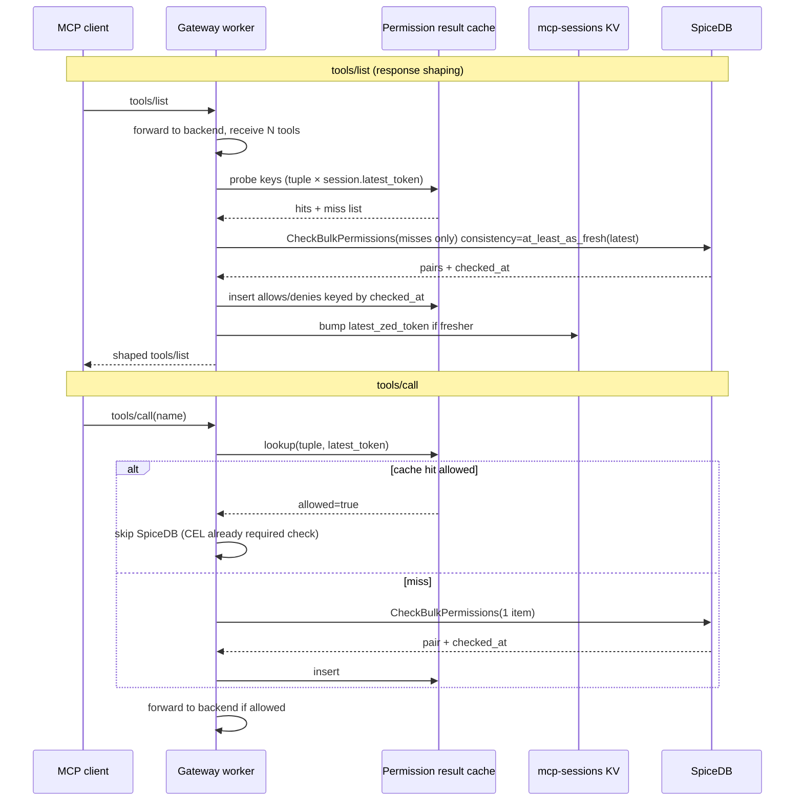

# BulkCheckPermission and ZedToken result cache

**Status:** Design specification (Block E, paper). No implementation in `trogon-mcp-gateway::spicedb` yet — this document is the review artifact before `spicedb.rs` changes land.

**Diátaxis:** Explanation (why, consistency contracts, invalidation trade-offs) plus reference (key shapes, metrics names, pseudocode).

**Cross-references:** [Identity overview](overview.md), [Gateway failure-mode matrix](failure-mode-matrix.md), [MCP session model](mcp-session-model.md), [MCP gateway operator overview](mcp-gateway-operator-overview.md).

---

## 1. Problem statement

### 1.1 What the gateway does today

Phase 1 gates SpiceDB only on mutating read paths. CEL (`policy.rs`) returns `requires_spicedb == true` for `tools/call` and `resources/read`, and **false** for `tools/list`. The ingress worker calls `PermissionChecker::authorize_mcp_request` only when that flag is set (`gateway.rs`).

| MCP method | SpiceDB gated today? | SpiceDB RPCs per gateway request (today) | Call site |
|---|---|---|---|
| `tools/list` | No | **0** | N/A — list is not passed through `authorize_mcp_request` |
| `tools/call` | Yes | **1** (`CheckBulkPermissions` with `items.len() == 1`) | `spicedb.rs` → `check_permission_bulk_single` |
| `resources/read` | Yes | **1** (same bulk API, single item) | `spicedb.rs` → `check_permission_bulk_single` |

The implementation already uses Authzed **`CheckBulkPermissions`** (Rust: `check_bulk_permissions`), not the unary `CheckPermission` RPC — but each gated request still performs **one gRPC round-trip** with a single-element `items` vector. That is equivalent to one logical permission check per request.

**`tools/call` path (today):**

1. `gateway.rs` parses `params.name`, builds `AuthzContext`, and awaits `checker.authorize_mcp_request` when CEL requires SpiceDB.
2. `SpicedbPermissionChecker::authorize_mcp_request` matches `"tools/call"`, normalizes `server_id` and tool name, and calls `check_permission_bulk_single` with resource id `{server_id}|{tool_name}` (`spicedb.rs:159–173`).
3. `check_permission_bulk_single` issues one `CheckBulkPermissionsRequest` (`spicedb.rs:102–121`), reads `pairs[0]`, and optionally updates the process-global `check_zed_token_cache` from `response.checked_at` (`spicedb.rs:125–131`).

**`tools/list` path (today):**

- Backend reply is forwarded (or schema-sniffed) without PDP calls. Block E adds **response shaping**: each tool in `result.tools[]` must be filtered by `invoke` (or bundle-defined permission) on `trogon/mcp_tool:{server_id}|{tool_name}`.

### 1.2 What Block E makes expensive without this design

Assume a catalog of **N** tools after `tools/list` returns from the backend.

| Approach | RPC count per `tools/list` | RPC count per `tools/call` | Notes |
|---|---|---|---|
| Naive per-item unary checks | **N** | 1 | One `CheckPermission` (or bulk API with one item) per tool — unacceptable at N ≈ 50–200 |
| **This design** | **1** bulk (+ cache hits on repeat lists) | **0** on cache hit, **1** on miss | Amortize list shaping; reuse list results for hot `tools/call` |

Example: agent session with `tools/list` (N = 80) then 12 `tools/call` invocations on distinct tools.

| Phase | Naive | With bulk + cache (steady state) |
|---|---|---|
| First list | 80 RPCs | 1 RPC |
| Repeat list (same session, unchanged graph) | 80 RPCs | 0 RPC (all cache hits if tokens still valid) |
| 12 calls (mixed hits) | 12 RPCs | 0–12 RPCs (hits for tools seen on last list) |

Operator-facing hot-path budget in [mcp-gateway-operator-overview.md](mcp-gateway-operator-overview.md) §6.1 targets **low ms** for SpiceDB when `ZedToken` enables `at_least_as_fresh`. Catalog shaping without batching blows that budget linearly in N.

### 1.3 Consistency promise to preserve

From [failure-mode-matrix.md](failure-mode-matrix.md) invariants 1–2:

- **No allow without PDP** on gated methods.
- **No allow cache past trust** — cached allows must not outlive the freshness implied by the associated `ZedToken` and gateway TTL cap.

The gateway today keeps a **single** process-local `Arc<Mutex<Option<String>>>` for the last `checked_at` token (`spicedb.rs:64`, `spicedb.rs:99–100`). That is insufficient for Block E: list shaping needs **per-check** results keyed by resource tuple and snapshot, and HA needs session-scoped tokens in JetStream KV ([mcp-session-model.md](mcp-session-model.md) § Session-bound state).

---

## 2. BulkCheckPermission primer

Authzed/SpiceDB exposes **`CheckBulkPermissions`** (historically “BulkCheckPermission” in product docs). The gateway `spicedb-rs-client` types mirror the v1 API.

### 2.1 Request shape

```text
CheckBulkPermissionsRequest {
  consistency: Option<Consistency>,   // minimize_latency | at_least_as_fresh | at_exact_snapshot
  items: Vec<CheckBulkPermissionsRequestItem>,
  with_tracing: bool,
}

CheckBulkPermissionsRequestItem {
  resource: ObjectReference { object_type, object_id },
  permission: string,
  subject: SubjectReference { object, optional_relation },
  context: Option<ContextualizedCaveat>,  // caveat name + context struct
}
```

Trogon MCP mapping (implemented today for `tools/call`; extended for list shaping):

| Field | `tools/call` / list item | Source |
|---|---|---|
| `resource.object_type` | `MCP_GATEWAY_SPICEDB_TOOL_OBJECT_TYPE` (default `trogon/mcp_tool`) | env / config |
| `resource.object_id` | `{server_id}\|{tool_name}` (normalized) | `normalize_spicedb_object_token` |
| `permission` | `MCP_GATEWAY_SPICEDB_TOOL_CALL_PERMISSION` (default `invoke`) | env |
| `subject.object_type` | `trogon/principal` (configurable) | JWT `sub` or tenant fallback |
| `subject.object_id` | normalized `caller_sub` | `AuthzContext` |

### 2.2 Response shape

```text
CheckBulkPermissionsResponse {
  checked_at: Option<ZedToken>,        // snapshot cursor for ALL items in this request
  pairs: Vec<CheckBulkPermissionsPair>,
}

CheckBulkPermissionsPair {
  request: Option<CheckBulkPermissionsRequestItem>,  // echo of input item
  response: oneof {
    item: CheckPermissionResponse { permissionship, partial_caveat_info, ... },
    error: google.rpc.Status,
  },
}
```

**Ordering:** Clients must pair by echoed `request` field, not by assuming `pairs[i]` aligns with `items[i]` index (Authzed may reorder). Trogon code should build a `HashMap` keyed by `(object_type, object_id, permission, subject_id)`.

### 2.3 Error semantics and partial failure

| Outcome | Transport | Per-item `pairs[].response` | Gateway behavior |
|---|---|---|---|
| Success | gRPC OK | All `Item` | Cache each allow/deny with shared `checked_at` |
| Partial | gRPC OK | Mix of `Item` and `Error` | **Fail-closed** for shaping: drop or deny items with `Error`; do not cache failed items. For `tools/call` single-item: map `Error` → `AuthzError` (today: `spicedb.rs:143–146`) |
| Total transport failure | gRPC err / timeout | No pairs | **CLOSED** `-32107` `AUTHZ_UNREACHABLE` ([failure-mode-matrix.md](failure-mode-matrix.md) row 1) |
| Empty pairs | gRPC OK | `pairs` empty | **CLOSED** — treat as PDP fault |

**Partial failure policy (normative):**

- **`tools/list` shaping:** Omit tools whose pair returned `Error` from the shaped list; emit audit `decision=error` per omitted tool if bundle says `fail_open_with_log`, else deny entire list (default **fail-closed** for security-sensitive tenants).
- **`tools/call`:** Any `Error` on the sole item → ingress error, no backend forward (matches today).

Bulk requests share one `checked_at` token. All successfully evaluated items in that response are consistent with the **same** snapshot revision.

---

## 3. ZedToken primer

### 3.1 Definition

A **`ZedToken`** is an opaque, server-issued revision cursor (string token) representing “the SpiceDB graph state observed when this check completed.” It is not a capability JWT and must not be accepted from clients as proof of permission.

SpiceDB returns it as:

- `CheckBulkPermissionsResponse.checked_at` (and unary check equivalents).
- `WriteRelationshipsResponse.written_at` after tuple writes.

### 3.2 Snapshot semantics (consistency requirements)

| Requirement | Meaning | Gateway use |
|---|---|---|
| **`minimize_latency`** | Prefer lowest latency; may read slightly stale replicas | Cold start, no cached token, or explicit retry after stale-token fault |
| **`at_least_as_fresh(ZedToken)`** | Evaluate at a snapshot **≥** the token’s revision | Hot path after first successful check in a session/process |
| **`at_exact_snapshot(ZedToken)`** | Evaluate at exactly that revision | Debugging, compliance proofs — not default for MCP hot path |

Today `spicedb.rs:46–52` selects `at_least_as_fresh` when `check_zed_token_cache` holds a non-empty string; otherwise `minimize_latency` (`spicedb.rs:40–44`).

### 3.3 What happens on writes

Relationship writes advance the datastore revision. Effects:

1. **New** `ZedToken` from write responses is strictly fresher than pre-write tokens.
2. Checks with `at_least_as_fresh(old_token)` either succeed at a fresh enough snapshot or fail with “stale / unknown token” (surfaced as gRPC `Status` on the check — [failure-mode-matrix.md](failure-mode-matrix.md) row 2).
3. Cached **allow** results tied to `old_token` must be treated as stale when a **fresher** token is observed (see §6).

The gateway does not mint ZedTokens; it only stores tokens returned by SpiceDB.

### 3.4 Session scoping (planned)

[mcp-session-model.md](mcp-session-model.md) binds session-scoped ZedToken to JetStream KV `mcp-sessions/{session_id}`. This design’s **result cache** is complementary: KV holds the session’s “latest known fresh token” for consistency headers; the result cache holds **(tuple, token) → allowed** for latency.

---

## 4. Cache key (reference)

### 4.1 Proposed key structure

```rust
/// Reference — not committed code.
struct PermissionCacheKey {
    tenant_id: String,           // JWT `tenant` claim; partition isolation
    resource_type: String,       // e.g. trogon/mcp_tool
    resource_id: String,         // e.g. github|create_issue (normalized)
    permission: String,          // e.g. invoke
    subject_type: String,        // e.g. trogon/principal
    subject_id: String,          // normalized caller sub
    zed_token: String,           // checked_at token this result was true at
    caveat_context_hash: Option<[u8; 32]>,  // BLAKE3 of canonical caveat JSON
}
```

**Canonical key string** (for KV or in-memory maps):

```text
v1|{tenant_id}|{resource_type}|{resource_id}|{permission}|{subject_type}|{subject_id}|{zed_token}|{caveat_hash_or_-}
```

### 4.2 Field justification

| Field | Why included |
|---|---|
| `tenant_id` | Hard boundary for multi-tenant KV and memory caps; prevents cross-tenant cache bleed under soft tenancy key prefixes. |
| `resource_type` + `resource_id` | Tuple identity — same id across types is different object. |
| `permission` | `invoke` vs `list` vs `read` on same object differ. |
| `subject_type` + `subject_id` | ReBAC subject; agent vs user principals must not collide. |
| `zed_token` | Binds cached allow/deny to a snapshot; stale graph → new token → new key (old entries become unreachable, then evicted by TTL). **Including token in the key** avoids serving a result evaluated under an older snapshot when the session has moved forward. |
| `caveat_context_hash` | Caveats can change outcome without relationship writes. Raw context may be large or PII-heavy — store **BLAKE3** over canonical JSON (sorted keys, stable encoding). Use `-` when `context` is `None`. |

### 4.3 Why `zed_token` is in the key, not only in invalidation

Alternative: key without token + store token in value + compare on read.

**Chosen approach:** token in key because:

1. Lookup on `tools/call` is O(1) without read-modify-compare races.
2. Multiple snapshots may coexist briefly during rolling token upgrade (old entries expire via TTL).
3. Aligns with “no allow cache past trust” — wrong token cannot alias to a hit.

Trade-off: more entries when token rotates often. Mitigate with short TTL (§5) and per-tenant cap (§10).

### 4.4 Caveat context

When `CheckBulkPermissionsRequestItem.context` is populated (CEL time, IP, custom fields):

- **Include** `caveat_context_hash` in the key.
- **Do not** include raw context (size, secrets).
- Hash algorithm: BLAKE3 over `serde_json` canonical form; document version byte in key prefix if encoding changes.

If caveats are unused in Phase 2 MCP bundles, `caveat_context_hash` is `None` and the key segment is `-`.

---

## 5. Cache value (reference)

```rust
struct PermissionCacheValue {
    allowed: bool,
    cached_at: SystemTime,   // wall clock at insert
    ttl_secs: u32,           // entry TTL; ≤ global cap
}
```

### 5.1 TTL upper bound

| Parameter | Value | Rationale |
|---|---|---|
| `MCP_GATEWAY_SPICEDB_RESULT_CACHE_TTL_SECS` (proposed) | default **60**, hard max **60** | Matches A2A tier-1 ZedToken TTL default (`DEFAULT_TIER1_ZEDTOKEN_TTL_SECS = 60` in `a2a-nats`) and operator doc “~60s” session token freshness |
| Absolute ceiling | **60 s** | Even if env requests higher, clamp to 60 — [failure-mode-matrix.md](failure-mode-matrix.md) invariant 2 |

**Consistency window the gateway promises to callers:**

- Cached allows are valid for at most **TTL** wall time **and** only while `zed_token` in the key remains the session’s “latest known” token or older (see token-based invalidation §6.2).
- Worst-case staleness: **min(TTL, time until next relationship write visible to SpiceDB)**. Operators requiring tighter bounds set TTL lower (e.g. 15s) or disable cache for regulated tenants.

### 5.2 Deny entries

Cache **deny** as well as allow:

- **Why:** Repeated `tools/call` to forbidden tools avoids PDP load.
- **Risk:** Deny cache stale if relationships grant access — mitigated by token in key + TTL + token invalidation.

Do not cache transport errors or caveat evaluation errors.

---

## 6. Invalidation

Three mechanisms; **one primary** for production.

### 6.1 Time-based (per-entry TTL)

Every insert sets `ttl_secs` (≤ 60). On `get`, if `cached_at + ttl < now`, delete and treat as miss.

- **Pros:** Simple, bounded staleness, no extra infra.
- **Cons:** Allows may live up to TTL after a revoke if token invalidation lags.

### 6.2 Token-based (recommended primary)

Maintain `SessionSpiceState { latest_zed_token: String, updated_at: Instant }` per `(tenant_id, session_id)` in JetStream KV (or process cache synced from KV).

**On any SpiceDB response** carrying `checked_at`:

```text
if new_token.revision > latest.revision:  // lexicographic compare per Authzed client helper
  latest_zed_token ← new_token
  // Entries with older zed_token in key are not deleted eagerly;
  // lookups compare key.zed_token against latest — mismatch ⇒ miss
```

**On lookup:**

```text
hit ⇔ key.zed_token == session.latest_zed_token
     OR key.zed_token is still accepted by SpiceDB at_least_as_fresh (optional strict mode)
     AND not TTL-expired
```

**Rationale for primary:** Zero extra subscriptions; aligns with existing `at_least_as_fresh` header path (`spicedb.rs:46–52`); matches row 2 stale-token handling (retry with `minimize_latency` then refresh latest). No false allow after write if gateway observes fresher token on any check in that session.

### 6.3 Event-based (WatchService)

Subscribe to SpiceDB **`Watch`** API filtered by resource types or subjects of interest. On `RELATIONSHIP_UPDATE` touching cached subjects, invalidate matching entries.

- **Pros:** Lowest staleness after writes.
- **Cons:** Long-lived gRPC per gateway replica, fan-out on busy graphs, operational cost — only worthwhile “if cheap enough.”

**Recommendation:** **Token-based primary**; TTL as safety net; Watch as **optional** Phase 3 enhancement for high-security tenants (`spicedb.watch_invalidation: true` in bundle).

### 6.4 Summary table

| Trigger | Role | When insufficient |
|---|---|---|
| TTL | Safety net, memory reclamation | Revoke within TTL without fresher token observed |
| Token bump | **Primary** correctness | Cross-session writes user never rechecks |
| Watch | Optional lowest latency | Cost / complexity |

---

## 7. Hot-path integration

### 7.1 End-to-end flow (explanation)



### 7.2 `tools/list` algorithm

1. Obtain `tenant_id`, `subject`, `session_id`, `server_id` from verified JWT + headers ([overview](overview.md)).
2. Load `latest_zed_token` from session KV (or `None`).
3. For each tool `t` in backend `result.tools`, build tuple `(trogon/mcp_tool, {server_id}|{t.name}, invoke, subject)`.
4. Batch cache lookup — partition into hits (allowed/deny known) and **misses**.
5. If misses non-empty: single `CheckBulkPermissions` with `items = misses`, `consistency = at_least_as_fresh(latest)` or `minimize_latency` if no token.
6. Insert results into cache under `checked_at` from response; update session latest token.
7. Filter list to tools where cached/evaluated `allowed == true` (per bundle fail-open/closed).
8. Optionally sniff schemas for surviving tools (orthogonal to this spec).

**RPC count:** **1** per list when cache cold; **0** when all N tools hit cache with current token.

### 7.3 `tools/call` algorithm

1. CEL requires SpiceDB (unchanged).
2. Build cache key from tuple + session `latest_zed_token` + caveat hash if any.
3. **Hit + allowed** → skip SpiceDB, forward to backend.
4. **Hit + denied** → `-32100` `policy_deny`, no forward.
5. **Miss** → `CheckBulkPermissions` single item (same as today `check_permission_bulk_single`), insert cache, proceed.

JWT / mesh / STS gates run **before** cache lookup (unchanged order in `gateway.rs`).

### 7.4 Pseudocode (Rust-flavoured)

```rust
async fn shape_tools_list(
    ctx: &RequestCtx,
    tools: &[Tool],
    cache: &PermissionCache,
    session: &mut SessionSpiceState,
    spicedb: &SpiceDbClient,
) -> Result<Vec<Tool>, GatewayError> {
    let subject = subject_ref(ctx);
    let mut kept = Vec::new();
    let mut bulk_items = Vec::new();
    let mut pending = Vec::new();

    for tool in tools {
        let rid = format!("{}|{}", normalize(ctx.server_id), normalize(&tool.name));
        let key = cache_key(ctx, &rid, "invoke", &subject, session.latest_zed_token(), None);
        match cache.get(&key).await {
            Some(v) if !v.is_expired() && v.allowed => kept.push(tool.clone()),
            Some(v) if !v.is_expired() && !v.allowed => {}
            _ => {
                bulk_items.push(check_item(&rid, "invoke", &subject, None));
                pending.push(tool.clone());
            }
        }
    }

    if !bulk_items.is_empty() {
        let req = CheckBulkPermissionsRequest {
            consistency: session.consistency(),
            items: bulk_items,
            with_tracing: false,
        };
        let resp = spicedb.check_bulk_permissions(req).await.map_err(authz_unreachable)?;
        session.adopt_checked_at(resp.checked_at.as_ref());
        let by_request = index_pairs(resp.pairs);
        for (tool, item) in pending.iter().zip(/* aligned via by_request */) {
            let pair = by_request.get(item).ok_or(policy_fault)?;
            match eval_pair(pair)? {
                Eval::Allowed => {
                    cache.insert(cache_key(..., session.latest_zed_token(), ...), allowed_true()).await;
                    kept.push(tool.clone());
                }
                Eval::Denied => {
                    cache.insert(..., allowed_false()).await;
                }
                Eval::Error(e) => return Err(shape_partial_error(e)),
            }
        }
    }

    Ok(kept)
}

async fn authorize_tools_call(
    ctx: &RequestCtx,
    tool_name: &str,
    cache: &PermissionCache,
    session: &SessionSpiceState,
    spicedb: &SpiceDbClient,
) -> Result<bool, AuthzError> {
    let rid = format!("{}|{}", normalize(ctx.server_id), normalize(tool_name));
    let key = cache_key(ctx, &rid, "invoke", &subject_ref(ctx), session.latest_zed_token(), caveat_hash(ctx));
    if let Some(v) = cache.get(&key).await {
        if v.is_expired() {
            cache.remove(&key).await;
        } else if key.zed_token_matches(session) {
            return Ok(v.allowed);
        }
    }

    let resp = spicedb
        .check_bulk_permissions(single_item_request(ctx, &rid, session.consistency()))
        .await
        .map_err(AuthzError::from_status)?;
    session.adopt_checked_at(resp.checked_at.as_ref()); // caller holds mutable session if needed
    let allowed = eval_single_pair(resp.pairs.first())?;
    cache.insert(key_from(resp.checked_at, ...), PermissionCacheValue::new(allowed, TTL)).await;
    Ok(allowed)
}
```

### 7.5 Migration from today’s `check_zed_token_cache`

| Today (`spicedb.rs`) | Target |
|---|---|
| One global `Mutex<Option<String>>` | Session KV `latest_zed_token` + optional process LRU |
| Token only drives consistency header | Token in **cache key** + header |
| No result cache | `PermissionCache` with §4–§5 |

Deprecate global mutex after session KV path is wired; until then, dual-write latest token to both for backward compatibility.

---

## 8. Failure modes

| Failure | Detection | User-visible | Cache / PDP handling |
|---|---|---|---|
| SpiceDB timeout mid-bulk | gRPC deadline | `-32107` `AUTHZ_UNREACHABLE` | Do not insert partial results; full list shaping fails closed (default) |
| Partial item errors in bulk | `pairs[].Error` | Shaped list omits bad items or entire list errors per bundle | Cache only successful `Item` pairs |
| `checked_at` absent | `response.checked_at == None` | Allow path may proceed but **do not cache**; use `minimize_latency` only | Log `spicedb_zed_token_missing_total` |
| Stale ZedToken on read | SpiceDB invalid argument / failed precondition | `-32107` or retry `minimize_latency` per [failure-mode-matrix.md](failure-mode-matrix.md) row 2 | Clear session latest token; flush entries keyed with that token |
| Cache memory pressure | LRU over per-tenant cap | No change to authz outcome | Evict oldest entries; misses → SpiceDB |
| KV session unavailable | JetStream KV error | `-32101` / `-32107` when session required ([failure-mode-matrix.md](failure-mode-matrix.md) row 12) | Cannot resolve `latest_zed_token`; fail closed for cache hits that need session |

**Security note:** A cache hit must never skip CEL “requires SpiceDB” gating — only the gRPC call.

---

## 9. Metrics (reference)

All names are normative for the implementation PR. Use OpenTelemetry semantic conventions where applicable; prefix with `trogon.` in OTLP if needed.

| Metric | Type | Labels | Purpose |
|---|---|---|---|
| `spicedb_cache_hit_total` | Counter | `tenant`, `method` (`tools/list` \| `tools/call`), `permission` | Cache served allow/deny without RPC |
| `spicedb_cache_miss_total` | Counter | same | Required SpiceDB round-trip |
| `spicedb_bulk_check_latency_ms` | Histogram | `tenant`, `item_count_bucket`, `method` | Bulk RPC latency (`le`: 5, 10, 25, 50, 100, 250, 500, 1000 ms) |
| `spicedb_zed_token_age_ms` | Histogram | `tenant` | `now - token_observed_at` when issuing `at_least_as_fresh` |
| `spicedb_bulk_partial_error_total` | Counter | `tenant`, `method` | Per-item errors in bulk response |
| `spicedb_zed_token_missing_total` | Counter | `tenant` | Responses without `checked_at` |
| `spicedb_cache_eviction_total` | Counter | `tenant`, `reason` (`ttl` \| `lru` \| `token`) | Capacity / invalidation |

**Derived SLO helpers:**

- Hit ratio = `hit / (hit + miss)` per tenant.
- P99 `spicedb_bulk_check_latency_ms` for `item_count_bucket="64+"` drives list-shaping capacity planning.

---

## 10. Open questions

| # | Question | Options | Lean |
|---|---|---|---|
| 1 | Cross-process cache (NATS KV) vs in-memory only | (a) Moka per process (b) KV `mcp-sessions` subkeys for hot tuples (c) hybrid: memory + KV write-behind | **(a) in-memory** Phase 2; KV only for `latest_zed_token` — tuple cache replication is high write churn |
| 2 | Cache poisoning if tenant lies about ZedToken | Clients never supply token; gateway ignores `X-Zed-Token` headers | **Closed** — tokens only from SpiceDB responses |
| 3 | Per-tenant memory cap | Fixed entry count (e.g. 10k) vs weighted by N tools | **10k entries/tenant** LRU; metric `spicedb_cache_eviction_total` |
| 4 | List permission: `list` on `mcp_server` vs `invoke` per tool | Plan table vs `shape-tools-list` CEL | **Per-tool `invoke`** for Phase 2 shaping (matches `trogon/mcp_tool` implementation); server-level `list` as future optimization |
| 5 | Federated virtual `tools/list` | One bulk per member server vs one mega-bulk | **One bulk per backend server_id** to keep failure domains isolated |
| 6 | Negative cache on STS deny | N/A | Out of scope |

---

## 11. Implementation checklist (for the follow-up PR)

- [ ] Replace single-item-only bulk helper with `check_bulk_permissions(items: Vec<_>)` shared by list + call.
- [ ] Introduce `PermissionCache` (Moka) + `SessionSpiceState` in KV.
- [ ] Wire `shape_tools_list` post-backend hook (Block E CEL / native).
- [ ] Emit §9 metrics; extend audit envelope with `spicedb.cache_hit`, `spicedb.bulk_items`.
- [ ] Update [failure-mode-matrix.md](failure-mode-matrix.md) row 2 examples if retry semantics change.
- [ ] Do **not** change fail-closed defaults on `tools/call` / `resources/read`.

---

## 12. References

| Source | Relevance |
|---|---|
| `rsworkspace/crates/trogon-mcp-gateway/src/spicedb.rs` | Today’s `CheckBulkPermissions`, ZedToken cache mutex |
| `rsworkspace/crates/trogon-mcp-gateway/src/gateway.rs:278–288` | Ingress `authorize_mcp_request` call |
| `rsworkspace/crates/trogon-mcp-gateway/src/policy.rs:467` | `tools/list` not SpiceDB-gated today |
| `rsworkspace/crates/a2a-nats/src/catalog/import_gate/spicedb/` | Prior art: session ZedToken cache + bulk |
| Authzed API docs | `CheckBulkPermissions`, consistency, Watch |

---

*Document version: 2026-05-28. Review target: gateway + identity maintainers before `spicedb.rs` refactor.*
