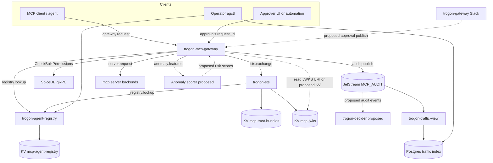

# MCP gateway integration touch-points

**Status:** Operator reference (Diátaxis reference).

**Related:** [overview.md](overview.md), [agent-traffic.md](agent-traffic.md), [adaptive-access.md](adaptive-access.md), [sts-exchange.md](sts-exchange.md), [registry.md](registry.md), [act-chain.md](act-chain.md), [jwt-claim-schema.md](jwt-claim-schema.md).

Unless noted **proposed**, identifiers below are verified in the repo (`rsworkspace/crates/trogon-mcp-gateway`, `trogon-sts`, `trogon-agent-registry`, `trogon-traffic-view`, `agctl`).

Default MCP subject prefix is `mcp` (`mcp_nats::Config` / `MCP_PREFIX`). Tables use `{prefix}` where the prefix is configurable.

**Failure modes:** Row links forward-reference [failure-mode-matrix.md](failure-mode-matrix.md) (Block C paper; not yet written). Until that matrix lands, use per-integration notes and [overview.md § Failure modes](overview.md#failure-modes).

---

## Summary table (all integrations)

| Integration | Direction | Wire identifier | Envelope / schema | Failure mode | Owner |
|---|---|---|---|---|---|
| [trogon-sts](#1-gateway--trogon-sts) | gateway → STS | NATS R/R `mcp.sts.exchange` | Request/response: `trogon-sts/src/types.rs`; contract: [sts-exchange.md](sts-exchange.md) | [FM-STS](failure-mode-matrix.md#sts) | `trogon-mcp-gateway` → `trogon-sts-client` / `trogon-sts` |
| [trogon-decider](#2-gateway--trogon-decider) | gateway → decider (proposed) | JetStream audit fan-out (no dedicated command subject yet) | Audit envelopes on `MCP_AUDIT` | [FM-DECIDER](failure-mode-matrix.md#decider) | **proposed** consumer on `trogon-decider` |
| [Approvals / Slack](#3-gateway--approvals-and-trogon-gateway-slack) | bidirectional | `mcp.approvals.{request_id}`, `mcp.approvals.step-up.{request_id}` | `trogon-mcp-gateway/src/approvals/types.rs`, [adaptive-access.md](adaptive-access.md) | [FM-APPROVAL](failure-mode-matrix.md#approval) | `trogon-mcp-gateway::approvals`; publishers external (UI / automation) |
| [Agent registry](#4-gateway--agent-registry) | gateway → registry | R/R `mcp.registry.agent.lookup` | `trogon-agent-registry/src/types.rs` (`LookupRequest` / `LookupResponse`) | [FM-REGISTRY](failure-mode-matrix.md#registry) | `trogon-mcp-gateway::ingress`, `trogon-sts::registry` |
| [SpiceDB](#5-gateway--spicedb) | gateway → SpiceDB | gRPC `CheckBulkPermissions` | N/A (Authzed API); tuple shapes in gateway README | [FM-SPICEDB](failure-mode-matrix.md#spicedb) | `trogon-mcp-gateway::spicedb` |
| [NATS transport](#6-gateway--nats-core-and-jetstream) | bidirectional | Queue group, streams, core pub/sub | `trogon-mcp-gateway/src/audit.rs`, `gateway.rs` | [FM-NATS](failure-mode-matrix.md#nats) | `trogon-mcp-gateway` |
| [Trust bundles](#7-gateway--trust-bundle-distribution) | indirect (STS) | KV `mcp-trust-bundles/<trust-domain>` | PEM SPIFFE bundle (bytes in KV) | [FM-TRUST](failure-mode-matrix.md#trust-bundle) | `trogon-sts` (gateway does not read this KV today) |
| [Traffic / OCSF](#8-gateway--traffic-indexer-and-ocsf-exporter) | gateway → indexer | JetStream `MCP_AUDIT` / `{prefix}.audit.>` | Gateway: `audit::AuditEnvelope`; STS: `trogon-sts/src/audit.rs`; OCSF: `trogon-traffic-view/src/siem/ocsf.rs` | [FM-AUDIT](failure-mode-matrix.md#audit) | `trogon-mcp-gateway::audit`, `trogon-traffic-view` |
| [Anomaly pipeline](#9-gateway--anomaly-feature-pipeline) | gateway → pipeline; score read **proposed** | Pub `mcp.metrics.anomaly.features`; sub **proposed** `mcp.metrics.anomaly.risk` | `trogon-mcp-gateway/src/anomaly.rs` | [FM-ANOMALY](failure-mode-matrix.md#anomaly) | `trogon-mcp-gateway::anomaly`, `policy` |
| [agctl](#10-gateway--agctl-cli) | operator → gateway (indirect) | NATS audit read / Postgres index; no gateway gRPC | [agent-traffic.md](agent-traffic.md), `agctl` crate | [FM-CLI](failure-mode-matrix.md#cli) | `agctl`, `trogon-traffic-view` |

---

## 1. Gateway ↔ trogon-sts

The gateway does **not** perform bootstrap exchange on ingress in Phase 1; it **mints** downstream mesh JWTs on egress via STS when `MCP_GATEWAY_AGENT_IDENTITY` is `shadow` or `enforce` (egress minter wired in `trogon-mcp-gateway/src/main.rs`).

### Bootstrap / mesh exchange (egress mint path)

| Field | Value |
|---|---|
| **Direction** | gateway → STS (request/reply); STS → gateway (reply JWT) |
| **Subject** | `mcp.sts.exchange` (`trogon_sts::EXCHANGE_SUBJECT`) |
| **Queue group (STS consumer)** | `trogon-sts` (`trogon_sts::DEFAULT_QUEUE_GROUP`) |
| **Request schema** | `trogon_sts::types::StsExchangeRequest` — [sts-exchange.md § Request schema](sts-exchange.md#request-schema) |
| **Success response** | `trogon_sts::types::StsExchangeResponse` — [sts-exchange.md § Response schema](sts-exchange.md#response-schema-success) |
| **Error response** | `trogon_sts::types::StsTokenErrorResponse` |
| **Client timeout** | `MCP_GATEWAY_STS_TIMEOUT_MS` (default **100 ms**); subject override `MCP_GATEWAY_STS_EXCHANGE_SUBJECT` |
| **Fail-mode** | STS unavailable → egress mint fails; gateway does not propagate inbound bearer ([overview](overview.md), [ADR 0004](../adr/0004-sts-form-factor.md)) — **fail-closed** in enforce | [FM-STS](failure-mode-matrix.md#sts) |
| **Owner** | Caller: `trogon-sts-client` (`rsworkspace/crates/trogon-sts-client`); service: `trogon-sts` (`exchange.rs`, `main.rs`) |

### Egress mesh-token cache (gateway-local)

| Field | Value |
|---|---|
| **Direction** | internal |
| **Key** | In-memory `MeshEgressCache` keyed by `mesh_cache:{tenant}:{caller_sub}:{target_aud}:{session_id}:{scope_fingerprint}` |
| **TTL** | `min(mesh JWT exp, MCP_GATEWAY_MESH_TOKEN_TTL_SECS)` (default token TTL **120 s**); invalidation on expiry / `invalidate_all` |
| **Env** | `MCP_GATEWAY_MESH_CACHE_MAX_ENTRIES` (default 10_000), `MCP_GATEWAY_MESH_TOKEN_TTL_SECS`, `MCP_GATEWAY_ACTOR_TOKEN` (SVID for `actor_token` on exchange) |
| **Owner** | `trogon-mcp-gateway::egress::cache`, `egress::mint` |

---

## 2. Gateway ↔ trogon-decider

`trogon-decider` is a **library** for event-sourced decisions; there is **no** NATS command subject between gateway and decider in the tree today. Block C intent: **audit-as-events** on the shared JetStream audit stream is the natural intersection.

| Field | Value |
|---|---|
| **Direction** | gateway → decider (**proposed**, via audit consumption) |
| **Wire (today)** | Gateway publishes only to `{prefix}.audit.>` on stream `MCP_AUDIT`; decider does not subscribe in-repo |
| **Wire (proposed)** | Durable consumer on `MCP_AUDIT` translating `trogon.mcp.audit/v1` (and `trogon.mcp.audit.sts/v1`) into decider domain events |
| **Risk / approval evaluator** | **proposed** `trogon-decider`-backed service replacing in-process `policy::evaluate_risk` ([adaptive-access.md](adaptive-access.md)) |
| **Timeout / fail-mode** | **proposed** fail-closed on decider unreachable for HITL/risk classes | [FM-DECIDER](failure-mode-matrix.md#decider) |
| **Owner** | **proposed** `trogon-decider` + audit projector; gateway stays publish-only |

---

## 3. Gateway ↔ approvals and trogon-gateway (Slack)

Human-in-the-loop and step-up flows use **core NATS pub/sub** on approval subjects. `trogon-gateway` ingests Slack into `slack.>` (stream `SLACK`); it does **not** publish to `mcp.approvals.*` in the current tree—operators or a future bridge publish approval decisions.

### Approval subjects

| Flow | Direction | Subject | Envelope |
|---|---|---|---|
| HITL park / resume | gateway subscribes; approver → gateway | `mcp.approvals.{request_id}` | `ApprovalDecisionMessage` in `trogon-mcp-gateway/src/approvals/types.rs` |
| Step-up | same | `mcp.approvals.step-up.{request_id}` | same |
| Client error envelope | gateway → client | JSON-RPC `-32107` `approval_required`; `error.data` built in `approvals/envelope.rs` | [adaptive-access.md § Client-visible envelope](adaptive-access.md#client-visible--32107-approval_required-envelope) |

**Approval decision message (grant / deny):**

```json
{
  "decision": "approve",
  "approver": "human:alice@acme",
  "expires_at": 1716840000
}
```

| Field | Value |
|---|---|
| **Direction** | bidirectional (gateway awaits; external publisher grants) |
| **Fail-mode** | Timeout → remain parked or return `-32107`; malformed payloads ignored ([adaptive-access.md](adaptive-access.md)) | [FM-APPROVAL](failure-mode-matrix.md#approval) |
| **Owner** | `trogon-mcp-gateway::approvals::{client,envelope,state}`; `policy::run_with_risk` |

### trogon-gateway (Slack) coexistence

| Field | Value |
|---|---|
| **Direction** | Slack → trogon-gateway → NATS (not to MCP gateway directly) |
| **Subjects** | `slack.{event.type}` (e.g. `slack.event.message`); stream **`SLACK`**, filter `slack.>` |
| **MCP gateway relation** | **proposed** Slack interaction handler publishes to `mcp.approvals.{request_id}` after operator action |
| **Owner** | `trogon-gateway::source::slack` |

There is no crate named `trogon-agent-gateway` in this repo; Slack ingress lives under **`trogon-gateway`**.

---

## 4. Gateway ↔ agent registry

### Read paths (gateway today)

| Path | Direction | Identifier | Schema | Cache / invalidation |
|---|---|---|---|---|
| Ingress `act_chain` resolution | gateway → registry | R/R `mcp.registry.agent.lookup` | `LookupRequest` / `LookupResponse` — `trogon-agent-registry/src/types.rs` | `RegistryCache` **60 s** TTL (`trogon_sts::cache`, moka); mode `MCP_GATEWAY_CHAIN_RESOLUTION_MODE` = `off` \| `cache` (default) \| `strict` |
| Env override | — | `MCP_GATEWAY_REGISTRY_SUBJECT` (default `mcp.registry.agent.lookup`) | — | — |

Gateway does **not** open KV `mcp-agent-registry` directly; all reads go through the lookup subject (same as STS).

### Write paths (gateway does not touch)

| Writer | KV bucket | NATS / audit |
|---|---|---|
| `trogon-agent-registry-controller` | `PUT`/`DELETE` `mcp-agent-registry` keys `{agent_id}/@latest`, `{agent_id}/{version}` | `mcp.audit.registry.{registered,bumped,deprecated,revoked}` |
| `trogon-agent-registry` (runtime, dev) | optional `put`/`delete` | `mcp.audit.registry.lookup.*`, `put`, `delete` |

| Field | Value |
|---|---|
| **Fail-mode** | Lookup NACK / timeout / `revoked` → ingress chain deny or STS `invalid_target` (fail-closed in enforce) | [FM-REGISTRY](failure-mode-matrix.md#registry) |
| **Owner (lookup service)** | `trogon-agent-registry` queue group **`trogon-agent-registry`** (`consumer.rs`) |

---

## 5. Gateway ↔ SpiceDB

| Field | Value |
|---|---|
| **Direction** | gateway → SpiceDB (gRPC only); **no writes** — read/check only |
| **Endpoint** | `MCP_GATEWAY_SPICEDB_ENDPOINT` (gRPC); optional `MCP_GATEWAY_SPICEDB_TOKEN`, `MCP_GATEWAY_SPICEDB_INSECURE` |
| **API** | `CheckBulkPermissions` (single item) via `spicedb-rs-client` |
| **When checked** | CEL gate: `tools/call`, `resources/read` (`trogon-mcp-gateway/src/policy.rs`, `spicedb.rs`) |
| **Permissions** | `call` on `trogon/mcp_tool` (env `MCP_GATEWAY_SPICEDB_PERMISSION`); `read` on `trogon/mcp_resource` (`MCP_GATEWAY_SPICEDB_READ_PERMISSION`) |
| **Subject type** | `trogon/principal` — id from JWT `sub`, else legacy `trogon-mcp-tenant`, else `anonymous` |
| **Resource ids** | Tool: `{server_id}\|{tool_name}` (normalized); Resource: normalized `params.uri` |
| **Consistency** | First check: `minimize_latency`; after success, cache `ZedToken` from `checked_at` and use **`at_least_as_fresh`** (`trogon-mcp-gateway/src/spicedb.rs`) |
| **Unset endpoint** | Allow-all (`AllowAllPermissionChecker`) — Phase 1 dev default |
| **Fail-mode** | PDP error → `-32107` class / deny; **fail-closed** when SpiceDB configured | [FM-SPICEDB](failure-mode-matrix.md#spicedb) |
| **Owner** | `trogon-mcp-gateway::spicedb`, `authz` |

Example schema: `devops/docker/compose/services/spicedb/schema.zed`.

---

## 6. Gateway ↔ NATS (core and JetStream)

### Queue groups

| Service | Queue group | Subscribes / serves |
|---|---|---|
| **MCP gateway** | `mcp-gateway` (`MCP_GATEWAY_QUEUE_GROUP`) | `{prefix}.gateway.request.>` |
| **trogon-sts** | `trogon-sts` | `mcp.sts.exchange` |
| **trogon-agent-registry** | `trogon-agent-registry` | `mcp.registry.agent.lookup` |

### Ingress / egress subjects (gateway)

| Lane | Direction | Subject pattern |
|---|---|---|
| Ingress | client → gateway | `{prefix}.gateway.request.{server_id}.{method…}` |
| Egress | gateway → backend | `{prefix}.server.{server_id}.{method…}` (rewrite in `subject.rs` / `gateway.rs`) |
| Audit publish | gateway → JetStream | `{prefix}.audit.{outcome}.{direction}.{method_root}` — `audit::audit_publish_subject` |

`method_root` is the first JSON-RPC segment (`tools`, `resources`, …).

### JetStream audit stream (append-only)

| Field | Value |
|---|---|
| **Stream name** | `MCP_AUDIT` (`MCP_GATEWAY_AUDIT_STREAM`) |
| **Capture filter** | `{prefix}.audit.>` |
| **Retention (bootstrap)** | `max_messages: 100_000` in `audit::ensure_audit_stream` — operator may override stream config out-of-band |
| **Init skip** | `MCP_GATEWAY_SKIP_AUDIT_STREAM_INIT=1` |
| **Sticky rule** | Audit subjects are **append-only**; consumers must not trim per-request history used for compliance ([agent-traffic.md](agent-traffic.md)) |
| **Gateway envelope** | `trogon-mcp-gateway/src/audit.rs` — `AuditEnvelope` (no `schema` field on wire yet; doc target `trogon.mcp.audit/v1` in [act-chain.md](act-chain.md)) |
| **Fail-mode** | Publish failure logged; request path continues (best-effort audit) | [FM-AUDIT](failure-mode-matrix.md#audit) |
| **Owner** | `trogon-mcp-gateway::audit`, `gateway` |

### KV buckets (gateway-adjacent)

| Bucket | Key | TTL / history | Gateway access |
|---|---|---|---|
| `mcp-agent-registry` | `{agent_id}/@latest`, … | `history: 10` (no KV TTL) | **Read-only** via lookup, not direct KV |
| `mcp-jwks` | `mesh/current` | watcher-driven | **proposed** ingress verify via `MCP_GATEWAY_JWT_JWKS_URI` or KV per [ADR 0006](../adr/0006-mesh-token-signing-keys.md) |
| `mcp-trust-bundles` | `<trust-domain>` | watcher-driven | STS only (see §7) |

**proposed** Phase 2+ control plane: `mcp-gateway-config` KV.

---

## 7. Gateway ↔ trust-bundle distribution

Gateway **does not** subscribe to trust bundles today; **trogon-sts** loads them for `actor_token` / SVID verification during exchange. Mesh ingress JWT verification uses JWKS (`MCP_GATEWAY_JWT_JWKS_URI`) or static keys, not SPIFFE KV.

| Field | Value |
|---|---|
| **Direction** | STS ← KV (gateway indirect via egress mint) |
| **KV bucket** | `mcp-trust-bundles` (`trogon_sts::TRUST_BUNDLES_KV_BUCKET`) |
| **Key** | `<trust-domain>` (e.g. `acme.local`) — PEM bundle |
| **Publish tooling** | `trogon-sts-publish-trust-bundle` binary; env `MCP_STS_TRUST_BUNDLE_PATH`, `MCP_STS_TRUST_DOMAIN` |
| **Watch** | `spawn_trust_bundle_watch` in `trogon-sts/src/cache.rs` |
| **Fail-mode** | Missing bundle → SPIFFE `actor_token` rejected at STS (**fail-closed**) | [FM-TRUST](failure-mode-matrix.md#trust-bundle) |
| **Owner** | `trogon-sts::cache`, `attestor`, `svid_verify` |

---

## 8. Gateway ↔ traffic indexer and OCSF exporter

### What the gateway publishes

| Source | Audit subject examples | Payload owner |
|---|---|---|
| Gateway decisions | `mcp.audit.allow.request.tools`, `mcp.audit.deny.request.tools`, … | `trogon-mcp-gateway::audit::AuditEnvelope` |
| STS (related) | `mcp.audit.sts.success`, `mcp.audit.sts.deny`, … | `trogon-sts/src/audit.rs` (`StsAuditEvent`) |
| Registry (related) | `mcp.audit.registry.lookup.found`, … | `trogon-agent-registry/src/audit.rs` |

### Traffic indexer (`trogon-traffic-view`)

| Field | Value |
|---|---|
| **Direction** | gateway → JetStream → projector → Postgres |
| **Stream** | `MCP_AUDIT` (default `trogon_traffic_view::projector::DEFAULT_STREAM`) |
| **Durable consumer** | `agent-traffic-projector` |
| **Filter (JetStream)** | `mcp.audit.>` |
| **Handled today in `JetStreamAuditConsumer`** | `mcp.audit.sts.*`, `mcp.audit.registry.*` only (`consumer.rs`); gateway-shaped subjects are classified in `normalize.rs` but skipped until handler widens |
| **Spec (full index)** | [agent-traffic.md §2](agent-traffic.md#2-inputs) — includes `{prefix}.audit.{outcome}.{direction}.{method_root}` |
| **OCSF schema** | [agent-traffic.md §7](agent-traffic.md#7-siem-export-pinned-ocsf-v1); implementation `trogon-traffic-view/src/siem/ocsf.rs` (`DefaultOcsfExporter`) |
| **Fail-mode** | Projector errors logged; message not acked (retry) | [FM-AUDIT](failure-mode-matrix.md#audit) |
| **Owner** | `trogon-traffic-view::projector`, `index`, `siem` |

---

## 9. Gateway ↔ anomaly feature pipeline

| Field | Value |
|---|---|
| **Direction (features)** | gateway → pipeline (core NATS publish, fire-and-forget) |
| **Publish subject** | `mcp.metrics.anomaly.features` (`ANOMALY_FEATURES_SUBJECT`) |
| **Payload** | `AnomalyFeature` — `trogon-mcp-gateway/src/anomaly.rs` (JSON: `ts`, `tenant`, `agent_id`, `purpose`, `target_aud`, `scope_fingerprint`, `outcome`, `latency_ms`, `recent_denials_60s`) |
| **Direction (risk score)** | **proposed** pipeline → gateway |
| **Read subject** | **proposed** `mcp.metrics.anomaly.risk` (no consumer in tree; risk is **in-process** `policy::risk_score` / `evaluate_risk` today) |
| **Fail-mode** | Feature publish failure must not block request ([adaptive-access.md](adaptive-access.md)); **proposed** missing score → fallback to inline heuristic | [FM-ANOMALY](failure-mode-matrix.md#anomaly) |
| **Owner** | `trogon-mcp-gateway::anomaly`, `policy` |

Related metrics (not gateway consume): `mcp.metrics.sts.latency`, `mcp.metrics.gateway.aud_mismatch_shadow` (shadow egress).

---

## 10. Gateway ↔ agctl (`agctl`)

`agctl` does **not** call the gateway over gRPC or a dedicated admin subject. Operator commands use the **traffic index** (Postgres) fed by audit projection, or local registry validation.

| Command | Transport | Touches gateway? |
|---|---|---|
| `agctl registry sync` | Local Git + PEM verify | No — validates manifests before controller sync |
| `agctl traffic query` | Postgres (`TROGON_PG_URL` / `--database-url`) | Indirect — reads projected audit rows |
| `agctl traffic tail` | Postgres | Same |
| **proposed** `agctl trace` | **proposed** KV or NATS read of in-memory traces | Today: `TraceStore` in-process only (`trogon-mcp-gateway/src/trace.rs`) |

| Field | Value |
|---|---|
| **Direction** | operator → index / registry (not gateway RPC) |
| **Owner** | `rsworkspace/crates/agctl` |

See [agent-traffic.md §8](agent-traffic.md#8-ui-substrate-pinned-cli-first-agctl-traffic).

---

## Environment variables (gateway process)

| Variable | Integration |
|---|---|
| `MCP_GATEWAY_QUEUE_GROUP`, `MCP_GATEWAY_AUDIT_STREAM`, `MCP_GATEWAY_SKIP_AUDIT_STREAM_INIT` | NATS / audit |
| `MCP_GATEWAY_SPICEDB_*` | SpiceDB |
| `MCP_GATEWAY_JWT_*`, `MCP_GATEWAY_AGENT_IDENTITY`, `MCP_GATEWAY_AUDIENCE`, `MCP_GATEWAY_TRUSTED_MINT_ISSUERS` | Ingress identity / STS mint |
| `MCP_GATEWAY_STS_EXCHANGE_SUBJECT`, `MCP_GATEWAY_STS_TIMEOUT_MS` | STS client |
| `MCP_GATEWAY_REGISTRY_SUBJECT`, `MCP_GATEWAY_CHAIN_RESOLUTION_MODE` | Registry |
| `MCP_GATEWAY_MESH_*`, `MCP_GATEWAY_ACTOR_TOKEN`, `MCP_GATEWAY_IDENTITY_SUB` | Egress mint / cache |
| `MCP_PREFIX` (via `mcp_nats`) | Subject prefix |

Full JWT/SpiceDB tables: [trogon-mcp-gateway/README.md](../../rsworkspace/crates/trogon-mcp-gateway/README.md).

---

## Dependency graph



---

## Cross-reference index

| Doc | Relevance |
|---|---|
| [overview.md](overview.md) | Identity model, audience URIs, failure summary |
| [sts-exchange.md](sts-exchange.md) | STS request/response and audit |
| [registry.md](registry.md) | KV layout, lookup contract, write ACL |
| [adaptive-access.md](adaptive-access.md) | Approvals, throttle, anomaly features |
| [agent-traffic.md](agent-traffic.md) | Audit consumers, OCSF, `agctl traffic` |
| [act-chain.md](act-chain.md) | `act_chain` audit embedding |
