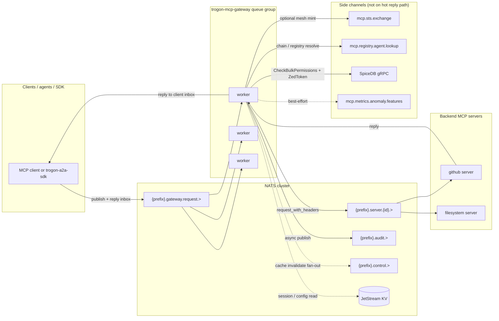

# MCP gateway — operator overview

**Status:** Diátaxis explanation (2026-05-28). Audience: platform / SRE engineers who know NATS and Trogon identity, but may not have used MCP before.

**Related:** [Agent identity overview](overview.md) · [MCP gateway plan](../../MCP_GATEWAY_PLAN.md) (Block H) · `trogon-mcp-gateway` crate README · [Registry runbook](registry-operations.md)

---

## 1. Elevator pitch

The **MCP gateway** (`trogon-mcp-gateway`) is a NATS queue-group service that sits on the **edge zone** of your MCP deployment. Every JSON-RPC call that crosses from clients to backend MCP servers passes through it first. The gateway parses MCP methods, applies identity and policy, optionally rewrites payloads, forwards to the backend lane, and emits a structured audit record to JetStream.

It is the **policy enforcement point** for MCP-over-NATS: authentication hooks, SpiceDB authorization on sensitive methods, mesh-token egress minting, actor-chain verification, and (in later phases) catalog shaping and schema-driven redaction. Clients publish to `{prefix}.gateway.request.{server_id}.{method}`; only the gateway may publish to `{prefix}.server.{server_id}.{method}`. That subject ACL pairing is what makes the gateway a chokepoint rather than a suggestion.

The gateway is **not** an agent runtime. It does not execute tools, hold conversation state for an LLM, or replace `mcp-nats` bridge processes. It is **not** an LLM or inference service. It is **not** a tool itself — it neither implements MCP tools nor registers them in a catalog; backends and agents do that. Think of it as the NATS-native equivalent of an API gateway or sidecar proxy, specialized for MCP JSON-RPC semantics on top of the existing `mcp-nats` transport.

If you operate TrogonStack today, the gateway complements — rather than replaces — the auth callout (CONNECT-time bootstrap JWT), the Security Token Service on `mcp.sts.exchange`, the agent registry, and SpiceDB. Those components answer "who may connect" and "who may act at this hop"; the gateway answers "may this specific `tools/call` or `resources/read` proceed, with what lineage, and what do we log."

---

## 2. Where the gateway sits in Trogon

Trogon agent traffic flows through several cooperating services. The gateway is one hop in a longer chain; understanding that chain prevents misconfigured ACLs and wrong scaling assumptions.

| Component | NATS surface | Role relative to MCP gateway |
|---|---|---|
| **Auth callout** | CONNECT-time | Issues bootstrap User JWT with subject ACL for `gateway.request` (and the caller's callback subtree). Does not read the agent registry. |
| **STS** (`trogon-sts`) | `mcp.sts.exchange` (queue group `trogon-sts`) | Exchanges bootstrap or upstream mesh JWT for audience-scoped mesh tokens; appends `act_chain` entries. |
| **Agent registry** | `mcp.registry.agent.lookup` | Authoritative `agent_id` → workloads, audiences, purposes. Read-only for gateway and STS. |
| **MCP gateway** | `{prefix}.gateway.request.>` | Ingress policy, SpiceDB checks, egress mesh mint, audit. |
| **Backend MCP servers** | `{prefix}.server.{server_id}.>` | Actual MCP implementations (`mcp-nats`, `mcp-nats-stdio` bridges, Trogon-native servers). |
| **SpiceDB** | gRPC (out of band) | Permission decision point for gated MCP methods. |
| **JetStream** | `MCP_AUDIT`, KV buckets | Durable audit stream; session, config, registry, and trust-bundle KV (shared control plane). |

For the full identity mental model (bootstrap vs mesh, per-hop audience, four-hop worked example), start with [Agent identity overview](overview.md). For wire contracts on STS and registry, see [STS exchange](sts-exchange.md) and [Agent registry](registry.md).

---

## 3. Topology

The default deployment shape is **on-bus**: clients and backends are NATS principals; the gateway is a subscriber on the edge zone. There is no required HTTP front door for MCP traffic in v1 (an HTTP STS facade is documented as a future option in ADR 0004).

### 3.1 Request path (client → backend)



### 3.2 Callback path (server → client)

Server-initiated MCP traffic (`sampling/createMessage`, `elicitation/create`, etc.) uses the **callback zone**:

- Server publishes to `{prefix}.client.{client_id}.{method}` (backend zone).
- Gateway subscribes on `{prefix}.gateway.callback.>` / `{prefix}.client.>` (separate queue group `mcp-gateway-callbacks` in the full design).
- Gateway applies the same policy engine with a separate rule set, mints mesh tokens for callback egress, and delivers to `{prefix}.gateway.callback.{client_id}.{method}` where the client subscribed.

Callback direction is specified in [MCP gateway plan](../../MCP_GATEWAY_PLAN.md) § NATS Subject Topology; ingress wiring for bidirectional enforcement is tracked in Block C of that plan.

### 3.3 Subject zones and ACL intent

| Zone | Example subject | Who may publish | Who may subscribe |
|---|---|---|---|
| Edge (client → gateway) | `mcp.gateway.request.github.tools.call` | Clients, SDK, edge bridges | Gateway queue group only |
| Backend (gateway → server) | `mcp.server.github.tools.call` | Gateway only | Backend MCP server for `github` |
| Callback (server → gateway) | `mcp.client.client-1.sampling.createMessage` | Backend servers | Gateway callback queue group |
| Edge callback (gateway → client) | `mcp.gateway.callback.client-1.sampling.createMessage` | Gateway | Owning client |
| Audit | `mcp.audit.allow.request.tools` | Gateway, STS, registry controller | SIEM consumers (JetStream durable) |
| Control | `mcp.control.cache.invalidate.github` | Gateway peers | All gateway instances |

Tenancy is **not** a subject segment. Under production defaults ([ADR 0001](../adr/0001-tenancy-model.md)), each customer gets a NATS account; subject strings are identical across accounts, and isolation is enforced by account boundaries. The `tenant` claim in JWT and audit envelopes is for SpiceDB principal naming and SIEM aggregation, not routing.

Default `{prefix}` is `mcp` (`MCP_PREFIX` in `mcp-nats`). Operators may set `MCP_PREFIX=acme.mcp` for soft partitioning on a shared cluster without changing gateway code.

---

## 4. The on-bus model in five bullets

1. **Queue group, not sticky routing.** Gateway workers subscribe to `{prefix}.gateway.request.>` under a single queue group name (default `mcp-gateway`, env `MCP_GATEWAY_QUEUE_GROUP`). NATS delivers each message to any healthy worker. There is **no** requirement that the same instance handles all messages in an MCP session in Phase 1; session-scoped state (ZedToken, schema versions, rate budgets) is designed to live in **JetStream KV** (`mcp-sessions`) so any instance can resume. Session-affinity via subject hashing is a documented Phase 3 optimization, not the default.

2. **Subjects encode server and method, not tenant.** Grammar: `{prefix}.gateway.request.{server_id}.{method_with_dots}`. Examples: `mcp.gateway.request.github.tools.call`, `mcp.gateway.request.filesystem.resources.read`. The gateway rewrites ingress subjects to `{prefix}.server.{server_id}.{method}` for backend fan-out. Federated virtual servers (`virtual-default`) expand to multi-backend fan-out in the policy layer; membership lists live in KV config, not in the subject.

3. **JetStream KV is the shared memory across gateway replicas.** Planned and partially specified buckets include: `mcp-gateway-config` (policy bundles and route config), `mcp-sessions` (session id → client binding, session ZedToken, schema hash), `mcp-agent-registry` (projected agent records), `mcp-trust-bundles` (SPIFFE trust domains for STS attestation), and `mcp-jwks` (mesh signing keys). Gateway instances watch KV and refresh in-memory caches; they do not coordinate via gossip.

4. **Audit is publish-and-forget on a parallel subject tree.** Every gateway decision emits JSON to `{prefix}.audit.{outcome}.{direction}.{method_root}` (for example `mcp.audit.deny.request.tools`). Payload carries caller, tenant, rules fired, SpiceDB outcome, latency, and full `act_chain`. Stream name defaults to `MCP_AUDIT` (`MCP_GATEWAY_AUDIT_STREAM`). Audit failure must not block the client reply path; the implementation logs and continues if stream init fails during smoke tests (`MCP_GATEWAY_SKIP_AUDIT_STREAM_INIT`).

5. **No sticky routing for reply correlation.** Each gateway process generates a unique `instance_id` at boot and subscribes to `_INBOX.gateway.{instance_id}.>` (direct subscribe, **not** queue grouped). Backend replies land on that inbox; the gateway maps back to the client's original `_INBOX.client.*` held in an in-memory correlation table for the duration of the request. If a worker dies mid-flight, that request is lost — clients must retry idempotent operations or use JSON-RPC ids for deduplication upstream.

---

## 5. What the gateway enforces and why

Enforcement is layered: perimeter identity (bootstrap + mesh), delegation lineage, coarse registry bindings, fine-grained SpiceDB, and adaptive access for high-risk calls.

### 5.1 Perimeter and mesh identity

At CONNECT, the auth callout issues a **bootstrap NATS User JWT** — broad NATS ACL, not a credential backends trust in enforce mode. Before a gated MCP call, callers obtain a **mesh token** from STS with `aud` set to exactly one downstream URI (gateway instance, another agent, backend server, or client callback target). The gateway validates mesh JWTs on ingress when `MCP_GATEWAY_AGENT_IDENTITY=enforce` and **mints** a fresh downstream token on egress; it never forwards inbound bearer tokens unchanged.

Why: bootstrap proves "who connected to NATS"; mesh proves "who may act at this hop" with short TTL (default 120 s), audience binding, and workload attestation via SVID. See [Agent identity overview](overview.md) and [STS exchange](sts-exchange.md).

### 5.2 Actor chain (`act_chain`)

Every mesh token carries an append-only `act_chain` array: `{ sub, agent_id?, wkl, iat }` per hop, oldest originator first. The gateway verifies structural rules, depth (default max 8), loop detection on `(agent_id, wkl)`, and registry resolution for agent entries **at receipt time** (revoked agents fail closed even if the hop was valid when recorded).

Why: audit and policy need to answer "who acted on whose behalf across N delegation hops," not just the immediate caller's `sub`. CEL rules can reference `jwt.act_chain`, `chain.depth()`, `chain.originator()`, and `chain.contains(agent_id)`. Full specification: [Actor chain (`act_chain`)](act-chain.md).

### 5.3 Agent registry bindings

STS and the gateway consult the registry (Git → controller → KV) to confirm that a presented `agent_id` is **active**, that the attested SPIFFE ID (`wkl`) is in `allowed_workloads`, and that requested `audience` and `purpose` are permitted. The gateway does not mint tokens without registry-backed STS; registry lookup failures are fail-closed in enforce mode.

Why: without registry bindings, any workload could claim any agent name. Specification: [Agent registry](registry.md). Day-zero operations: [Registry runbook](registry-operations.md).

### 5.4 SpiceDB on gated methods

Phase 1 runs a hardcoded CEL gate:

```cel
mcp.method == "tools/call" || mcp.method == "resources/read"
```

When `MCP_GATEWAY_SPICEDB_ENDPOINT` is set, the gateway calls SpiceDB `CheckBulkPermissions` (single item) with:

- **Subject:** `trogon/principal` id from JWT `sub` (preferred) or legacy `trogon-mcp-tenant` header when JWT mode is off.
- **Resource:** `trogon/mcp_tool` with id `{server_id}|{tool_name}` for `tools/call`; `trogon/mcp_resource` with id `{uri}` for `resources/read`.

When SpiceDB is unset, gated methods **allow-all** (Phase 1 dev behavior). Deny maps to JSON-RPC `-32100`; PDP unreachable maps to `-32107`.

Why: registry and mesh answer "is this agent allowed to talk to this backend at all"; SpiceDB answers "may this principal invoke **this** tool or read **this** resource right now."

### 5.5 Adaptive access (risk, throttle, approval)

For deployments using mesh identity hardening, the gateway library exposes risk evaluation: context throttling on `(tenant, agent_id, purpose)`, step-up auth, human-in-the-loop approval parked on `mcp.approvals.{request_id}`, and deny on risk score. Anomaly features publish best-effort to `mcp.metrics.anomaly.features`.

Why: static allow/deny is insufficient for high-risk tools (deploy, delete, spend). Operators need rate limits that follow agent intent, not just NATS connection identity. Contract: [Adaptive access](adaptive-access.md).

### 5.6 Ingress hardening summary

| Client-supplied input | Gateway behavior |
|---|---|
| `trogon-mcp-tenant` header | Used only when JWT mode is `off`; **stripped on egress** when JWT ingress is active |
| `mcp-caller-sub`, `mcp-tenant`, `mcp-act-chain` | Dropped on ingress; replaced from verified JWT / gateway state |
| Bearer JWT on `authorization` | Verified when `MCP_GATEWAY_JWT_MODE` is `validate` or `require` |
| Forgeable mesh claims in non-trusted JWTs | Rejected or ignored per `MCP_GATEWAY_TRUSTED_MINT_ISSUERS` |

---

## 6. Hot paths and cold paths

Operators sizing clusters care about what runs synchronously before the backend sees the request versus what can lag or run asynchronously.

### 6.1 Per-request hot path (target under ~10 ms gateway overhead)

These steps run on the critical path for every handled message (exact set depends on method and env):

| Step | Typical cost | Notes |
|---|---|---|
| NATS deliver + JSON-RPC parse | sub-ms to low ms | Dominated by payload size |
| JWT signature verify | sub-ms | Local crypto after key material is loaded |
| CEL gate evaluation | sub-ms | In-process; Phase 1 expression is fixed |
| `act_chain` structural checks | sub-ms | In-memory parse; registry walk may add cold latency (below) |
| SpiceDB `CheckBulkPermissions` | low ms | **Hot** when `ZedToken` cache hit → consistency `at_least_as_fresh` |
| Subject rewrite + `request_with_headers` to backend | network RTT | Not gateway CPU; included in end-to-end budget |
| In-memory trace record | sub-ms | `TraceStore` by JSON-RPC id until KV export lands |

JWT verification uses locally cached decoding keys: static RSA PEM, HS256 secret, or JWKS keys refreshed on a **~5 minute TTL** after first fetch. Mesh egress token mint (STS call) is on the hot path only when cache miss or proactive refresh window — see egress cache in [STS exchange](sts-exchange.md) § Caching contract.

SpiceDB checker keeps a process-local `ZedToken` cache (`check_zed_token_cache`). After the first successful check returns `checked_at`, subsequent checks use `at_least_as_fresh` with the cached token instead of `minimize_latency` cold reads.

### 6.2 Cold-path work (first request, cache miss, or periodic refresh)

| Step | Trigger | Impact |
|---|---|---|
| JWKS HTTP fetch | Unknown `kid`, cache TTL expiry (~300 s) | Adds HTTP RTT to first JWT after rotation |
| SpiceDB without cached ZedToken | First check after process start or token invalidation | Uses `minimize_latency`; may read remote SpiceDB more expensively |
| Registry lookup / chain resolution | Enforce mode + mesh identity; STS egress mint | `mcp.registry.agent.lookup` RTT; STS chain cache default 60 s |
| STS mesh token exchange | Egress cache miss, callback direction, TTL /4 proactive refresh | Target STS P99 < 40 ms per [STS exchange](sts-exchange.md) |
| Schema sniff on `tools/list` replies | Phase 2 — populate schema cache | One-time per server schema version |
| `BulkCheckPermission` batch for catalog shaping | Phase 2 — filter `tools/list` per item | Potentially tens of checks per list response |

Operators should warm caches after deploy: synthetic `tools/call` against a canary tool, STS probe sidecar (`trogon-sts-probe`), and ensure JWKS overlap during key rotation ([ADR 0006](../adr/0006-mesh-token-signing-keys.md)).

### 6.3 Out-of-band (must not block client replies)

| Work | Subject / sink | Semantics |
|---|---|---|
| Audit envelope publish | `{prefix}.audit.>` → JetStream `MCP_AUDIT` | Async; loss logged, not propagated as MCP error |
| Anomaly feature vector | `mcp.metrics.anomaly.features` | Best-effort JSON per request |
| STS exchange audit | `mcp.audit.sts.{outcome}` | Emitted by STS, not gateway |
| Registry mutation audit | `mcp.audit.registry.*` | Emitted by registry controller |
| OpenTelemetry span export | OTLP via `trogon-telemetry` | Span `mcp_gateway.handle_ingress` on gateway |
| Control plane signals | `mcp.control.cache.invalidate.{server_id}` | Fan-out among gateway peers |

Phase 2+ adds schema-cache invalidation on `notifications/tools/list_changed` and policy bundle hot-reload from KV watchers — both are designed as watch-driven background refresh, not inline with each `tools/call`.

---

## 7. Capacity model

Scaling the gateway is mostly horizontal; some dependencies scale independently and become the bottleneck first.

### 7.1 Gateway replicas vs subjects

| Dimension | Scales with | Does not scale with |
|---|---|---|
| Ingress throughput | **Queue group members** on `{prefix}.gateway.request.>` | Number of backend MCP servers (same group serves all) |
| Callback throughput | **Separate queue group** `mcp-gateway-callbacks` on `{prefix}.client.>` | Request-side replica count (shared process today; can be split later) |
| Reply correlation | **Per-process** `_INBOX.gateway.{instance_id}.>` subscription | Queue group size (each instance owns its inbox namespace) |
| In-flight backpressure | Per-target semaphore (default 256 per `server_id`) + per-tenant cap (4096) | Adding replicas without raising caps |

**When to add gateway replicas:** CPU or inflight saturation on gateway workers, NATS consumer lag on the queue group, or P99 gateway span duration growing while backend latency is flat. Adding replicas does **not** require sticky sessions in the default KV session model.

**When replicas do not help:** SpiceDB write/read limits, STS exchange rate limits (100 per `wkl` / 10 s default), single backend MCP server that is itself saturated, or JetStream audit stream disk bandwidth.

### 7.2 JetStream KV throughput

KV buckets (`mcp-sessions`, `mcp-gateway-config`, `mcp-agent-registry`, trust bundles) share the JetStream cluster's IOPS and watch fan-out budget.

| Bucket | Read pattern | Write churn |
|---|---|---|
| `mcp-agent-registry` | Watch + occasional lookup on chain verify | Low — Git merge via controller |
| `mcp-sessions` | Per-request read on session-bound calls (Phase 2+) | Per-session create/update on `initialize` |
| `mcp-gateway-config` | Watch on all gateway pods | Low — policy releases |
| `mcp-trust-bundles` | STS and gateway on SVID verify | Rare — rotation events |

If KV watch latency exceeds ~5 s P99, gateway replicas may serve stale registry or config until refresh. Registry design target: < 5 s P99 refresh under normal churn ([Agent registry](registry.md)).

### 7.3 SpiceDB consistency budget

Each gated `tools/call` / `resources/read` consumes one SpiceDB check (today single-item bulk API). Catalog shaping (Phase 2) multiplies checks per `tools/list`. The gateway amortizes read load via `ZedToken` caching but **cannot** cache denials safely across principals.

Plan SpiceDB capacity for:

- Peak gated MCP RPS × (1 + list-filter multiplier)
- Plus STS/gateway registry-driven checks if relations are duplicated in SpiceDB
- Headroom for `at_least_as_fresh` consistency when permissions change — cache invalidation is per-process on restart or token expiry, not cluster-wide instant

If SpiceDB is unavailable, the gateway fails **closed** on gated methods (`-32107`). Operators should monitor PDP latency separately from NATS latency.

### 7.4 Audit and SIEM fan-out

`MCP_AUDIT` retention and consumer count affect JetStream storage, not gateway CPU. High-volume `allow` auditing should be sampled at the consumer ([Agent-traffic view](agent-traffic.md)); subject filters like `mcp.audit.deny.>` reduce fan-out for alerting-only pipelines.

### 7.5 Quick sizing heuristics

| Signal | Likely bottleneck | First knob |
|---|---|---|
| Gateway queue lag rising, flat SpiceDB | Too few gateway replicas | Increase `trogon-mcp-gateway` replicas |
| SpiceDB p99 high, flat gateway CPU | PDP saturation | Scale SpiceDB; review relation complexity |
| STS `rate_limited` audit events | Exchange storm | Raise limits per bundle; cache mesh tokens (`session_id` binding) |
| KV watch stale after registry merge | Controller or KV issue | [Registry runbook](registry-operations.md) § Normal change workflow |
| `-32105 rate_limited` from gateway | Context throttle or inflight cap | Tune adaptive access / per-server inflight in bundle |

---

## 8. Failure tolerance summary

The gateway and its dependencies follow a **fail-closed** posture for authorization decisions: if the system cannot prove allow, the client receives deny or unreachable errors rather than silent passthrough. Exact per-class behavior (SpiceDB down vs WASM panic vs backend timeout vs bundle signature invalid) is being consolidated in a forthcoming operator reference:

**→ [Failure mode matrix](failure-mode-matrix.md)** *(forthcoming — MCP gateway plan Block C)*

Until that matrix ships, use these defaults aligned with shipped docs and Phase 1 code:

| Failure | Gated MCP methods | Bootstrap / off mode | Audit |
|---|---|---|---|
| SpiceDB unreachable | Deny (`-32107`) | Allow-all if endpoint unset | `error` outcome when publish succeeds |
| Registry unreachable (enforce) | Deny at STS / chain verify | Shadow may allow with `would_deny` | `registry_miss` / STS deny |
| STS unavailable (egress mint) | Deny — no bypass | Mesh egress skipped if identity off | STS `mcp.audit.sts.deny` |
| JWT invalid / expired | Deny (`-32110`, `-32106`) under `require` | Legacy header path if configured | Deny envelope |
| Backend MCP timeout | `-32102` upstream timeout | Same | `error` with latency |
| Gateway process crash mid-request | Client sees NATS timeout; retry | Same | May omit audit for incomplete handling |
| NATS partition | Clients cannot publish; gateway cannot forward | Same | Audit backlog when JS returns |
| JetStream audit unavailable | **Request still forwarded** if policy allowed | Same | Log warning; stream init skippable in dev |

For identity-specific codes (`act_chain_depth_exceeded`, `audience_mismatch`, `approval_required`), see tables in [Agent identity overview](overview.md) and [Actor chain](act-chain.md).

Rollback playbook for mesh identity: set `MCP_GATEWAY_AGENT_IDENTITY=shadow`, drain mesh egress cache, investigate audit for `would_deny: true`, then re-enforce after seven clean days ([overview](overview.md) § Rollout modes).

---

## 9. Day-2 operations checklist

Use this as a periodic review (weekly in production, after every identity or policy change).

### 9.1 Identity and registry

- [ ] Confirm auth callout issues bootstrap JWT with publish ACL only on `{prefix}.gateway.request.>` (not `{prefix}.server.>`). See [A2A auth callout deployment](../a2a/how-to/operators/auth-callout-deployment.md) for parallel patterns.
- [ ] Verify STS queue group `trogon-sts` has healthy consumers; run or monitor `trogon-sts-probe` for P99 < 40 ms ([STS exchange](sts-exchange.md) § Latency probe).
- [ ] After agent registration or revocation, follow [Registry runbook — Normal change workflow](registry-operations.md#normal-change-workflow) and confirm `mcp.audit.registry.*` events.
- [ ] Validate mesh JWKS overlap during signer rotation ([ADR 0006](../adr/0006-mesh-token-signing-keys.md)).
- [ ] Review `MCP_GATEWAY_AGENT_IDENTITY` mode per environment (`off` → `shadow` → `enforce`).

### 9.2 Gateway data plane

- [ ] `trogon-mcp-gateway` replicas subscribed to `{prefix}.gateway.request.>` with queue group `mcp-gateway` (or env override).
- [ ] `MCP_GATEWAY_SPICEDB_ENDPOINT` set in production; tuple shapes match README (`trogon/mcp_tool`, `trogon/principal`).
- [ ] `MCP_GATEWAY_JWT_MODE=require` for production gated methods; issuers and JWKS URI configured.
- [ ] JetStream stream `MCP_AUDIT` exists with filter `{prefix}.audit.>`; retention matches compliance target.
- [ ] Smoke test: `cargo test -p trogon-mcp-gateway -- --ignored` against staging NATS ([crate README](../../rsworkspace/crates/trogon-mcp-gateway/README.md)).

### 9.3 Policy and adaptive access

- [ ] CEL gate covers expected methods; plan Phase 2 catalog shaping before exposing wide `tools/list`.
- [ ] Adaptive access thresholds reviewed ([Adaptive access](adaptive-access.md)): approval scores, throttle windows, step-up purposes.
- [ ] Approver workflows can publish to `mcp.approvals.{request_id}` from your console or automation.

### 9.4 Observability

- [ ] SIEM or [agent-traffic view](agent-traffic.md) projector consuming `MCP_AUDIT`.
- [ ] Dashboards for deny rate by `mcp.audit.deny.request.tools`, STS deny reasons, registry sync errors.
- [ ] Traces: `mcp_gateway.handle_ingress` with `trogon.gateway.identity.source` attribute.

### 9.5 Forthcoming docs (Block H placeholders)

Track these in [MCP gateway plan](../../MCP_GATEWAY_PLAN.md) Block H as they land:

| Doc | Purpose |
|---|---|
| [Failure mode matrix](failure-mode-matrix.md) | Fail-open vs fail-closed per decision class |
| Third-party MCP behind gateway how-to | `mcp-nats-stdio` server-side bridge pattern |
| Bundle pack how-to | Phase 3 WASM / CEL bundle authoring |
| Subject grammar reference | Full `{prefix}.gateway.*` catalog |
| CEL variables reference | Host ABI builtins |
| Audit envelope schema reference | Stable JSON schema for SIEM |

---

## 10. Phase roadmap (operator expectations)

Understanding what is **shipped in Phase 1** vs **planned** avoids expecting features that are not in the binary yet.

| Capability | Phase 1 (shipped) | Phase 2+ (planned) |
|---|---|---|
| Queue-group ingress on `gateway.request` | Yes | — |
| Subject rewrite to `server.*` | Yes | — |
| JWT verify + strip forgeable headers | Yes | — |
| SpiceDB on `tools/call`, `resources/read` | Yes | Bulk checks for list filtering |
| CEL gate (fixed expression) | Yes | Full bundle-driven rules |
| Audit to JetStream | Yes | Hash-chained envelopes |
| Mesh egress mint + `act_chain` verify | Library + tests; wiring per env | Full enforce-by-default |
| `tools/list` catalog shaping | No | CEL per-item filter |
| Schema-driven redaction | No | JSONPath rules from schema cache |
| WASM policy bundles | No | Phase 3 |
| Session KV + ZedToken per session | Specified | Implementation |
| Rate limit distributed via KV | Partial (adaptive throttle in library) | Bundle-configured limits |

When in doubt, read `MCP_GATEWAY_PLAN.md` TODO blocks D–H for the authoritative engineering checklist.

---

## 11. Glossary

| Term | Definition |
|---|---|
| **Bootstrap token** | NATS User JWT issued at CONNECT by the auth callout. Proves perimeter identity and NATS subject ACL. **Not** trusted by backends or the gateway for gated MCP authorization in enforce mode. See [ADR 0003](../adr/0003-bootstrap-vs-mesh-tokens.md). |
| **Mesh token** | Short-lived JWT from STS (`mcp.sts.exchange`) with audience set to exactly one downstream URI, workload attestation (`wkl`), optional `agent_id`, and appended `act_chain`. Default TTL 120 s ([ADR 0005](../adr/0005-token-ttl-and-audience.md)). |
| **SVID** | SPIFFE Verifiable Identity Document — X.509 (or JWT-SVID) proof of workload identity. STS validates `actor_token` as SVID when `MCP_STS_REQUIRE_ATTESTATION=1` and derives minted `wkl` from the certificate SAN. |
| **ZedToken** | SpiceDB consistency token returned on successful permission checks. The gateway caches the latest token and sends `at_least_as_fresh` on subsequent checks to reduce read latency while honoring freshness after writes. |
| **`act_chain`** | Append-only JWT claim array documenting delegation hops `{ sub, agent_id?, wkl, iat }`. Verified on ingress; projected to audit and `mcp-act-chain` header on egress. [act-chain.md](act-chain.md). |
| **Schema cache** | Planned gateway-local / KV-backed store of MCP tool and resource schemas keyed by `{server_id, schema_hash}`, populated by sniffing `tools/list` (and related) replies, invalidated by `notifications/tools/list_changed` and control subject `mcp.control.cache.invalidate.{server_id}`. Required for schema-driven redaction (Phase 2). |
| **Redaction** | Policy-driven rewrite of JSON-RPC `params` or `result` before forward, using schema-aware JSONPath rules (not regex PII guards). Emits audit outcome `rewrite`. Phase 2+. |
| **Anomaly feature** | Best-effort JSON document published to `mcp.metrics.anomaly.features` per request (tenant, agent_id, purpose, outcome, latency, recent denials) for offline risk scoring. Does not block the hot path. [Adaptive access](adaptive-access.md). |
| **Approval** | Human-in-the-loop or step-up flow where the gateway parks a high-risk call and returns JSON-RPC `-32107 approval_required` with `approval_subject` on `mcp.approvals.{request_id}` until an approver publishes `{ decision, approver, expires_at }`. |

---

## 12. Related reading

| Document | Why read it |
|---|---|
| [Agent identity overview](overview.md) | Bootstrap vs mesh, four-hop diagram, rollout modes |
| [STS exchange](sts-exchange.md) | Wire format, caching, failure modes, audit |
| [Agent registry](registry.md) | Entity schema, lookup API, lifecycle |
| [Registry runbook](registry-operations.md) | Bootstrap, rotation, revocation, KV recovery |
| [Actor chain](act-chain.md) | Verification rules, CEL surface, error codes |
| [Adaptive access](adaptive-access.md) | Approvals, throttling, anomaly stream |
| [A2A SDK contract](sdk.md) | Client publish rules — never bypass gateway subjects |
| [ADR 0001 Tenancy](../adr/0001-tenancy-model.md) | Account-per-tenant vs JWT claim |
| [trogon-mcp-gateway README](../../rsworkspace/crates/trogon-mcp-gateway/README.md) | Env vars, SpiceDB tuple shapes, integration tests |

---

## 13. FAQ

**Do backend MCP servers need code changes?** No changes to `mcp-nats` subject grammar on the backend lane. Servers continue to subscribe on `{prefix}.server.{my_id}.>`. Only clients retarget from `server.*` to `gateway.request.*` when a gateway is deployed.

**Can one gateway serve multiple tenants?** Under account-per-tenant, you typically run gateway instances per NATS account (or use account imports explicitly). Under single-account dev mode, tenant is a JWT claim in audit and SpiceDB principal naming only.

**Does the gateway terminate TLS?** No. TLS terminates at the NATS server. The gateway is a NATS client using the same creds model as other Trogon services.

**What JSON-RPC methods are gated today?** `tools/call` and `resources/read` for SpiceDB and strict JWT (`require` mode). Other methods are forwarded with audit but without PDP check in Phase 1.

**How do third-party MCP servers (GitHub, Notion) fit?** Run them behind `mcp-nats-stdio` or similar bridge subscribing on `{prefix}.server.{id}.>`. Clients never connect to the bridge directly — only through the gateway edge zone. Detailed how-to: forthcoming Block H doc.

**Where is session state?** Phase 1 correlation is in-flight only (reply inbox map). Session KV (`mcp-sessions`) is the documented HA default for `initialize` → operate sequences once session-aware policy lands.

---

*Document type: Diátaxis **explanation** — understanding-oriented. For procedural steps, prefer [Registry runbook](registry-operations.md) and forthcoming Block H how-tos. For wire-level detail, prefer [STS exchange](sts-exchange.md) and the MCP gateway plan reference sections.*
