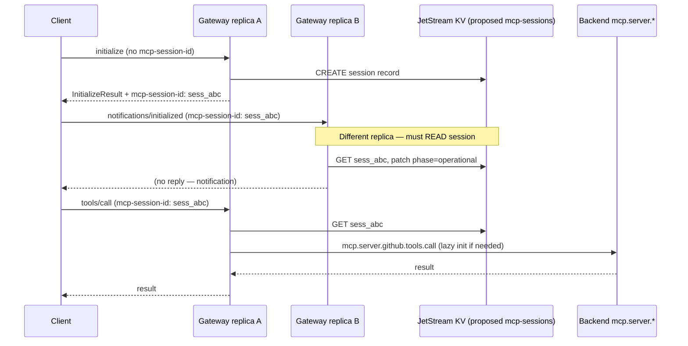
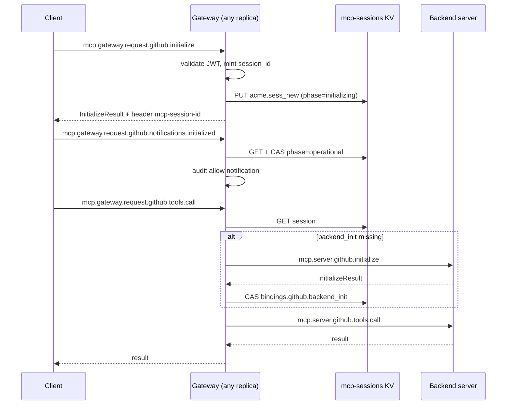
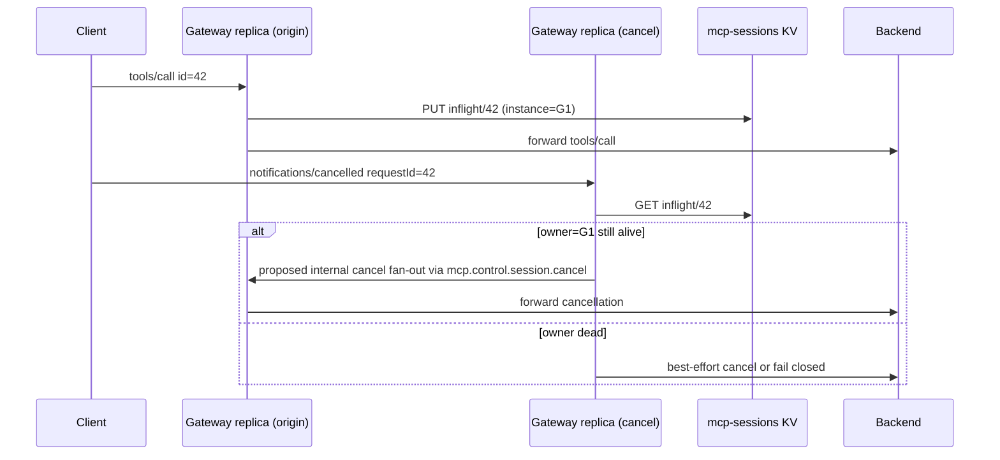

# MCP session model (gateway HA)

**Status:** Design spec (2026-05-28). Block C paper item — no implementation yet.

**Related:** [overview.md](overview.md), [act-chain.md](act-chain.md), [MCP_GATEWAY_PLAN.md](../../MCP_GATEWAY_PLAN.md) Block C and § Session correlation.

---

## Why this document exists

The Trogon MCP gateway runs as a **queue-group worker** on `mcp.gateway.request.>`: any healthy replica may consume any client message. NATS does not pin a client to a particular gateway instance. That shape is correct for throughput and failover, but it conflicts with how MCP defines a **session** — a sequence of logically related interactions that begin with `initialize`, negotiate capabilities once, carry a stable session identifier on subsequent turns, and may involve long-lived server→client callbacks (`notifications/progress`, `sampling/createMessage`, …).

Without an agreed session model, Phase 2 features that depend on session-scoped state — ZedToken cache keyed to session id, schema cache invalidation per session, rate budgets, egress mesh-token cache — cannot behave consistently under HA. This document compares placement strategies, picks one, and pins the storage schema and observability contract before code lands.

---

## What MCP considers a "session"

The MCP specification treats a session as **state spanning multiple JSON-RPC messages**, not a single request/reply. The lifecycle is explicit in the [Lifecycle](https://modelcontextprotocol.io/specification/latest/basic/lifecycle) section.

### Initialization and capability negotiation

The client **must** send `initialize` as the first request. The request carries:

- `protocolVersion` — the protocol revision the client supports.
- `capabilities` — a structured object describing optional features the client implements (for example `roots.listChanged`, `sampling`, `elicitation`, task-augmented requests).
- `clientInfo` — implementation metadata (`name`, `version`, …).

The server **must** respond with a `InitializeResult` containing:

- `protocolVersion` — the negotiated revision (the server selects a version both sides support).
- `capabilities` — what the server offers (`tools.listChanged`, `resources.subscribe`, `logging`, …).
- `serverInfo` — implementation metadata.
- Optional `instructions` — human-readable guidance for the client.

Capability negotiation is **complete at the end of this exchange**. Neither side re-negotiates capabilities on later requests unless the connection is torn down and a new `initialize` runs.

After a successful `initialize` response, the client **must** send the `notifications/initialized` notification (no JSON-RPC `id`; no reply expected). Until that notification is sent, the server **must not** send requests other than logging; the client **must not** send requests other than `ping`. This two-step handshake (`initialize` → `initialized`) marks the transition from **initialization phase** to **operation phase**.

Spec wording (paraphrased from the lifecycle section): *"The initialization phase is the first interaction between client and server. During this phase, the client and server exchange capabilities and implementation details. After successful initialization, the client sends an `initialized` notification to indicate it is ready for normal operations."*

### Session identity (transport binding)

On Streamable HTTP transports, the specification defines optional **session IDs** assigned by the server in the `InitializeResult` response via the `MCP-Session-Id` header. When assigned:

- The session ID **should** be globally unique and cryptographically secure.
- The client **must** include `MCP-Session-Id` on all subsequent HTTP requests.
- The server **may** terminate the session at any time (HTTP 404); the client **must** re-`initialize` without a session id.
- The client **should** send HTTP DELETE with `MCP-Session-Id` to explicitly close when finished.

Trogon maps this concept to the NATS header **`mcp-session-id`**, already pinned in [MCP_GATEWAY_PLAN.md](../../MCP_GATEWAY_PLAN.md) § Wire-Format Pins. The gateway **issues** the opaque id at `initialize`; clients echo it on every later edge-zone message. Mesh JWTs may also carry `session_id` for egress cache keying ([overview.md](overview.md) claim cheatsheet).

### Operation phase and server lifecycle

During operation, client and server exchange requests, responses, and notifications defined by negotiated capabilities. The server **may** emit list-change notifications (`notifications/tools/list_changed`, …) and **may** initiate client callbacks (`sampling/createMessage`, `elicitation/create`, `roots/list`) when the client advertised the corresponding capability at `initialize`.

There is no separate MCP `close` RPC in the core lifecycle. Session end is signaled by:

- Client explicit termination (HTTP DELETE on Streamable HTTP; Trogon equivalent: session TTL expiry or a future `session/close` convention).
- Server termination (404 / session-not-found semantics).
- Transport drop (NATS disconnect; client retries with stale or missing session id).

`ping` is available in operation phase for keepalive; it does not advance session state beyond confirming liveness.

### Cancellation and progress (session-scoped operations)

Two notifications tie mid-session behaviour to **in-flight request identity**:

**`notifications/cancelled`** — sent by the party that wishes to abort a previously issued request. Parameters:

- `requestId` (required) — the JSON-RPC id of the request to cancel.
- `reason` (optional) — human-readable explanation.

Receivers **should** stop work associated with that `requestId` as promptly as practical. Because notifications are fire-and-forget, senders **should** continue polling or awaiting a terminal response. For task-augmented requests, cancellation moves the task to `cancelled` status.

**`notifications/progress`** — out-of-band progress for a long-running request. Parameters:

- `progressToken` (required) — associates the notification with the originating request (typically supplied by the sender in `_meta.progressToken` on the initial request).
- `progress` (required) — monotonically increasing work-done indicator.
- `total` (optional) — total work units when known.
- `message` (optional) — human-readable status.

Progress tokens are **valid for the lifetime of the associated request** (and, for tasks, for the task lifetime). A gateway that loses track of which replica owns an in-flight `requestId` cannot route a cancellation notification to the correct worker.

### Summary: session-bound state in MCP

| Concern | Bound to session? | Notes |
|---|---|---|
| Negotiated `protocolVersion` | Yes | Fixed after `initialize` |
| Client / server `capabilities` | Yes | Union/intersection at init |
| `clientInfo` / `serverInfo` | Yes | Recorded at init |
| Session id (`MCP-Session-Id` / `mcp-session-id`) | Yes | Opaque handle for all post-init turns |
| In-flight `requestId` → worker mapping | Per-request | Needed for `notifications/cancelled` |
| `progressToken` → request mapping | Per-request | Needed for `notifications/progress` |
| ZedToken / SpiceDB consistency | Session-scoped (Trogon plan) | Reused across calls in one session |
| Backend lazy-`initialize` result | Per `(session, server_id)` | Gateway plan §5 |

---

## Trogon transport mapping

Clients reach the gateway on edge-zone subjects (`mcp.gateway.request.{server_id}.{method_path}`). The gateway queue group (`mcp-gateway`) load-balances across replicas. Reply correlation for a **single** request uses per-instance inboxes (`_INBOX.gateway.{instance_id}.{nuid}`) held in **process memory** — intentionally not replicated ([MCP_GATEWAY_PLAN.md](../../MCP_GATEWAY_PLAN.md) § Reply inboxes).

Session state is **orthogonal** to inbox correlation:

| State class | Lifetime | HA requirement |
|---|---|---|
| In-flight request map (`nuid_g` → client inbox) | One request | Lost on replica crash; client timeout + retry acceptable |
| Session record (`session_id` → init context) | Many requests | **Must survive** replica crash and client reconnect to a different replica |
| Progress / cancel routing | One long request | Must reach the replica awaiting the backend reply, or be recoverable |

The gateway **terminates** `initialize` by default ([MCP_GATEWAY_PLAN.md](../../MCP_GATEWAY_PLAN.md) §5): the client sees `trogon-mcp-gateway` as the MCP server. Backend servers receive a lazy `initialize` on first use per session. Session KV therefore holds both **client-facing** init context and **per-backend** init snapshots.



---

## Why a stateless queue-group worker is in tension

A queue-group subscriber has three properties that conflict with naive session handling:

1. **Any worker may consume any message.** NATS selects a queue member per message. Two consecutive messages from the same client NATS connection may still land on different gateway pods if the connection reconnects, if the client library opens a new connection, or if load balancing spreads concurrent publishes.

2. **No replica owns "the session."** Unlike sticky HTTP sessions or ACP's `{prefix}.{session_id}.agent.*` subject embedding (`acp-nats`), the default gateway edge grammar keeps `session_id` **out of the subject** ([MCP_GATEWAY_PLAN.md](../../MCP_GATEWAY_PLAN.md) § Session correlation — current default: session in KV, not subject).

3. **Process-local memory is invisible to peers.** The Phase 1 gateway correctly stores in-flight inbox maps in memory. Session data placed in the same map would vanish on crash and would be unreachable from sibling replicas handling the next message.

The tension is not theoretical. It appears the first time:

- A client sends `notifications/initialized` to replica B after replica A answered `initialize`.
- A mesh egress cache lookup uses `session_id` but the mint happened on another replica ([`egress/cache.rs`](../../rsworkspace/crates/trogon-mcp-gateway/src/egress/cache.rs) keys include `session_id`; today the cache is in-process only).
- A `notifications/cancelled` arrives while the original `tools/call` is awaiting a backend reply on replica C.
- An operator scales the gateway Deployment from three replicas to ten — all existing sessions must continue without client re-init.

Failover requirement: **survive replica loss without requiring client re-`initialize`**, except when the session record itself is gone (TTL expiry, explicit close, or KV unavailability beyond SLO).

---

## Decision matrix: three candidate strategies

### Strategy A — JetStream KV-backed session state (recommended)

Every gateway replica reads and writes a session record in a JetStream KV bucket on each session-touching turn. Subject grammar stays unchanged (`mcp.gateway.request.{server_id}.{method}`).

| Dimension | Assessment |
|---|---|
| **Latency cost** | +1 KV `get` per request (~1–3 ms same-cluster; higher cross-AZ). `initialize` also `put`. Optional in-replica LRU (TTL ≤ few seconds) to absorb read bursts; writes still go to KV for coherence. |
| **Failover behaviour** | Strong. Any replica loads session after crash. In-flight **requests** still fail if the owning replica dies (client retries); session **context** survives. |
| **Hot-key risk** | Moderate. One KV key per active session; chatty sessions (progress floods) update the same key. Mitigate: store progress/cancel maps in separate sub-keys `{session_id}/inflight/{request_id}`; rate-limit KV writes on progress (coalesce to 1 Hz). |
| **Observability** | KV revision in audit envelope; existing `session_id` fields in `trogon.mcp.audit/v1`. Straightforward per-session audit trail in [agent-traffic.md](agent-traffic.md). |
| **Complexity** | Medium. CAS / revision conflicts on concurrent updates; idle TTL; tenancy-aware bucket layout. No subject ACL changes. Aligns with existing plan text and `mcp-gateway-config` KV precedent. |

### Strategy B — Sticky routing via `session_id` → subject mapping

Introduce a session segment or parallel subject tree, e.g. `mcp.gateway.session.{session_id}.request.{server_id}.{method}` ( **proposed** — not in codebase), consumed only by the replica that created the session.

| Dimension | Assessment |
|---|---|
| **Latency cost** | Lowest steady-state (no KV read). Mapping table still needed somewhere to route first message. |
| **Failover behaviour** | Weak unless combined with KV anyway. On replica death, session subject must be re-homed or clients must re-`initialize`. NATS queue groups do not provide sticky delivery by default; requires custom partition assignment or dedicated subscription per session. |
| **Hot-key risk** | Low for KV (if used only for mapping). Risk shifts to **single replica CPU** — one hot session pins one pod. |
| **Observability** | Session id visible in subject (easy log filter). Complicates subject ACL templates (clients would need publish rights on dynamic session subjects). |
| **Complexity** | High. New subject tree (**proposed**), auth-callout ACL updates, client adapter changes, federation rewrite rules, SIEM parsers. Conflicts with "tenancy is not a subject segment" discipline for per-tenant isolation. |

### Strategy C — Per-session NATS subject ownership (ephemeral consumer)

The replica that handles `initialize` creates a dedicated subscription (or JetStream consumer) for `mcp.gateway.session.{session_id}.>` and owns it until close.

| Dimension | Assessment |
|---|---|
| **Latency cost** | Low per message (direct subscription). **High** at session creation/teardown (subscription churn). Thousands of concurrent sessions ⇒ thousands of subscriptions per replica — NATS server memory and consumer limits become the bottleneck. |
| **Failover behaviour** | Poor. Consumer is tied to connection context on one replica. Failover requires orphan detection and consumer handoff protocol (not native in core NATS queue groups). |
| **Hot-key risk** | Session isolation avoids KV hot keys but creates **subscription hot spots** on the owning replica. |
| **Observability** | Per-session subscription metrics on NATS `$SYS` (operator burden). Gateway must emit explicit session owner heartbeat. |
| **Complexity** | Highest. Custom ownership lease in KV regardless (to know which replica holds the consumer), watchdog for crashed owners, client routing to correct subject. Essentially rebuilds connection-oriented semantics on a message bus. |

### Matrix summary

| | A: KV session state | B: Sticky subject | C: Ephemeral consumer |
|---|---|---|---|
| Latency | +KV RTT | Best | Good; bad at scale |
| Failover | Good | Poor alone | Poor |
| Hot-key | KV key/session | Replica CPU | Subscriptions/replica |
| Observability | Good (existing audit) | Good (subject) | Heavy |
| Complexity | Medium | High | Highest |
| Client / ACL impact | None | Major | Major |

---

## Recommendation

**Adopt Strategy A: JetStream KV-backed session state** as the v1 session model.

Justification:

1. **Already the plan default.** [MCP_GATEWAY_PLAN.md](../../MCP_GATEWAY_PLAN.md) § Session correlation names bucket `mcp-sessions` and lists the fields to store. Block C explicitly calls for this decision paper; the KV approach is the only strategy that satisfies HA without changing edge subject grammar or client ACLs.

2. **Failover matches operator expectations.** Clients reconnecting to NATS after a gateway roll do not know which replica served `initialize`. KV is the shared memory of the fleet.

3. **Orthogonal to inbox correlation.** Phase 1 correctly keeps in-flight maps local. Session KV handles only cross-turn state — the same separation Synadia uses for JWT state vs request/reply.

4. **Incremental path to B.** If latency profiling (Block G) shows KV read dominance, an optional **read-through LRU** or a hybrid (KV authoritative + optional sticky hint header) can be added without breaking the schema. Strategy B alone is insufficient for failover unless KV backs the mapping anyway.

5. **Strategy C does not scale** on NATS for multi-thousand concurrent MCP sessions typical of agent swarms.

Phase 3 perf optimization (optional sticky routing) remains documented in the plan as a future knob; v1 implementation targets KV only.

---

## Concrete schema (Strategy A)

All names below marked **proposed** are design pins for Block C — they are **not** yet provisioned in the codebase. Existing wire pins (`mcp-session-id` header, `mcp.gateway.request.>` subjects, `mcp.audit.>` stream) are already implemented or specified elsewhere.

### KV bucket

| Property | Value |
|---|---|
| Bucket name (**proposed**) | `mcp-sessions` |
| Storage | JetStream KV |
| Tenancy — hard (NATS account per tenant) | One bucket per account (same pattern as `mcp-gateway-config`) |
| Tenancy — soft (JWT `tenant` claim) | Single bucket; tenant encoded in key prefix (see below) |
| Default idle TTL (**proposed**) | 30 minutes, refreshed on each session-touching message |
| Max TTL cap (**proposed**) | 24 hours absolute (`created_at` + cap) regardless of activity |
| History | 1 (latest value only; no revision archive needed for session state) |

### Key format

```
{tenant}.{session_id}
```

| Segment | Constraints | Meaning |
|---|---|---|
| `{tenant}` | `[a-z0-9-]+` | JWT `tenant` claim or NATS account alias; omitted when bucket is already account-scoped (key reduces to `{session_id}`) |
| `{session_id}` | `[A-Za-z0-9._~-]+`, max 128 chars | Gateway-issued opaque id; matches `mcp-session-id` header and audit `session_id` |

Examples (soft tenancy):

```
acme.sess_01JXYZabc
acme.sess_01JXYZabc/inflight/42   # sub-key for in-flight request metadata (optional)
```

Examples (hard tenancy, account-scoped bucket):

```
sess_01JXYZabc
sess_01JXYZabc/inflight/42
```

Sub-keys under `{tenant}.{session_id}/…` hold optional inflight maps so progress/cancel routing does not rewrite the main session document on every notification.

### Value JSON schema (`trogon.mcp.session/v1`)

```json
{
  "schema": "trogon.mcp.session/v1",
  "session_id": "sess_01JXYZabc",
  "tenant": "acme",
  "phase": "operational",
  "created_at": "2026-05-28T12:00:00Z",
  "last_seen_at": "2026-05-28T12:05:00Z",
  "expires_at": "2026-05-28T12:35:00Z",
  "client": {
    "client_id": "cursor-bridge-7",
    "caller_sub": "user:alice",
    "protocol_version": "2025-11-25",
    "client_info": { "name": "ExampleClient", "version": "1.0.0" },
    "capabilities": { "roots": { "listChanged": true }, "sampling": {} }
  },
  "gateway": {
    "instance_id_init": "NB7K…",
    "capabilities_aggregate": { "tools": { "listChanged": true } },
    "server_info": { "name": "trogon-mcp-gateway", "version": "0.1.0" }
  },
  "bindings": {
    "github": {
      "server_id": "github",
      "backend_init": null,
      "backend_init_pending": false,
      "zedtoken": "…",
      "schema_generation": 3
    }
  },
  "mesh": {
    "egress_cache_generation": 1
  },
  "inflight_count": 0
}
```

Field-by-field semantics:

| Field | Type | Required | Meaning |
|---|---|---|---|
| `schema` | string | yes | `"trogon.mcp.session/v1"` — forward-compat discriminator |
| `session_id` | string | yes | Redundant copy of key suffix; aids audit export without key parsing |
| `tenant` | string | yes | Tenant claim at init; used when bucket is shared |
| `phase` | enum | yes | `initializing` → `operational` → `closing` → `closed`. Set `operational` on first `notifications/initialized` or first post-init RPC if client skips notification (logged) |
| `created_at` | RFC3339 | yes | Session birth |
| `last_seen_at` | RFC3339 | yes | Updated every session-touching message; drives idle TTL refresh |
| `expires_at` | RFC3339 | yes | `min(last_seen_at + idle_ttl, created_at + max_ttl)` |
| `client.client_id` | string | yes | Logical MCP client id for callback subjects `mcp.gateway.callback.{client_id}.>` |
| `client.caller_sub` | string | yes | JWT `sub` at init; stable principal for policy |
| `client.protocol_version` | string | yes | Negotiated MCP revision |
| `client.client_info` | object | yes | Echo of client `initialize` params |
| `client.capabilities` | object | yes | Echo of client capabilities at init |
| `gateway.instance_id_init` | string | yes | Replica that created the record (diagnostic; not routing authority) |
| `gateway.capabilities_aggregate` | object | yes | Capabilities returned to client |
| `gateway.server_info` | object | yes | Gateway `serverInfo` returned to client |
| `bindings.{server_id}` | object | per backend | Lazy backend init state for that target |
| `bindings.*.backend_init` | object \| null | no | Cached backend `InitializeResult` after lazy forward |
| `bindings.*.backend_init_pending` | bool | no | Lock flag: avoid duplicate concurrent lazy inits |
| `bindings.*.zedtoken` | string | no | SpiceDB consistency token scoped to session ([MCP_GATEWAY_PLAN.md](../../MCP_GATEWAY_PLAN.md) SpiceDB section) |
| `bindings.*.schema_generation` | int | no | Bumped on `notifications/tools/list_changed`; invalidates schema cache |
| `mesh.egress_cache_generation` | int | no | Invalidates in-process mesh token cache across replicas when incremented |
| `inflight_count` | int | yes | Number of outstanding gateway→backend requests; used for close guard |

Optional inflight sub-key value (`…/inflight/{request_id}`):

```json
{
  "request_id": "42",
  "method": "tools/call",
  "gateway_instance_id": "NB7K…",
  "gateway_inbox_nuid": "gNuid…",
  "progress_token": "abc123",
  "started_at": "2026-05-28T12:05:01Z"
}
```

Writes use KV compare-and-swap on revision for the main record; inflight sub-keys use short TTL (request deadline + slack) and delete on reply completion.

### TTL and refresh rules

| Event | Action |
|---|---|
| `initialize` | `put` new record; `phase=initializing`; idle TTL starts |
| Any message with valid `mcp-session-id` | `last_seen_at=now`; extend `expires_at` by idle TTL; reject if `phase=closed` |
| `notifications/initialized` | `phase=operational` |
| Reply completes | delete inflight sub-key; decrement `inflight_count` |
| Idle past `expires_at` | KV TTL eviction; subsequent requests get `-32106 auth_expired` |
| Operator revoke | `put` with `phase=closed` or explicit delete |

---

## Session lifecycle flows

### Happy path: initialize through first tool call



### Cancellation mid-session



The **`mcp.control.session.cancel.{session_id}`** subject is **proposed** for cross-replica cancel routing when KV shows inflight owned by another `gateway_instance_id`. It mirrors existing control-plane subjects (`mcp.control.cache.invalidate.{server_id}`) documented in the plan.

### Session close

Explicit client close (future convention or HTTP-bridge DELETE mapped to NATS):

1. Gateway sets `phase=closing`, waits for `inflight_count=0` (with timeout).
2. Gateway sets `phase=closed` and deletes KV record (or relies on immediate TTL=0).
3. Audit `mcp.audit.allow.request.initialize` with `decision: session_closed` in envelope extension field.

---

## Failure modes

| Condition | Behaviour | Client-visible | Audit / metric |
|---|---|---|---|
| **Replica crash mid-session (no inflight)** | Session record persists in KV. Next message may hit any replica. | Transparent | `mcp.control.gateway.heartbeat.{instance_id}` stops; optional `mcp.audit.error.request.other` if message was in-flight on dead replica |
| **Replica crash mid-request (inflight)** | In-flight inbox map lost on dead replica. Client times out. Session record remains. | JSON-RPC timeout; retry same `mcp-session-id` | `mcp.audit.error.request.{method_root}` with `error.code: backend_timeout` or transport error |
| **KV unavailable (get/put fail)** | **Fail-closed** for session-touching RPCs. `initialize` cannot create session. | `-32103 backend_unreachable` or dedicated `-32111` session_store_unavailable (**proposed** code) | `mcp.audit.error.request.initialize`; metric `mcp.metrics.gateway.session_kv_error` (**proposed**) |
| **Client reconnects with stale `session_id`** | KV miss or `phase=closed` / TTL expired. | `-32106 auth_expired` — client must re-`initialize` | `mcp.audit.deny.request.initialize` with `reason: session_not_found` |
| **Client reconnects with valid `session_id`** | Normal GET; refresh TTL. | Success | Existing allow audit with same `session_id` |
| **Concurrent `initialize` same connection** | Second `initialize` without close **must** mint a **new** session id (MCP re-init semantics). | New `mcp-session-id` | Two session create audits |
| **Concurrent `initialize` racing same suggested id** | Client must not supply id; gateway generates UUID. Collision astronomically unlikely; KV `create` (not overwrite) rejects duplicate | `-32101 policy_fault` if create fails | `session_id_collision` counter (**proposed**) |
| **Split-brain CAS conflict** | Optimistic lock failure on session update | Single retry with backoff; then `-32105 rate_limited` or fault | `session_cas_conflict` (**proposed**) |
| **`notifications/initialized` before KV replicate** | Rare JetStream lag | Client retry notification | Logged warning; idempotent phase transition |
| **Progress flood** | Coalesce KV writes; inflight sub-key optional | Progress delivered if owner replica reachable | Rate metric on `notifications/progress` |

Session revocation (operator or authz):

- Bump `mesh.egress_cache_generation` or set `phase=closed` when bootstrap JWT revoked mid-session ([overview.md](overview.md) failure modes: `-32106 auth_expired`).

---

## Observability

### Audit subjects (existing grammar)

Session lifecycle events use the standard gateway audit subject tree — no new `{direction}` segment required:

| Event | Subject | Envelope highlights |
|---|---|---|
| Session created (`initialize` allow) | `mcp.audit.allow.request.initialize` | `session_id`, `caller`, negotiated `protocol_version`, `client.client_id` |
| Session denied (auth / policy) | `mcp.audit.deny.request.initialize` | `reason`, no `session_id` or partial |
| Session expired / unknown id | `mcp.audit.deny.request.tools` (or matching method_root) | `reason: session_not_found`, `session_id` from header |
| Initialized notification | `mcp.audit.allow.request.notification` | `method: notifications/initialized`, `session_id` |
| Session closed | `mcp.audit.allow.request.initialize` | `extra.event: session_closed` |
| KV store fault | `mcp.audit.error.request.initialize` | `error.tier: session_kv` |
| In-flight cancel routed | `mcp.audit.allow.request.notification` | `method: notifications/cancelled`, `request_id` |

All envelopes use schema `trogon.mcp.audit/v1` ([MCP_GATEWAY_PLAN.md](../../MCP_GATEWAY_PLAN.md) §7). The [agent-traffic view](agent-traffic.md) indexes `session_id` for timeline queries ("show all tools for session X").

STS exchanges during the session continue on `mcp.audit.sts.{outcome}` with the same `session_id` claim when mesh tokens are minted ([act-chain.md](act-chain.md) audit embedding).

### Metrics (**proposed** subjects)

Follow the precedent of `mcp.metrics.sts.latency` ([sts-exchange.md](sts-exchange.md)):

| Subject (**proposed**) | Schema (**proposed**) | Fields |
|---|---|---|
| `mcp.metrics.gateway.session_kv.latency` | `trogon.mcp.metrics.gateway.session_kv.latency/v1` | `op` (`get`/`put`/`delete`), `p50_us`, `p99_us`, `outcome` |
| `mcp.metrics.gateway.session.active` | `trogon.mcp.metrics.gateway.session.active/v1` | `count` (gauge; periodic publish per replica estimating from KV or local cache) |
| `mcp.metrics.gateway.session.expired` | `trogon.mcp.metrics.gateway.session.expired/v1` | counter increment on TTL miss |
| `mcp.metrics.gateway.session.cas_conflict` | `trogon.mcp.metrics.gateway.session.cas_conflict/v1` | counter |

### Trace spans

Span names follow OpenTelemetry messaging conventions already used in `trogon-nats` ([MCP_GATEWAY_PLAN.md](../../MCP_GATEWAY_PLAN.md) Block G):

| Span name | Parent | Attributes |
|---|---|---|
| `mcp.session.initialize` | Consumer span for NATS message | `mcp.session_id`, `tenant`, `client_id`, `protocol_version` |
| `mcp.session.load` | Per-request consumer span | `mcp.session_id`, `kv.revision`, `session.phase` |
| `mcp.session.update` | Same | `kv.op`, `cas.retry_count` |
| `mcp.session.inflight.register` | `tools/call` span | `request.id`, `gateway.instance_id` |
| `mcp.session.inflight.cancel` | Notification consumer span | `request.id`, `cancel.route` (`local`/`control_fanout`) |
| `mcp.session.close` | Admin or client-initiated | `inflight_count`, `outcome` |

Propagate `traceparent` from client through session operations ([MCP_GATEWAY_PLAN.md](../../MCP_GATEWAY_PLAN.md) § Wire-Format Pins). Link backend lazy-init spans as children of the first `tools/call` that triggered them.

### Control-plane signals (existing + proposed)

| Subject | Status | Use |
|---|---|---|
| `mcp.control.gateway.heartbeat.{instance_id}` | Existing (plan) | Detect replica loss; correlate inflight owner death |
| `mcp.control.cache.invalidate.{server_id}` | Existing (plan) | Bump `bindings.{server_id}.schema_generation` in session records |
| `mcp.control.session.cancel.{session_id}` | **Proposed** | Cross-replica cancel delivery |

---

## Relationship to other identity docs

| Doc | Interaction |
|---|---|
| [overview.md](overview.md) | Mesh tokens carry optional `session_id`; binds egress cache and audit correlation across hops |
| [act-chain.md](act-chain.md) | Independent of MCP session id — `act_chain` is delegation lineage; `session_id` is transport session. Both appear in audit envelopes |
| [jwt-claim-schema.md](jwt-claim-schema.md) | `session_id` claim lift from header; gateway issues at init |
| [agent-traffic.md](agent-traffic.md) | `session_id` indexed column for operator timelines |
| [sts-exchange.md](sts-exchange.md) | Egress re-exchange per call uses session-scoped cache key (`tenant`, `caller_sub`, `target_aud`, `session_id`, scope fingerprint) |

---

## Implementation notes (non-normative)

These are guidance for the Block C → Phase 2 implementer; not wire pins.

1. **Read-through cache:** Each gateway replica may keep a 5–15 s LRU of session records keyed `{tenant}.{session_id}` to cut KV reads on chatty loops. Invalidate on CAS conflict or `mcp.control.cache.invalidate.*` broadcast.

2. **Do not store in-flight inbox maps in KV** except the optional inflight sub-keys for cancel/progress routing. Full reply correlation stays in memory ([MCP_GATEWAY_PLAN.md](../../MCP_GATEWAY_PLAN.md) explicit default).

3. **Mesh egress cache:** Today [`MeshEgressCache`](../../rsworkspace/crates/trogon-mcp-gateway/src/egress/cache.rs) is process-local. Phase 2 should either tie cache lifetime to session KV generation counter (reload on mismatch) or accept one redundant STS exchange after replica switch — document in egress module when implemented.

4. **Provision KV** in the same Terraform/Helm path as `mcp-gateway-config`, `mcp-jwks`, and `mcp-agent-registry`.

---

## Open questions (deferred)

1. **Explicit NATS close RPC** — map HTTP DELETE to a JSON-RPC notification vs new method vs TTL-only.
2. **Cancel fan-out** — is `mcp.control.session.cancel.*` required for v1, or is client retry-after-timeout sufficient?
3. **Session ↔ bootstrap JWT binding** — reject session if connect JWT rotated to a different `sub`?
4. **Virtual MCP sessions** — single session record with multiple `bindings.*` vs one session per federated target.
5. **Hybrid sticky optimization** — optional `mcp-session-affinity` response header hint for clients that can target a subset of connections (Phase 3).

---

## Acceptance criteria (Block C)

- [ ] Operators can read this doc and provision **proposed** bucket `mcp-sessions` with key/TTL conventions.
- [ ] Gateway implementer can code `initialize` / `initialized` / post-init RPC against the JSON schema without guessing fields.
- [ ] Failure-mode table maps to JSON-RPC codes and audit subjects already in the plan (plus proposed extensions labeled).
- [ ] Decision matrix records why KV beats sticky subject and ephemeral consumer for v1 HA.
- [ ] Cross-references resolve to [overview.md](overview.md), [act-chain.md](act-chain.md), and [MCP_GATEWAY_PLAN.md](../../MCP_GATEWAY_PLAN.md) Block C.

---

## References

| Source | Topic |
|---|---|
| [MCP Lifecycle](https://modelcontextprotocol.io/specification/latest/basic/lifecycle) | `initialize`, `notifications/initialized`, operation phase |
| [MCP Transports — Session Management](https://modelcontextprotocol.io/specification/latest/basic/transports) | `MCP-Session-Id`, termination |
| [MCP Progress](https://modelcontextprotocol.io/specification/2025-11-25/basic/utilities/progress) | `notifications/progress` |
| [MCP Schema — cancelled](https://modelcontextprotocol.io/specification/2025-06-18/schema) | `notifications/cancelled` |
| [MCP_GATEWAY_PLAN.md](../../MCP_GATEWAY_PLAN.md) Block C, § Session correlation, § Wire-Format Pins | Subject grammar, headers, queue groups |
| [overview.md](overview.md) | Identity layers, `session_id` claim |
| [act-chain.md](act-chain.md) | Delegation vs session correlation |
