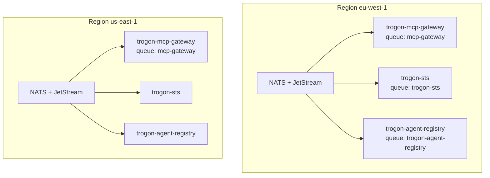

# Multi-region MCP gateway deployment

**Status:** Design decision (Block G, paper). Satisfies [MCP_GATEWAY_PLAN.md](../../MCP_GATEWAY_PLAN.md) Block G item *Multi-region story*.

**Diátaxis:** **Explanation** (why regional NATS, what replicates globally) plus **decision** (topology, consistency, residency enforcement). Implementation is out of scope until Block G operational work and the K8s controller (v2) land.

**Related:** [Integration touch-points](integration-touchpoints.md) · [Failure-mode matrix](failure-mode-matrix.md) · [K8s controller](k8s-controller.md) (forward-ref) · [Tenancy boundary](tenancy-boundary.md) (forward-ref) · [ADR 0001](../adr/0001-tenancy-model.md) · [ADR 0006](../adr/0006-mesh-token-signing-keys.md)

Unless marked **proposed**, NATS subjects, KV bucket names, and queue groups match the repo (`trogon-mcp-gateway`, `trogon-sts`, `trogon-agent-registry`, `trogon-agent-registry-controller`).

---

## 1. Goals

Production today assumes a **single NATS cluster** colocated with the gateway fleet, SpiceDB, and JetStream KV. That shape is valid for one geography but breaks down when customers need:

| Goal | Operator need | Design consequence |
|---|---|---|
| **Low-latency local enforcement** | `tools/call` and `resources/read` must not round-trip to another continent for SpiceDB, registry cache, policy eval, or egress STS mint on every request | Hot path stays **in-region**: regional gateway queue group, regional NATS core + JetStream, regional read paths to replicated control-plane KV |
| **Regional data residency** | Audit envelopes, session/schema cache, and anomaly feature streams must remain in the tenant's declared geography (EU-only, US-only) | Audit JetStream **does not** mirror cross-region by default; schema warm cache and anomaly publishes are **regional-only** |
| **Global policy + identity consistency** | Revoked agents, updated trust bundles, and policy bundle rollouts must converge everywhere without operators editing three Git repos | **Global SoT** for registry (Git + controller), mesh JWKS, trust bundles per trust-domain, and OCI policy artifacts; **regional mirrors** for read latency |

These goals are in tension: residency wants data to stop at a border; consistency wants revocation to propagate quickly. This document picks **explicit defaults** (mirror for control plane, no mirror for audit) and documents **policy-driven** exceptions (optional audit aggregation, cross-region approval escalation).

### 1.1 Non-goals (this paper)

- Replacing NATS with a non-NATS mesh transport.
- Defining HTTP STS or xDS control planes.
- Changing MCP subject grammar to include `{region}` segments ([ADR 0001](../adr/0001-tenancy-model.md) keeps region out of subjects).
- Implementing multi-region in code on the current branch.

---

## 2. Decision summary

| Topic | Decision |
|---|---|
| NATS shape | **Mandatory** dedicated JetStream-capable cluster per region; **global supercluster** with leafnodes only for cross-region control-plane replication |
| Gateway scaling | Queue group **`mcp-gateway` is regional**, not stretched across regions |
| STS mesh issuer | **Single global issuer** (one signing custody + one JWKS document); regional STS **replicas** call the same KMS/Vault key ([ADR 0006](../adr/0006-mesh-token-signing-keys.md)) |
| Agent registry | **Global Git SoT**; `trogon-agent-registry-controller` writes to **primary** KV; **JetStream KV mirror** into each region |
| Policy bundles | **Global OCI registry**; per-region KV mirror of active pointer + Tier-1 config (see §4 naming) |
| Trust bundles | **Global per trust-domain** key in `mcp-trust-bundles`; mirrored to all regions that verify that domain |
| Audit | **Regional** stream `MCP_AUDIT`; optional cross-region **source** stream for aggregation (**off** by default) |
| SpiceDB | **One global primary** cluster; **regional read replicas** for `CheckBulkPermissions` on the hot path |
| Residency | Tenant declares allowed regions on **`MCPTenant.spec.regions`** (**proposed** CRD); controller projects region tags into regional KV and gateway config |

---

## 3. Topology

Three layers stack: **local cluster (mandatory)**, **global interconnect (selective)**, **regional gateway fleet (mandatory)**.

### 3.1 Layer A — Local NATS cluster per region

Each production region runs an independent NATS deployment:

- Core NATS for request/reply (`mcp.gateway.request.>`, `mcp.sts.exchange`, `mcp.registry.agent.lookup`, approvals).
- JetStream for `MCP_AUDIT`, session KV (`mcp-sessions` when enabled), rate-limit KV (`mcp-rate-limits` per [rate-limiting.md](rate-limiting.md)), and **regional replicas** of mirrored control-plane buckets.
- NATS accounts per tenant ([ADR 0001](../adr/0001-tenancy-model.md)) **within that region's operator** — a tenant with EU-only residency has accounts only in EU clusters, not in US.

**Why mandatory:** Subject ACLs, queue groups, and JetStream streams are not safe to "stretch" across WAN latency; a single logical cluster spanning regions creates false sharing on `mcp-gateway` queue delivery and couples outage domains.



### 3.2 Layer B — Global NATS supercluster / leafnodes

Regions connect via NATS **supercluster** routes or **leafnode** attachments to a **hub** cluster (or pairwise supercluster routes). Design rule:

> Cross-region replication carries **only** what must be globally consistent. Everything else stays on the regional JetStream domain.

| Traffic class | Cross-region mechanism | Default |
|---|---|---|
| JetStream KV mirror | Supercluster / leaf JetStream domain replication | `mcp-agent-registry`, `mcp-trust-bundles`, policy bundle KV (§4) |
| Core pub/sub | **Not** used for gateway ingress | Clients never publish `mcp.gateway.request` on a remote region |
| Audit | JetStream **source** (pull from regional stream) | **Disabled** (residency) |
| Metrics / anomaly | **No** mirror | Regional `mcp.metrics.anomaly.features` only |

Leafnode hubs are acceptable when operators already run a central NATS operations account; supercluster is acceptable when Sym/SRE teams want symmetric peering. The identity program does not mandate one NATS topology vendor pattern — only that **gateway queue groups are not global**.

### 3.3 Layer C — Per-region gateway fleet

`trogon-mcp-gateway` instances join **`MCP_GATEWAY_QUEUE_GROUP`** (default `mcp-gateway`) **only within their region**. Horizontal scale is per region; there is no cross-region queue member.

| Property | Regional behavior |
|---|---|
| Ingress subject | `{prefix}.gateway.request.{server_id}.{method…}` served by local queue group |
| Egress STS | `mcp.sts.exchange` to **local** `trogon-sts` queue group `trogon-sts` |
| Registry | `mcp.registry.agent.lookup` to **local** `trogon-agent-registry` |
| SpiceDB | gRPC to **nearest read replica**; writes (if any) go to global primary |
| Audit publish | Local `MCP_AUDIT` only |

**Discovery:** Backend MCP servers register on **local** `mcp.control.discovery.register.{server_id}` ([integration-touchpoints.md §6](integration-touchpoints.md#6-gateway--nats-core-and-jetstream)). A server in `us-east-1` is not visible to EU gateways unless policy explicitly allows cross-region backend routing (**proposed**, not v1 default).

---

## 4. What is global, what is regional

### 4.1 Global (single source of truth)

| Asset | Global SoT | Replication to regions | Consumers |
|---|---|---|---|
| **STS mesh issuer** | One custody backend (KMS/Vault) + one JWKS document | KV `mcp-jwks` / `mesh/current` mirrored; HTTPS `/.well-known/jwks.json` | All `trogon-sts` replicas sign with same `kid`; gateways watch JWKS |
| **Agent registry** | Git signed manifests | Controller writes **primary** `mcp-agent-registry`; JetStream KV **mirror** per region | `trogon-agent-registry` lookup (read-only) |
| **Policy bundles** | OCI registry (signed WASM/CEL artifacts) | KV mirror holds active pointer + Tier-1 YAML | Gateway bundle loader |
| **Trust bundles** | Operator publish pipeline (`trogon-sts-publish-trust-bundle`) | KV `mcp-trust-bundles/{trust_domain}` mirrored | `trogon-sts` SVID verification |
| **SpiceDB schema / relationships (writes)** | Global primary | Replicated to read replicas | Tuple writes via admin pipeline, not per-request gateway |

**STS issuer region down** is a special case: other regions can still **verify** cached JWKS but **cannot mint** new mesh tokens until issuer custody is healthy or a rehearsed failover promotes a standby (§6). That is **read-only on mesh JWTs** for egress in enforce mode, not read-only on MCP catalog methods.

### 4.2 Regional (stay in geography)

| Asset | Regional scope | Cross-region |
|---|---|---|
| **Audit envelopes** | JetStream `MCP_AUDIT`, subjects `{prefix}.audit.>` | Optional **source** consumer in aggregation region; **off** by default |
| **Schema cache** | Per-region warm cache (KV or in-process) | Miss falls through to **local** MCP backend / schema learner; no foreign cache read |
| **Anomaly features** | Publish `mcp.metrics.anomaly.features` locally | Aggregation is **control-plane** (SIEM / batch), not hot-path |
| **Approvals** | `mcp.approvals.{request_id}` on local core NATS | Cross-region escalation only when tenant policy allows (**proposed** bridge) |
| **Sessions** | `mcp-sessions` KV per region | No session KV mirror |
| **Rate limits** | `mcp-rate-limits` per region | No global inflight semaphore |

### 4.3 Policy bundle KV naming

Planning text and Block G refer colloquially to **`mcp-policy-bundles`**. The **implemented** Phase 1–2 distribution bucket is **`mcp-gateway-config`** ([bootstrap-day-zero.md §1.1](bootstrap-day-zero.md#11-empty-or-missing-control-plane-artifacts)).

| Name in this doc | Canonical bucket (today) | Mirror key examples |
|---|---|---|
| `mcp-policy-bundles` (design alias) | `mcp-gateway-config` | `bundle/active`, `trusted_signers`, tenant overlays |
| `mcp-trust-bundles` | `mcp-trust-bundles` | `{trust_domain}` |
| `agent-registry` | `mcp-agent-registry` | `{agent_id}/@latest` |

Multi-region work should add JetStream KV **mirror** definitions using the **canonical** bucket names above. If operators prefer the alias bucket name at the NATS layer, treat it as a **proposed** rename migration, not a second source of truth.

---

## 5. Cross-region replication paths

### 5.1 JetStream KV mirror (control plane)

Configure mirrors on each regional JetStream domain with upstream on the **primary region** (or hub domain):

| Bucket | Direction | Writer | Reader | Lag SLO (target) |
|---|---|---|---|---|
| `mcp-agent-registry` | Primary → all regions | `trogon-agent-registry-controller` only on primary | Regional `trogon-agent-registry` | p95 < 2 s |
| `mcp-trust-bundles` | Primary → all regions | `trogon-sts-publish-trust-bundle`, break-glass | Regional `trogon-sts` | p95 < 2 s |
| `mcp-gateway-config` | Primary → all regions | Policy/CD pipeline (**proposed** controller) | Regional gateway hot-swap | p95 < 5 s |
| `mcp-jwks` | Primary → all regions | `trogon-jwks-publisher` after rotation | Gateways + STS | p95 < 2 s; critical on rotation day |

Mirror lag directly affects **revocation SLA**: a revoked agent in Git may not appear in EU until KV mirror catches up. Registry operations runbook should treat **mirror lag** as an incident class ([registry-operations.md](registry-operations.md)).

**Not mirrored:** `mcp-sessions`, `mcp-rate-limits`, regional-only backend discovery entries.

### 5.2 JetStream source — audit aggregation (optional)

For enterprises that accept **copies** of audit metadata in a central SIEM region:

| Stream | Mechanism | Default |
|---|---|---|
| Regional `MCP_AUDIT` | Origin stream in tenant region | Always on |
| Global aggregation stream | JetStream **source** pulling from regional streams | **Off** |
| Residency override | Tenant policy `audit_export: regional_only` | Deny source wiring |

Source (not mirror) preserves **append-only** regional streams while allowing a derived aggregate. EU-only tenants **must not** wire sources to US streams.

### 5.3 Agent registry write path

```
Git (global) → trogon-agent-registry-controller (primary region)
                    ↓ PUT mcp-agent-registry
              JetStream KV mirror → eu-west, us-east, …
                    ↓ watch
              trogon-agent-registry (regional lookup)
                    ↑ R/R mcp.registry.agent.lookup
              trogon-mcp-gateway / trogon-sts
```

Lookup remains **`mcp.registry.agent.lookup`** per [registry.md](registry.md); gateways never read KV cross-region.

### 5.4 SpiceDB — global cluster with regional read replicas

**Recommendation:** Deploy **one global SpiceDB primary** (multi-zone within a compliance cell if required) plus **regional read replicas** that serve `CheckBulkPermissions` with `minimize_latency` / `at_least_as_fresh` semantics already used in `trogon-mcp-gateway` ([integration-touchpoints.md §5](integration-touchpoints.md#5-gateway--spicedb)).

| Approach | Pros | Cons |
|---|---|---|
| **Global primary + regional replicas (chosen)** | One relationship graph; revocation is globally meaningful; gateways avoid cross-region gRPC on hot path | Replica staleness must be bounded; primary region outage affects writes |
| Per-region SpiceDB cluster | Strong residency for tuples | Cross-region policy divergence; no portable `ZedToken`; federation unsolved |
| SpiceDB per tenant per region | Maximum isolation | Operationally explosive; breaks global agent registry semantics |

**Justification:** MCP authorization tuples tie **agents, tools, and tenants** together ([overview.md](overview.md)). Split-brain SpiceDB regions would allow EU gateway to see a different `call` permission than US gateway for the same `agent_id`. A single primary with read replicas matches the **global registry** model while meeting the **< 5 ms** hot-path budget via local replica RTT.

**Write path:** Schema migrations and relationship writes go to **primary** only (CI / admin jobs). Gateways remain read-only on the PDP.

**Stale replica handling:** Align with [failure-mode-matrix.md row 2](failure-mode-matrix.md#failure-mode-matrix) — default **CLOSED** on `at_least_as_fresh` failure; optional bundle rule to retry with `minimize_latency` (**proposed**).

---

## 6. Failure modes

| Failure | Symptom | Default behavior | Mitigation |
|---|---|---|---|
| **Region partition** (WAN loss) | Region isolated from supercluster | In-region MCP continues with last-known KV mirror and JWKS; no new global registry writes visible until heal | Run gateway + STS in each region; monitor mirror lag alarms; clients retry other regions only if tenant policy allows multi-region ingress (**proposed**) |
| **STS issuer region down** | Primary custody unavailable | **Other regions:** verify existing mesh JWTs until `exp`; **cannot mint** new egress tokens (enforce **CLOSED** on mint) | Failover custody per ADR 0006; rehearse JWKS publisher standby; keep overlap keys during rotation |
| **KV mirror lag** | Revocation / bundle update delayed | Lookup may return stale `active` agent; STS may mint until registry version catches up | Monitor lag; pause controller promotions if lag > SLO; registry break-glass purge on primary ([registry-operations.md](registry-operations.md)) |
| **SpiceDB read replica stale `ZedToken`** | `at_least_as_fresh` rejects token | **CLOSED** `-32107` class ([failure-mode-matrix.md](failure-mode-matrix.md)) | Retry `minimize_latency` if bundle allows; drain replica; fall back to primary read with higher latency (break-glass) |
| **Primary SpiceDB unavailable** | All replicas fail writes/reads | Gateways with PDP configured: **CLOSED** on gated methods | Readiness probe fails; shift traffic to region with healthy replica path to primary |
| **Audit stream full** | Regional `MCP_AUDIT` publish fails | **OPEN-with-audit** (request proceeds) per row 14 | Scale regional JetStream; regulated tenants may opt into fail-closed (**proposed**) |
| **Trust bundle missing in region** | Key not mirrored yet | STS **CLOSED** on SPIFFE attestation | Publish to primary; verify mirror; file bootstrap `MCP_STS_TRUST_BUNDLE_PATH` only for disaster |

Region partition does **not** imply fail-open authorization: gateways use last-known policy and JWKS, which is **fail-closed relative to new revocations**, not fail-open to anonymous access.

---

## 7. Consistency model

Per resource class — what operators should expect under normal operation and partition.

| Resource | Scope | Model | Typical lag | Notes |
|---|---|---|---|---|
| Mesh JWKS `mcp-jwks/mesh/current` | Global | **Strong** at issuer; **eventual** at replicas | 1–5 s | Rotation overlap ≥ max mesh TTL ([ADR 0006](../adr/0006-mesh-token-signing-keys.md)) |
| Trust bundle `mcp-trust-bundles/{domain}` | Global per domain | Eventual | 1–5 s | Missing key = fail-closed STS |
| Registry `mcp-agent-registry` | Global SoT | Eventual via mirror | 1–5 s (target) | Controller write on primary only |
| Policy active pointer `mcp-gateway-config/bundle/active` | Global | Eventual | 2–10 s | Hot-swap after mirror + signature verify |
| SpiceDB relationships | Global | **Strong** on primary; replica **bounded stale** | ms–s | `ZedToken` tracks freshness |
| Gateway in-memory mesh egress cache | Regional | Per-process TTL | ≤ `MCP_GATEWAY_MESH_TOKEN_TTL_SECS` | Not shared across regions |
| Registry lookup cache (STS/gateway) | Regional | TTL ~60 s | 60 s | May serve stale agent until TTL |
| Audit `MCP_AUDIT` | Regional | **Strong** per regional stream | n/a | No cross-region consistency by default |
| Anomaly features | Regional | Fire-and-forget | n/a | No cross-region merge on hot path |
| Approvals state | Regional | Ephemeral per `request_id` | n/a | Cross-region escalation **proposed** |
| Session KV `mcp-sessions` | Regional | Strong per region | n/a | Not mirrored |

**Strongly consistent** in this table means "linearizable within the owning store for a single key operation." **Eventual** means all regions converge barring partition; operators measure lag.

---

## 8. Data residency

### 8.1 Tenant declaration

**Proposed** Kubernetes API (see [k8s-controller.md](k8s-controller.md)):

```yaml
apiVersion: identity.trogon.ai/v1alpha1
kind: MCPTenant
metadata:
  name: acme
spec:
  regions:
    - eu-west-1
  residencyPolicy: strict   # strict | primary-plus-dr
  auditExport: regional_only  # regional_only | aggregate-to:us-east-1
```

| Field | Meaning |
|---|---|
| `spec.regions` | Allow-list of region IDs where this tenant's NATS accounts, gateways, and backends may run |
| `residencyPolicy: strict` | Deny mirror/source wiring that copies audit or sessions out of allow-list |
| `auditExport` | Optional aggregation exception (explicit second region) |

Hard tenancy ([ADR 0001](../adr/0001-tenancy-model.md)): each allowed region gets a **dedicated NATS account** for the tenant; no shared subject space across tenants.

### 8.2 Gateway enforcement (runtime)

On ingress, gateway derives `tenant` from JWT ([integration-touchpoints.md](integration-touchpoints.md)) and checks:

1. **Region binding:** `MCP_GATEWAY_REGION` (env) must be ∈ `MCPTenant.spec.regions` for that tenant (**proposed** config projection).
2. **Backend locality:** discovered `server_id` must carry label `region` matching gateway region unless bundle grants `cross_region_backend: true` (**proposed**).
3. **Audit publish:** only to local `MCP_AUDIT`; no publish to foreign JetStream domain.

Violations: **CLOSED** with `-32100` policy deny class and audit `deny` with `reason: residency_violation` (**proposed** code path).

### 8.3 Controller projection

**Proposed** `trogon-mcp-gateway-controller` (Block G v2) writes:

| Region | KV / config keys written |
|---|---|
| Each `spec.regions[]` | Tenant overlay in `mcp-gateway-config` prefix `{tenant}/` |
| Each region | NATS account JWT templates with `region` claim |
| Primary only | `mcp-agent-registry` controller deployment target |
| Mirror targets | Only regions in `spec.regions` receive mirrors |

Controller **does not** create cross-region audit sources when `auditExport: regional_only`.

See [tenancy-boundary.md](tenancy-boundary.md) for account vs soft-tenancy key-prefix rules (forward-ref).

### 8.4 Bootstrap JWT and residency

Auth callout may embed `https://trogon.ai/region` or `residency` claim ([microsoft-agent-gov-toolkit research](../../docs/research/microsoft-agent-gov-toolkit/04-nats-native-translation.md)). Mesh tokens inherit `tenant` but region enforcement is a **gateway + account placement** concern, not an MCP subject segment.

---

## 9. Latency budget

Targets for capacity planning and Block G baseline work.

### 9.1 In-region hot path (p95 < 5 ms gateway-added)

Measured from gateway dequeue to policy allow (excluding backend MCP execution):

| Segment | Budget (p95) | Notes |
|---|---|---|
| JSON-RPC parse + routing | 0.3 ms | Fixed cost |
| Registry lookup (cache hit) | 0.5 ms | `RegistryCache` 60 s TTL |
| Registry lookup (cache miss) | 2 ms | Regional R/R `mcp.registry.agent.lookup` |
| SpiceDB `CheckBulkPermissions` | 2 ms | Regional read replica |
| CEL / Tier-1 policy | 0.5 ms | In-process |
| Audit publish (async) | off hot path | Best-effort |

**Egress STS mint** (additional on `tools/call` forwarding): regional `mcp.sts.exchange` p95 **< 3 ms** when STS colocated; counts toward gateway work but often overlaps with backend RTT.

### 9.2 Cross-region operations (p95 < 200 ms)

| Operation | Target | Why cross-region |
|---|---|---|
| STS exchange when client mistakenly hits non-home region | **Deny fast** < 5 ms | Should not happen; prefer residency deny |
| Registry controller write → mirror visible | < 200 ms | Global revocation visibility |
| Policy bundle promote → all regions active | < 200 ms | Coordinated rollout |
| JWKS rotation → all regions watching KV | < 200 ms | Avoid verify skew |
| SpiceDB write on primary from CI | < 200 ms | Not on request path |
| Optional audit source lag | minutes acceptable | SIEM, not MCP caller |

WAN RTT alone can exceed 5 ms — another reason **hot path must not cross regions**.

### 9.3 Measurement hooks

Existing metrics subjects ([integration-touchpoints.md §9](integration-touchpoints.md#9-gateway--anomaly-feature-pipeline)):

- `mcp.metrics.anomaly.features` — regional only; include `region` label (**proposed** field).
- `mcp.metrics.sts.latency` — per region.
- Shadow: `mcp.metrics.gateway.aud_mismatch_shadow`.

Block G CLI should compare **direct `mcp-nats`** vs gateway in **same region** only.

---

## 10. Operator runbook checklist

### 10.1 Region rotation (JWKS / trust / policy)

Use during planned key rotation or bundle promotion ([ADR 0006](../adr/0006-mesh-token-signing-keys.md), [registry-operations.md](registry-operations.md)).

1. Confirm **mirror lag** < SLO on all regions in tenant allow-list.
2. Publish new JWKS / trust bundle / policy pointer on **primary** region writer.
3. Wait for KV mirror watch on regional gateways (metrics: config revision monotonic).
4. Verify `trogon-sts` and gateway process logs show reload (no restart required when watcher wired).
5. Roll gateway queue group **one region at a time** if in-process cache lacks watch.
6. Validate mesh mint + sample `tools/call` per region before next region.

### 10.2 Region drain (remove region from tenant)

1. Set `MCPTenant.spec.regions` to exclude draining region (**proposed** CRD).
2. Scale `trogon-mcp-gateway` deployment to zero in that region.
3. Drain `trogon-sts` and `trogon-agent-registry` queue groups.
4. Disable mirror **into** draining region; wait for in-flight sessions to expire (max mesh TTL 300 s + approval TTL).
5. Revoke NATS account creds for tenant in that region.
6. Remove JetStream streams/KV only after retention/legal hold satisfied.

### 10.3 Region promotion (new region stand-up)

1. Provision regional NATS + JetStream domain; join supercluster/leaf to hub.
2. Configure KV mirrors from primary for `mcp-agent-registry`, `mcp-trust-bundles`, `mcp-gateway-config`, `mcp-jwks`.
3. Deploy SpiceDB read replica with replication from global primary.
4. Deploy `trogon-sts`, `trogon-agent-registry`, `trogon-mcp-gateway` with `MCP_GATEWAY_REGION={id}`.
5. Add region to `MCPTenant.spec.regions`; controller writes tenant overlay keys.
6. Smoke: registry lookup, STS exchange, gated `tools/call`, audit visible in **regional** `MCP_AUDIT`.
7. Add to traffic dashboards ([agent-traffic.md](agent-traffic.md)) with `region` dimension.

### 10.4 Incident cues

| Signal | Likely cause | First action |
|---|---|---|
| Mirror lag alarm | WAN / JetStream pressure | Pause registry/bundle promotions |
| STS mint error spike in one region | Issuer or regional STS outage | Check custody; fail over JWKS publisher |
| `-32107` spike after deploy | SpiceDB replica stale | Roll gateway; check `ZedToken` policy |
| Residency deny audits | Mis-tagged backend | Fix discovery `region` label |

---

## 11. Queue groups and subjects (regional reference)

Verified queue groups ([integration-touchpoints.md](integration-touchpoints.md)):

| Service | Queue group | Subject(s) |
|---|---|---|
| `trogon-mcp-gateway` | `mcp-gateway` | `{prefix}.gateway.request.>` |
| `trogon-sts` | `trogon-sts` | `mcp.sts.exchange` |
| `trogon-agent-registry` | `trogon-agent-registry` | `mcp.registry.agent.lookup` |

Do **not** deploy one queue group spanning regions — NATS would deliver requests to workers on the wrong continent.

---

## 12. Security and compliance notes

- **Global STS issuer** prevents region A from minting with a different key than region B verifies; avoids split-trust mesh.
- **EU-only** tenants: no audit JetStream source, no Postgres projector in US unless `auditExport` explicitly allows (controller enforced).
- **Break-glass** KV writes on primary still propagate via mirror; dual-control procedures in [registry-operations.md](registry-operations.md) apply globally.
- **SpiceDB** replica reads trade latency for slight staleness; regulated workloads may require `minimize_latency` only on first check per session ([integration-touchpoints.md §5](integration-touchpoints.md#5-gateway--spicedb)).

---

## 13. Open questions (tracked, not blocking paper)

| # | Question | Default until decided |
|---|---|---|
| 1 | Rename `mcp-gateway-config` → `mcp-policy-bundles` at NATS layer? | Keep canonical `mcp-gateway-config` |
| 2 | HTTP STS facade per region vs global | NATS `mcp.sts.exchange` remains v1 |
| 3 | Active-active registry controller | Primary + mirror only |
| 4 | Cross-region approval bridge | Policy-driven **proposed** |
| 5 | `mcp.jwks.mesh.{region}` vs singleton `mcp.jwks.mesh.get` | Singleton + KV watch ([ADR 0006](../adr/0006-mesh-token-signing-keys.md)) |

---

## 14. Cross-references

| Document | Relevance |
|---|---|
| [integration-touchpoints.md](integration-touchpoints.md) | Wire subjects, KV buckets, queue groups, SpiceDB consistency |
| [failure-mode-matrix.md](failure-mode-matrix.md) | CLOSED/OPEN behavior when STS, SpiceDB, KV, audit fail |
| [k8s-controller.md](k8s-controller.md) | **Forward-ref** — `MCPTenant`, regional projection, Block G v2 |
| [tenancy-boundary.md](tenancy-boundary.md) | **Forward-ref** — account-per-tenant vs soft tenancy across regions |
| [registry.md](registry.md) | Global Git SoT, lookup contract |
| [registry-operations.md](registry-operations.md) | Controller ACLs, break-glass, mirror lag ops |
| [sts-exchange.md](sts-exchange.md) | Regional STS queue group, exchange schema |
| [bootstrap-day-zero.md](bootstrap-day-zero.md) | KV bucket naming (`mcp-gateway-config`) |
| [overview.md](overview.md) | Identity mental model, fail-closed enforce |

---

## 15. NATS interconnect patterns (operator detail)

This section does not invent new subject names; it constrains how existing subjects ride on NATS infrastructure.

### 15.1 Supercluster vs leafnode

| Pattern | When to use | Identity impact |
|---|---|---|
| **Supercluster** (symmetric routes) | Two to four regions, same operations team, low hub preference | JetStream domains peer; KV mirrors configured per domain pair |
| **Leafnode** (spoke → hub) | Many regions attach to existing corporate NATS hub | Regional clusters stay spokes; only hub admins edit mirror upstream |
| **No interconnect** (manual export) | Air-gapped regions with occasional bundle USB | **Not recommended** — registry drift; use only for classified enclaves |

Gateway **core** traffic never transits the hub: clients connect to the regional leaf/spoke URL, not the hub URL, for `mcp.gateway.request.>`.

### 15.2 JetStream domain boundaries

Each region should use a distinct JetStream domain name (e.g. `js-eu-west`, `js-us-east`) so mirror definitions explicitly name upstream domain. Prevents accidental merge of regional `MCP_AUDIT` streams.

**Invariant:** `MCP_AUDIT` stream name may be identical per region (`MCP_AUDIT`) but **stream identity is per domain** — they are not one stream.

### 15.3 ACL implications

Per [ADR 0001](../adr/0001-tenancy-model.md), tenant isolation is the NATS account. Multi-region adds a second axis:

| Axis | Enforced by |
|---|---|
| Tenant | NATS account + JWT `tenant` |
| Region | Account provisioned only in allowed regions; gateway env `MCP_GATEWAY_REGION` |

Export/import between regional clusters is **not** used for MCP data plane subjects. If export/import exists, it is for **mirror control** only (operator accounts), not tenant publish rights.

---

## 16. Worked example — EU-only tenant `acme`

**Assumptions:** `MCPTenant.spec.regions: [eu-west-1]`, `residencyPolicy: strict`, hard tenancy (one NATS account `ACME_EU` in EU cluster).

1. Developer connects to **EU** NATS URL; auth callout issues bootstrap JWT for `ACME_EU` only.
2. Agent calls `mcp.sts.exchange` on **EU** `trogon-sts`; registry lookup hits **EU** mirror of `mcp-agent-registry`.
3. Agent publishes to `mcp.gateway.request.github.tools.call` on **EU**; `mcp-gateway` worker in EU evaluates policy.
4. SpiceDB check goes to **EU read replica** with cached `ZedToken` from session.
5. Gateway mints egress mesh token via **EU** STS; publishes audit to **EU** `MCP_AUDIT`.
6. If agent attempts US NATS URL (credential leak): account does not exist or gateway rejects `residency_violation` (**proposed**).

No US JetStream bucket receives EU audit bytes. Registry revocation in Git propagates EU ← primary mirror within SLO.

---

## 17. Schema cache (regional)

Block G references schema-aware redaction. Schema state is **regional**:

| State | Placement | On miss |
|---|---|---|
| Learned tool schemas | Regional KV **proposed** `mcp-schema-cache` or in-process LRU | Fetch from **local** backend `tools/list` / `initialize`, not foreign region |
| WASM schema learner output | Tied to bundle version in `mcp-gateway-config` mirror | Reload with bundle |

**Why regional:** Schema blobs can embed tenant-specific resource URIs; replicating cache cross-region duplicates residency-sensitive metadata. Policy bundles already carry redaction rules globally; cache is optimization only.

---

## 18. Anomaly and adaptive access (regional)

| Path | Regional behavior |
|---|---|
| `mcp.metrics.anomaly.features` | Published locally; feature vectors do not leave region |
| `mcp.metrics.anomaly.risk` | **Proposed** read path stays regional |
| Risk score in `policy::evaluate_risk` | In-process fallback today ([integration-touchpoints.md §9](integration-touchpoints.md#9-gateway--anomaly-feature-pipeline)) |
| Approvals `mcp.approvals.*` | Park/unpark on local core NATS |

Cross-region **aggregation** (fraud desk in US viewing EU agents) requires explicit `auditExport` / analytics policy and is not part of MCP request path latency.

---

## 19. STS and JWKS in multi-region

### 19.1 Single issuer, regional consumers

[ADR 0006](../adr/0006-mesh-token-signing-keys.md) already requires JWKS replication without sharing private key material across hosts. Multi-region extends that:

| Component | Deployment |
|---|---|
| KMS / Vault signing key | One logical key (multi-region KMS or replicated Vault) |
| `trogon-jwks-publisher` | Active on primary; standby rehearsed |
| `trogon-sts` | N replicas per region, same queue group name **per region** |
| JWKS consumption | KV watch `mcp-jwks` / `mesh/current` on every gateway |

### 19.2 Read-only mesh JWT period

When issuer region fails:

- **Verify path:** Gateways continue validating inbound mesh JWT until `exp` using cached JWKS.
- **Mint path:** Egress `mcp.sts.exchange` fails → enforce mode **CLOSED** ([failure-mode-matrix.md row 13](failure-mode-matrix.md#failure-mode-matrix)).
- **Operator messaging:** "Regional enforcement active; cross-hop delegation paused for new tokens."

This is **not** a security bypass: existing tokens were minted under global trust; new hops cannot start.

### 19.3 Audience URIs and region

[ADR 0005](../adr/0005-token-ttl-and-audience.md) audience URIs do not embed `region` today (`urn:trogon:mcp:gateway:{tenant}:{instance}`). Region is enforced by **which NATS cluster** accepts the connection, not by `aud` string parsing. **Proposed** future: optional `region` claim on mesh JWT for SIEM only — not for routing.

---

## 20. OCI policy bundles (global artifact, regional activation)

| Stage | Location | Consistency |
|---|---|---|
| Build & sign | CI / developer | Strong (Git tag) |
| Push | Global OCI registry | Strong |
| Promote pointer | Primary `mcp-gateway-config/bundle/active` | Eventual to regions via mirror |
| Load WASM | Regional gateway | After mirror + signature verify |

Rollback: repoint `bundle/active` on primary; mirrors propagate; gateways hot-swap ([failure-mode-matrix.md rows 3–5](failure-mode-matrix.md#failure-mode-matrix)).

Per-tenant overlays in KV follow same mirror rules as base bundle ([hierarchical-policy-merge.md](hierarchical-policy-merge.md)).

---

## 21. Comparison to single-region baseline

| Concern | Single-region (today) | Multi-region (this design) |
|---|---|---|
| NATS | One cluster | One cluster **per region** + selective interconnect |
| Gateway queue group | `mcp-gateway` | Same name, **scoped per region** |
| Registry | Controller → KV | Controller on **primary** → **mirror** |
| Audit | `MCP_AUDIT` | **Per-region** `MCP_AUDIT` |
| SpiceDB | Single endpoint | Primary + **regional replicas** |
| STS | `trogon-sts` pool | Regional pools, **global issuer** |
| Tenancy | ADR 0001 account | Account **per region per tenant** when strict residency |

Migration path: stand up second region mirrors before moving tenant accounts; never split one NATS account across two regions.

---

## Appendix A — Regional deployment matrix (example)

| Component | eu-west-1 | us-east-1 | Global / primary |
|---|---|---|---|
| NATS JetStream | yes | yes | hub supercluster |
| `trogon-mcp-gateway` | yes | yes | — |
| `trogon-sts` | replica | replica | custody primary |
| `trogon-agent-registry` | yes | yes | — |
| `trogon-agent-registry-controller` | — | — | primary in eu-west-1 |
| SpiceDB | read replica | read replica | primary (eu-west-1) |
| `MCP_AUDIT` | regional stream | regional stream | — |
| OCI policy bundles | pull | pull | global registry |

---

## Appendix B — Mirror lag monitoring (**proposed**)

Operators should alert on:

- JetStream mirror `num_pending` / byte lag per bucket.
- Time from `mcp.audit.registry.revoked` on primary to lookup `revoked` in secondary region (synthetic canary).
- Gateway config revision id skew across regions.

---

## Appendix C — Glossary

| Term | Definition |
|---|---|
| **Region** | Deployment geography (e.g. `eu-west-1`), not a NATS subject token |
| **Primary region** | Writes global KV SoT and hosts SpiceDB primary |
| **Mirror** | JetStream KV replication primary → secondary |
| **Source** | JetStream stream pull from foreign stream (audit aggregation) |
| **Hot path** | Gateway ingress → policy → optional STS mint → backend publish |

---

## Document history

| Date | Change |
|---|---|
| 2026-05-28 | Initial Block G multi-region design (topology, consistency, residency, runbook) |
