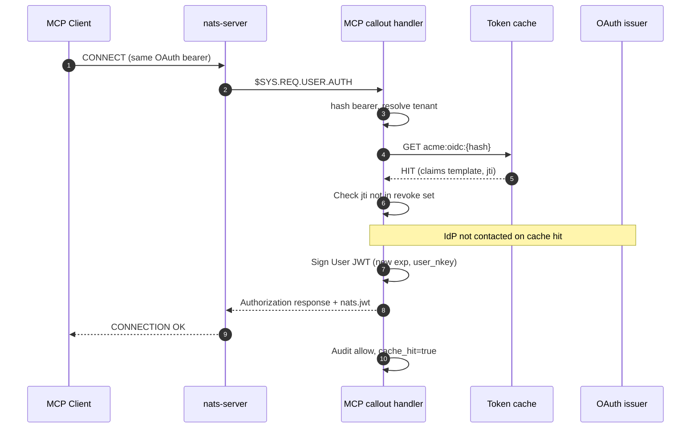
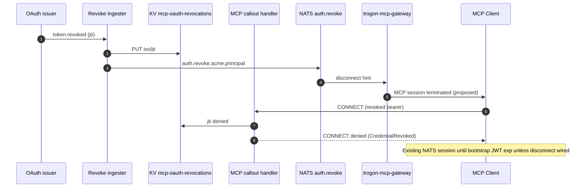
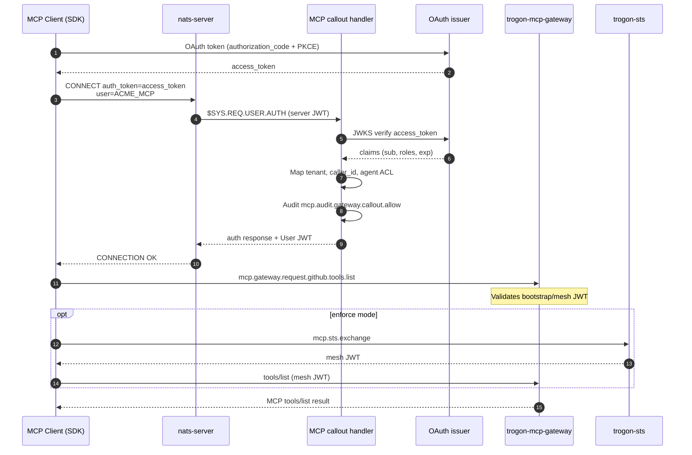

# NATS auth-callout plugin — MCP gateway design

**Status:** Design spec (paper, Block F). Operator reference target after implementation review.

**Related:** [OAuth 2.0 + MCP integration](oauth-mcp-integration.md) · [Integration touch-points](integration-touchpoints.md) · [STS exchange](sts-exchange.md) · [JWT claim schema](jwt-claim-schema.md) · [A2A auth callout design](../a2a/explanation/auth-callout-design.md)

**Audience:** platform security, NATS operators, gateway implementers.

**Non-goals:** NSC key generation runbooks, IdP product selection, crate-level implementation tickets. Those follow this spec in how-to docs and code.

---

## Purpose

[MCP_GATEWAY_PLAN.md](../../MCP_GATEWAY_PLAN.md) Block F lists the **NATS server auth-callout plugin** as outstanding. NATS Authorization Callout delegates CONNECT-time authentication to an external service that returns a signed **User JWT** with publish/subscribe permissions. Trogon's MCP gateway is the natural external service: the OAuth identity (or SPIFFE SVID, or bootstrap mTLS certificate) becomes the connection's NATS JWT, scoped to MCP edge subjects.

This document closes that design gap before code lands. It explains **why** the gateway owns callout, **how** NATS wire envelopes map to Trogon identity primitives, and **what** operators must configure on `nats-server` and the gateway fleet.

Identifiers below are **verified in-repo** unless marked **(proposed)**.

---

## Document map (Diátaxis)

| Section | Diátaxis kind | Content |
|---|---|---|
| [§1](#1-nats-auth-callout-primer) | Explanation | NATS callout concept, subjects, request/response envelopes |
| [§2](#2-where-the-gateway-fits) | Explanation | Gateway placement, HA, relationship to `a2a-auth-callout` |
| [§3](#3-input-translation) | Reference | Request field → identity primitive mapping |
| [§4](#4-permission-shape) | Reference | User JWT `nats` block templates per tenant role |
| [§5](#5-caching) | Explanation + reference | Per-token validation cache |
| [§6](#6-revocation-propagation) | Explanation | OAuth revoke → active NATS connection |
| [§7](#7-failure-modes) | Reference | Deny/fallback matrix |
| [§8](#8-operator-deployment) | Reference | `nats-server` + gateway wiring |
| [§9](#9-audit) | Reference | Callout decision audit subjects and envelope |
| [§10](#10-cross-references) | Reference | Links to sibling identity docs |

---

## 1. NATS auth-callout primer

### 1.1 Explanation — delegated CONNECT authentication

When auth callout is enabled on a NATS Account, the server does **not** accept static username/password or pre-issued User JWTs alone for User connections into that Account. Instead, on each CONNECT the server publishes an authorization decision request to a trusted subscriber. The subscriber validates external credentials and replies with a signed authorization response containing either:

- a minted **User JWT** (`nats.jwt` in the response claims), or
- a signed **denial** (`nats.error` with an opaque category string).

Official concept documentation: [NATS Authorization Callout](https://docs.nats.io/running-a-nats-service/configuration/securing_nats/auth_callout).

Trogon treats callout as the **perimeter authentication** step in the mesh identity model ([overview.md](overview.md)): bootstrap User JWT proves who connected; STS mesh tokens prove who may act at each hop ([ADR 0003](../adr/0003-bootstrap-vs-mesh-tokens.md)).

### 1.2 Callout subject — not `auth.callout`

NATS does **not** use a generic `auth.callout` subject. The server publishes authorization requests on a **system subject** pinned in this repo:

| Field | Value |
|---|---|
| **Request subject** | `$SYS.REQ.USER.AUTH` |
| **Reply target** | Message `reply-to` inbox (mandatory) |
| **Wire pin** | NATS server **2.14.x** (`a2a-auth-callout/src/wire/`, [A2A auth callout deployment](../a2a/how-to/operators/auth-callout-deployment.md)) |

Implementation constant: `AUTH_CALLOUT_SUBJECT = "$SYS.REQ.USER.AUTH"` in `a2a-auth-callout/src/subscriber.rs`.

**(proposed)** Operators MAY alias this in runbooks as "auth callout" or "USER.AUTH path"; no alternate subject is supported by NATS for User authorization callout in the pinned version.

### 1.3 Request envelope (server → callout)

The server publishes raw bytes on `$SYS.REQ.USER.AUTH`. The payload is either:

1. A server-signed NKey JWT (`ed25519-nkey`) with optional XKey encryption, or
2. An XKey-encrypted blob when `authorization.auth_callout.xkey` is configured.

#### Request JWT claims (inner)

| Claim / block | Role |
|---|---|
| `aud` | Must be `nats-authorization-request` (`AUTH_REQUEST_AUDIENCE` in `wire/mod.rs`) |
| `iss` | Server authorization issuer NKey (matches `authorization.auth_callout.issuer` in server config) |
| `sub` | Reserved for server use |
| `nats.server.id` | Target `server_id` — echoed as `aud` on the response JWT |
| `nats.user_nkey` | Ephemeral User NKey the client presented at CONNECT |
| `nats.client_info` | Client metadata: `user`, `name`, `name_tag`, `host`, `version`, … |
| `nats.connect_opts` | CONNECT options: `jwt`, `pass`, `auth_token`, `user`, … |
| `nats.client_tls` | When TLS client auth occurred: PEM certs and/or `verified_chains` |

Decoded in-tree as `ServerAuthRequestClaims` (`a2a-auth-callout/src/wire/server_auth_request_claims.rs`).

#### Credential extraction order (Trogon)

The MCP callout handler inspects CONNECT material in this order (matches shipped `CalloutDispatcher` preference in [auth-callout-design.md §2](../a2a/explanation/auth-callout-design.md)):

| Priority | Source field | Credential kind |
|---|---|---|
| 1 | `connect_opts.jwt` or `connect_opts.auth_token` | Bearer / OAuth access token / SPIFFE JWT-SVID |
| 2 | `connect_opts.pass` | Opaque secret (API key transitional path) |
| 3 | `client_tls.verified_chains` or `client_tls.certs` | mTLS client certificate (when `auth_token` empty) |

Task shorthand `auth.token` maps to **`nats.connect_opts.auth_token`** in NATS server JWT JSON (also surfaced as `connect_opts_auth_token()` on `ServerAuthRequestClaims`).

#### XKey headers

When encryption is enabled:

| Header | Role |
|---|---|
| `Nats-Server-Xkey` | Server one-time XKey public key for sealing the response (`AUTH_REQUEST_XKEY_HEADER`) |

Decryption uses account XKey seed and server persistent XKey public key configured on the callout service.

### 1.4 Response envelope (callout → server)

The callout **must** publish the response to the request's `reply-to` subject.

| Outcome | Response JWT shape |
|---|---|
| **Allow** | Callout-signed NKey JWT: `sub` = request `user_nkey`, `aud` = `server_id`, `nats.jwt` = minted User credential string |
| **Deny** | Callout-signed NKey JWT: `sub` = request `user_nkey`, `aud` = `server_id`, `nats.error` = opaque `DenialCategory` string |

Signed with the callout issuer NKey seed (`authorization.auth_callout` account/user credentials on the server trust the issuer public key).

Denials **never** embed IdP, x509, or verifier exception text on the wire ([`DenialCategory`](../../rsworkspace/crates/a2a-auth-callout/src/denial_category.rs)).

### 1.5 Minted User JWT (inner `nats.jwt`)

On success, `nats.jwt` holds a NATS User JWT (v2) signed by the tenant Account signing key. Standard and Trogon-specific claims are documented in [jwt-claim-schema.md § Bootstrap NATS User JWT extensions](jwt-claim-schema.md) and [auth-callout-design.md §3](../a2a/explanation/auth-callout-design.md).

Minimum MCP-relevant fields:

| Claim | MCP role |
|---|---|
| `aud` | NATS Account name (tenant boundary) |
| `sub` | External principal id (IdP `sub`, SPIFFE id, cert subject) |
| `caller_id` | Subject-safe segment for `_INBOX.{caller_id}.>` and callback ACL |
| `tenant` | Soft-tenancy audit / CEL ([ADR 0001](../adr/0001-tenancy-model.md)) |
| `roles` | Tenant role list driving permission template selection (§4) |
| `nats.pub` / `nats.sub` | Allow/deny publish and subscribe patterns |
| `data` | SpiceDB principal payload (`spicedb_subject`, …) |

---

## 2. Where the gateway fits

### 2.1 Explanation — gateway as callout authority

The MCP gateway fleet terminates **external identity** at the NATS perimeter and mints bootstrap User JWTs whose ACLs confine callers to the **edge zone** (`mcp.gateway.request.>`, own callback subtree, own inbox). Backend zone subjects (`mcp.server.>`, `mcp.client.>`) remain gateway-private.

```
External credential (OAuth / SVID / mTLS)
        │
        ▼
  NATS CONNECT ──► nats-server ──► $SYS.REQ.USER.AUTH
                                        │
                                        ▼
                           MCP auth-callout handler
                           (gateway fleet consumer)
                                        │
                                        ▼ mint User JWT (edge ACL)
                           Caller NATS session ──► mcp.gateway.request.>
                                        │
                                        ▼
                              trogon-mcp-gateway (queue group)
```

The gateway **does not** re-validate OAuth on every MCP JSON-RPC message when the caller presents a fresh bootstrap or mesh JWT; CONNECT-time callout and STS exchange establish identity upstream of ingress policy ([oauth-mcp-integration.md §2](oauth-mcp-integration.md)).

### 2.2 Deployment form factor

Two implementation paths are compatible with this design; operators choose one per cluster:

| Form factor | Description | When |
|---|---|---|
| **A — Extended `a2a-auth-callout`** | Shipped binary gains MCP permission templates and MCP-specific audit; same `$SYS.REQ.USER.AUTH` subscriber | Reuse A2A perimeter ops; single callout serves A2A + MCP Accounts |
| **B — Embedded in `trogon-mcp-gateway`** | Gateway process hosts `Subscriber` + `CalloutDispatcher` alongside ingress | Minimize moving parts when MCP-only cluster |

Both expose a **queue-group consumer** on `$SYS.REQ.USER.AUTH` for horizontal scale:

| Field | Value |
|---|---|
| **Subject** | `$SYS.REQ.USER.AUTH` |
| **Queue group (proposed)** | `trogon-mcp-callout` |
| **Connect identity** | Dedicated service User on AUTH/sys Account (see §8) |

Today `a2a-auth-callout` uses plain `subscribe` without queue group (`subscriber.rs`). HA via queue group is **(proposed)** for MCP gateway fleets; NATS delivers each auth request to one group member.

### 2.3 Relationship to HTTP OAuth termination

HTTP MCP clients may validate OAuth at the gateway HTTP listener ([oauth-mcp-integration.md §2 Option A/B](oauth-mcp-integration.md)). NATS-native MCP clients use **Option C** — OAuth bearer at CONNECT → callout. Both paths must converge on the **same** bootstrap claim shape and permission templates so STS and SpiceDB see one principal model.

### 2.4 What callout is not

| Concern | Owner | Notes |
|---|---|---|
| Per-tool SpiceDB checks | `trogon-mcp-gateway` ingress | After CONNECT |
| Mesh token mint | `trogon-sts` on `mcp.sts.exchange` | Bootstrap → mesh |
| Bridge internal mint | `a2a.bridge.auth.callout.request` | JSON path; not `$SYS.REQ.USER.AUTH` |

---

## 3. Input translation

### 3.1 Reference — request field mapping

| NATS callout field | Trogon primitive | Use |
|---|---|---|
| `nats.server.id` | `ServerId` | Response JWT `aud`; audit `server_id` |
| `nats.client_info.user` / `name_tag` / `connect_opts.user` | `RequestedAccount` hint | Resolve target NATS Account → tenant |
| `nats.connect_opts.auth_token` | `BearerCredential` | OAuth access token or SPIFFE JWT-SVID |
| `nats.connect_opts.jwt` | `BearerCredential` | Alternate bearer slot (some clients) |
| `nats.connect_opts.pass` | `ApiKeyCredential` | Transitional HMAC API key |
| `nats.client_tls.*` | `ClientCertChain` | mTLS path when bearer empty |
| `nats.user_nkey` | `EphemeralUserNkey` | Response `sub`; inner User JWT subject NKey |

Account resolution uses the same `AccountResolver` pattern as A2A: static allowlist or issuer→tenant map ([oauth-mcp-integration.md §6](oauth-mcp-integration.md)).

### 3.2 Path A — OAuth access token (`auth_token` / JWT bearer)

**Trigger:** Non-empty `connect_opts.auth_token` or `connect_opts.jwt` that parses as OAuth/OIDC access token (JWT or opaque).

**Steps:**

1. **Verify** signature via tenant IdP JWKS (`JwksOidcVerifier`) or RFC 7662 introspection for opaque tokens.
2. **Validate** `iss` ∈ configured issuer allowlist for the resolved tenant.
3. **Validate** `aud` or RFC 8707 `resource` includes `MCP_GATEWAY_OAUTH_RESOURCE_URI` (HTTP) or configured OIDC audience list (`AUTH_CALLOUT_OIDC_AUDIENCES`).
4. **Validate** `exp` (± leeway), optional `nbf`.
5. **Map** claims → `ExternalSubject`, `caller_id`, `data.spicedb_subject`, `roles`, `tenant`.
6. **Select** permission template from primary tenant role (§4).
7. **Mint** User JWT with `exp = min(oauth_exp, AUTH_CALLOUT_USER_JWT_TTL_SECS)`.

Claim mapping table (OAuth → bootstrap): [oauth-mcp-integration.md §4.2](oauth-mcp-integration.md).

| OAuth claim | Bootstrap claim |
|---|---|
| `sub` | `sub` (namespaced, e.g. `oidc\|acme\|{sub}`) |
| `iss` | verification only |
| `scope` | `scope` **(proposed)** on bootstrap |
| groups / roles | `roles[]` |
| — | `aud` = NATS Account name |
| — | `caller_id` = derived stable token-safe id |
| — | `nats` = role template ACL |

### 3.3 Path B — SPIFFE SVID (`auth_token` as JWT-SVID)

**Trigger:** Bearer parses as SPIFFE JWT-SVID (`sub` URI `spiffe://…`).

**Steps:**

1. **Resolve** trust domain from SVID `sub`.
2. **Load** SPIFFE bundle from NATS KV `mcp-trust-bundles/<trust-domain>` ([integration-touchpoints.md §7](integration-touchpoints.md)).
3. **Verify** signature and validity window against bundle.
4. **Map** SPIFFE id → tenant Account + workload principal; derive `roles` default `agent` unless IdP mapping exists.
5. **Mint** User JWT with agent-oriented template (§4.2).

SPIFFE acceptance in auth callout is **partial** in the research backlog ([05-gap-analysis.md § ID-10](../research/microsoft-agent-gov-toolkit/05-gap-analysis.md)); this spec defines the target MCP behavior.

| SVID field | Bootstrap claim |
|---|---|
| `sub` (SPIFFE URI) | `sub` + `wkl` **(proposed)** on bootstrap for shadow mode |
| `exp` | caps bootstrap TTL |
| — | `auth_method` = `svid` **(proposed)** |
| — | `data.spicedb_subject` = mapped workload principal |

### 3.4 Path C — mTLS (empty bearer, client cert present)

**Trigger:** `auth_token` and `jwt` empty; `client_tls.verified_chains` or `certs` non-empty.

**Steps:**

1. **Verify** chain against `AUTH_CALLOUT_MTLS_TRUST_ANCHORS` (or per-tenant trust bundle).
2. **Map** SAN / subject CN → tenant Account + service principal (same as A2A `X509MtlsVerifier`).
3. **Mint** User JWT; default role `agent` for service identities, `admin` only when cert maps to operator SAN registry entry.

Reference: [auth-callout-design.md §2 Credential sources](../a2a/explanation/auth-callout-design.md).

### 3.5 Path D — Bootstrap token (re-connect)

**Trigger:** `connect_opts.jwt` is an existing Trogon bootstrap User JWT (re-connect optimization).

**Behavior (proposed):** Verify JWT signature against callout issuer keys; if valid and not revoked, re-issue fresh User JWT with unchanged principal mapping and renewed TTL. Otherwise fall through to Path A/B/C.

### 3.6 Deny paths (no credential)

| Condition | Denial |
|---|---|
| No bearer, no cert | `CredentialVerification` |
| Unknown Account hint | `unknown_account` |
| Issuer not in tenant registry | `CredentialVerification` |
| SPIFFE bundle missing | `CredentialVerification` (fail-closed) |

---

## 4. Permission shape

### 4.1 Explanation — NATS User JWT permissions block

Bootstrap credentials embed publish/subscribe ACL in the NATS JWT v2 `nats` object:

```json
{
  "nats": {
    "pub": {
      "allow": ["mcp.gateway.request.>", "_INBOX.client.>"],
      "deny": []
    },
    "sub": {
      "allow": ["mcp.gateway.callback.{caller_id}.>", "_INBOX.client.>"],
      "deny": []
    }
  }
}
```

Deny lists are evaluated after allow. Wildcards follow NATS subject rules (`*` single token, `>` remainder).

Prefix `{prefix}` defaults to `mcp` (`MCP_PREFIX`). Substitute `{prefix}` in all templates when overridden.

`caller_id` must be a **single subject token** (no `.` characters) — same constraint as A2A ([auth-callout-design.md §3](../a2a/explanation/auth-callout-design.md)).

### 4.2 Tenant roles

Roles arrive on the bootstrap JWT as `roles[]` from IdP groups or SPIFFE mapping. Trogon MCP defines three **tenant role templates** for callout minting:

| Role | Intended principal | IdP mapping example |
|---|---|---|
| `admin` | Tenant operator, break-glass automation | `mcp-admin`, `trogon:tenant:acme:admin` |
| `agent` | Registered agent workload or standard MCP client | `mcp-user`, `mcp-agent`, default for SVID |
| `observer` | Read-only auditor, SIEM connector | `mcp-observer`, `mcp-audit-reader` |

When multiple roles are present, effective template = **most privileged** by order `admin` > `agent` > `observer` **(proposed)** unless gateway config `MCP_CALLOUT_ROLE_MERGE=intersection` is set.

### 4.3 Template — `admin`

Broad edge access plus control-plane read and audit subscribe. Does **not** grant backend zone publish.

| Permission | Allow patterns |
|---|---|
| **Publish** | `{prefix}.gateway.request.>` |
| | `{prefix}.gateway.callback.>` **(proposed)** — admin clients that receive callbacks for support tooling |
| | `{prefix}.control.>` **(proposed)** — cache invalidation signals, bundle reload listen |
| | `_INBOX.client.>` |
| | `{prefix}.sts.exchange` — STS exchange for support sessions |
| **Subscribe** | `{prefix}.gateway.callback.>` |
| | `{prefix}.control.>` **(proposed)** |
| | `{prefix}.audit.>` — read audit stream (JetStream consumer on gateway SIEM role) |
| | `_INBOX.client.>` |
| | `_INBOX.>` **(proposed)** — reply inbox for STS R/R |

Explicit **deny** (defense in depth when NATS supports deny in template):

| Deny | Reason |
|---|---|
| `{prefix}.server.>` | Backend zone — gateway only |
| `{prefix}.plugin.>` | Policy plugins — gateway only |

### 4.4 Template — `agent`

Default for OAuth users and SPIFFE workloads. Matches [MCP_GATEWAY_PLAN.md § Subject ACL — Client / edge bridge](../../MCP_GATEWAY_PLAN.md).

| Permission | Allow patterns |
|---|---|
| **Publish** | `{prefix}.gateway.request.>` |
| | `_INBOX.client.>` |
| | `{prefix}.sts.exchange` |
| **Subscribe** | `{prefix}.gateway.callback.{caller_id}.>` |
| | `_INBOX.client.>` |

| Deny | Reason |
|---|---|
| `{prefix}.server.>` | Cannot reach backends directly |
| `{prefix}.client.>` | Cannot impersonate backend callback publisher |
| `{prefix}.audit.>` | Audit is operator-facing |
| `{prefix}.control.>` | Control plane operator-only |

`caller_id` in callback subscribe pattern is substituted at mint time from derived id.

### 4.5 Template — `observer`

Read-only: audit and control read paths; **no** MCP gateway request publish.

| Permission | Allow patterns |
|---|---|
| **Publish** | `_INBOX.client.>` only (for R/R replies if needed) |
| **Subscribe** | `{prefix}.audit.>` |
| | `{prefix}.control.discovery.>` **(proposed)** — server registration visibility |
| | `_INBOX.client.>` |

| Deny | Reason |
|---|---|
| `{prefix}.gateway.request.>` | Cannot invoke tools |
| `{prefix}.gateway.callback.>` | Cannot receive MCP callbacks |
| `{prefix}.server.>` | Backend isolation |
| `{prefix}.sts.exchange` | Cannot mint mesh tokens |

### 4.6 Gateway and backend principals (not callout-minted)

Callout does **not** mint these; NSC provisions long-lived service Users:

| Principal | Publish | Subscribe |
|---|---|---|
| **Gateway service** | `{prefix}.server.>`, `{prefix}.gateway.callback.>`, `{prefix}.audit.>`, `{prefix}.plugin.>`, `{prefix}.control.>`, `_INBOX.gateway.>` | `{prefix}.gateway.request.>`, `{prefix}.client.>`, `{prefix}.control.>`, `_INBOX.gateway.>` |
| **Backend MCP server** | `{prefix}.client.>`, `_INBOX.>` | `{prefix}.server.{my_server_id}.>` |

Source: [MCP_GATEWAY_PLAN.md § Subject ACL per principal](../../MCP_GATEWAY_PLAN.md).

Agent-role mints include `aud=ACME_MCP`, `caller_id`, `tenant`, `roles`, and `nats.pub`/`nats.sub` blocks matching §4.4. Full claim examples: [jwt-claim-schema.md](jwt-claim-schema.md), [auth-callout-design.md §3](../a2a/explanation/auth-callout-design.md).

---

## 5. Caching

### 5.1 Explanation — why cache at callout

Validating an OAuth access token on every NATS CONNECT (and on reconnect storms) amplifies IdP load and adds tail latency to CONNECT. SPIFFE bundle verification is cheaper but still redundant for bursty reconnects with the same SVID.

Callout implements a **positive cache** of successful mint decisions keyed by credential fingerprint, not a cache of denials (except short-lived negative cache for revoked tokens — §6).

### 5.2 Cache key

| Component | Value |
|---|---|
| **Key (proposed)** | `{tenant}:{auth_method}:{token_hash}` |
| `tenant` | Resolved tenant id string |
| `auth_method` | `oidc` \| `svid` \| `mtls` \| `api_key` |
| `token_hash` | SHA-256 hex of raw bearer bytes or cert fingerprint (SHA-256 of DER of leaf cert) |

Never use raw token as cache key in logs or KV.

### 5.3 Cache value

| Field | Content |
|---|---|
| `minted_claims_template` | Serialized permission template + principal fields |
| `oauth_jti` | For revocation matching **(proposed)** |
| `cached_at` | Unix seconds |
| `expires_at` | Cache entry expiry |

On hit, callout skips IdP JWKS/introspection, re-signs User JWT with fresh `iat`/`exp` and current `user_nkey` from request.

### 5.4 TTL

```
cache_ttl = min(
    token_exp - now,
    MCP_CALLOUT_CACHE_MAX_TTL_SECS   # proposed default: 60
)
```

| Constraint | Rule |
|---|---|
| OAuth access token | TTL capped by `exp - now` |
| Bootstrap max | Also capped by `AUTH_CALLOUT_USER_JWT_TTL_SECS` (default 300) at mint |
| Revocation | Entry invalidated immediately on revoke event (§6) |
| mTLS | TTL = `MCP_CALLOUT_CACHE_MAX_TTL_SECS` (cert expiry does not shrink cache unless cert expires before TTL) |

Environment **(proposed):**

| Variable | Default | Meaning |
|---|---|---|
| `MCP_CALLOUT_CACHE_MAX_TTL_SECS` | `60` | Upper bound for cache entry |
| `MCP_CALLOUT_CACHE_MAX_ENTRIES` | `50000` | In-memory LRU bound per instance |

### 5.5 Sequence — cache hit



---

## 6. Revocation propagation

### 6.1 Explanation — two lifetimes

After CONNECT succeeds, three clocks run:

| Artifact | Typical TTL | Revocation effect |
|---|---|---|
| OAuth access token | 5–60 min | New CONNECT with same token denied when detected |
| Bootstrap User JWT | ≤ 300 s (`AUTH_CALLOUT_USER_JWT_TTL_SECS`) | Existing NATS TCP session may persist until JWT exp |
| Mesh JWT | 60–300 s | Gateway rejects expired mesh; STS denies re-exchange |

OAuth revocation does **not** instantly drop an established NATS TCP connection unless the server enforces periodic re-auth (NATS does not today). Trogon combines **short bootstrap TTL**, **revocation denylist**, and **optional disconnect signal**.

### 6.2 Revocation sources

| Source | Detection |
|---|---|
| IdP webhook | `token.revoked`, `session.logout` → Trogon revoke ingester **(proposed)** |
| RFC 7662 introspection | `active: false` on cache miss or periodic re-check **(proposed)** |
| Operator action | Manual `jti` / `sub` revoke via CLI **(proposed)** |
| Registry revoke | Agent principal revoked → STS denies mesh; callout denylist for `sub` **(proposed)** |

### 6.3 Denylist storage

Align with [oauth-mcp-integration.md §7.3](oauth-mcp-integration.md):

| Store | Key | Value |
|---|---|---|
| JetStream KV **(proposed)** | `mcp-oauth-revocations/{iss}/{jti}` | `{ revoked_at, reason }` |
| In-memory | Same key | TTL synced from KV watcher |

Callout checks denylist **before** cache hit promotion and on every CONNECT.

### 6.4 Explicit revoke broadcast — `auth.revoke` (proposed)

When revocation is observed, the callout publisher emits a core NATS message so interested services terminate sessions early:

| Field | Value |
|---|---|
| **Subject (proposed)** | `auth.revoke.{tenant}.{principal_segment}` |
| **Payload (proposed)** | `{ "jti": "…", "sub": "…", "revoked_at": 1748347200, "reason": "oauth_revoke" }` |
| **Publisher** | MCP callout handler or revoke webhook service |
| **Subscribers (proposed)** | Gateway (`mcp.control.disconnect.*`), STS (invalidate mesh cache) |

**Note:** `auth.revoke` is **not** a NATS built-in subject; it is a Trogon convention **(proposed)**. Do not confuse with `$SYS.REQ.USER.AUTH`.

Gateway **(proposed)** maps `auth.revoke` → `mcp.control.disconnect.{tenant}.{caller_id}` to nudge clients off active MCP sessions ([oauth-mcp-integration.md §7.3](oauth-mcp-integration.md)).

### 6.5 Sequence — revocation



### 6.6 Bootstrap TTL as primary safety

Even without disconnect wiring, **`AUTH_CALLOUT_USER_JWT_TTL_SECS` default 300 s** bounds blast radius. Operators SHOULD NOT raise above 900 s without compensating revoke latency SLO.

Mesh enforce mode further bounds tool invocation: expired bootstrap cannot exchange at STS ([sts-exchange.md](sts-exchange.md)).

---

## 7. Failure modes

### 7.1 Reference matrix

| Condition | Callout behavior | NATS server behavior | Client recovery |
|---|---|---|---|
| **OAuth issuer down** (JWKS + introspection unreachable) | Deny CONNECT; **no** silent allow | Authorization response error | Retry backoff; use cached bootstrap if still valid **(proposed client behavior)** |
| **OAuth issuer down** + `MCP_CALLOUT_OIDC_OFFLINE_GRACE=1` **(proposed, dev only)** | Allow cache hits only; deny cache miss | Same | Dev only — not production |
| **OAuth token expired** | Deny `CredentialExpired` **(proposed category)** | Error response | Refresh OAuth token; re-CONNECT |
| **OAuth token revoked** | Deny `CredentialRevoked` **(proposed)** | Error response | Re-authorize |
| **SPIFFE bundle missing** in KV | Deny fail-closed | Error response | Restore bundle to `mcp-trust-bundles/<td>` |
| **SPIFFE bundle stale** | Deny if signature fails | Error response | Check trust bundle controller |
| **Unknown tenant Account** | Deny `unknown_account` | Error response | Fix NSC / account hint |
| **Callout handler down** | No response within `authorization.timeout` | **Fallback** to default auth — MUST be deny | Fix callout fleet |
| **Callout slow** | NATS waits until timeout | Same as down if timeout | Scale callout queue group |
| **Signing key unavailable** | Deny internal error category | Error response | Fix `SigningKeySource` |
| **Cache poisoned (proposed)** | Admin flush LRU + revoke key | — | Rotate credentials |

### 7.2 Default auth MUST deny

When callout times out, `nats-server` falls back to configured default authorization. MCP tenant Accounts must have **no** broad static Users — only callout-minted JWTs. See §8.2 illustrative config; break-glass Users require explicit audit.

### 7.3 Denial category → audit outcome

| Category | Audit outcome **(proposed)** |
|---|---|
| Success mint | `allow` |
| Any denial | `deny` |
| Internal/signing failure | `error` |

---

## 8. Operator deployment

### 8.1 Topology

```
                    ┌─────────────────────┐
                    │     nats-server      │
                    │  auth_callout block  │
                    └──────────┬──────────┘
                               │ $SYS.REQ.USER.AUTH
           ┌───────────────────┼───────────────────┐
           ▼                   ▼                   ▼
    ┌─────────────┐     ┌─────────────┐     ┌─────────────┐
    │ callout pod │     │ callout pod │     │ callout pod │
    │  (qg member)│     │  (qg member)│     │  (qg member)│
    └─────────────┘     └─────────────┘     └─────────────┘
           │                   │                   │
           └───────────────────┴───────────────────┘
                               │
                    ┌──────────▼──────────┐
                    │  trogon-mcp-gateway │
                    │  (ingress qg)       │
                    └─────────────────────┘
```

### 8.2 nats-server configuration (illustrative)

Substitute placeholders from NSC bootstrap. Pattern follows [scripts/a2a-auth-callout-nats-server.conf](../../scripts/a2a-auth-callout-nats-server.conf).

```hcl
# illustrative — MCP tenant cluster (NATS 2.14.x)
listen: 0.0.0.0:4222

accounts {
  AUTH: {
    users: [
      { user: callout, password: "<callout-service-password>" }
    ]
  }
  ACME_MCP: {
    jetstream: enabled
  }
  SYS: {}
}

system_account: SYS

authorization {
  timeout: 2s
  auth_callout {
    issuer: "<callout-response-signer-nkey-public>"
    account: AUTH
    auth_users: [ callout ]
    # Optional encryption:
    # xkey: "<account-xkey-public>"
  }
}
```

Tenant Users connect **into** `ACME_MCP` (or connect URL routes to that Account) with OAuth bearer in `auth_token` — no static password.

### 8.3 Callout service environment

Extends the A2A env table ([auth-callout-deployment.md](../a2a/how-to/operators/auth-callout-deployment.md)). MCP additions **(proposed)**: `MCP_PREFIX`, `MCP_CALLOUT_CACHE_MAX_TTL_SECS`, `MCP_CALLOUT_DEFAULT_ROLE`. Required pins unchanged: `AUTH_CALLOUT_ISSUER_NKEY_SEED`, `AUTH_CALLOUT_SERVER_NKEY_PUBLIC`, `AUTH_CALLOUT_OIDC_ISSUER`, `AUTH_CALLOUT_ALLOWED_ACCOUNTS`, `AUTH_CALLOUT_USER_JWT_TTL_SECS`.

### 8.4 Queue group and readiness

Subscribe `$SYS.REQ.USER.AUTH` with queue group `trogon-mcp-callout` **(proposed)**. Write `AUTH_CALLOUT_READY_FILE` when active ([subscriber.rs](../../rsworkspace/crates/a2a-auth-callout/src/subscriber.rs)).

### 8.5 Sequence — first connect (OAuth)



---

## 9. Audit

### 9.1 Requirement

Every callout authorization decision **must** emit an audit event. No silent denials.

### 9.2 Subject (proposed)

Task shorthand:

```
mcp.audit.gateway.callout.{outcome}
```

Where `{outcome}` ∈ `allow` | `deny` | `error`.

**Mapping note:** This follows the task naming convention for callout-specific audits. It is **distinct** from gateway MCP tool traffic subjects `{prefix}.audit.{outcome}.{direction}.{method_root}` ([agent-traffic.md §2.1](agent-traffic.md)). The literal segment `gateway` here identifies the **callout decision plane**, not JSON-RPC direction.

| Subject | When |
|---|---|
| `mcp.audit.gateway.callout.allow` | User JWT minted |
| `mcp.audit.gateway.callout.deny` | Credential or policy denial |
| `mcp.audit.gateway.callout.error` | Signing failure, internal error |

Published to JetStream stream **`MCP_AUDIT`** with filter `mcp.audit.>` ([integration-touchpoints.md §8](integration-touchpoints.md)).

Related **(proposed)** OAuth subjects from [oauth-mcp-integration.md §8.2](oauth-mcp-integration.md): `mcp.audit.callout.mint.success` may merge with `gateway.callout.allow` in a future envelope unification — until then, emit **`gateway.callout.*`** per this spec.

### 9.3 Envelope fields (proposed)

| Field | Type | Required | Description |
|---|---|---|---|
| `envelope_version` | string | Yes | `1.0.0` when header unified ([reference-audit-envelope.md](reference-audit-envelope.md)) |
| `event_time` | RFC3339 | Yes | Decision timestamp |
| `tenant` | string | Yes | Resolved tenant id |
| `subject` | string | Yes | External principal (`sub` claim source) |
| `auth_method` | string | Yes | `oidc` \| `svid` \| `mtls` \| `api_key` |
| `cache_hit` | bool | Yes | Whether IdP/bundle verification was skipped |
| `latency_ms` | number | Yes | Wall time from request decode to response sign |
| `server_id` | string | No | From `nats.server.id` |
| `nats_account` | string | No | Target Account |
| `caller_id` | string | No | On allow |
| `roles` | string[] | No | Effective roles |
| `denial_category` | string | No | On deny — opaque category only |
| `oauth_jti_hash` | string | No | SHA-256 of access token — never raw token |
| `trace_id` | string | No | W3C trace when propagated on CONNECT **(proposed)** |

### 9.4 Examples

**Allow** (`mcp.audit.gateway.callout.allow`): include `tenant`, `subject`, `auth_method`, `cache_hit`, `latency_ms`, `caller_id`, `roles`, `oauth_jti_hash`.

**Deny** (`mcp.audit.gateway.callout.deny`): same header fields; add `denial_category` (opaque); omit `caller_id`.

See [reference-audit-envelope.md §2](reference-audit-envelope.md) for common header vocabulary.

### 9.5 Redaction rules

| Must never appear | Replacement |
|---|---|
| Raw OAuth access token | `oauth_jti_hash` or `jti` |
| Refresh token | omit |
| mTLS private keys | omit |
| IdP error text | `denial_category` only |

---

## 10. Cross-references

### 10.1 Sibling identity documents

| Document | Relevance |
|---|---|
| [oauth-mcp-integration.md](oauth-mcp-integration.md) | OAuth → bootstrap claim mapping; HTTP + NATS composite; revocation diagram |
| [integration-touchpoints.md](integration-touchpoints.md) | STS subject, trust bundle KV, audit stream names |
| [sts-exchange.md](sts-exchange.md) | Bootstrap User JWT as `subject_token`; SPIFFE `actor_token` |
| [jwt-claim-schema.md](jwt-claim-schema.md) | Bootstrap vs mesh claims; `roles`, `tenant`, `caller_id` |
| [reference-audit-envelope.md](reference-audit-envelope.md) | Common header fields; outcome vocabulary |
| [overview.md](overview.md) | Perimeter vs per-hop identity mental model |
| [agent-traffic.md](agent-traffic.md) | Audit subject shorthand vs wire patterns |

### 10.2 MCP gateway plan

| Block | Item | This doc |
|---|---|---|
| **Block F** | NATS auth-callout plugin | Full design |
| **Block C** | OAuth 2.0 MCP integration | Composes via §3 Path A |
| **Phase 0** | Auth callout + subject ACL | §4 permission templates |
| **§ Components** | Auth callout service | §2 deployment |
| **§ Subject ACL** | Client / gateway / backend | §4.3–4.6 |
| **§ Audit** | `mcp.audit.>` stream | §9 |

### 10.3 A2A reuse and open decisions

Reuse [auth-callout-design.md](../a2a/explanation/auth-callout-design.md), the `a2a-auth-callout` crate (`Subscriber`, `CalloutDispatcher`, `wire`), and [auth-callout-deployment.md](../a2a/how-to/operators/auth-callout-deployment.md) for NSC keys and env pins. MCP templates swap A2A `a2a.gateway.>` publish for `{prefix}.gateway.request.>`.

| Open decision | Default in this spec |
|---|---|
| Embed callout in gateway vs standalone | Either; queue group `trogon-mcp-callout` required |
| Audit subject unification | Emit `mcp.audit.gateway.callout.{outcome}` |
| `auth.revoke` disconnect | Optional; bootstrap TTL cap mandatory |
| SPIFFE in callout | §3 Path B; gap ID-10 in research backlog |
| Multi-role merge | `admin` > `agent` > `observer` |
