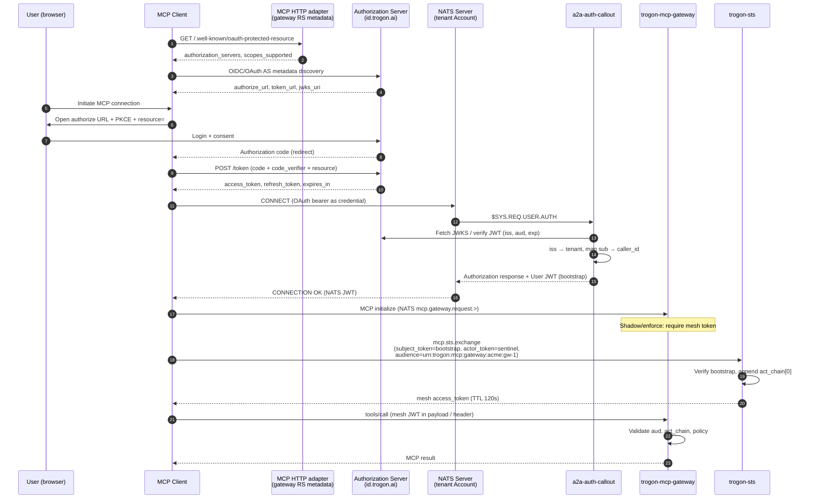
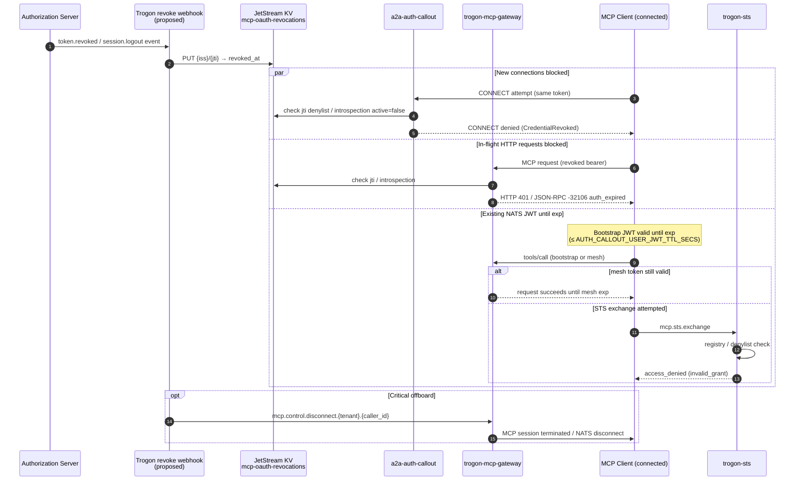

# OAuth 2.0 + MCP integration

**Status:** Design spec (paper, Block C). Operator reference target after implementation review.

**Related:** [Agent identity overview](overview.md) · [STS exchange](sts-exchange.md) · [JWT claim schema](jwt-claim-schema.md) · [MCP gateway plan](../../MCP_GATEWAY_PLAN.md) Block C · [A2A auth callout design](../a2a/explanation/auth-callout-design.md)

---

## Purpose

This document closes the open Block C item **"OAuth 2.0 MCP integration"** in [`MCP_GATEWAY_PLAN.md`](../../MCP_GATEWAY_PLAN.md). It explains how a third-party MCP client authenticates to the Trogon MCP gateway using OAuth 2.0 / OIDC, and how that OAuth identity becomes:

1. A **bootstrap NATS User JWT** minted at CONNECT via NATS **auth callout**, and
2. The **`subject_token`** presented to STS on `mcp.sts.exchange` for the first mesh hop.

The MCP specification mandates OAuth 2.0 / OIDC for HTTP-based server-side authorization. Trogon already terminates external credentials at the NATS perimeter through **`a2a-auth-callout`** (OIDC primary, mTLS secondary). This spec composes those two worlds without inventing claim names that do not exist today; proposed additions are marked **(proposed)**.

**Audience:** platform security, gateway operators, MCP client authors integrating with Trogon-hosted servers.

**Non-goals:** IdP product selection, UI consent flows, full Keycloak runbooks, or implementation tickets. Those belong in operator how-to docs after this spec is accepted.

---

## Mental model

Trogon mesh identity separates **perimeter authentication** (who connected) from **per-hop authorization** (who may act at this hop). OAuth proves perimeter identity to MCP and NATS; STS mints short-lived mesh tokens for cross-agent and gateway-to-backend hops ([ADR 0003](../adr/0003-bootstrap-vs-mesh-tokens.md)).

```
OAuth access token (IdP)
        │
        ├─ HTTP MCP path ──► gateway validates bearer (resource server)
        │                         │
        │                         └─► policy / STS / egress mint
        │
        └─ NATS MCP path ──► auth callout verifies bearer at CONNECT
                                  │
                                  └─► bootstrap NATS User JWT (aud = tenant Account)
                                            │
                                            └─► STS exchange → mesh JWT (aud = hop URI)
```

OAuth tokens **never** propagate to MCP backends. The gateway mints downstream mesh tokens on egress ([overview](overview.md)). Clients must not expect passthrough of inbound OAuth bearers past the gateway edge.

---

## 1. The MCP OAuth surface

### 1.1 Explanation — why MCP cares about OAuth

The [MCP Authorization specification (2025-11-25)](https://modelcontextprotocol.io/specification/2025-11-25/basic/authorization) defines how HTTP-based MCP clients obtain and use access tokens when calling restricted MCP servers. STDIO transports retrieve credentials from the environment and **do not** follow this HTTP OAuth profile.

For Trogon, the MCP OAuth surface is the **HTTP ingress** to `trogon-mcp-gateway` (and any MCP-compatible HTTP adapter in front of NATS). NATS-native MCP clients that connect directly to a tenant Account still use OAuth at CONNECT time, but the wire format is NATS auth callout rather than `Authorization: Bearer` on HTTP — see [§2](#2-where-the-gateway-sits-in-the-oauth-flow).

MCP builds on:

| Standard | Role in MCP |
|---|---|
| OAuth 2.1 (draft) | Core token and resource-request semantics |
| [RFC 8414](https://www.rfc-editor.org/rfc/rfc8414) | Authorization Server Metadata discovery |
| [RFC 9728](https://www.rfc-editor.org/rfc/rfc9728) | Protected Resource Metadata (resource server discovery) |
| [RFC 8707](https://www.rfc-editor.org/rfc/rfc8707) | Resource Indicators — `resource` parameter and token audience binding |
| [RFC 7591](https://www.rfc-editor.org/rfc/rfc7591) | Dynamic Client Registration (optional) |
| OIDC Discovery 1.0 | Alternate authorization server metadata path |

MCP clients **must** support both OAuth 2.0 Authorization Server Metadata and OpenID Connect Discovery when resolving authorization server endpoints ([MCP spec § Authorization Server Metadata Discovery](https://modelcontextprotocol.io/specification/2025-11-25/basic/authorization#authorization-server-metadata-discovery)).

### 1.2 Authorization server discovery

Discovery is a two-stage process mandated by MCP:

**Stage 1 — Protected Resource Metadata (RFC 9728).** The MCP server (resource server) advertises which authorization servers may issue tokens for it.

| Mechanism | Requirement | Trogon gateway behavior (target) |
|---|---|---|
| `WWW-Authenticate` on `401` | MCP clients **must** parse; `resource_metadata` URL when present | Gateway returns `401` with `resource_metadata="https://{host}/.well-known/oauth-protected-resource{path}"` and optional `scope=` per RFC 6750 |
| Well-known URI | Fallback when header absent | Serve document at `/.well-known/oauth-protected-resource` or path-suffixed variant per RFC 9728 |

The Protected Resource Metadata document **must** include `authorization_servers` with at least one issuer URL. MCP clients choose among listed servers per RFC 9728 §7.6.

**Stage 2 — Authorization Server Metadata.** From the chosen issuer, the client probes (in priority order):

1. `{issuer}/.well-known/oauth-authorization-server{path}`
2. `{issuer}/.well-known/openid-configuration{path}`
3. `{issuer}{path}/.well-known/openid-configuration`

Trogon deployments that use an upstream IdP (Option B, [§2](#2-where-the-gateway-sits-in-the-oauth-flow)) publish Protected Resource Metadata **at the gateway** pointing at the tenant's authorization server(s). The gateway does not replace the IdP's authorization server metadata endpoints.

Example Protected Resource Metadata (illustrative):

```json
{
  "resource": "https://mcp.acme.trogon.ai/mcp",
  "authorization_servers": ["https://id.trogon.ai/acme"],
  "scopes_supported": ["mcp:tools:read", "mcp:tools:invoke", "mcp:resources:read"],
  "bearer_methods_supported": ["header"],
  "resource_signing_alg_values_supported": []
}
```

### 1.3 Grant types — `authorization_code` vs `client_credentials`

MCP supports multiple client registration paths (Client ID Metadata Documents preferred, pre-registration, RFC 7591 DCR as fallback). Grant type selection follows client kind:

| Client kind | Typical grant | MCP spec notes | Trogon use case |
|---|---|---|---|
| **Interactive MCP client** (desktop, IDE plugin) | `authorization_code` + PKCE (`S256`) | **Required** for public clients; PKCE mandatory ([OAuth 2.1 §7.5.2](https://datatracker.ietf.org/doc/html/draft-ietf-oauth-v2-1-13#section-7.5.2)) | Human operator connects Cursor/Claude Desktop to tenant MCP gateway |
| **Confidential automation client** | `client_credentials` | May use step-up on `insufficient_scope`; no browser | CI job, headless agent runner with pre-registered client |
| **Refresh continuation** | `refresh_token` | Public clients: authorization server **must** rotate refresh tokens (OAuth 2.1 §4.3.1) | Session continuity without re-consent |

**Authorization code flow (human-in-the-loop):**

1. Client discovers resource + authorization server metadata.
2. Client generates PKCE verifier/challenge; includes `resource=` (canonical MCP server URI, RFC 8707).
3. User authenticates and consents at authorization server.
4. Client exchanges code at token endpoint with `code_verifier` and `resource`.
5. Client receives `access_token`, optional `refresh_token`, `expires_in`.

**Client credentials flow (machine):**

1. Client authenticates to token endpoint with `client_id` + secret (or `private_key_jwt`).
2. Client includes `resource=` identifying the MCP server URI.
3. Client receives access token (refresh token issuance is IdP policy-dependent; many IdPs omit refresh for client_credentials).

Trogon **does not** mint OAuth access tokens. The tenant authorization server (Trogon SSO, Keycloak, Auth0, Okta, etc.) remains the OAuth authorization server. The gateway and auth callout are **resource servers / token validators** at the MCP and NATS layers respectively.

### 1.4 `aud` claim — MCP requirement

MCP servers **must** validate that access tokens were issued specifically for them ([MCP spec § Access Token Usage](https://modelcontextprotocol.io/specification/2025-11-25/basic/authorization#access-token-usage), [RFC 8707 §2](https://www.rfc-editor.org/rfc/rfc8707#section-2)):

> MCP servers MUST validate that access tokens were issued specifically for them as the intended audience.

Clients **must** include the `resource` parameter (canonical MCP server URI) in authorization and token requests. When the authorization server supports Resource Indicators, the access token's `aud` (or `resource` claim, depending on IdP format) must match the MCP server's canonical URI.

| Token shape | Audience validation at gateway |
|---|---|
| JWT access token | Verify signature via IdP JWKS; require `aud` or `resource` matches configured `MCP_GATEWAY_OAUTH_RESOURCE_URI` (default: gateway public MCP base URL) |
| Opaque access token | RFC 7662 introspection; require `active: true` and audience/resource field matches gateway URI |

**Distinction from mesh `aud`:** OAuth token `aud` names the **MCP resource server URI** (e.g. `https://mcp.acme.trogon.ai/mcp`). Mesh token `aud` names a **Trogon hop URI** (e.g. `urn:trogon:mcp:gateway:acme:gw-prod-1`) per [ADR 0005](../adr/0005-token-ttl-and-audience.md). These are different namespaces; the gateway maps between them during bootstrap mint and STS exchange ([§4](#4-token-translation-oauth-access-token--sts-bootstrap-token)).

Invalid or wrong-audience OAuth tokens → HTTP `401 Unauthorized` at MCP ingress; NATS CONNECT denial at auth callout.

### 1.5 Refresh semantics

MCP expects clients to handle token lifetime without server-side session affinity:

| Event | Client behavior | Server behavior |
|---|---|---|
| Access token near expiry | Proactive refresh using `refresh_token` (if issued) | Gateway continues accepting valid tokens; no server-side refresh cache required |
| Access token expired | Refresh or re-run authorization code flow | `401` with `WWW-Authenticate`; MCP JSON-RPC `-32106` `auth_expired` when mapped |
| Refresh token rotated | Store new refresh token; discard old | IdP invalidates old refresh handle |
| `insufficient_scope` at runtime | Step-up authorization with expanded scopes ([MCP spec § Scope Challenge Handling](https://modelcontextprotocol.io/specification/2025-11-25/basic/authorization#scope-challenge-handling)) | `403` + `WWW-Authenticate` with `error="insufficient_scope"` |

OAuth refresh updates the **OAuth access token** only. It does **not** automatically extend a bootstrap NATS User JWT or mesh JWT ([§5](#5-refresh-and-revocation)). Clients that use NATS transport must re-CONNECT (or use a defined re-mint path) when the bootstrap JWT approaches expiry even if OAuth access token was refreshed out-of-band.

---

## 2. Where the gateway sits in the OAuth flow

Three architectural placements are considered. Trogon may compose them per transport.

### Option A — Gateway is the MCP-facing OAuth resource server

The MCP client talks directly to `trogon-mcp-gateway` over HTTPS. The gateway:

- Publishes Protected Resource Metadata (RFC 9728).
- Validates `Authorization: Bearer` on every MCP HTTP request.
- Optionally hosts a token introspection adapter for opaque tokens.

The authorization server is a separate deployment (tenant IdP). The gateway never issues OAuth codes or access tokens; it only validates them.

```
MCP Client ──Bearer──► trogon-mcp-gateway (resource server)
                              │
                              ├── JWKS / introspection ──► Authorization Server
                              │
                              └── NATS publish ──► mcp.gateway.request.>
```

**Pros:** Matches MCP spec literally; single HTTP endpoint for discovery + MCP JSON-RPC; clear resource URI for RFC 8707.

**Cons:** Does not by itself solve NATS CONNECT authentication; a parallel path still needed for NATS-native clients unless all traffic is HTTP-terminated at the gateway.

### Option B — Gateway behind an upstream OAuth proxy

An upstream reverse proxy or API gateway (e.g. existing Trogon SSO edge, Envoy `ext_authz`, Cloudflare Access) terminates OAuth and forwards to `trogon-mcp-gateway` with signed internal identity headers or a NATS-signed JWT.

```
MCP Client ──Bearer──► OAuth Proxy (resource server)
                              │
                              ├── validates token
                              ├── mints internal session JWT or headers
                              └──► trogon-mcp-gateway (trusts proxy)
```

**Pros:** Reuses existing enterprise SSO and WAF investments; centralizes rate limiting and bot detection; gateway stays free of IdP-specific quirks.

**Cons:** Two hop trust chain; gateway must pin proxy issuer keys and strip client-forged headers ([jwt-claim-schema.md § Ingress hardening](jwt-claim-schema.md)); Protected Resource Metadata may be published at proxy instead of gateway (must stay consistent with `resource` URI).

### Option C — NATS auth callout (OAuth at CONNECT)

The MCP client (or MCP SDK) connects to NATS with an OAuth access token as the connection credential. NATS invokes **`a2a-auth-callout`** on `$SYS.REQ.USER.AUTH`. The callout:

1. Extracts OIDC bearer from CONNECT options.
2. Verifies JWT via IdP JWKS (existing `JwksOidcVerifier`).
3. Maps claims → tenant Account + `caller_id` + `data.spicedb_subject`.
4. Mints bootstrap NATS User JWT with `nats.pub` / `nats.sub` ACL.

This is the **existing A2A perimeter pattern** ([auth-callout-design.md](../a2a/explanation/auth-callout-design.md)). MCP gateway ingress on `mcp.gateway.request.>` validates the minted User JWT (or subsequent mesh token in enforce mode).

```
MCP Client ──CONNECT + OAuth bearer──► NATS Server
                                              │
                                              ▼
                                    a2a-auth-callout
                                              │
                                              ▼ mint User JWT
MCP Client ──NATS JWT──► mcp.gateway.request.> ──► trogon-mcp-gateway
```

**Pros:** Aligns with ADR 0001 account-per-tenant isolation; bootstrap ACL is NATS-enforced; same callout serves A2A and MCP; OAuth verification already implemented for OIDC.

**Cons:** Requires MCP client or SDK to speak NATS (not pure HTTP MCP); HTTP-only MCP clients need Option A or B in addition.

### Comparison matrix

| Criterion | A — Gateway RS | B — Upstream proxy | C — Auth callout |
|---|---|---|---|
| MCP spec HTTP compliance | Native | Via proxy as RS | Requires HTTP adapter |
| NATS perimeter ACL | Needs separate CONNECT auth | Proxy or callout | Native |
| Blast radius on token theft | HTTP MCP scope until OAuth expiry | Same + proxy session | NATS gateway publish scope until bootstrap JWT expiry |
| Operational complexity | Low (single service) | Medium (two trust domains) | Low for NATS clients; composite for HTTP |
| Fits existing `a2a-auth-callout` | Partial (HTTP only) | Partial | Full |
| STS bootstrap path | Mint bootstrap from validated OAuth | Mint from proxy JWT | Mint from callout User JWT |

---

## 3. Recommendation

**Adopt composite Option B + Option C**, with Option A behavior embedded in the gateway's HTTP listener (the gateway acts as resource server on HTTP without being the authorization server).

| Transport | Placement | Rationale |
|---|---|---|
| **HTTP MCP** (remote clients, IDE over HTTPS) | **A + B**: Gateway publishes Protected Resource Metadata and validates OAuth bearer **or** trusts a pinned upstream OAuth proxy that validates bearer and forwards attested identity | Satisfies MCP spec discovery and `aud` validation; enterprises can terminate OAuth at SSO edge (B) or at gateway (A) via config flag `MCP_GATEWAY_OAUTH_TERMINATION={local,trusted_proxy}` |
| **NATS MCP** (in-mesh SDK, agents) | **C**: OAuth bearer at CONNECT → `a2a-auth-callout` → bootstrap User JWT | Reuses shipped OIDC verifier; NATS Account ACL enforces tenant boundary ([ADR 0001](../adr/0001-tenancy-model.md)) |

**Not recommended alone:**

- **A only** — leaves NATS CONNECT unauthenticated for NATS-native MCP paths.
- **B only** — does not cover SDK clients that connect directly to NATS without HTTP.
- **C only** — fails MCP spec HTTP discovery for third-party HTTP clients unless a separate HTTP resource server is added (which is Option A).

**Authorization server:** remain tenant-scoped IdP (`iss` per tenant). Gateway and callout are never the OAuth authorization server in production.

**Enforce mode alignment:** Per [ADR 0003](../adr/0003-bootstrap-vs-mesh-tokens.md), bootstrap User JWT proves CONNECT identity; gated MCP RPCs additionally require mesh token from STS when `MCP_GATEWAY_AGENT_IDENTITY=enforce`.

---

## 4. Token translation — OAuth access token → STS bootstrap token

### 4.1 Explanation — two JWT layers

After OAuth succeeds, Trogon operates two distinct JWT layers:

| Layer | Minted by | Lifetime | Purpose |
|---|---|---|---|
| **OAuth access token** | Tenant authorization server | IdP-defined (often 5–60 min) | MCP HTTP bearer; CONNECT credential for callout |
| **Bootstrap NATS User JWT** | `a2a-auth-callout` | `AUTH_CALLOUT_USER_JWT_TTL_SECS` (default 300 s) | NATS subject ACL + STS `subject_token` |
| **Mesh JWT** | `trogon-sts` on `mcp.sts.exchange` | 60–300 s (default 120 s) | Per-hop `aud`, `act_chain`, tool `scope` |

OAuth access tokens are **not** accepted as mesh tokens at backends. The gateway exchanges bootstrap → mesh at ingress (enforce) and egress ([sts-exchange.md](sts-exchange.md)).

### 4.2 Claim mapping reference

Mapping applies at **auth callout mint time** (OAuth → bootstrap) and is **preserved or projected** at **STS first exchange** (bootstrap → mesh). Claim names below exist today in [jwt-claim-schema.md](jwt-claim-schema.md) or [auth-callout-design.md](../a2a/explanation/auth-callout-design.md) unless marked **(proposed)**.

#### OAuth access token → bootstrap NATS User JWT

| OAuth / OIDC claim | Bootstrap claim | Transformation |
|---|---|---|
| `iss` | *(verification only)* | Must match `AUTH_CALLOUT_OIDC_ISSUER` allowlist entry for tenant; drives trust bundle / tenant resolver lookup ([§6](#6-multi-tenant-isolation)) |
| `sub` | `sub` | ExternalSubject: stable principal string, e.g. `oidc\|acme\|{sub}` |
| `aud` or `resource` (RFC 8707) | *(verification only)* | Must include MCP resource URI or configured OIDC audience list (`AUTH_CALLOUT_OIDC_AUDIENCES`); **not copied** to bootstrap `aud` |
| `scope` | `scope` **(proposed)** | Space-delimited OAuth scopes → stored for CEL / STS narrowing; optional on bootstrap |
| `client_id` (from introspection or `azp`) | `data.oauth_client_id` **(proposed)** | Audit + policy; nested under `data` object alongside `spicedb_subject` |
| `exp`, `iat`, `nbf` | `exp`, `iat`, `nbf` | Bootstrap TTL = `min(oauth_exp, AUTH_CALLOUT_USER_JWT_TTL_SECS)` |
| — | `aud` | **NATS Account name** (tenant boundary), not OAuth resource URI |
| — | `caller_id` | Derived from external `sub` + tenant ([auth-callout-design.md §3](../a2a/explanation/auth-callout-design.md)) |
| — | `data.spicedb_subject` | Mapped from IdP claims via `spicedb_principal_from_oidc_claims` |
| — | `data` | SpiceDbPrincipal JSON object |
| — | `nats` | `IssuedPermissions::default_for_caller` — publish `mcp.gateway.>`, subscribe `_INBOX.{caller_id}.>` |
| — | `tenant` | From issuer → tenant resolver ([§6](#6-multi-tenant-isolation)) |
| — | `roles` | From IdP groups / roles claim when configured |
| `act` (RFC 8693 actor) | `data.oauth_act` **(proposed)** | Preserved for audit when present; may inform future `act_chain` root |

#### Bootstrap NATS User JWT → first mesh JWT (STS exchange)

| Bootstrap claim | Mesh claim | Notes |
|---|---|---|
| `sub` | `sub`, `originator_sub`, `act_chain[0].sub` | First hop originator |
| `tenant` | `tenant` | Required on mesh ([ADR 0001](../adr/0001-tenancy-model.md)) |
| `scope` | `scope` | Narrowed per registry + request |
| `roles` | *(not copied)* | Policy input at gateway only unless ADR extends |
| `caller_id` | *(not copied)* | Bootstrap / NATS ACL only |
| `data`, `nats` | *(absent)* | Must not appear on mesh token |
| — | `aud` | Requested STS `audience` URI, e.g. `urn:trogon:mcp:gateway:{tenant}:{instance}` |
| — | `wkl` | From `actor_token` SVID attestation or `sentinel:human` |
| — | `auth_method` | `oidc` / `svid` / documented sentinel |
| — | `act_chain` | Single entry or append to existing if bootstrap carried chain |
| — | `session_id` | From MCP `initialize` when HTTP path; gateway-issued |

#### OAuth `client_id` vs mesh identity

| Field | Layer | Use |
|---|---|---|
| OAuth `client_id` / `azp` | Audit, rate limits, policy | Identifies MCP client software registration |
| Mesh `sub` | Authorization | Identifies logical actor (human or agent principal) |
| Mesh `agent_id` | Registry | Only when caller is a registered agent workload |

Human MCP clients: `sub` = IdP user; `wkl` = `sentinel:human`. Agent MCP clients using client_credentials: `sub` = service principal; `wkl` from SVID when agent connects with workload attestation.

### 4.3 Translation pipeline (reference)

```
1. VERIFY oauth_access_token
   - signature (JWKS) or introspection (opaque)
   - iss ∈ trusted issuers for tenant
   - aud/resource == MCP_GATEWAY_OAUTH_RESOURCE_URI
   - exp valid (± leeway)

2. RESOLVE tenant
   - iss → tenant_id via issuer registry ([§6])
   - load SPIFFE / OIDC trust bundle for iss

3. MINT bootstrap User JWT (auth callout)
   - aud = NATS Account for tenant
   - sub, caller_id, data.spicedb_subject, nats ACL
   - optional: scope, data.oauth_client_id (proposed)

4. CONNECT / MCP session established

5. STS EXCHANGE (first mesh hop, when enforce or shadow)
   - subject_token = bootstrap User JWT
   - actor_token = SVID or sentinel
   - audience = urn:trogon:mcp:gateway:{tenant}:{gateway_id}
   - mint mesh JWT with act_chain[0] = originator
```

### 4.4 Worked example

OAuth access token (decoded, illustrative):

```json
{
  "iss": "https://id.trogon.ai/acme",
  "sub": "alice@acme.com",
  "aud": "https://mcp.acme.trogon.ai/mcp",
  "client_id": "https://cursor.example/oauth/client-metadata.json",
  "scope": "mcp:tools:read mcp:tools:invoke",
  "iat": 1748343600,
  "exp": 1748347200
}
```

Bootstrap NATS User JWT (after callout):

```json
{
  "iss": "ABCD…",
  "sub": "oidc|acme|alice@acme.com",
  "aud": "TENANT-ACME",
  "iat": 1748343601,
  "exp": 1748343901,
  "caller_id": "usr_7f3a9c2b",
  "tenant": "acme",
  "scope": "mcp:tools:read mcp:tools:invoke",
  "data": {
    "spicedb_subject": "user/alice",
    "oauth_client_id": "https://cursor.example/oauth/client-metadata.json"
  },
  "nats": {
    "pub": { "allow": ["mcp.gateway.>"] },
    "sub": { "allow": ["_INBOX.usr_7f3a9c2b.>", "mcp.gateway.callback.>"] }
  }
}
```

First mesh JWT (after STS, truncated):

```json
{
  "iss": "https://sts.trogon.ai/acme",
  "sub": "oidc|acme|alice@acme.com",
  "aud": "urn:trogon:mcp:gateway:acme:gw-prod-1",
  "tenant": "acme",
  "wkl": "sentinel:human",
  "auth_method": "oidc",
  "originator_sub": "oidc|acme|alice@acme.com",
  "scope": "tool:github::search_issues",
  "session_id": "sess_01JABC",
  "act_chain": [
    { "sub": "oidc|acme|alice@acme.com", "wkl": "sentinel:human", "iat": 1748343605 }
  ]
}
```

---

## 5. Refresh and revocation

### 5.1 Explanation — three independent lifetimes

Operators must treat OAuth access token, bootstrap User JWT, and mesh JWT as **independently expiring** credentials. Refreshing one does not automatically refresh the others.

| Credential | Typical TTL | Refresh mechanism |
|---|---|---|
| OAuth access token | 15–60 min | OAuth `refresh_token` grant at IdP |
| Bootstrap User JWT | 300 s (configurable) | Re-CONNECT with valid OAuth bearer → auth callout re-mint |
| Mesh JWT | 120 s (configurable) | STS re-exchange on `mcp.sts.exchange` |

### 5.2 OAuth refresh → mesh propagation

**HTTP MCP path:**

1. Client detects OAuth access token expiry (or proactive threshold, e.g. 60 s before `exp`).
2. Client calls IdP token endpoint with `refresh_token`.
3. Client resumes MCP requests with new bearer; gateway validates new token.
4. If bootstrap or mesh tokens are still valid, no STS call required.
5. If mesh token expired, gateway (or SDK) performs STS exchange using **current** bootstrap as `subject_token` ([sts-exchange.md § Caching](sts-exchange.md)).

**NATS MCP path:**

1. Client refreshes OAuth access token out-of-band (same as above).
2. Before bootstrap JWT expiry, client **re-CONNECTs** to NATS presenting fresh OAuth bearer.
3. Auth callout verifies new OAuth token and mints new User JWT.
4. SDK triggers STS exchange when mesh TTL threshold reached (proactive refresh at TTL/4 per [ADR 0005](../adr/0005-token-ttl-and-audience.md)).

**(proposed) `oauth_jti` binding:** Store IdP `jti` (or token hash) in bootstrap `data.oauth_token_hash` **(proposed)** so STS can reject bootstrap minted from a since-revoked OAuth token when introspection cache says inactive. Not required for v1 if bootstrap TTL ≤ OAuth TTL.

### 5.3 Revocation strategies

Revocation must reach active MCP sessions and NATS connections. Trogon uses **defense in depth**:

| Strategy | When | Effect |
|---|---|---|
| **Short TTL** | Always | OAuth, bootstrap, and mesh exp bound exposure window |
| **OAuth introspection** | Opaque tokens or high-security tenants | Gateway / callout calls RFC 7662 endpoint; cache ≤ 30 s **(proposed `MCP_OAUTH_INTROSPECTION_CACHE_SECS`)** |
| **OAuth JWT `jti` denylist** | JWT access tokens with `jti` | JetStream KV `mcp-oauth-revocations/{iss}/{jti}` watched by gateway + callout **(proposed)** |
| **Bootstrap reconnect gate** | NATS path | New CONNECT requires fresh OAuth verification; old User JWT expires naturally |
| **Mesh STS deny** | Agent/user revoked in registry | STS rejects exchange with `access_denied`; existing mesh tokens expire ≤ 120 s |
| **NATS disconnect** **(proposed)** | Critical revocation (employee offboard) | Operator publishes to `mcp.control.disconnect.{tenant}.{caller_id}`; gateway severs MCP session |

**Introspection vs short TTL alone:**

- **Short TTL only** is acceptable for dev / shadow mode when IdP lacks introspection and revocation latency of one TTL window is tolerable.
- **Production recommend:** introspection (or JWT denylist fed by IdP webhook) for OAuth layer + mesh short TTL for in-flight requests.

When revocation is detected:

1. Auth callout denies new CONNECT attempts (`DenialCategory::CredentialRevoked` **(proposed)**).
2. Gateway rejects HTTP MCP with `401` + `invalid_token`.
3. Active NATS connection with unexpired bootstrap JWT remains until JWT `exp` unless disconnect control message is used.
4. Mesh tokens already minted expire at `exp`; STS refuses refresh if registry marks principal revoked.

### 5.4 Sequence — token refresh

See [§7.2](#72-token-refresh).

---

## 6. Multi-tenant isolation

### 6.1 Explanation — issuer determines tenant boundary

Per [ADR 0001](../adr/0001-tenancy-model.md), production uses **NATS account per tenant** (hard isolation). JWT `tenant` claim remains the portable field for audit, CEL, and SpiceDB. OAuth `iss` is the primary key for selecting tenant context at verification time.

**Rule:** A single OAuth access token must not authorize cross-tenant resources. Validation fails closed if issuer maps to tenant A but requested MCP resource URI belongs to tenant B.

### 6.2 Issuer → tenant resolution

| Config surface | Purpose |
|---|---|
| `AUTH_CALLOUT_OIDC_ISSUER` + allowlist | Per-deployment trusted issuer URLs |
| **(proposed)** `mcp-issuer-registry` KV bucket | Key `{iss}` → `{ tenant, nats_account, oauth_resource_uri, jwks_uri, introspection_uri? }` |
| `AUTH_CALLOUT_ALLOWED_ACCOUNTS` | Static map for callout binary (current shipped behavior) |

Resolution algorithm:

```
1. Parse iss from OAuth token (or introspection response).
2. Lookup iss in issuer registry.
3. If missing → deny (unknown_issuer).
4. Set tenant = record.tenant, nats_account = record.nats_account.
5. Verify token aud/resource matches record.oauth_resource_uri for this tenant.
6. Select trust bundle: mcp-trust-bundles/{trust_domain} where trust_domain derived from iss registry ([overview](overview.md)).
```

### 6.3 Trust bundle selection from OAuth `iss`

| Verification step | Trust material source |
|---|---|
| OAuth JWT signature | IdP JWKS from OIDC discovery (`jwks_uri` in issuer registry) |
| Bootstrap User JWT | Auth callout signing keys (`AUTH_CALLOUT_ISSUER_NKEY_SEED` / file / vault) |
| Mesh JWT | STS mesh JWKS via `mcp-jwks/mesh/current` ([ADR 0006](../adr/0006-mesh-token-signing-keys.md)) |
| Workload SVID | SPIFFE bundle in `mcp-trust-bundles/<trust-domain>` |

OAuth issuer JWKS and SPIFFE trust bundles are **different** trust domains linked through issuer registry metadata. Do not conflate IdP signing keys with mesh STS keys.

### 6.4 NATS account binding

After resolution, bootstrap JWT `aud` = NATS Account name (e.g. `TENANT-ACME`). NATS server enforces that the connection cannot publish outside account subject space regardless of MCP-layer bugs.

---

## 7. Sequence diagrams

### 7.1 First connect — authorization code grant → NATS auth callout → STS exchange

Human MCP client over NATS transport (composite B+C with IdP at `id.trogon.ai`):



HTTP-only clients skip NATS CONNECT steps; gateway validates OAuth bearer on each HTTP MCP request and performs STS exchange internally before forwarding to NATS backend subjects.

### 7.2 Token refresh

```mermaid
sequenceDiagram
    autonumber
    participant Client as MCP Client
    participant AS as Authorization Server
    participant NATS as NATS Server
    participant Callout as a2a-auth-callout
    participant GW as trogon-mcp-gateway
    participant STS as trogon-sts

    Note over Client: OAuth access_token near expiry;<br/>bootstrap JWT still valid

    Client->>AS: POST /token (grant_type=refresh_token)
    AS-->>Client: new access_token, rotated refresh_token

    alt NATS transport — bootstrap near expiry
        Client->>NATS: CONNECT (new OAuth bearer)
        NATS->>Callout: $SYS.REQ.USER.AUTH
        Callout-->>NATS: new bootstrap User JWT
        NATS-->>Client: CONNECTION OK
    end

    Note over Client: mesh JWT near expiry (TTL/4 threshold)

    Client->>STS: mcp.sts.exchange<br/>(subject_token=bootstrap, audience=same hop)
    STS-->>Client: new mesh access_token

    Client->>GW: MCP request (new mesh JWT)
    GW-->>Client: MCP response

    Note over Client,GW: If OAuth refresh fails → re-run code grant<br/>If STS fails → -32107 authz_unreachable
```

### 7.3 Revocation reaching an active connection



---

## 8. Failure modes and audit subjects

### 8.1 Failure mode matrix

| Condition | Layer | Client-visible | Recovery |
|---|---|---|---|
| Unknown OAuth `iss` | Callout / gateway | CONNECT denied / HTTP 401 | Fix issuer registry entry |
| OAuth `aud` / resource mismatch | Callout / gateway | CONNECT denied / HTTP 401 `-32109` class | Client must request token with correct `resource` |
| OAuth token expired | Callout / gateway | 401 / `-32106` `auth_expired` | Refresh or re-authorize |
| OAuth token revoked | Callout / gateway | 401 / CONNECT denied | Re-authorize; user may need admin |
| Introspection unreachable | Gateway (config: fail-closed) | 503 / `-32107` `authz_unreachable` | Restore IdP; fall back only in dev with explicit flag |
| JWKS stale | Callout / gateway | Intermittent 401 | Refresh JWKS cache; check IdP rotation |
| Unknown tenant account | Callout | CONNECT denied `unknown_account` | NSC provisioning |
| Bootstrap expired | STS | `invalid_grant` | Re-CONNECT with OAuth |
| Mesh expired | Gateway | `-32106` `auth_expired` | STS re-exchange |
| Registry revoked principal | STS | `access_denied` | Admin un-revokes or user re-provisioned |
| STS unavailable | Gateway | `-32107` `authz_unreachable` | Fail-closed; retry with backoff |
| Cross-tenant resource URI | Gateway / callout | 403 / deny | Configuration bug; audit as `cross_tenant_denied` **(proposed)** |

### 8.2 Audit subjects

All audit envelopes publish to JetStream stream `MCP_AUDIT` under `mcp.audit.>` ([MCP_GATEWAY_PLAN.md § NATS Subject Topology](../../MCP_GATEWAY_PLAN.md)). OAuth-specific subjects **(proposed)** extend the tree without breaking existing consumers:

| Subject | When emitted | Key fields |
|---|---|---|
| `mcp.audit.oauth.verify.success` | **(proposed)** OAuth bearer validated at gateway HTTP ingress | `iss`, `sub`, `oauth_client_id`, `tenant`, `resource_uri`, `trace_id` |
| `mcp.audit.oauth.verify.deny` | **(proposed)** OAuth validation failed | `reason`, `iss`, `tenant?`, `trace_id` |
| `mcp.audit.callout.mint.success` | **(proposed)** Auth callout minted bootstrap JWT from OAuth | `iss`, `sub`, `caller_id`, `tenant`, `nats_account`, `oauth_jti_hash` |
| `mcp.audit.callout.mint.deny` | Existing denial path via `DenialCategory` | `category`, `tenant?`, never raw IdP errors |
| `mcp.audit.oauth.revoke.propagate` | **(proposed)** Revocation event written to KV | `iss`, `jti`, `source=webhook\|introspection` |
| `mcp.audit.sts.{outcome}` | STS exchange | Per [sts-exchange.md § Audit emission](sts-exchange.md) |
| `mcp.audit.{outcome}.request.{method}` | Gateway policy decision | `jwt.sub`, `jwt.tenant`, `session_id`, `trace_id` |

**Excluded from audit payloads:** raw OAuth access token, refresh token, authorization codes, private keys. Log `jti` or SHA-256 token hash only.

### 8.3 Denial category mapping (callout)

Align **`DenialCategory`** ([`a2a-auth-callout/src/denial_category.rs`](../../rsworkspace/crates/a2a-auth-callout/src/denial_category.rs)) with OAuth failures:

| OAuth condition | DenialCategory (existing or proposed) |
|---|---|
| Signature invalid | `CredentialVerification` (existing) |
| Issuer not allowed | `CredentialVerification` |
| Audience mismatch | `CredentialVerification` |
| Token expired | `CredentialExpired` **(proposed)** |
| Token revoked | `CredentialRevoked` **(proposed)** |
| Introspection inactive | `CredentialRevoked` **(proposed)** |

Wire denials continue to use opaque category strings on `nats.error`; never forward IdP error text to clients.

### 8.4 JSON-RPC error mapping

Gateway maps OAuth/STS failures to Trogon `-32100` … `-32199` range ([sts-exchange.md § Mesh-specific JSON-RPC mapping](sts-exchange.md)):

| Code | Symbol | OAuth-related trigger |
|---|---|---|
| `-32106` | `auth_expired` | OAuth, bootstrap, or mesh past `exp` |
| `-32107` | `authz_unreachable` | Introspection / STS / registry dependency down |
| `-32109` | `audience_mismatch` | OAuth resource URI or mesh hop `aud` mismatch |
| `-32110` | `invalid_token` | Signature, malformed JWT, wrong issuer |
| `-32105` | `rate_limited` | OAuth verification or STS rate limit exceeded |

---

## 9. Open questions

Items below are intentionally unresolved; implementation should not wire-format pin until decided.

### 9.1 Dynamic Client Registration (RFC 7591)

| Question | Options | Trogon lean |
|---|---|---|
| Should Trogon IdP expose `registration_endpoint`? | Yes for self-serve tenants / No (metadata documents only) | **Metadata documents first** per MCP 2025-11-25 preference order; DCR as optional fallback for legacy clients |
| Who approves registered clients? | Auto-approve within tenant / operator review queue | Operator review for enterprise; auto for dev stacks |

### 9.2 PKCE

MCP **requires** PKCE S256 for authorization code flow. Open questions:

| Question | Notes |
|---|---|
| Do all tenant IdPs expose `code_challenge_methods_supported`? | Gateway metadata should document minimum IdP requirements per tenant |
| Headless CI clients using client_credentials — PKCE N/A? | Confirm MCP clients acting on own behalf skip browser PKCE ([MCP spec § Step-Up](https://modelcontextprotocol.io/specification/2025-11-25/basic/authorization#step-up-authorization-flow)) |

### 9.3 mTLS-bound tokens (RFC 8705)

| Question | Options |
|---|---|
| Support `tls_client_auth` or `self_signed_tls_client_auth` at token endpoint? | Aligns with existing `AUTH_CALLOUT_MTLS` path for service clients |
| Map mTLS cert → same bootstrap mint as OIDC? | Likely yes via unified `CalloutDispatcher` credential preference order ([auth-callout-design.md §2](../a2a/explanation/auth-callout-design.md)) |
| MCP HTTP clients presenting mTLS at gateway? | Separate from OAuth bearer; document as parallel ingress, not OAuth replacement |

### 9.4 Additional open items

| ID | Question | Blocker for |
|---|---|---|
| OQ-1 | Single vs per-tenant OAuth resource URI on shared gateway hostname | Protected Resource Metadata publishing |
| OQ-2 | Whether bootstrap JWT may carry `act_chain` pre-STS ([ADR 0003](../adr/0003-bootstrap-vs-mesh-tokens.md)) | First-hop latency |
| OQ-3 | Standard mapping from OAuth `scope` to Trogon tool `scope` tokens | CEL policy templates |
| OQ-4 | Introspection cache TTL vs revocation SLA tradeoff | Enterprise security review |
| OQ-5 | HTTP gateway as OAuth RS vs trusted-proxy header contract (`MCP_GATEWAY_OAUTH_TERMINATION`) | Phase 2 gateway config schema |
| OQ-6 | Publish issuer registry in NATS KV vs static env | Multi-tenant ops automation |
| OQ-7 | Client credentials + human delegation: how `act` claim populates `act_chain[0]` | Agent identity Phase 3 |

---

## 10. Configuration reference (target)

Environment variables below consolidate this spec for operators. Names align with existing `a2a-auth-callout` and `trogon-mcp-gateway` prefixes.

| Variable | Component | Description |
|---|---|---|
| `MCP_GATEWAY_OAUTH_RESOURCE_URI` | Gateway | Canonical MCP resource URI for RFC 8707 validation |
| `MCP_GATEWAY_OAUTH_TERMINATION` | Gateway | `local` (gateway validates) or `trusted_proxy` |
| `MCP_GATEWAY_OAUTH_TRUSTED_PROXY_ISSUERS` | Gateway | JWKS issuers for proxy-minted internal JWTs (Option B) |
| `MCP_GATEWAY_OAUTH_INTROSPECTION_URL` | Gateway | Optional RFC 7662 endpoint override per tenant |
| `MCP_OAUTH_INTROSPECTION_CACHE_SECS` | Gateway, callout | **(proposed)** Introspection cache (default 30) |
| `AUTH_CALLOUT_OIDC_ISSUER` | Callout | Trusted issuer URL |
| `AUTH_CALLOUT_OIDC_AUDIENCES` | Callout | Expected OAuth audiences (includes MCP resource URI) |
| `AUTH_CALLOUT_USER_JWT_TTL_SECS` | Callout | Bootstrap lifetime (default 300) |
| `AUTH_CALLOUT_ALLOWED_ACCOUNTS` | Callout | Tenant NATS Account allowlist |

---

## 11. Implementation checklist (Block C exit criteria)

- [ ] Protected Resource Metadata served at gateway HTTP listener.
- [ ] OAuth bearer validation on HTTP MCP ingress (`local` termination mode).
- [ ] Auth callout accepts OAuth JWT at CONNECT (extends existing OIDC verifier with MCP resource URI check).
- [ ] Issuer → tenant registry documented and deployable.
- [ ] Claim mapping tables in this doc reflected in [jwt-claim-schema.md](jwt-claim-schema.md) after ADR sign-off (separate PR).
- [ ] Audit subjects wired for OAuth verify and callout mint paths.
- [ ] Sequence diagrams validated in shadow mode integration test plan.

---

## References

| Document | Relevance |
|---|---|
| [MCP Authorization (2025-11-25)](https://modelcontextprotocol.io/specification/2025-11-25/basic/authorization) | Normative OAuth surface |
| [RFC 8707 — Resource Indicators](https://www.rfc-editor.org/rfc/rfc8707) | `resource` parameter and audience binding |
| [RFC 9728 — Protected Resource Metadata](https://www.rfc-editor.org/rfc/rfc9728) | Resource server discovery |
| [RFC 8693 — Token Exchange](https://www.rfc-editor.org/rfc/rfc8693) | STS wire contract |
| [overview.md](overview.md) | Identity mental model |
| [sts-exchange.md](sts-exchange.md) | Bootstrap → mesh exchange |
| [jwt-claim-schema.md](jwt-claim-schema.md) | Claim names and enforce matrix |
| [auth-callout-design.md](../a2a/explanation/auth-callout-design.md) | NATS CONNECT mint |
| [ADR 0001](../adr/0001-tenancy-model.md) | Account-per-tenant |
| [ADR 0003](../adr/0003-bootstrap-vs-mesh-tokens.md) | Bootstrap vs mesh |
| [MCP_GATEWAY_PLAN.md Block C](../../MCP_GATEWAY_PLAN.md) | Parent planning item |

---

## Document history

| Date | Change |
|---|---|
| 2026-05-28 | Initial Block C design spec (paper) |
