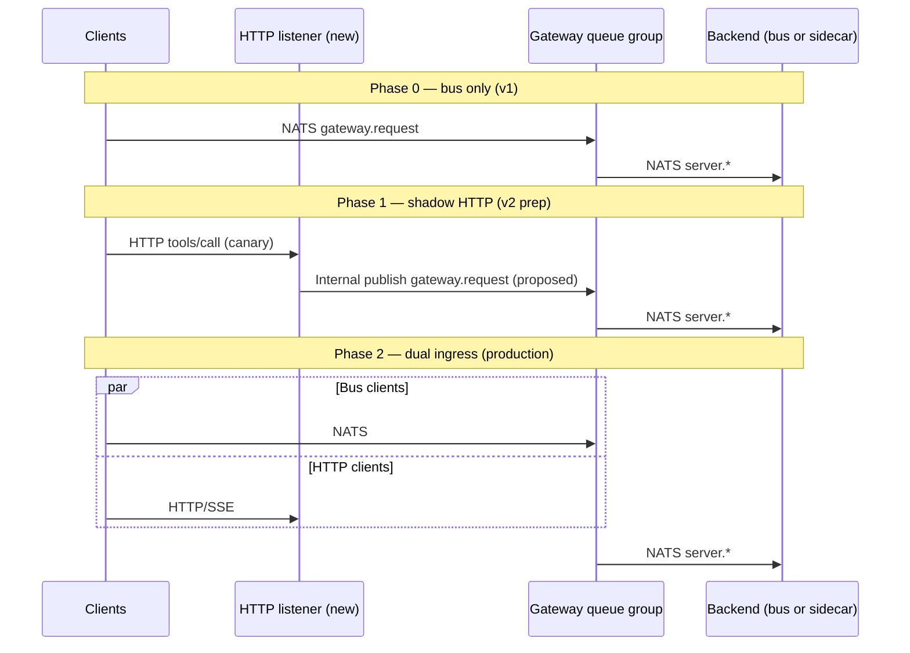

# On-bus vs. hybrid MCP gateway deployment

**Status:** Accepted decision (Block A, paper, 2026-05-28). Resolves the open item in [MCP_GATEWAY_PLAN.md](../../MCP_GATEWAY_PLAN.md) Block A — *on-bus vs. hybrid deployment shape*.

**Diátaxis:** [Explanation](#explanation) (why the fork exists and what each mode means) + [Decision](#decision) (recommendation, implications, migration).

**Related:** [Agent identity overview](overview.md) · [Integration touch-points](integration-touchpoints.md) · [OAuth 2.0 + MCP integration](oauth-mcp-integration.md) · [MCP gateway operator overview](mcp-gateway-operator-overview.md) · [Reference subject grammar](reference-subject-grammar.md) · [Reference audit envelope](reference-audit-envelope.md) · [How to integrate a third-party MCP server](howto-integrate-third-party-mcp.md)

---

## Explanation

### 1. The two modes defined

Trogon's MCP gateway is a **policy enforcement point** on JSON-RPC traffic. The strategic fork is not "whether the gateway exists" but **which transports terminate at the gateway edge** and **how backend MCP servers attach**. Both modes assume the gateway's internal control plane stays NATS-native: STS on `mcp.sts.exchange`, registry on `mcp.registry.agent.lookup`, JetStream audit on `{prefix}.audit.>`, SpiceDB over gRPC, and KV-backed session and policy state ([integration-touchpoints.md](integration-touchpoints.md)).

#### 1.1 On-bus only

In **on-bus only** mode, every MCP participant that the gateway fronts is a **NATS principal**. Clients publish to `{prefix}.gateway.request.{server_id}.{method_suffix}`; the gateway queue group consumes, evaluates policy, and forwards to `{prefix}.server.{server_id}.{method_suffix}`; backends subscribe on the server lane only. Callback traffic uses `{prefix}.client.{client_id}.>` and `{prefix}.gateway.callback.{client_id}.>` per [reference-subject-grammar.md](reference-subject-grammar.md).

Third-party MCP servers that speak **stdio** or ship as local binaries do not connect to NATS directly. A **sidecar adapter** (today: operator-maintained `mcp-nats` server transport or the proposed `trogon-mcp-bridge serve-stdio`) subscribes to `{prefix}.server.{server_id}.>`, translates NATS JSON-RPC to stdio, and returns replies on the request inbox. The vendor binary never sees bootstrap NATS JWTs or client OAuth tokens; secrets stay in the sidecar environment ([howto-integrate-third-party-mcp.md](howto-integrate-third-party-mcp.md)).

Registry discovery announcements use `transport: stdio-sidecar` or `transport: nats-native` ([howto-integrate-third-party-mcp.md § Step 2](howto-integrate-third-party-mcp.md#step-2--place-the-server-on-the-bus)). There is **no** first-class HTTP/SSE listener on `trogon-mcp-gateway` for MCP JSON-RPC in v1 ([mcp-gateway-operator-overview.md § Topology](mcp-gateway-operator-overview.md#3-topology)).

```text
                    ON-BUS ONLY (v1 default)
  ┌─────────────┐         ┌──────────────────┐         ┌─────────────────┐
  │ MCP client  │  NATS   │ trogon-mcp-      │  NATS   │ Backend MCP     │
  │ (SDK/agent) │────────►│ gateway (queue)  │────────►│ server OR       │
  └─────────────┘         └──────────────────┘         │ stdio sidecar   │
        │                         │                    └────────┬────────┘
        │                         │                             │ stdio
        │                         ▼                             ▼
        │                  mcp.audit.>                  [vendor MCP binary]
        └──────────────── STS / registry / SpiceDB (all NATS-adjacent)
```

**Invariant:** one hot-path transport family (NATS request/reply + JetStream side channels). Perimeter identity is bootstrap NATS User JWT at CONNECT; mesh tokens on gated RPCs ([overview.md](overview.md), [ADR 0003](../adr/0003-bootstrap-vs-mesh-tokens.md)).

#### 1.2 Hybrid

In **hybrid** mode, the gateway retains the on-bus data plane for Trogon-native and sidecar-wrapped backends, and **additionally** exposes a **north-south HTTP listener** for MCP clients and servers that cannot adopt NATS. The listener implements MCP's HTTP transports — **Streamable HTTP** and/or **Server-Sent Events (SSE)** per the [MCP transport specification](https://modelcontextprotocol.io/specification/2025-11-25/basic/transports) — so remote third-party MCP servers and browser-adjacent clients can attach without a NATS client library.

Hybrid does **not** mean "backends over HTTP, clients over NATS only." It means **two ingress families** into the same policy engine:

| Ingress family | Wire | Typical caller | Backend egress |
|---|---|---|---|
| **East-west (bus)** | NATS `{prefix}.gateway.request.>` | `trogon-a2a-sdk`, agents with NATS creds | `{prefix}.server.{server_id}.>` |
| **North-south (HTTP)** | HTTPS + MCP Streamable HTTP / SSE | Browser tools, SaaS MCP, vendor HTTP-only servers | HTTP client to upstream **or** bus after adapter |

OAuth resource-server behavior (Protected Resource Metadata, `401` + `WWW-Authenticate`) attaches to the HTTP listener ([oauth-mcp-integration.md](oauth-mcp-integration.md)). NATS CONNECT still uses auth callout for bus clients; HTTP path validates bearer tokens at the gateway edge before the same STS → mesh → egress mint chain.

```text
                    HYBRID (v2 target shape)
  ┌─────────────┐  NATS    ┌──────────────────┐  NATS    ┌─────────────────┐
  │ Bus client  │─────────►│                  │─────────►│ On-bus backend  │
  └─────────────┘          │ trogon-mcp-      │          │ / sidecar       │
  ┌─────────────┐  HTTP    │ gateway          │  HTTP    └─────────────────┘
  │ HTTP MCP    │─────────►│ + HTTP listener  │─────────►┌─────────────────┐
  │ client/srv  │  SSE     │ (north-south)    │  (opt.)  │ Remote HTTP MCP │
  └─────────────┘          └──────────────────┘          └─────────────────┘
```

**Proposed** HTTP route prefix and handler crate split are intentionally **not** named here; no HTTP ingress routes exist in `trogon-mcp-gateway` today. v2 design must add them as a separate ADR once a design partner specifies required MCP HTTP profile.

#### 1.3 Terminology alignment

| Term | Meaning in this document |
|---|---|
| **On-bus** | MCP JSON-RPC carried on NATS subjects under `{prefix}.gateway.*` / `{prefix}.server.*` |
| **North-south** | Internet- or VPC-facing HTTP/SSE terminating at the gateway (hybrid only) |
| **Sidecar** | Process that bridges `{prefix}.server.{id}.>` ↔ stdio MCP; not the gateway itself |
| **http-bridge** | Registry `transport` value in [howto-integrate-third-party-mcp.md](howto-integrate-third-party-mcp.md) for remote HTTP upstream — today satisfied by `mcp-nats-server` or operator adapter, **not** gateway-embedded reverse proxy |

---

### 2. Why the question matters

The on-bus vs. hybrid choice is **irreversible for operator mental models** even if code can later add HTTP. It fixes which documents describe "supported" ingress, which compliance controls apply on day one, and how much subject grammar and audit schema we treat as complete.

#### 2.1 Policy enforcement surface

The gateway policy engine evaluates CEL + SpiceDB on JSON-RPC methods ([mcp-gateway-operator-overview.md § What the gateway enforces](mcp-gateway-operator-overview.md#5-what-the-gateway-enforces-and-why)). The **inputs** to that engine differ by ingress:

| Input dimension | On-bus | Hybrid (additional) |
|---|---|---|
| Caller identity | Bootstrap JWT claims + mesh JWT headers on NATS messages | OAuth bearer + optional mTLS client cert on HTTP |
| Routing key | `server_id` and method suffix parsed from NATS subject | URL path / route table mapping to `server_id` |
| Rate limiting | Per-connection NATS identity + `trogon-mcp-tenant` header ([rate-limiting.md](rate-limiting.md)) | Per-IP, per-API-key, per-route HTTP quotas (**proposed**) |
| Session affinity | JetStream KV `mcp-sessions` ([mcp-session-model.md](mcp-session-model.md)) | HTTP cookies / session tokens per MCP HTTP session (**proposed**) |

A dual-mode gateway must implement **one merged deny semantics**: the same `policy_id` hash and `decision_reason` on audit for equivalent calls whether the client used NATS or HTTP ([hierarchical-policy-merge.md](hierarchical-policy-merge.md)). Building HTTP later without this decision paper forces retroactive audit field design.

#### 2.2 Audit envelope and network metadata

Gateway audit today publishes to `{prefix}.audit.{outcome}.{direction}.{method_root}` with caller, tenant, rules fired, SpiceDB outcome, and `act_chain` ([reference-audit-envelope.md](reference-audit-envelope.md)). NATS ingress carries **connection-oriented** metadata (account, connection id, optional message headers). HTTP ingress carries **network-oriented** metadata that SIEM and adaptive-access rules expect for north-south abuse detection:

| Metadata class | On-bus (available today / planned) | Hybrid-only (**proposed** audit fields) |
|---|---|---|
| Source identity | NATS user, `sub`, `wkl` from mesh JWT | OAuth `sub`, `azp`, token `jti` |
| Network | NATS server cluster, optional `trogon-mcp-tenant` header | `client_ip`, `xff`, `tls_cipher`, `user_agent`, geo from edge |
| Transport | `transport: nats` (implicit) | `transport: http` \| `sse` |
| Correlation | JSON-RPC `id`, gateway `request_id` | + HTTP `traceparent`, request id header |

If v1 is on-bus only, the audit schema can defer HTTP-only fields without breaking cross-service dashboards. Choosing hybrid from day one requires extending [reference-audit-envelope.md](reference-audit-envelope.md) § common header before Phase 2 SIEM work ([agent-traffic.md](agent-traffic.md)).

#### 2.3 Trust-bundle model

Mesh token verification and SPIFFE attestation consume trust material from KV `mcp-trust-bundles/<trust-domain>` ([overview.md](overview.md), [ADR 0006](../adr/0006-mesh-token-signing-keys.md)). On-bus backends present **SVIDs to STS** via sidecar `actor_token`; HTTP-only third parties may never present SPIFFE at all.

| Trust posture | On-bus | Hybrid |
|---|---|---|
| Workload attestation | Expected for production agent paths (`MCP_STS_REQUIRE_ATTESTATION=1`) | HTTP servers may be attestable only at TLS layer unless Trogon operates the binary |
| Secret handling | Sidecar holds vendor API keys | Gateway HTTP egress client holds upstream tokens — larger blast radius |
| Federation | NATS account per tenant ([ADR 0001](../adr/0001-tenancy-model.md)) | + HTTP tenant routing (host/SNI/path) must map to same `tenant_id` |

Hybrid increases the number of **trust domains** the gateway operator must reason about: NATS account ACL, mesh JWT, and HTTP TLS + OAuth issuer trust chains.

#### 2.4 Load-balancer and multi-region story

On-bus HA is **NATS queue-group semantics**: any `trogon-mcp-gateway` replica may consume `{prefix}.gateway.request.>`; reply correlation uses per-instance `_INBOX.gateway.{instance_id}.>` ([mcp-gateway-operator-overview.md § On-bus model](mcp-gateway-operator-overview.md#4-the-on-bus-model-in-five-bullets)). Regional scaling is "more gateway pods + NATS cluster capacity"; sticky sessions are optional Phase 3 optimization backed by KV ([mcp-session-model.md](mcp-session-model.md)).

Hybrid adds **L7 load balancers** in front of HTTP listeners, WebSocket/SSE stickiness, and cross-region OAuth metadata replication ([oauth-mcp-integration.md § Discovery](oauth-mcp-integration.md#12-authorization-server-discovery)). Multi-region on-bus is already documented as an open registry/KV replication question ([registry.md](registry.md)); hybrid compounds it with **HTTP session state** and **IdP redirect URLs** per region.

#### 2.5 Vendor onboarding friction

Community MCP servers overwhelmingly ship **stdio** or **local HTTP** for IDE integration. Trogon's documented v1 path — sidecar to `{prefix}.server.{server_id}.>` — adds one container per server but avoids gateway HTTP complexity ([howto-integrate-third-party-mcp.md](howto-integrate-third-party-mcp.md)). Hybrid helps when:

- The vendor refuses to run any Trogon-managed process (pure SaaS MCP endpoint).
- The customer forbids NATS egress from certain networks (browser-only clients).
- MCP Authorization mandates HTTP resource-server behavior the customer will audit.

Hybrid hurts when operators must run **two** credential systems, two rate-limit configs, and two failure-mode matrices for the same `server_id`.

---

### 3. Pros, cons, and risks

#### 3.1 On-bus only

**Pros**

- **Single transport to harden.** Security reviews, pen tests, and SOC playbooks cover NATS TLS + auth callout + subject ACL only; no parallel HTTP attack surface on the gateway hot path.
- **Policy parity is trivial.** Every gated RPC is observed on the same subject grammar; CEL `nats.subject` variables match [reference-subject-grammar.md](reference-subject-grammar.md) without HTTP route indirection.
- **Lower tail latency.** No extra HTTP hop between gateway and backend when both are queue-group subscribers on the same cluster; STS and SpiceDB dominate P99, not protocol translation ([mcp-gateway-operator-overview.md](mcp-gateway-operator-overview.md)).
- **Operational model matches Phase 1 code.** `trogon-mcp-gateway` already implements queue-group ingress, inbox correlation, and egress rewrite — no axum listener, CORS, or SSE session lifecycle in-tree.
- **Third-party stdio servers remain first-class** via sidecar; this matches the majority of "MCP servers in the wild" today without requiring vendors to implement Streamable HTTP.

**Cons**

- **NATS client required for every bus participant.** Pure HTTP agents need an adapter (SDK or bridge) before they can call the gateway; cannot point Postman at MCP over HTTP on the gateway itself.
- **Per-server sidecar footprint.** Each stdio MCP server needs a bridge pod or process; large catalogs increase ops burden versus one HTTP reverse proxy.
- **SaaS MCP over HTTPS** requires `mcp-nats-server` or operator `http-bridge` adapter today — not an integrated gateway feature ([howto-integrate-third-party-mcp.md § Remote](howto-integrate-third-party-mcp.md#13-placement-topology)).
- **MCP OAuth HTTP resource-server profile** is specified against HTTP ingress ([oauth-mcp-integration.md](oauth-mcp-integration.md)); deferring HTTP delays full OAuth conformance for HTTP-only MCP clients.

**Risks**

- **Bridge supply chain.** Compromised sidecar equals compromised `{prefix}.server.{server_id}.>` subscriber; blast radius is per-server, but fleet size can be large.
- **Skill gap.** Teams strong on API gateways but weak on NATS may misconfigure subject ACL or queue groups, causing silent bypass (publish directly to `mcp.server.*`).
- **Vendor refusal.** A design partner that will not run a sidecar and will not grant Trogon a NATS client forces a v2 pivot — acceptable if v1 scope stays TrogonStack-native.

#### 3.2 Hybrid

**Pros**

- **Native MCP HTTP/SSE clients** attach without NATS libraries; aligns with MCP spec direction for remote servers and browser tooling.
- **Reduced sidecar fleet** for HTTP-native SaaS MCP — gateway can proxy Streamable HTTP to upstream with centralized secret injection (pattern exists in A2A `a2a-bridge` sketch, not MCP gateway today).
- **OAuth discovery endpoints** live on the same host as MCP HTTP ([oauth-mcp-integration.md](oauth-mcp-integration.md)) — cleaner customer-facing URL than "use NATS for MCP, use HTTPS for OAuth metadata only."
- **Regional L7 scaling** familiar to enterprise buyers already terminating TLS at ingress controllers.
- **Audit richness** for north-south abuse detection (IP reputation, geo velocity) when network metadata is populated.

**Cons**

- **Two transports to secure and test.** Every policy change needs NATS + HTTP regression; CI matrix doubles ([failure-mode-matrix.md](failure-mode-matrix.md) must gain HTTP rows).
- **HTTP listener obligations.** CORS, CSRF posture for browser clients, OAuth metadata routes, body size limits, SSE timeouts, and per-route rate limits become shipping criteria — not stretch goals.
- **Session model complexity.** MCP HTTP sessions do not map 1:1 to NATS queue-group delivery; KV session state plus HTTP stickiness must be designed together ([mcp-session-model.md](mcp-session-model.md)).
- **Latency stack.** Client → LB → gateway HTTP → (optional) STS → upstream HTTP MCP adds hops versus bus-local sidecar.
- **Doc and grammar drift.** [reference-subject-grammar.md](reference-subject-grammar.md) is NATS-complete; hybrid requires a parallel **HTTP route reference** and explicit subject mapping for audit.

**Risks**

- **Split-brain policy.** Ingress HTTP path accidentally skips SpiceDB or mesh mint while NATS path enforces — classic dual-stack bug class.
- **Secret concentration.** Upstream API keys in gateway HTTP egress pool versus isolated sidecar environments ([howto-integrate-third-party-mcp.md § Authentication](howto-integrate-third-party-mcp.md#12-authentication-the-server-expects)).
- **False confidence in "MCP compatible".** Shipping HTTP before Streamable HTTP / session semantics are validated against a real vendor yields spec drift.
- **Operational cost before demand.** Building hybrid without a paying design partner spreads Phase 2 capacity across HTTP infrastructure instead of catalog shaping, WASM policy, and decider integration.

---

## Decision

### 4. Recommendation

**Adopt on-bus only for v1.** Defer hybrid (gateway-embedded north-south HTTP/SSE MCP listener) to **v2**, gated on at least one design partner requirement that cannot be satisfied by sidecar or `mcp-nats-server` remote adapter.

**Argument (not assumption).** Phase 1 already proved the substrate on NATS: queue-group on `{prefix}.gateway.request.>`, SpiceDB on gated methods, mesh egress mint, JetStream audit. The product positioning in *The Take* is an **MCP-aware feature inside TrogonStack's event-modeling platform**, not a generic HTTP API gateway. Trogon's differentiated story is mesh identity (`act_chain`), NATS-native audit, and schema-driven redaction — all of which are transport-agnostic once JSON-RPC reaches the policy engine, but all of which are **already wired on the bus**.

Third-party MCP integration for v1 is satisfied by documented sidecar and `nats-native` paths ([howto-integrate-third-party-mcp.md](howto-integrate-third-party-mcp.md)). GitHub-, Notion-, and Linear-class servers in the wild are overwhelmingly stdio-first; operators accept one bridge pod per `server_id` when policy and audit are mandatory. Remote HTTP SaaS is covered without gateway HTTP by `http-bridge` / `mcp-nats-server` as an **operator-managed adapter** on the backend lane — keeping the gateway itself a single-transport chokepoint.

Hybrid becomes mandatory when a concrete partner blocks sidecar deployment **and** will not operate NATS, **or** when revenue requires browser-direct MCP with OAuth Protected Resource Metadata on the same hostname as tools. Until that signal exists, hybrid work competes with Block C/E items (session HA, hierarchical policy merge, failure-mode matrix) that apply to **all** customers on the bus. [ADR 0004](../adr/0004-sts-form-factor.md) already documents HTTP STS as a future option without requiring MCP JSON-RPC over HTTP in v1.

Security posture favors sequencing: one transport to fail-closed ([failure-mode-matrix.md](failure-mode-matrix.md)), one audit envelope without half-populated HTTP network fields, one operator overview diagram. The A2A program's `a2a-bridge` HTTPS sidecar ([docs/a2a/explanation/bridge-sketch.md](../a2a/explanation/bridge-sketch.md)) shows Trogon knows how to build north-south bridges — but A2A and MCP should not share a listener prematurely; MCP HTTP has distinct session and OAuth binding rules ([oauth-mcp-integration.md](oauth-mcp-integration.md)).

**v2 trigger checklist** (all need not fire at once; any two is enough to prioritize hybrid):

1. Signed design partner letter requiring HTTP MCP ingress without NATS client.
2. Revenue deal blocked on MCP Authorization HTTP resource-server on gateway hostname.
3. Sidecar fleet operational cost exceeds agreed SLO at >N servers per tenant (partner-specific N).
4. Competitive loss documented against HTTP-only MCP gateways with Trogon policy named as gap.

Until then, mark HTTP MCP ingress on `trogon-mcp-gateway` as **proposed / out of v1 scope** in dependent docs.

---

### 5. Decision implications

#### 5.1 If on-bus only (chosen for v1)

**What we lose**

- One-hop onboarding for HTTP-only MCP clients without any Trogon SDK or NATS bridge.
- Unified hostname for OAuth Protected Resource Metadata + MCP Streamable HTTP on the gateway (OAuth doc remains "target" for HTTP, not shipped v1 ingress).
- Centralized HTTP reverse-proxy secret injection for SaaS MCP — remains operator adapter responsibility.
- SIEM network-geo fields that depend on HTTP `client_ip` on the gateway audit envelope (deferred as **proposed** fields).

**What we keep simple**

- Subject grammar in [reference-subject-grammar.md](reference-subject-grammar.md) is the single routing source of truth; no parallel HTTP path table.
- [mcp-gateway-operator-overview.md](mcp-gateway-operator-overview.md) topology diagram stays accurate without "optional HTTP ear."
- NATS account ACL pairing (`gateway.request` publish for clients, `server.*` publish for gateway only) remains the enforcement backstop.
- Failure-mode and rate-limit papers scope to NATS dimensions only for v1.
- Trust bundles and SVID attestation story unchanged — no "HTTP backend without `wkl`" carve-out on the hot path.

**Documentation updates required (v1 hygiene)**

| Document | Change |
|---|---|
| [mcp-gateway-operator-overview.md](mcp-gateway-operator-overview.md) | State explicitly: HTTP MCP ingress **not supported v1**; sidecar is the third-party path. |
| [oauth-mcp-integration.md](oauth-mcp-integration.md) | Move HTTP listener sections to **v2 / proposed**; keep NATS CONNECT + auth callout as v1 OAuth composition. |
| [howto-integrate-third-party-mcp.md](howto-integrate-third-party-mcp.md) | Demote `http-bridge` to remote adapter pattern; remove implication that gateway terminates vendor HTTP. |
| [integration-touchpoints.md](integration-touchpoints.md) | No HTTP ingress row until v2; optional footnote pointing to this decision. |

Do **not** delete OAuth or HTTP transport research — v2 will reuse [oauth-mcp-integration.md](oauth-mcp-integration.md) verbatim with implementation tickets.

#### 5.2 If hybrid from day 1 (not chosen; reference for v2 design)

Had hybrid been selected for v1, the gateway HTTP listener would owe:

| Obligation | Rationale |
|---|---|
| **Authentication** | OAuth 2.1 bearer validation, RFC 9728 Protected Resource Metadata, RFC 8707 resource indicators ([oauth-mcp-integration.md](oauth-mcp-integration.md)) |
| **Authorization handoff** | Map OAuth identity → bootstrap claims → STS `subject_token`; same mesh mint on egress as NATS path |
| **CORS** | Browser MCP clients; deny-by-default origin list per tenant |
| **Rate limiting** | Per-IP and per-token buckets in addition to NATS connection limits ([rate-limiting.md](rate-limiting.md)) |
| **Body / SSE limits** | MCP Streamable HTTP framing; max JSON body; SSE idle timeout |
| **TLS termination contract** | Document cipher suites, mTLS option for enterprise, `X-Forwarded-For` trust boundary |
| **Audit** | Populate **proposed** `transport`, `client_ip`, `user_agent` in [reference-audit-envelope.md](reference-audit-envelope.md) |

**Specs requiring amendment**

| Spec | Amendment |
|---|---|
| [reference-subject-grammar.md](reference-subject-grammar.md) | Add § HTTP ingress routes → `{server_id}` mapping table; clarify audit subjects unchanged (still `{prefix}.audit.*`) |
| [reference-audit-envelope.md](reference-audit-envelope.md) | Normative HTTP network metadata block |
| [mcp-session-model.md](mcp-session-model.md) | HTTP session id binding to KV `mcp-sessions` |
| [oauth-mcp-integration.md](oauth-mcp-integration.md) | Promote from design spec to normative v2 |
| [failure-mode-matrix.md](failure-mode-matrix.md) | HTTP 502/504, OAuth metadata down, SSE disconnect mid-RPC |
| **proposed:** `reference-http-route-grammar.md` | New Diátaxis reference if route count > ~20 |

---

### 6. Migration path

Tenants may need to move **on-bus → hybrid** (enable HTTP clients) or **hybrid → on-bus** (retire HTTP edge). Design for **no hard traffic drop** using parallel ingress and shared backend identity.

#### 6.1 On-bus → hybrid (v2 enablement)



| Step | Action | Traffic impact |
|---|---|---|
| 0 | Keep `server_id` stable; register `transport: nats-native` or `stdio-sidecar` unchanged | None |
| 1 | Deploy gateway build with HTTP listener **disabled by default** (`MCP_GATEWAY_HTTP_LISTEN=0` **proposed** env) | None |
| 2 | Enable HTTP on canary gateway instances behind dedicated LB; bus clients unchanged | Canary HTTP only |
| 3 | Map HTTP routes to same `server_id` and SpiceDB tuples as NATS subjects | Policy parity testing |
| 4 | Shift client SDKs to HTTP where required; keep NATS for agents | Gradual |
| 5 | Decommission per-server HTTP adapters that duplicated gateway proxy | Reduced ops |

**Identity continuity:** `urn:trogon:mcp:gateway:{tenant}:{gateway_instance_id}` audience stays stable; HTTP clients obtain mesh tokens via STS with OAuth `subject_token` same as NATS bootstrap path ([oauth-mcp-integration.md § Mental model](oauth-mcp-integration.md#mental-model)). Session KV records gain optional `ingress_transport` field (**proposed**).

#### 6.2 Hybrid → on-bus (contraction)

| Step | Action | Traffic impact |
|---|---|---|
| 1 | Announce maintenance; freeze new HTTP client registrations | — |
| 2 | Deploy NATS SDK/bridge to each HTTP-only client; verify parity on shadow subjects | Dual-write period |
| 3 | Drain HTTP listener via LB weight → 0 | HTTP drained |
| 4 | Remove HTTP routes; revert docs to on-bus-only | — |
| 5 | Move SaaS upstream secrets from gateway vault to sidecar `http-bridge` if still needed | — |

**Rollback:** Re-enable HTTP listener weight if NATS migration stalls; bus path remains authoritative throughout because v1 never removed it.

#### 6.3 Backend migration without ingress change

Switching **stdio sidecar → nats-native server** does not change the deployment mode decision — both are on-bus. Procedure remains [howto-integrate-third-party-mcp.md § Option B](howto-integrate-third-party-mcp.md#option-b--central-nats-native-server): register new transport, dual-run subjects under temporary `server_id` suffix if needed, cut over gateway config KV, deprecate old bridge.

---

### 7. Cross-references

| Document | Relevance |
|---|---|
| [overview.md](overview.md) | Bootstrap vs mesh, audience URIs, failure modes — apply to both modes at policy layer |
| [integration-touchpoints.md](integration-touchpoints.md) | NATS subjects and KV buckets; v1 scope boundary |
| [oauth-mcp-integration.md](oauth-mcp-integration.md) | HTTP OAuth surface — v2 hybrid enabler, v1 NATS CONNECT composition |
| [mcp-gateway-operator-overview.md](mcp-gateway-operator-overview.md) | Default on-bus topology (§3–4) |
| [reference-subject-grammar.md](reference-subject-grammar.md) | Authoritative `{prefix}.gateway.request` / `{prefix}.server` grammar |
| [reference-audit-envelope.md](reference-audit-envelope.md) | Audit families; HTTP metadata **proposed** |
| [howto-integrate-third-party-mcp.md](howto-integrate-third-party-mcp.md) | v1 third-party path via sidecar |
| [ADR 0001](../adr/0001-tenancy-model.md) | Account-per-tenant vs hybrid HTTP routing |
| [ADR 0004](../adr/0004-sts-form-factor.md) | NATS-first STS; HTTP STS facade optional later |

---

## Appendix A — Decision record

| Field | Value |
|---|---|
| **Decision** | On-bus only for v1; hybrid in v2 with design partner trigger |
| **Date** | 2026-05-28 |
| **Deciders** | Block A paper swarm (agent task) |
| **Review by** | Before first HTTP listener PR: platform security + SRE sign-off |

---

## Appendix B — Comparison matrix

| Criterion | On-bus only (v1) | Hybrid (v2) |
|---|---|---|
| Gateway ingress transports | NATS | NATS + HTTP/SSE |
| Third-party stdio MCP | Sidecar on `{prefix}.server.{id}.>` | Same (unchanged) |
| Third-party HTTP SaaS MCP | Operator `http-bridge` / `mcp-nats-server` | Optional gateway reverse proxy |
| OAuth resource server on gateway | No (CONNECT callout only) | Yes (HTTP path) |
| Audit network metadata | NATS-oriented | + HTTP **proposed** fields |
| Phase 1 code alignment | Full | Partial — requires new crate surface |
| Primary ops skill | NATS ACL + queue groups | NATS + L7 ingress + CORS |

---

## Appendix C — FAQ

**Does on-bus mean Trogon-native servers only?**

No. Third-party servers are on-bus when a sidecar or remote adapter subscribes to `{prefix}.server.{server_id}.>`. "On-bus" describes the **gateway-facing** transport, not the vendor's internal stdio.

**Is STS over HTTP required for on-bus?**

No. v1 STS remains `mcp.sts.exchange` ([sts-exchange.md](sts-exchange.md)). [ADR 0004](../adr/0004-sts-form-factor.md) HTTP facade is independent of MCP JSON-RPC HTTP ingress.

**Can a tenant run hybrid externally without Trogon gateway HTTP?**

Yes — an operator-managed HTTP→NATS bridge in front of the cluster is **not** Trogon hybrid mode; it is a customer integration pattern. Trogon hybrid specifically means **`trogon-mcp-gateway` terminates MCP HTTP** with unified policy and audit.

**What about `mcp-nats-server` Streamable HTTP?**

That crate exposes MCP over HTTP **to NATS**, not gateway policy. It remains a valid backend adapter under on-bus-only v1 ([howto-integrate-third-party-mcp.md § Prerequisites](howto-integrate-third-party-mcp.md#prerequisites)).

**Does this block OAuth work?**

OAuth composition at NATS CONNECT is in scope for v1 ([oauth-mcp-integration.md](oauth-mcp-integration.md)). HTTP OAuth discovery endpoints on the gateway wait for v2 hybrid.

---

*End of document. Line count target: 350–600 (explanation + decision for Block A).*
