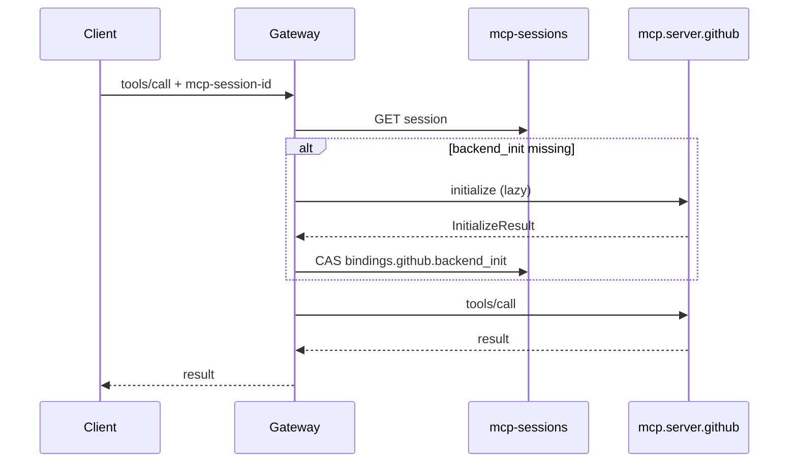
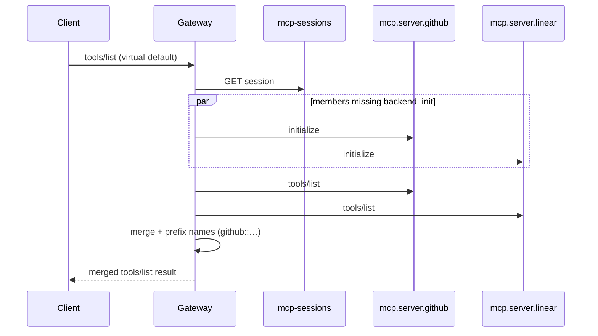
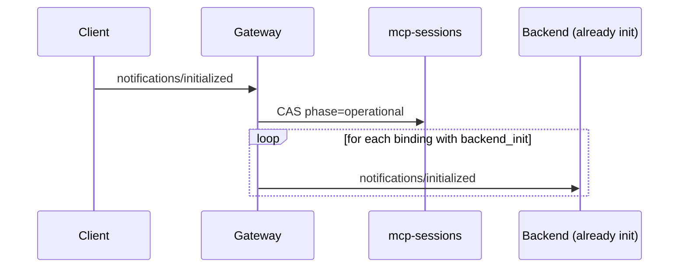

# MCP `initialize` handshake reference

**Diátaxis:** reference (field shapes, headers, KV keys) + explanation (why gateway-terminated init and lazy backend forward).

**Status banner:** Phase 1 contract. Gateway-terminated by default. Backends are lazy-initialized.

**Related:** [MCP session model](mcp-session-model.md) · [Reference subject grammar](reference-subject-grammar.md) · [MCP gateway plan](../../MCP_GATEWAY_PLAN.md) § Wire-Format Pins (pin 5) · [Reply correlation](reply-correlation.md) · [Tools/list filtering](tools-list-filtering.md)

**Implementation note:** Session KV and gateway-terminated `initialize` are specified here and in [mcp-session-model.md](mcp-session-model.md); they are **not** fully implemented in `trogon-mcp-gateway` yet. Wire pins that already exist in code include `mcp-session-id` header constant (`trogon-mcp-gateway/src/egress/cache.rs`) and ingress subject suffix `initialize` (`mcp-nats` transport mapping).

---

## 1. Contract summary

| Layer | Who answers `initialize`? | When backends see `initialize` |
|---|---|---|
| Client ↔ gateway (edge) | Gateway | Immediately on first `initialize` RPC |
| Gateway ↔ backend (`mcp.server.{id}.initialize`) | Each backend, lazily | First method call that routes to that backend (or parallel fan-out before virtual `tools/list` merge) |

The client always negotiates capabilities with the **gateway** implementation (`trogon-mcp-gateway`). Backend `InitializeResult` values are cached per `(session, server_id)` and are not re-exposed to the client unless the session is torn down and a new edge `initialize` runs.

Authoritative plan text ([MCP_GATEWAY_PLAN.md](../../MCP_GATEWAY_PLAN.md) § Wire-Format Pins, item 5):

> **Gateway-terminated by default.** The gateway answers `initialize` itself; the client sees the gateway as the MCP server.
>
> - Gateway returns its own `serverInfo` (name `trogon-mcp-gateway`, version) and an aggregated `capabilities` object reflecting the **union** of features the federation supports — `tools`, `resources`, `prompts`, `logging`, `completions`, `sampling`, `elicitation`, etc.
> - Client's `clientInfo` and `protocolVersion` are recorded in the session KV under the issued `mcp-session-id`.
> - For **non-virtual** targets, the gateway lazily forwards an `initialize` to the chosen backend on first method call so the backend can do per-session setup. The backend response is recorded in the session KV; subsequent calls reuse it.
> - For **virtual** targets, the gateway lazily initializes each federation member on first call to that member. Members not yet initialized when `tools/list` runs are initialized in parallel before the merge.
>
> The lazy-forward keeps `initialize` cheap (no fan-out for clients that never call anything) while still giving backends a chance to do session setup before real work hits them.

---

## 2. Gateway-terminated handshake

### 2.1 Edge ingress

| Item | Value |
|---|---|
| JSON-RPC method | `initialize` |
| NATS subject | `{prefix}.gateway.request.{server_id}.initialize` |
| Queue group | `mcp-gateway` (default; env `MCP_GATEWAY_QUEUE_GROUP`) |
| Required headers (post-auth) | `traceparent` recommended; `mcp-session-id` **absent** on first init |
| Reply | Client-chosen inbox; gateway responds with `InitializeResult` JSON-RPC result |

The gateway **does not** forward the client's `initialize` to `mcp.server.{server_id}.initialize` during the edge handshake. That keeps session creation O(1) with respect to backend count and avoids warming backends for clients that only probe capabilities and disconnect.

### 2.2 What the client observes

From the MCP lifecycle perspective, the gateway is the MCP **server**:

1. Client sends `initialize` (must be first request on the connection / subject stream).
2. Gateway returns `InitializeResult` and sets response header **`mcp-session-id`** (Trogon binding of MCP `MCP-Session-Id`).
3. Client sends `notifications/initialized` (no JSON-RPC `id`).
4. Operation-phase methods include `mcp-session-id` on every subsequent edge message.

See [mcp-session-model.md § What MCP considers a session](mcp-session-model.md#what-mcp-considers-a-session) for spec-aligned lifecycle wording.

### 2.3 Gateway-side steps (normative)

On each edge `initialize`:

1. Validate JWT / auth-callout outcome; derive `tenant`, `caller_sub`, `client_id` (logical callback identity for `mcp.client.{client_id}.*`).
2. Mint opaque `session_id` (`[A-Za-z0-9._~-]+`, max 128 chars).
3. Negotiate `protocolVersion` with client params (gateway supports a configured allow-list; responds with the chosen revision).
4. Build gateway `InitializeResult` (`serverInfo`, `capabilities`, optional `instructions`).
5. **`PUT`** session record to JetStream KV (§5); `phase = initializing`.
6. Publish audit `mcp.audit.allow.request.initialize` (or deny/error on failure).
7. Respond to client inbox with result body + `mcp-session-id` header.

Re-`initialize` on an active connection without explicit close **mints a new** `session_id` (MCP re-init semantics; [mcp-session-model.md](mcp-session-model.md) failure matrix).

---

## 3. Returned `serverInfo`

Pinned shape for the edge `InitializeResult.serverInfo` object (MCP `Implementation`):

```json
{
  "name": "trogon-mcp-gateway",
  "version": "0.42.0"
}
```

| Field | Type | Required | Semantics |
|---|---|---|---|
| `name` | string | yes | Constant `"trogon-mcp-gateway"` (matches service telemetry name `trogon-telemetry::ServiceName::TrogonMcpGateway` and default JWT audience `trogon-mcp-gateway`) |
| `version` | string | yes | Gateway **build version** at process start |

**Version source (proposed):** `CARGO_PKG_VERSION` from the `trogon-mcp-gateway` crate, optionally suffixed with git SHA when built with `VERGEN_GIT_SHA`. Operators may override via env **`MCP_GATEWAY_SERVER_VERSION`** for reproducible support bundles. The value returned to the client MUST match `gateway.server_info.version` stored in session KV (§5).

Optional MCP field `instructions` (human-readable server guidance) MAY be set from bundle config (`gateway.instructions` in `mcp-gateway-config` KV). When absent, omit the key.

Backend `serverInfo` from lazy init is stored under `bindings.{server_id}.backend_init` only; it MUST NOT replace the client-visible `serverInfo` on later RPCs.

---

## 4. Returned `capabilities`

### 4.1 Aggregate feature set

The gateway advertises support for federation-level MCP surfaces by returning a `capabilities` object whose **top-level keys** include (when configured for the target):

| Capability key | Typical nested flags (MCP) | Included when |
|---|---|---|
| `tools` | `listChanged` | Target routes `tools/*` or virtual member exposes tools |
| `resources` | `subscribe`, `listChanged` | Target routes `resources/*` or member exposes resources |
| `prompts` | `listChanged` | Target routes `prompts/*` |
| `logging` | `{}` (empty object) | Gateway implements `logging/setLevel` forwarding |
| `completions` | `{}` | Target or member exposes `completion/complete` |
| `sampling` | `{}` | Client advertised `sampling` **and** policy allows server→client callbacks |
| `elicitation` | `{}` | Client advertised `elicitation` **and** policy allows callbacks |

Exact nested flags MAY be copied from bundle static config for the gateway role plus member metadata for `virtual-{id}` targets. Keys with no supporting route in the bundle MUST be omitted (not `null`).

### 4.2 Union vs intersection (explanation)

Two aggregation strategies appear in gateway literature:

| Strategy | Client sees | Risk |
|---|---|---|
| **Intersection (conservative)** | Only features every backend implements | Under-reports: client hides UI for tools one member could serve |
| **Union (liberal)** | Feature if **any** backend or gateway route supports it | Over-reports: client may call a method the routed backend rejects |

Phase 1 pins **union** at the plan level:

> aggregated `capabilities` object reflecting the **union** of features the federation supports

**Why union:** MCP clients gate UX and callback handlers on server capabilities at init time. A federated gateway that answered with intersection would hide tools from members the client never calls, breaking virtual `tools/list` merges and forcing premature capability renegotiation. The gateway already enforces authorization on each method (`tools/call`, callbacks, etc.); capability advertisement is a **catalog of what the mesh might offer**, not a per-backend guarantee.

**Safety boundary:** Union is advertisement only; unsupported paths fail at route time (`-32103` or MCP method errors). **proposed:** intersect nested flags (e.g. `tools.listChanged`) when all members are known statically.

### 4.3 Example edge capabilities payload

```json
{
  "tools": { "listChanged": true },
  "resources": { "subscribe": true, "listChanged": true },
  "prompts": { "listChanged": true },
  "logging": {},
  "completions": {},
  "sampling": {},
  "elicitation": {}
}
```

Stored verbatim on the session record as `gateway.capabilities_aggregate` ([mcp-session-model.md](mcp-session-model.md) § Value JSON schema).

### 4.4 `protocolVersion` in the result

`InitializeResult.protocolVersion` MUST be the negotiated revision (single string), not an array. The gateway selects the newest mutually supported version from its allow-list and the client's `initialize.params.protocolVersion`. That value is persisted as `client.protocol_version` in KV.

---

## 5. Recorded session state

### 5.1 KV bucket

| Property | Value | Pin status |
|---|---|---|
| Bucket name | `mcp-sessions` | **proposed** — cited in [MCP_GATEWAY_PLAN.md](../../MCP_GATEWAY_PLAN.md) § Session correlation, [reference-subject-grammar.md §7.4](reference-subject-grammar.md#74-proposed-buckets), [mcp-session-model.md](mcp-session-model.md); **not** provisioned in gateway code yet |
| Key (soft tenancy) | `{tenant}.{session_id}` | **proposed** |
| Key (hard tenancy) | `{session_id}` | **proposed** |
| Schema | `trogon.mcp.session/v1` | **proposed** |

Grep across the repo shows `mcp-sessions` only in documentation and operator guides — no Rust constant yet. Treat the bucket name as a **design pin**, not an implemented bucket.

### 5.2 Fields written at edge `initialize`

Minimum client context persisted before responding:

| Session path | Source (`initialize.params`) |
|---|---|
| `client.protocol_version` | `protocolVersion` |
| `client.client_info` | `clientInfo` (`name`, `version`, …) |
| `client.capabilities` | `capabilities` (client-side object) |
| `client.client_id` | Derived from JWT / bridge config (not a param field) |
| `client.caller_sub` | JWT `sub` |
| `gateway.server_info` | §3 |
| `gateway.capabilities_aggregate` | §4 |
| `gateway.instance_id_init` | Processing replica NUID |
| `phase` | `initializing` until `notifications/initialized` or first operational RPC |

Header issued to client: `mcp-session-id: {session_id}` — authoritative for all later edge messages ([MCP_GATEWAY_PLAN.md](../../MCP_GATEWAY_PLAN.md) § Wire-Format Pins, header table).

### 5.3 Backend init slots

Per-backend lazy state lives under `bindings.{server_id}`:

| Field | When set |
|---|---|
| `backend_init` | After successful lazy `mcp.server.{server_id}.initialize` |
| `backend_init_pending` | `true` during in-flight lazy init (CAS guard) |

See full record example in [mcp-session-model.md § Value JSON schema](mcp-session-model.md#value-json-schema-trogondmcpessionv1).

---

## 6. Lazy forward — non-virtual targets

For `{server_id}` that maps 1:1 to a backend (e.g. `github`, not `virtual-default`):

| Trigger | Action |
|---|---|
| First operational RPC needing backend `github` | If `bindings.github.backend_init` is null, gateway publishes `mcp.server.github.initialize` with pass-through params (§8) |
| Success | Store full backend `InitializeResult` in `bindings.github.backend_init`; clear `backend_init_pending` |
| Later RPCs | Reuse cached init; do not re-send `initialize` unless session closed or backend generation bumped |
| Concurrent first calls | One winner performs init; others await CAS on `backend_init_pending` or retry KV read |



**Why lazy:** Backends may allocate session-scoped resources (schema cache, OAuth refresh handles, ZedToken scope). Eager fan-out on every edge `initialize` would multiply NATS traffic for idle sessions and couples edge init latency to slowest backend.

Subject rewrite for lazy init: `{prefix}.server.{server_id}.initialize` ([reference-subject-grammar.md](reference-subject-grammar.md), `mcp-nats` `InitializeSubject`).

---

## 7. Lazy forward — virtual targets

For federated `server_id` values `virtual-{id}` ([MCP_GATEWAY_PLAN.md](../../MCP_GATEWAY_PLAN.md) § Virtual MCP in subjects):

| Trigger | Lazy init scope |
|---|---|
| `tools/call` with `params.name = "github::create_issue"` | Initialize **only** member `github` if not yet in `bindings.github` |
| `tools/list` on virtual target | **Parallel** `initialize` to every federation member that lacks `backend_init` **before** merging tool lists |
| `resources/list`, `prompts/list`, … | Same parallel pattern per method fan-out plan |

Virtual tool naming uses `::` separator (pin 4 in plan). Split on **first** `::` only when routing `tools/call`.



Member init uses the **same** client params snapshot from session KV (§8), not the virtual server's edge `initialize` payload again.

---

## 8. `initialize` parameters — pass-through and forbidden edits

When the gateway forwards lazy `initialize` to `mcp.server.{backend_id}.initialize`, it MUST send the MCP request:

```json
{
  "jsonrpc": "2.0",
  "id": "<gateway-generated>",
  "method": "initialize",
  "params": {
    "protocolVersion": "<from session client.protocol_version>",
    "capabilities": <from session client.capabilities>,
    "clientInfo": <from session client.client_info>
  }
}
```

| Parameter | Gateway behavior |
|---|---|
| `protocolVersion` | Pass through unchanged from session record (edge negotiation already validated) |
| `capabilities` | Pass through unchanged (client advertisement) |
| `clientInfo` | Pass through unchanged |
| `_meta` | Pass through if present on original edge init; store in session if needed for progress tokens |

**Forbidden modifications:** The gateway MUST NOT rewrite client capability flags, substitute a different `clientInfo`, or downgrade `protocolVersion` for backend init. Policy that needs to hide client features belongs in egress JWT claims and method-level gates, not in falsified init params (backends may audit `clientInfo` for support contracts).

**Gateway-added context (not in JSON-RPC params):** NATS headers on backend init per [MCP_GATEWAY_PLAN.md](../../MCP_GATEWAY_PLAN.md) § Wire-Format Pins §1: `mcp-session-id`, `mcp-caller-sub`, `mcp-tenant`, `mcp-instance-id`, `traceparent`, `mcp-schema`, etc. Ingress hardening strips client-forged identity headers before lazy forward.

---

## 9. `notifications/initialized`

| Aspect | Behavior |
|---|---|
| Edge subject | `{prefix}.gateway.request.{server_id}.notifications.initialized` |
| Reply | None (notification) |
| Session KV | Transition `phase` from `initializing` to `operational` |
| Backend fan-out | Forward to **each backend** that already has `bindings.{id}.backend_init` set |

Backends **not** yet lazy-initialized MUST NOT receive `notifications/initialized`:

- MCP requires init before operation; delivering `initialized` before a backend's own `initialize`/`InitializeResult` exchange violates server lifecycle expectations.
- Those backends will observe only the lazy `initialize` request/response pair when first used; no retroactive `initialized` is sent.



If the client skips `notifications/initialized` but sends an operational RPC, the gateway MAY promote `phase=operational` on first such RPC and log `session_initialized_implicit` (operator visibility; [mcp-session-model.md](mcp-session-model.md) TTL table).

---

## 10. Errors, audit, consumers

| Condition | Outcome |
|---|---|
| KV down on edge init | `-32101` / `-32107` **(proposed)** — [failure-mode-matrix.md](failure-mode-matrix.md) row 12 |
| Auth failure | `-32106` or ingress deny |
| Duplicate edge init **(proposed)** | Reuse `mcp-session-id` — [reply-correlation.md](reply-correlation.md) |
| Lazy init timeout / unreachable | `-32102` / `-32103` |

Audit: `mcp.audit.{allow|deny}.request.initialize`; lazy backend init adds `subject_out=mcp.server.{id}.initialize`. Spans **(proposed):** `mcp.session.initialize` ([mcp-session-model.md](mcp-session-model.md)).

Bridges MUST read and echo `mcp-session-id`; backends MUST expect lazy init with unmodified client params.

---

## 11. Cross-reference index

| Topic | Document |
|---|---|
| Session KV schema, HA, phase machine | [mcp-session-model.md](mcp-session-model.md) |
| Subject `…initialize`, `…notifications.initialized` | [reference-subject-grammar.md](reference-subject-grammar.md) |
| Wire-Format Pin 5 (authoritative) | [MCP_GATEWAY_PLAN.md](../../MCP_GATEWAY_PLAN.md) — § Wire-Format Pins, item 5 |
| Virtual `::` tool names | [MCP_GATEWAY_PLAN.md](../../MCP_GATEWAY_PLAN.md) — § Wire-Format Pins, item 4 |
| `mcp-session-id` header | [MCP_GATEWAY_PLAN.md](../../MCP_GATEWAY_PLAN.md) — § Wire-Format Pins, item 1 |
| Session correlation bucket | [MCP_GATEWAY_PLAN.md](../../MCP_GATEWAY_PLAN.md) — § Session correlation |
| Dedup / initialize class | [reply-correlation.md](reply-correlation.md) |
| Virtual `tools/list` fan-out | [tools-list-filtering.md](tools-list-filtering.md), plan Block E / federation sections |

---

## 12. Quick lookup

| Layer | Subject | KV |
|---|---|---|
| Edge init | `mcp.gateway.request.{server_id}.initialize` | Client + gateway metadata |
| Lazy backend | `mcp.server.{backend_id}.initialize` | `bindings.{id}.backend_init` |

| Phase | `mcp-session-id` |
|---|---|
| Edge `initialize` | Absent |
| After init response | Required on client messages |
| Lazy backend init | Gateway sets (same session) |

| Capability pin | **Union** for advertisement; enforcement at route/policy; client params pass-through unchanged |
