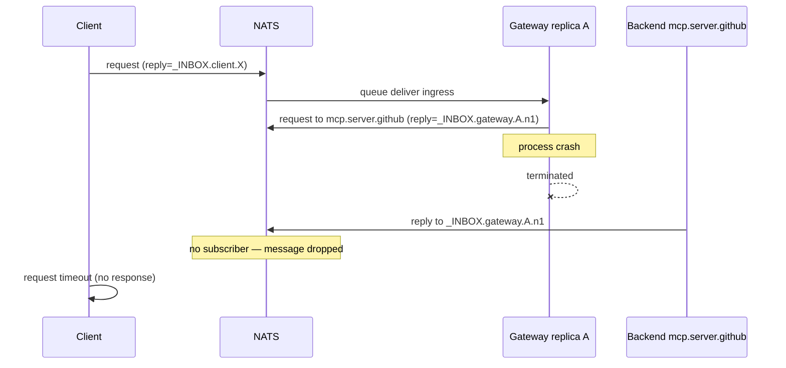
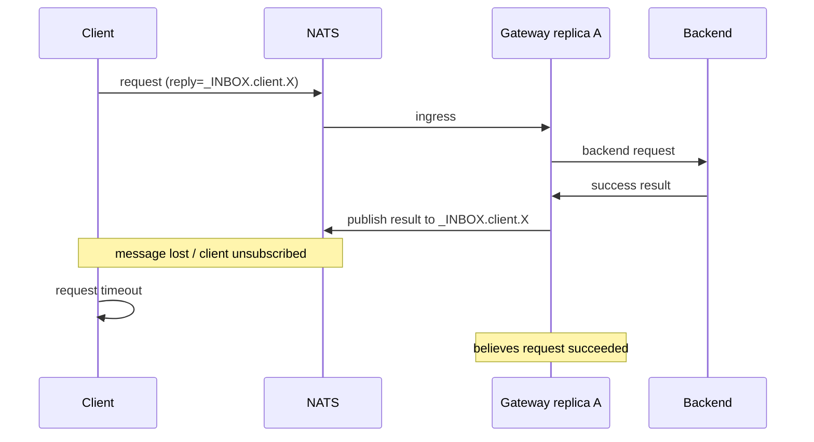
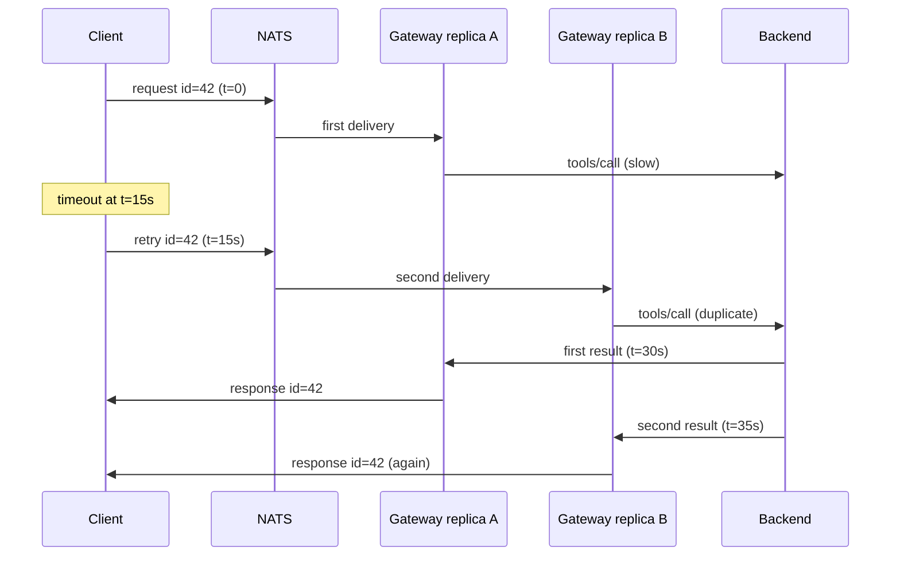

# Reply correlation in queue-group workers

**Status:** Block B paper artifact (2026-05-28). Irreversible decision for how MCP gateway replies return to the same caller under HA queue-group load balancing.

**Document type:** Diátaxis **explanation** (why queue-group workers break naive reply routing, failure modes, strategy trade-offs) plus **reference** (headers, dedup contract, metrics, idempotency table).

**Related:** [MCP session model](mcp-session-model.md), [Failure-mode matrix](failure-mode-matrix.md), [Reference subject grammar](reference-subject-grammar.md), [MCP gateway operator overview](mcp-gateway-operator-overview.md)(Reply correlation mechanism), Block D Phase 1 (shipped substrate), § Reply inbox naming, § Wire-Format Pins.

**Implementation target:** `rsworkspace/crates/trogon-mcp-gateway` Phase 2 (per-instance inbox subscription and dedup store). Phase 1 behaviour is documented as **(today)** throughout.

---

## Why this document exists

The Trogon MCP gateway is a **queue-group worker**: NATS delivers each ingress message to any healthy replica subscribed under `mcp-gateway`. MCP clients, however, expect **request/reply semantics** — a JSON-RPC call with an `id` must receive exactly one matching response on the reply subject they attached to the publish.

That asymmetry is an irreversible architectural decision. Before changing the reply path, operators and implementers need a written contract for:

- how replies are correlated today and in the target architecture;
- what happens when a replica dies, a reply is dropped, or a client retries;
- where duplicate suppression lives and for how long;
- what the gateway promises about idempotency to callers.

Session state (initialize context, ZedToken cache) is covered in [mcp-session-model.md](mcp-session-model.md). **This document covers single-request reply correlation only** — the in-flight map from gateway-side backend inbox back to the client's `_INBOX.*`.

---

## 1. The model today

### 1.1 Grep summary (`trogon-mcp-gateway`)

The task spec asks for `inbox`, `reply_to`, and `respond_to` across the gateway crate. Results:

| Identifier | Occurrences in `trogon-mcp-gateway` | Notes |
|---|---|---|
| `inbox` | **0** | Per-instance `_INBOX.gateway.{instance_id}` is specified in the plan and operator overview but **not implemented** in Rust yet. |
| `reply_to` | **0** | Gateway uses NATS `Message.reply` (`Option<Subject>`), not a local variable named `reply_to`. |
| `respond_to` | **0** | Error replies use `reply_with_jsonrpc_error` / `respond_with_jsonrpc_error` (see below). |

The live reply path is expressed through **`msg.reply`** (NATS request/reply inbox token set by the client library on publish) and helper functions that publish back to that subject.

### 1.2 Phase 1 ingress path (shipped)

Queue-group subscription and ingress handling:

```70:74:rsworkspace/crates/trogon-mcp-gateway/src/gateway.rs
    let subject = format!("{}.gateway.request.>", settings.mcp.prefix_str());
    let mut subscription = client
        .queue_subscribe(subject.clone(), settings.queue_group.clone())
        .await
        .map_err(|e| GatewayError(e.to_string()))?;
```

JSON-RPC correlation id extraction (audit and trace only today — not reply routing):

```647:649:rsworkspace/crates/trogon-mcp-gateway/src/gateway.rs
fn jsonrpc_request_id(payload: &[u8]) -> Option<serde_json::Value> {
    let value: serde_json::Value = serde_json::from_slice(payload).ok()?;
    value.get("id").cloned()
```

**Branch A — no reply subject (fire-and-forget publish):**

```419:436:rsworkspace/crates/trogon-mcp-gateway/src/gateway.rs
    if msg.reply.is_none() {
        client
            .publish_with_headers(backend_subject.clone(), outbound_headers, msg.payload.clone())
            .await
            .map_err(|e| GatewayError(e.to_string()))?;
        client.flush().await.map_err(|e| GatewayError(e.to_string()))?;

        publish_allow_audit_and_maybe_trace_no_reply(
            jetstream,
            prefix,
            &msg,
            &backend_subject,
            &jsonrpc_method,
            &gateway_identity,
            request_id.clone(),
        )
        .await;
        return Ok(());
    }
```

**Branch B — reply expected (synchronous request path):**

The worker blocks on a single NATS `request_with_headers` to the backend lane, then forwards the backend payload to the **same** `msg.reply` the client supplied:

```439:444:rsworkspace/crates/trogon-mcp-gateway/src/gateway.rs
    let timeout = settings.mcp.operation_timeout();
    let backend_result = tokio::time::timeout(
        timeout,
        client.request_with_headers(backend_subject.clone(), outbound_headers, msg.payload.clone()),
    )
    .await;
```

Success path — publish backend bytes to client inbox:

```744:757:rsworkspace/crates/trogon-mcp-gateway/src/gateway.rs
async fn dispatch_backend_response(
    client: &async_nats::Client,
    ingress: &Message,
    payload: Bytes,
) -> Result<(), GatewayError> {
    let Some(reply) = ingress.reply.clone() else {
        return Err(GatewayError("missing reply subject for JSON-RPC request path".into()));
    };
    client
        .publish_with_headers(reply.to_string(), ingress.headers.clone().unwrap_or_default(), payload)
        .await
        .map_err(|e| GatewayError(e.to_string()))?;
    client.flush().await.map_err(|e| GatewayError(e.to_string()))?;
    Ok(())
}
```

Error and deny paths publish JSON-RPC errors to `ingress.reply` via `reply_with_jsonrpc_error` (`gateway.rs:596-607`, `760-792`). Timeout and backend-unreachable branches call `respond_with_jsonrpc_error` with `-32102` / `-32103` (`gateway.rs:495-504`).

E2E harness (`tests/e2e_nats_forward.rs:46-54`, `96-103`): client `request_with_headers` on ingress; backend echoes to `msg.reply`; gateway returns result on client inbox.

### 1.3 Target architecture (plan — not yet in code)

[MCP_GATEWAY_PLAN.md](../../MCP_GATEWAY_PLAN.md) § Reply inbox naming and [mcp-gateway-operator-overview.md](mcp-gateway-operator-overview.md) §4 describe the **intended** Phase 2 shape:

```
_INBOX.client.{nuid}                       # client → gateway (client NATS library sets Message.reply)
_INBOX.gateway.{instance_id}.{nuid}        # gateway → backend (gateway mints; held in memory map)
```

| Property | Phase 1 **(today)** | Target Phase 2 |
|---|---|---|
| Client reply | Client `Message.reply` preserved end-to-end via inline `request_with_headers` | Client `Message.reply` stored in **process-local** map keyed by gateway inbox NUID |
| Gateway → backend reply | NATS client library sets backend `Message.reply` to an ephemeral `_INBOX.*` owned by the **same worker process** handling ingress | Explicit `_INBOX.gateway.{instance_id}.{nuid}`; worker subscribes direct (no queue group) |
| Cross-replica reply | N/A — worker that took ingress also holds NATS subscription for backend reply | Still N/A — only the owning replica may publish to client inbox |
| `instance_id` header | Not emitted **(today)** | `mcp-instance-id` on egress per plan § Wire-Format Pins |
| In-flight map storage | Implicit in NATS client pending request table | Explicit in-memory `HashMap<NuidG, ClientReplyCtx>`; **not** replicated to KV ([mcp-session-model.md](mcp-session-model.md) § Implementation notes) |

### 1.4 Current contract (normative for Phase 1)

1. **Single-worker affinity for the duration of one request.** The queue-group member that consumes the ingress message performs policy, backend `request_with_headers`, and client reply publish. No cross-replica handoff.

2. **Client inbox is opaque.** The gateway never subscribes to `_INBOX.client.*`; it only publishes to the `Message.reply` token attached to the ingress message.

3. **No deduplication.** Retries with the same JSON-RPC `id` are treated as independent requests. Side-effecting `tools/call` may execute twice if the client retries after timeout.

4. **Replica death loses in-flight work.** If the worker process terminates after consuming a message but before publishing the client reply, the client observes a NATS request timeout. No other replica completes that half-open request.

5. **Notifications without reply** (`notifications/*`) follow Branch A — core publish to backend, no client reply expected.

6. **Audit carries JSON-RPC `id`** in `AuditEnvelope.request_id` for forensics but does not drive reply routing ([audit.rs:45](rsworkspace/crates/trogon-mcp-gateway/src/audit.rs)).

---

## 2. The problem

Queue-group load balancing is correct for throughput and failover on **new** messages. It is insufficient for **in-flight** reply routing unless an explicit correlation layer exists. Three failure modes motivate the Block B decision.

### 2.1 Failure mode (a) — replica dies before reply

**Scenario:** Replica A consumes `mcp.gateway.request.github.tools.call`. Policy passes. Backend request is in flight. Replica A crashes (OOM, SIGKILL, node drain).



**Client behaviour:** NATS `request()` times out. The client does not know whether the backend executed the tool. A blind retry may double-apply side effects unless dedup exists.

**Why queue-group does not help:** The retry is a **new** publish to `mcp.gateway.request.>`. NATS may deliver it to Replica B. Replica B has no memory of `_INBOX.client.X` from Replica A's map (in target architecture) and, in Phase 1, never owned the backend subscription anyway — but the original attempt is simply lost.

### 2.2 Failure mode (b) — reply dropped by NATS

**Scenario:** Replica A completes backend work and publishes the JSON-RPC result to the client inbox. Rare core NATS path: publish succeeds locally but the reply message is lost before the client's inbox subscription receives it (partition, subscriber race, client disconnect).



**Asymmetry:** Gateway audit may record `outcome=allow` ([gateway.rs:446-463](rsworkspace/crates/trogon-mcp-gateway/src/gateway.rs)) while the client sees timeout. Operators correlate via audit + client logs; the client must retry.

### 2.3 Failure mode (c) — client timeout then duplicate processing

**Scenario:** Replica A handles a long-running `tools/call` (30 s). Client timeout is 15 s. Client re-sends the same JSON-RPC message with the same `id`. Replica B accepts the retry while Replica A is still executing the first attempt.



**Risk:** Two side effects for one logical user action unless the gateway or backend deduplicates on a stable key (`request_id` / JSON-RPC `id` + session scope).

### 2.4 Problem summary

| Mode | Root cause | Client symptom | Gateway state |
|---|---|---|---|
| (a) Replica death | Process-local correlation lost | Timeout | First attempt orphaned |
| (b) Reply drop | Best-effort core NATS publish | Timeout | Thinks success |
| (c) Retry overlap | No dedup; independent queue delivery | Duplicate responses / double side effects | Two concurrent executions |

---

## 3. Candidate strategies

### 3.1 Best-effort + client retry with KV dedup

**Shape:** Keep queue-group ingress. Each replica owns per-instance backend inboxes and an in-memory map for the lifetime of a request. On ingress, before forwarding to backend, atomically claim `(tenant, session_id, request_id)` in **JetStream KV** with a TTL. Duplicate claims within the TTL window return the cached terminal response (or a `-32105`-class "still in progress" error).

**Pros:**

- Preserves queue-group scalability and existing subject grammar ([reference-subject-grammar.md](reference-subject-grammar.md)).
- Aligns with plan default: in-memory inbox map, KV only for dedup — not full correlation state ([mcp-session-model.md](mcp-session-model.md) note 2).
- Client retry is already required for modes (a) and (b); dedup makes retry safe for idempotent methods and bounded for mutating methods.

**Cons:**

- Mutating `tools/call` still executes at least once; dedup prevents **double** execution only within the TTL window after the first completion is recorded.
- KV add latency on ingress hot path (~1–3 ms in-cluster); mitigated by in-memory LRU fronting KV.

### 3.2 Inbox per replica + broadcast to any worker

**Shape:** Every replica subscribes to a fleet-wide subject such as `mcp.gateway.reply.{request_id}` **(proposed — not in codebase)**. Any replica that completes work publishes the terminal response there; whichever replica holds the client inbox mapping delivers to the client.

**Pros:**

- Theoretically allows Replica B to finish a reply if Replica A dies but another worker had copied correlation state — requires replicated correlation store.

**Cons:**

- Requires **replicated** correlation map (KV or gossip) for every in-flight request — contradicts explicit plan default against KV-stored inbox maps.
- Broadcast fan-out cost scales with replica count × in-flight requests.
- Race between duplicate completers without strong leader election per `request_id`.
- New subject namespace and ACL surface not present in [reference-subject-grammar.md](reference-subject-grammar.md).

### 3.3 Sticky routing via JetStream consumer

**Shape:** Assign each `request_id` (or `session_id`) to a deterministic JetStream consumer / ordered partition so only one gateway instance ever processes retries for that key.

**Pros:**

- Natural affinity: retries land on the same replica that might still hold in-memory state.
- Simplifies cancel/progress routing ([mcp-session-model.md](mcp-session-model.md) § Cancellation).

**Cons:**

- Conflicts with **"No sticky routing for reply correlation"** in [mcp-gateway-operator-overview.md](mcp-gateway-operator-overview.md) §4 — ops model assumes any replica serves any new message.
- JetStream partition count bounds parallelism; hot `session_id` keys create stragglers.
- Failover requires consumer rebalance delay; in-flight work on dead partition still lost until client retry.
- Documented only as Phase 3 **optional** session-affinity optimization ([mcp-session-model.md](mcp-session-model.md) open question 5), not default.

### 3.4 Strategy comparison

| Criterion | 3.1 Best-effort + KV dedup | 3.2 Broadcast | 3.3 Sticky consumer |
|---|---|---|---|
| Queue-group ingress | Yes | Yes | Replaces with partitioned pull |
| In-memory inbox map | Yes (plan default) | No (needs shared store) | Yes |
| New NATS subjects | Dedup KV only **(proposed)** | Fleet reply broadcast **(proposed)** | Partitioned stream **(proposed)** |
| Handles (a) replica death | Client retry + dedup | Theoretically if map replicated | Retry sticks to dead consumer until rebalance |
| Handles (c) duplicate | KV claim | Complex races | Reduces (c) for same key |
| Operational complexity | Low | High | Medium–high |

---

## 4. Recommendation

**Adopt strategy 3.1: best-effort per-replica inbox correlation with client retry and JetStream KV dedup.**

### 4.1 Justification

Phase 1 already binds one queue-group member to one request via inline NATS request/reply. Phase 2 adds explicit `_INBOX.gateway.{instance_id}.{nuid}` without changing ingress — smallest delta from working code.

Modes (a) and (b) cannot be hidden without exactly-once delivery, which core NATS does not offer. Client retry with stable JSON-RPC `id` is required; the gateway makes retries **safe** via KV dedup, not invisible.

Strategy 3.2 needs a replicated in-flight map, contradicting [mcp-session-model.md](mcp-session-model.md): *"Do not store in-flight inbox maps in KV except optional inflight sub-keys."* Strategy 3.3 conflicts with [mcp-gateway-operator-overview.md](mcp-gateway-operator-overview.md) §4 (no sticky reply routing); session affinity belongs in `mcp-sessions` KV, not per-request JetStream partitions.

`mcp-producer-replica-id` on every reply (§7) gives forensics without cross-replica fan-in.

**Non-goals:** exactly-once `tools/call`; gateway-initiated retry; completing orphaned work after replica death (client must retry).

---

## 5. Idempotency

### 5.1 MCP method classes

Classification follows MCP semantics and gateway SpiceDB gating ([gateway.rs:263-273](rsworkspace/crates/trogon-mcp-gateway/src/gateway.rs), [failure-mode-matrix.md](failure-mode-matrix.md) row 1).

| Class | Methods (representative) | Idempotent? | Gateway retry / dedup stance |
|---|---|---|---|
| **Read-only query** | `tools/list`, `resources/list`, `prompts/list`, `resources/templates/list` | Yes | Safe to retry; dedup may return cached list snapshot |
| **Read by key** | `resources/read`, `resources/subscribe` (initial read) | Yes* | Safe to retry; *subscribe establishes state — see session doc |
| **Pure ping** | `ping` | Yes | Retry freely |
| **Session init** | `initialize` | No (allocates session) | Dedup on `(tenant, client_connection_id, initialize)` **(proposed)** returns existing `mcp-session-id` if within init TTL |
| **Notification** | `notifications/initialized`, `notifications/cancelled`, `notifications/progress` | N/A (no reply) | No dedup on ingress; cancel/progress routed via session inflight keys **(proposed)** |
| **Mutating call** | `tools/call` | **No** (unless tool declares otherwise) | Dedup suppresses **second backend forward** after terminal response recorded; first in-flight attempt may still complete |
| **Mutating write** | `resources/write` **(when supported)** | No | Same as `tools/call` |
| **Callback (server→client)** | `sampling/createMessage`, `elicitation/create` | No | Covered by [bidirectional-enforcement.md](bidirectional-enforcement.md); separate dedup bucket prefix **(proposed)** |

Virtual MCP federation (`github::create_issue`) inherits the underlying method class — still mutating when the leaf tool mutates.

### 5.2 Gateway promise to clients

| Promise | Detail |
|---|---|
| **P1 — At-most-one backend forward per dedup key within TTL** | After a terminal outcome (success JSON-RPC result or Trogon error code) is recorded for key `K`, a second ingress with the same `K` receives the recorded outcome without a second backend publish. |
| **P2 — No silent duplicate success on mutators** | If the first attempt is still in progress, duplicate ingress receives JSON-RPC error `-32105` `rate_limited` with `data.retry_after_ms` and `data.reason = "duplicate_in_flight"` **(proposed extension to [rpc_codes.rs](rsworkspace/crates/trogon-mcp-gateway/src/rpc_codes.rs))** — not a second execution. |
| **P3 — Timeout is ambiguous for mutators** | Clients **must** treat timeout on `tools/call` as **unknown** outcome unless they can verify effect via a read tool. Gateway audit `outcome=allow` does not prove client delivery (mode b). |
| **P4 — Idempotent reads may be cached** | For methods in the read-only class, dedup cache may serve stale data until TTL expires; operators tune TTL vs freshness. |
| **P5 — JSON-RPC `id` required for dedup** | Notifications and requests without `id` are not deduplicated. Clients using dedup **must** send string or integer ids stable across retries. |

---

## 6. Dedup contract

### 6.1 Dedup key

```
dedup_key = SHA-256( tenant || 0x00 || mcp_session_id || 0x00 || canonical_jsonrpc_id )
```

| Component | Source |
|---|---|
| `tenant` | Verified JWT tenant or `"unknown"` ([gateway.rs:340-344](rsworkspace/crates/trogon-mcp-gateway/src/gateway.rs)) |
| `mcp_session_id` | Header `mcp-session-id`; empty string before `initialize` completes |
| `canonical_jsonrpc_id` | JSON-RPC `id` rendered as canonical JSON (stable string/int encoding) |

### 6.2 Where dedup happens

| Layer | Role | Status |
|---|---|---|
| **In-memory LRU** | Fast path: reject duplicate `in_flight` and serve completed entries without KV round-trip | **(proposed)** per replica, size bound `MCP_GATEWAY_DEDUP_LRU_CAP` default 4096 |
| **JetStream KV** | Authoritative cross-replica dedup within TTL; survives single replica restart if another replica already completed | **(proposed)** bucket below |
| **Backend** | Tool-specific idempotency (e.g. GitHub node id) | Out of gateway scope |

**KV bucket (proposed):** `mcp-reply-dedup`

| Field | Value |
|---|---|
| Bucket name | `mcp-reply-dedup` **(proposed — not in codebase)** |
| Key | `{tenant}/{dedup_key_hex}` |
| Value | JSON `DedupRecord` (§6.4) |
| TTL | `MCP_GATEWAY_DEDUP_TTL_SECS` default **300** (5 min) |
| History | `1` (latest only) |
| Writers | Gateway queue-group workers |
| Readers | Same |

Rationale for 300 s default: covers client retry backoff (typically 1 s – 120 s) plus clock skew; bounded storage; aligns with mesh token TTL order of magnitude ([overview.md](overview.md) ADR 0005).

### 6.3 Dedup algorithm (reference)

```
on ingress(request R):
  if R.method is notification or R.jsonrpc_id is absent:
    proceed without dedup

  key = dedup_key(R)
  if local LRU hit completed(key):
    return cached_response(key)

  if local LRU hit in_flight(key):
    return error DUPLICATE_IN_FLIGHT (-32105)

  status = KV.create(key, in_flight_record)   // atomic claim
  if status == KeyExists:
    record = KV.get(key)
    if record.completed:
      return record.response
    else:
      return error DUPLICATE_IN_FLIGHT (-32105)

  execute policy + backend forward (existing path)
  on terminal outcome O:
    KV.put(key, completed(O), TTL)
    LRU.insert(key, O)
    publish client reply with reply envelope headers (§7)
```

**Create-then-execute** ensures cross-replica exclusion: only the first claimant forwards to backend; others observe `in_flight` or `completed`.

### 6.4 `DedupRecord` value schema **(proposed)**

```json
{
  "state": "in_flight | completed",
  "jsonrpc_response": { "jsonrpc": "2.0", "id": 1, "result": {} },
  "producer_replica_id": "NB7K…",
  "recorded_at_unix_ms": 1716892800000,
  "method": "tools/call"
}
```

For `in_flight`, `jsonrpc_response` is omitted. For gateway-generated errors, store full JSON-RPC error object.

### 6.5 Suppression time window

| Event | Window |
|---|---|
| Duplicate while first in flight | Until first attempt reaches terminal state or `operation_timeout()` ([gateway.rs:439](rsworkspace/crates/trogon-mcp-gateway/src/gateway.rs)) + 5 s grace |
| Duplicate after completion | `MCP_GATEWAY_DEDUP_TTL_SECS` (default 300 s) from `recorded_at_unix_ms` |
| Maximum | Hard cap **600 s** — operator-configurable ceiling |

After TTL expiry, identical JSON-RPC `id` is treated as a **new** logical request (client must use fresh ids for long-lived workflows).

---

## 7. Reply envelope

Every gateway-to-client publish on the client reply subject **must** include the headers below in Phase 2+. Phase 1 **(today)** forwards ingress headers on success ([gateway.rs:753](rsworkspace/crates/trogon-mcp-gateway/src/gateway.rs)) but does not yet inject correlation headers.

### 7.1 Required headers (reference)

| Header | Required | Source | Purpose |
|---|---|---|---|
| `mcp-request-id` | **MUST** | JSON-RPC `id` serialized as string | Client-side correlation; audit join |
| `mcp-producer-replica-id` | **MUST** | Gateway boot `instance_id` (NUID) | Forensics: which replica produced this reply |
| `mcp-dedup-state` | MAY | `primary \| cached \| error` **(proposed)** | Indicates whether response was executed or served from dedup cache |

Existing plan headers on egress to backend (`mcp-instance-id`) must equal `mcp-producer-replica-id` on the client reply for the same request.

### 7.2 Forensics rule

**`mcp-producer-replica-id` MUST appear on every reply**, including:

- successful backend pass-through;
- Trogon JSON-RPC errors (`-32100` … `-32199`);
- dedup cache hits (`mcp-dedup-state=cached`).

Rationale: mode (c) debugging requires knowing whether two responses came from one or two replicas. Audit envelopes already carry `instance_id` **(proposed field on wire)** — reply header lets clients log without parsing JetStream.

### 7.3 Example reply publish **(proposed shape)**

```
Subject: _INBOX.client.Ck8f…   (client-owned)
Headers:
  mcp-request-id: "42"
  mcp-correlation-id: "agent-run-9f3a"
  mcp-producer-replica-id: "NB7K2M8Q"
  mcp-dedup-state: primary
  mcp-schema: trogon.mcp/v1
Payload: { "jsonrpc": "2.0", "id": 42, "result": { … } }
```

---

## 8. Failure modes (operational reference)

### 8.1 Stale `request_id` collision

**Trigger:** Client reuses JSON-RPC `id` after dedup TTL expired, or two unrelated logical operations share an id (client bug).

**Behaviour:** Gateway treats as new request; backend may see duplicate tool invocation.

**Mitigation:** Clients use monotonic or UUID ids per logical operation; SDK helpers generate ids. Operators monitor `gateway_reply_correlation_dedup_total{state="completed_hit"}` spikes for suspicious reuse.

### 8.2 KV cleared or bucket missing

**Trigger:** Operator deletes `mcp-reply-dedup` bucket; DR failover without KV restore; permission denied on `create`.

**Behaviour:** Dedup degrades to **in-memory LRU only** (single-replica protection). Cross-replica duplicate (mode c) possible again.

**Default:** **Fail-open on dedup** — log `dedup_kv_unavailable` at `warn`; proceed with request. Rationale: dedup is safety rail, not authorization ([failure-mode-matrix.md](failure-mode-matrix.md) row 14 pattern — availability over auxiliary subsystem).

**Regulated override (proposed):** `MCP_GATEWAY_DEDUP_REQUIRED=1` → CLOSED with `-32101` `policy_fault` when KV claim fails.

### 8.3 Replica restart mid long-running tool call

**Trigger:** Rolling deploy kills Replica A while backend still executing; client has not retried yet.

**Behaviour:**

1. In-memory map lost; backend reply arrives at `_INBOX.gateway.{old_instance_id}.*` with no subscriber — dropped.
2. Client times out; retries with same id.
3. If first attempt eventually completes on backend **without** gateway to record dedup, retry executes **second** backend call unless backend is idempotent.

**Mitigation:** Drain in-flight work before SIGTERM **(proposed)** — stop queue subscription, wait `operation_timeout()` max; client retry + dedup covers the common case when first attempt never completes.

### 8.4 Dedup `in_flight` stuck

**Trigger:** Replica dies after KV `create(in_flight)` but before terminal `put`.

**Behaviour:** Key remains `in_flight` until KV TTL expires. Duplicates receive `-32105 duplicate_in_flight`.

**Mitigation:** TTL on `in_flight` records = `operation_timeout() + 30 s` **(proposed)**; background janitor optional Phase 3.

### 8.5 Failure mode cross-reference

| Scenario | Matrix row | JSON-RPC | Audit |
|---|---|---|---|
| Backend timeout | [failure-mode-matrix.md](failure-mode-matrix.md) #8 | `-32102` | `{prefix}.audit.error.request.*` |
| Duplicate in flight | This doc §8.4 | `-32105` **(proposed)** | `{prefix}.audit.deny.request.*` **(proposed)** |
| Dedup cache serve | This doc §6 | Same as cached | `{prefix}.audit.allow.request.*` with `dedup=true` **(proposed)** |
| Replica death | [mcp-gateway-operator-overview.md](mcp-gateway-operator-overview.md) §4 | Client timeout | May be absent if crash before audit |

---

## 9. Observability

### 9.1 Metrics **(proposed names — not in codebase)**

Follow [otel-name-metric](https://github.com/open-telemetry/semantic-conventions) style: prefix `gateway.reply.correlation` in OTel; Prometheus export may flatten to below.

| Metric | Type | Labels | When incremented |
|---|---|---|---|
| `gateway_reply_correlation_dedup_total` | Counter | `state=claim\|in_flight_reject\|completed_hit\|kv_unavailable` | Each dedup decision (§6.3) |
| `gateway_reply_timeout_total` | Counter | `phase=backend\|client_publish`, `method_root` | Backend `operation_timeout`; client reply publish retry exhausted **(proposed)** |
| `gateway_reply_correlation_inflight` | Gauge | `replica_id` | In-memory map size |
| `gateway_reply_correlation_kv_latency_ms` | Histogram | `op=create\|get\|put` | KV dedup operations |

### 9.2 Trace attributes

Span `mcp_gateway.handle_ingress` ([gateway.rs:119-128](rsworkspace/crates/trogon-mcp-gateway/src/gateway.rs)) should record:

- `gateway.reply.client_subject` (hashed — not full `_INBOX` in logs);
- `gateway.reply.gateway_inbox` **(proposed Phase 2)**;
- `gateway.dedup.state`;
- `gateway.producer_replica_id`.

### 9.3 Audit envelope extensions **(proposed)**

Add optional fields to `AuditEnvelope`:

| Field | Type | Meaning |
|---|---|---|
| `producer_replica_id` | string | Same as `mcp-producer-replica-id` |
| `dedup_state` | string | `primary`, `cached`, `skipped` |
| `client_reply_delivered` | bool | Best-effort: publish to client inbox succeeded |

Join audit to client logs via `request_id` + `correlation_id` ([reference-audit-envelope.md](reference-audit-envelope.md) §2.1).

---

## 10. Cross-references

| Document | Relevance |
|---|---|
| [mcp-session-model.md](mcp-session-model.md) | Session KV vs in-flight inbox; cancel/progress routing; explicit "no KV for full reply map" |
| [failure-mode-matrix.md](failure-mode-matrix.md) | CLOSED/Open defaults; backend timeout row; audit subjects |
| [reference-subject-grammar.md](reference-subject-grammar.md) | Ingress/backend subjects; queue group names; `_INBOX.*` not in grammar table |
| [mcp-gateway-operator-overview.md](mcp-gateway-operator-overview.md) | §4 "No sticky routing for reply correlation"; five-bullet on-bus model |
| [reference-audit-envelope.md](reference-audit-envelope.md) | `request_id` / `correlation_id` audit fields |
| [bidirectional-enforcement.md](bidirectional-enforcement.md) | Server→client reply correlation (mirror contract) |

**Implementation phases:** Phase 1 **(today)** — inline `Message.reply`; Phase 2a — per-instance inbox + in-memory map; Phase 2b — `mcp-reply-dedup` KV + metrics + reply headers; Phase 3 — cancel inflight keys, drain-on-SIGTERM. Block B sign-off: satisfies **Reply correlation mechanism**.

**Glossary:** `producer_replica_id` / `instance_id` = boot NUID; `nuid_g` = gateway inbox suffix; `dedup_key` = §6.1 hash (not raw JSON-RPC `id`).

Identifiers marked **(proposed)** are not verified in production code paths yet.
