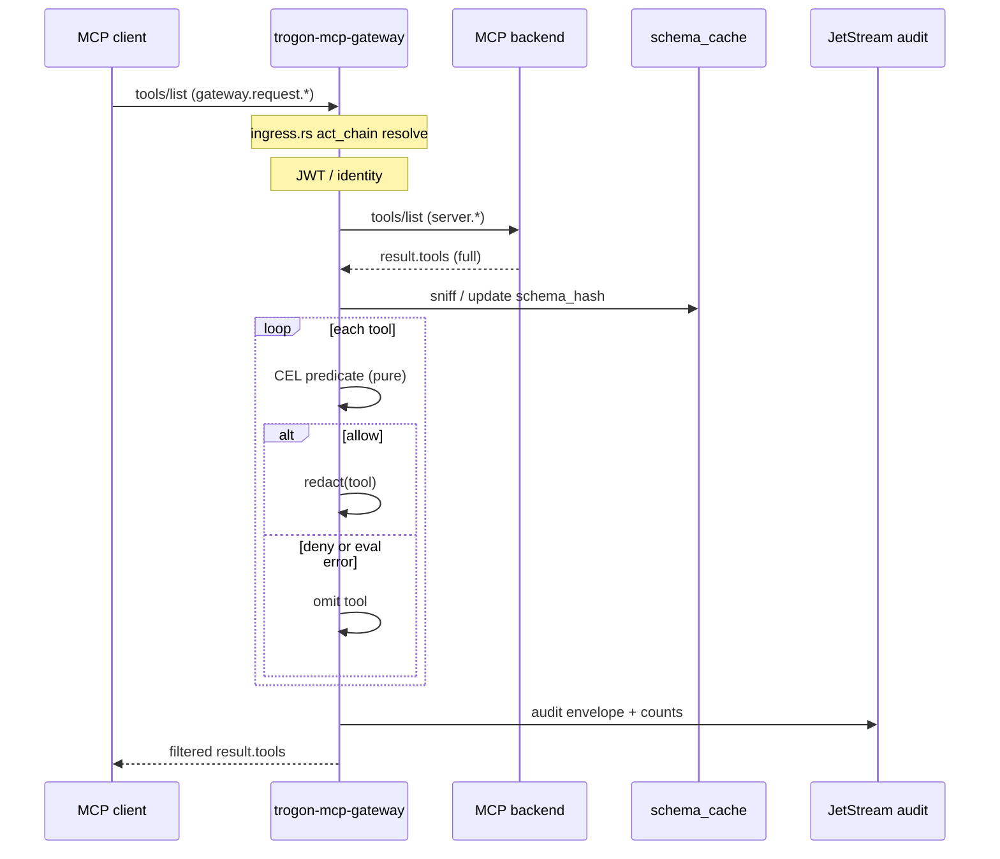

# CEL-based `tools/list` filtering

**Status:** Design spec (Block E, paper). Implementation targets `policy.rs` and `gateway.rs` on branch `yordis/agentgateway`.

**Diátaxis:** Explanation (sections 1–2, 7) + reference (sections 3–6, 8–9).

**Related:** [Agent identity overview](overview.md) · [Adaptive access](adaptive-access.md) · [MCP gateway operator overview](mcp-gateway-operator-overview.md) · [MCP gateway plan](../../MCP_GATEWAY_PLAN.md) (Block E) · `rsworkspace/crates/trogon-mcp-gateway/`

---

## 1. Problem

### 1.1 What `tools/list` returns today

MCP `tools/list` is a JSON-RPC request whose successful `result` contains a `tools` array. Each element is a tool descriptor: at minimum `name` and `description`, plus `inputSchema` (JSON Schema object) per the MCP specification.

Phase 1 of `trogon-mcp-gateway` treats `tools/list` like any other ingress method: the gateway does **not** run SpiceDB for it (`policy.rs` explicitly excludes `tools/list` from the gated-method set), and the backend reply is forwarded **verbatim** to the client.

Ingress handling lives in `gateway.rs`:

1. `handle_ingress` / `handle_ingress_inner` parse the JSON-RPC method from the NATS message payload, resolve identity (JWT, legacy tenant header, `act_chain`), and optionally authorize gated methods.
2. For requests with a `reply` inbox, the gateway issues `request_with_headers` to the backend subject derived from the ingress subject (`gateway_to_server_subject` in `subject.rs`).
3. On success, `dispatch_backend_response` publishes the backend payload unchanged to the ingress `reply` subject.

```744:757:rsworkspace/crates/trogon-mcp-gateway/src/gateway.rs
async fn dispatch_backend_response(
    client: &async_nats::Client,
    ingress: &Message,
    payload: Bytes,
) -> Result<(), GatewayError> {
    let Some(reply) = ingress.reply.clone() else {
        return Err(GatewayError("missing reply subject for JSON-RPC request path".into()));
    };
    client
        .publish_with_headers(reply.to_string(), ingress.headers.clone().unwrap_or_default(), payload)
        .await
        .map_err(|e| GatewayError(e.to_string()))?;
    client.flush().await.map_err(|e| GatewayError(e.to_string()))?;
    Ok(())
}
```

`ingress.rs` in this crate is **not** the JSON-RPC ingress router; it implements **inbound `act_chain` registry resolution** (`IngressChainResolver::resolve_inbound_chain`) that runs inside `handle_ingress_inner` **before** the backend forward. A denied chain short-circuits through `finish_ingress_blocked` and never reaches `dispatch_backend_response`. For `tools/list`, a passing chain still yields the full tool catalogue from the server.

Subject shape (from tests and README): `{prefix}.gateway.request.{server_id}.tools.list` rewrites to `{prefix}.server.{server_id}.tools.list`.

### 1.2 Why the full catalogue is a problem

| Risk | Mechanism |
|---|---|
| **Information leak** | Tool `name`, `description`, and `inputSchema` often reveal internal APIs, data models, or privileged operations. An agent authorised for three tools must not learn that forty-seven others exist. |
| **Agent confusion** | LLM clients treat `tools/list` as the action space. Irrelevant tools increase mistaken `tools/call` attempts, wasted tokens, and false confidence about capabilities. |
| **Policy inconsistency** | Block E goal: the **same CEL predicate** that will gate `tools/call` should decide visibility in `tools/list` (agentgateway pattern, adopted in [MCP gateway plan](../../MCP_GATEWAY_PLAN.md) Block E). Today, list and call are decoupled. |
| **Audit blind spot** | Phase 1 audit records method and outcome but not how many tools were hidden from a list response. Operators cannot prove least-privilege catalogue shaping. |

Tool restrictions in Trogon identity belong in JWT `scope` and registry-backed attributes ([overview.md](overview.md)); catalog filtering is how those restrictions become **visible** to the agent without changing MCP client code.

### 1.3 Design goal

Express catalog visibility as **declarative CEL** evaluated once per candidate tool, with optional **schema redaction** on tools that remain visible. Fail closed on policy compile errors; define per-tool runtime errors separately (section 7).

---

## 2. Where filtering happens

Two architectural placements are viable on the NATS gateway.

### 2.1 Upstream (intercept backend reply)

```
Client --tools/list--> Gateway --tools/list--> Backend
Client <--filtered--- Gateway <--full list--- Backend
```

After `request_with_headers` returns, the gateway parses `result.tools`, evaluates the CEL predicate per entry, drops failures, optionally redacts survivors, then calls `dispatch_backend_response` with the modified JSON.

**Pros**

- Always reflects the server's live catalogue on cache miss.
- Natural extension of Phase 1 (`dispatch_backend_response` becomes the shaping hook).
- Populates `schema_cache` by sniffing the same response ([`schema_cache/mod.rs`](../../rsworkspace/crates/trogon-mcp-gateway/src/schema_cache/mod.rs) `SchemaSource::ToolsListSniff`).
- Matches agentgateway's documented pattern: re-evaluate authorization rules per list item.

**Cons**

- Every `tools/list` hits the backend unless another layer caches the filtered output.
- Gateway process briefly holds the full catalogue in memory (acceptable: gateway is a trusted PEP).

### 2.2 Downstream (synthesise from `schema_cache`)

```
Client --tools/list--> Gateway
                              \
                               +--> read schema_cache, filter locally, reply
Backend  (not contacted for list)
```

On cache hit, the gateway never forwards `tools/list` to `{prefix}.server.{server_id}.tools.list`; it builds `result.tools` from cached schemas.

**Pros**

- Removes backend load for hot paths.
- Guarantees list payloads are exactly what the gateway has already validated/redacted against.
- Avoids timing windows where the server revokes a tool but list still shows it until the next upstream fetch (if invalidation is strict).

**Cons**

- **Cold start:** empty cache cannot answer `tools/list` without a bootstrap upstream fetch or explicit registration (`SchemaSource::ExplicitRegistration`).
- Must keep cache coherent with `notifications/tools/list_changed` ([`schema_cache/invalidate.rs`](../../rsworkspace/crates/trogon-mcp-gateway/src/schema_cache/invalidate.rs)).
- Stale cache is a security bug if invalidation lags.

### 2.3 Recommendation

**Ship upstream filtering in Block E; add downstream synthesis as an optimisation once `schema_cache` invalidation is wired.**

Rationale:

1. Block E already lists schema cache population by sniffing `tools/list` replies — upstream is the prerequisite path.
2. Phase 1 code path is entirely upstream; the smallest correct diff hooks between backend response and `dispatch_backend_response`.
3. Downstream synthesis depends on cache fleet behaviour (section 9) that is not specified yet.
4. Hybrid later: try filtered-result cache (section 6); on miss, upstream fetch + filter + populate caches.

Implementation sketch (upstream):

```text
handle_ingress_inner
  ...
  backend_result = request_with_headers(...)
  if jsonrpc_method == "tools/list" && policy.has_list_filter() {
      payload = filter_tools_list_response(payload, eval_ctx, schema_cache, redaction)?;
      maybe_sniff_schema_cache(server_id, &payload);
  }
  dispatch_backend_response(client, msg, payload)
```

Downstream fast path (future):

```text
if jsonrpc_method == "tools/list" && cache.hit(server_id, schema_hash, policy_version, actor) {
    return synthesised_list_reply(...);
}
// else fall through to upstream branch
```

---

## 3. The CEL predicate (reference)

### 3.1 Semantics

- **Type:** boolean expression.
- **Evaluation model:** called once per tool candidate in `result.tools` (after upstream fetch or when iterating cache entries).
- **Decision:** `true` → keep (then redaction, section 5); `false` → omit from `tools` array.
- **Composition:** multiple rules in policy YAML use **OR** semantics (any matching rule keeps the tool), consistent with agentgateway `mcpAuthorization` and [MCP gateway plan](../../MCP_GATEWAY_PLAN.md) § MCP Authorization.

### 3.2 Activation context (`eval_ctx`)

Top-level bindings for the CEL program (distinct from per-tool bindings in 3.3):

| Field | Type | Required | Source |
|---|---|---|---|
| `mcp.method` | string | yes | Always `"tools/list"` for this program class. |
| `mcp.server_id` | string | yes | Parsed from ingress subject (`parse_server_id`). |
| `actor.agent_id` | string | no | JWT `agent_id` or mesh token. |
| `actor.agent_version` | string | no | JWT `agent_version`. |
| `actor.sub` | string | no | Gateway `caller_sub` (JWT `sub`). |
| `actor.tenant` | string | no | Resolved tenant. |
| `actor.wkl` | string | no | Workload attestation id. |
| `actor.purpose` | string | no | JWT `purpose`. |
| `actor.scope` | list(string) | no | Normalised JWT `scope` entries (tool allow-list fragments). |
| `actor.attributes` | map(string, dyn) | no | Registry- or claim-derived bag (see 3.4). |
| `actor.act_chain` | list(map) | no | Projected `act_chain` entries (`sub`, `agent_id`, `wkl`, `iat`). |
| `server.server_id` | string | yes | Same as `mcp.server_id`. |
| `server.tenant` | string | no | Tenant owning the backend registration. |
| `server.labels` | map(string, string) | no | Operator metadata from gateway config KV. |

### 3.3 Per-tool bindings (`tool` + merged `actor` / `server`)

For each element `T` of `result.tools`:

| Field | Type | Required | Notes |
|---|---|---|---|
| `tool.name` | string | yes | MCP `Tool.name`. |
| `tool.description` | string | no | Empty string if absent. |
| `tool.input_schema` | map / dyn | no | MCP `inputSchema` object; use `has(tool.input_schema)` before field access. |
| `tool.annotations` | map | no | Future MCP annotation bag; empty if absent. |

`actor` and `server` are identical on every iteration; only `tool.*` changes.

### 3.4 `actor.attributes` contract

`actor.attributes` is the **policy-facing** key/value store for authorization predicates. Sources (merge order, later spec):

1. JWT claims mapped by convention (`allowed_tools` → list, `role` → string).
2. Agent registry record for `actor.agent_id` (see [registry.md](registry.md)).
3. Optional SpiceDB-derived materialised attributes (future; not on hot path for list).

Keys are stable snake_case strings. Values are CEL-compatible: bool, int, double, string, list, map.

Example keys:

| Key | Example value | Use |
|---|---|---|
| `allowed_tools` | `["read.file", "search"]` | Explicit allow-list |
| `role` | `"reader"` | Prefix / pattern rules |
| `deny_tools` | `["admin.*"]` | Optional deny overlay (evaluated only if policy references it) |

### 3.5 Standard CEL surface (no host builtins)

Predicates may use the CEL standard library: `in`, `&&`, `||`, `!`, `==`, `!=`, comparisons, `size()`, `startsWith()`, `endsWith()`, `contains()`, `matches()`, list/map comprehensions where enabled by the interpreter, and ternary patterns.

Field access uses dot notation; use `has(field)` for optional nested schema properties inside `tool.input_schema`.

### 3.6 Program class identifier

Policy bundles tag list predicates as `program_class: tools_list_filter` so the compiler applies the restricted builtin set (section 4.3). Invocation path: `policy::evaluate_tools_list_predicate(program, eval_ctx, tool) -> Result<bool, PolicyEvalError>` (to be added beside `SpicedbGatePolicy` in `policy.rs`).

---

## 4. Policy authoring (reference)

### 4.1 YAML bundle shape

```yaml
# Fragment: gateway policy bundle (KV-projected)
policy_version: "2026-05-28T12:00:00Z"   # opaque revision; bumps invalidate list cache

tools_list_filter:
  # OR semantics across rules
  rules:
    - expr: |
        tool.name in actor.attributes.allowed_tools ||
          (tool.name.startsWith("read.") && actor.attributes.role == "reader")
    - expr: |
        tool.name == "health_ping"   # intentional public tool
```

Each `expr` must compile independently; the runtime OR-combines rule results for a given tool (first-match-wins is **not** used — any true rule keeps the tool).

### 4.2 Equivalent standalone CEL

```cel
tool.name in actor.attributes.allowed_tools ||
  (tool.name.startsWith("read.") && actor.attributes.role == "reader")
```

With `actor.attributes` populated as:

```json
{
  "allowed_tools": ["read.file", "search.repo"],
  "role": "reader"
}
```

### 4.3 Host builtins (`src/cel_builtins/`)

Registered in `cel_builtins::register` ([`cel_builtins/mod.rs`](../../rsworkspace/crates/trogon-mcp-gateway/src/cel_builtins/mod.rs)):

| Namespace variable | Function | Arity | Implementation status |
|---|---|---|---|
| `spicedb` | `check` | 3 | Stub (`spicedb::BUILTIN_NAME` = `"spicedb.check"`) |
| `cache` | `get` | 1 | Stub (`cache::GET_NAME` = `"cache.get"`) |
| `cache` | `set` | 3 | Stub (`cache::SET_NAME` = `"cache.set"`) |
| `jsonpath` | `get` | 2 | Stub (`jsonpath::GET_NAME` = `"jsonpath.get"`) |
| `jsonpath` | `set` | 3 | Stub (`jsonpath::SET_NAME` = `"jsonpath.set"`) |
| `jsonpath` | `delete` | 2 | Stub (`jsonpath::DELETE_NAME` = `"jsonpath.delete"`) |
| `audit` | `emit` | 2 | Stub (`audit::EMIT_NAME` = `"audit.emit"`) |
| `time` | `now` | 0 | Stub (`time::NOW_NAME` = `"time.now"`) |
| `rate` | `acquire` | 3 | Stub (`rate::ACQUIRE_NAME` = `"rate.acquire"`) |

Dispatch uses namespace marker strings (`__trogon.cel_builtins.{name}`) to route `get`/`set` overloads.

### 4.4 Allowed builtins for `tools_list_filter` programs

| Builtin | Allowed at runtime | Rationale |
|---|---|---|
| (CEL standard only) | yes | Pure predicates. |
| `jsonpath.get(doc, path)` | yes | Read-only inspection of `tool.input_schema` or `actor.attributes`. |
| `spicedb.check(...)` | **no** (compile-time reject for this class) | Side effect + network; use materialised `actor.attributes` instead. |
| `cache.get` / `cache.set` | **no** | Mutating / shared state breaks purity. |
| `jsonpath.set` / `jsonpath.delete` | **no** | Mutates evaluation context. |
| `audit.emit` | **no** (compile-time reject) | Side effect; audit handled by gateway envelope (section 8). |
| `time.now` | **no** | Nondeterministic across evaluations; breaks cache keys. |
| `rate.acquire` | **no** | Side effect; belongs on `tools/call` path ([adaptive-access.md](adaptive-access.md)). |

**Compile-time enforcement:** when `program_class == tools_list_filter`, the policy compiler walks the AST (or preflight-executes against a stub context) and **rejects** programs that reference:

- `audit.emit` (any form: `emit(...)` with `audit` receiver)
- `cache.set` (including bare `set` with `cache` receiver per `namespace_id`)

Also reject `cache.get`, `jsonpath.set`, `jsonpath.delete`, `time.now`, `rate.acquire`, and `spicedb.check` for this class so predicates remain **pure** and cacheable.

Error surface: `PolicyCompileError::ImpureBuiltin { name, program_class }` at bundle load / hot-swap time (fail closed — gateway keeps previous bundle revision).

### 4.5 Relationship to `tools/call` policy

`tools/call` and `resources/read` may use the full builtin surface (including future live `spicedb.check`). List predicates should be **implied** by the same intent, not necessarily the same AST:

- Preferred: shared `actor.attributes` materialised once per request.
- Alternative: compile list rules as the call rule with `tool.name` free variable (agentgateway style).

Document operators should keep list and call rules **syntactically aligned** to avoid drift.

---

## 5. Schema redaction within a kept tool (reference)

Filtering answers **whether** a tool appears. **Redaction** answers **what** of the descriptor is safe to show ([`redaction/mod.rs`](../../rsworkspace/crates/trogon-mcp-gateway/src/redaction/mod.rs)).

### 5.1 Pipeline order

For each tool where the CEL predicate is true:

1. Start from the server descriptor (or cached schema copy).
2. Apply `redaction::redact(&mut tool_value, &ruleset)` in place ([`redaction/engine.rs`](../../rsworkspace/crates/trogon-mcp-gateway/src/redaction/engine.rs)).
3. Append to `result.tools`.

Redaction runs **after** the allow decision so denied tools never leak even masked field names.

### 5.2 Rule model (existing types)

| Type | Location | Role |
|---|---|---|
| `RedactionRule` | `redaction/rule.rs` | `path: JsonPath` + `action: RedactionAction` |
| `RedactionAction` | `redaction/rule.rs` | `Mask`, `Hash`, `Drop`, `Replace(String)` |
| `RedactionRuleset` | `redaction/ruleset.rs` | Ordered `Vec<RedactionRule>` |
| `JsonPath` | `redaction/rule.rs` | JSONPath string, must start with `$` |

Actions apply to JSON paths on the **tool descriptor** (typically `$.inputSchema.properties.secret` or `$.description`).

### 5.3 Attachment: per-tool vs global

| Layer | Key | Contents | When applied |
|---|---|---|---|
| **Global ruleset** | `policy.redaction.global` | Default paths (e.g. mask `$.inputSchema.properties.password`) | Every kept tool on this server |
| **Per-tool ruleset** | `policy.redaction.tools.{tool_name}` | Additional or overriding paths | Only matching `tool.name` |
| **Schema-cache derived** | `schema_cache` entry metadata (future) | Auto-learned sensitive fields | Optional; never widens visibility |

**Merge semantics:** `effective_rules(tool) = global.rules ++ per_tool.rules(tool.name)` (global first, per-tool appended). Conflicting paths: **per-tool wins** (last rule in engine walk order — document in implementation; prefer explicit override list in YAML).

Example YAML:

```yaml
redaction:
  global:
    rules:
      - path: "$.inputSchema.properties.api_key"
        action: { drop: {} }
  tools:
    search_repo:
      rules:
        - path: "$.inputSchema.properties.internal_ranking_hint"
          action: { mask: {} }
```

Wire-up: `RedactionRuleset::from_yaml` (pending serde_yaml) loads fragments; gateway holds `Arc<RedactionPolicy>` keyed by `policy_version`.

### 5.4 Interaction with `schema_cache`

`SchemaCacheKey { server_id, schema_hash }` ([`schema_cache/key.rs`](../../rsworkspace/crates/trogon-mcp-gateway/src/schema_cache/key.rs)) stores the **unredacted** canonical schema for validation on `tools/call`. List responses carry **redacted** views. On `tools/call`, redaction/rehydration policy for `params`/`result` is a separate path (Block E redaction); list redaction only shapes what the agent sees in the catalogue.

---

## 6. Caching (reference)

### 6.1 Filtered list cache key

```
ToolsListCacheKey = {
  agent_id:      string,   # stable agent identity; "" if human-only sub
  sub:           string,   # caller_sub fingerprint when agent_id absent
  server_id:     string,
  schema_hash:   string,   # hex SHA-256 of canonical tools array (pre-filter)
  policy_version: string,  # bundle revision id
}
```

Optional extension: include `scope_fingerprint` (hash of sorted JWT `scope`) when scope drives predicates without registry attributes.

### 6.2 Cached value

Serialised JSON-RPC success body (after filter + redaction), plus metadata:

| Field | Purpose |
|---|---|
| `tools_count_visible` | Observability |
| `tools_count_filtered` | Observability |
| `computed_at` | Wall clock for TTL |

### 6.3 Invalidation triggers

| Event | Action |
|---|---|
| **Policy change** | Bump `policy_version` → all list cache entries for that version miss. |
| **Schema change** | New `schema_hash` from sniffed `tools/list` or `notifications/tools/list_changed` → miss per `(server_id, schema_hash)`. |
| **Attribute change** | Registry update or JWT claim change affecting `actor.attributes` → miss per `agent_id` / `sub` (no version bump on server). |
| **TTL expiry** | Safety net when notifications are lost (see section 9). |
| **Server reconnect** | Optional version bump on backend session re-`initialize` (align with [MCP gateway plan](../../MCP_GATEWAY_PLAN.md) schema cache bullet). |

`should_invalidate` today only recognises `notifications/tools/list_changed` method string ([`schema_cache/invalidate.rs`](../../rsworkspace/crates/trogon-mcp-gateway/src/schema_cache/invalidate.rs)). Gateway workers subscribed to backend notifications must drop:

1. Raw `schema_cache` entry for `server_id`.
2. All `ToolsListCacheKey` entries for that `server_id` (any `schema_hash`).

### 6.4 Placement

- **Process-local** (moka): default for Phase 2 filtered-list cache.
- **JetStream KV** (optional): cross-worker consistency when queue-group members must share shaped lists; key prefix `mcp-gateway-tools-list/{tenant}/{server_id}/...`.

Upstream path still refreshes `schema_hash` when serving a cache miss.

---

## 7. Error semantics (explanation)

### 7.1 Compile-time errors

Invalid CEL, impure builtins (section 4.4), or type errors → **reject bundle** at load; gateway retains last good `policy_version`. `tools/list` continues under previous policy or default-deny catalog (operator choice documented in [bootstrap-day-zero.md](bootstrap-day-zero.md) — recommend **deny all tools** if no valid list policy).

### 7.2 Per-tool runtime evaluation errors

When evaluation of the predicate for a single tool fails (CEL runtime error, missing `has()` guard, type mismatch):

**Decision: omit that tool only; continue evaluating siblings.**

| Alternative | Why rejected |
|---|---|
| Deny entire `tools/list` | One malformed descriptor or pathological schema punishes all agents. |
| Include tool on error | Fail open leaks catalogue entries. |

Log at `warn` with `tool.name`, `server_id`, `agent_id`, error class — **not** full schema payload.

### 7.3 Panics / interpreter faults

Treat as runtime errors per tool (omit tool). If the interpreter aborts the whole program (bug), catch at request scope and return JSON-RPC error `-32000` with message `policy_internal_error` for the **entire** `tools/list` — distinct from per-tool omission. Rationale: process-level failure indicates gateway bug, not data issue.

### 7.4 Empty result

Returning `"tools": []` is valid JSON-RPC success. Clients must handle empty catalogues; audit still records `tools_count_filtered`.

### 7.5 Backend errors unchanged

Upstream backend timeout / unreachable paths remain `gateway.rs` `respond_with_jsonrpc_error` (`BACKEND_TIMEOUT`, `BACKEND_UNREACHABLE`) — filtering does not run.

---

## 8. Observability (reference)

### 8.1 Audit envelope extensions

Extend [`AuditEnvelope`](../../rsworkspace/crates/trogon-mcp-gateway/src/audit.rs) for `jsonrpc_method == "tools/list"` when shaping runs:

| Field | Type | Description |
|---|---|---|
| `catalog_tools_total` | u32 | Count from backend before filter |
| `catalog_tools_visible` | u32 | Count after filter + redaction |
| `catalog_tools_filtered` | u32 | `total - visible` |
| `catalog_filtered_name_hashes` | list(string) | SHA-256 hex of **denied** tool names (see 8.2) |
| `policy_version` | string | Bundle revision used |
| `schema_hash` | string | Hex hash if sniffed / known |
| `list_cache_hit` | bool | Whether response served from filtered cache |

Existing fields remain: `subject_in`, `subject_out`, `outcome`, `tenant`, `caller_sub`, `agent_id`, `agent_version`, `session_id`, `act_chain`, `identity_source`.

Publish on same JetStream subject family: `{prefix}.audit.{outcome}.request.tools_list` via `audit::audit_publish_subject`.

### 8.2 PII and tool names

Tool names may embed customer identifiers. **Do not** emit raw denied names to JetStream by default.

`catalog_filtered_name_hashes` contains `sha256(tool.name)` as lowercase hex. Operators correlate with allow-lists offline. Optional operator flag `MCP_GATEWAY_AUDIT_LIST_NAMES=1` logs cleartext names at `debug` only (never audit stream).

### 8.3 Tracing

Span `mcp_gateway.handle_ingress` records:

- `gateway.catalog.filter.enabled`
- `gateway.catalog.tools_total` / `visible` / `filtered`
- `gateway.catalog.cache_hit`

Align with OpenTelemetry export in Block G.

### 8.4 Metrics (future)

Counters: `mcp_gateway_tools_list_filtered_total{server_id}`, histogram `mcp_gateway_tools_list_eval_seconds` for CEL loop latency.

---

## 9. Open questions

### 9.1 Per-tool TTL on the filtered-list cache

Should `ToolsListCacheKey` entries expire independently of schema/policy bumps?

| Option | Tradeoff |
|---|---|
| Fixed TTL (e.g. 60s) | Limits stale attribute visibility; adds backend load. |
| No TTL, event-only | Minimal load; relies on registry webhooks + `list_changed`. |
| TTL only without registry events | Middle ground for tenants without registry push. |

**Provisional:** 120s TTL aligned with default mesh token TTL ([overview.md](overview.md)), overridden by invalidation events.

### 9.2 `notifications/tools/list_changed` across the queue group

When one gateway worker serves upstream `tools/list` and another holds filtered cache:

1. Who subscribes to backend notification subjects?
2. Is invalidation **local** (moka) + **KV broadcast** (recommended) on `{prefix}.control.catalog.invalidate.{server_id}`?
3. Race: worker A serves stale filtered list while worker B processes `list_changed` — acceptable if TTL short?

Needs a control-plane subject in [MCP gateway plan](../../MCP_GATEWAY_PLAN.md) subject grammar (Block C).

### 9.3 Downstream synthesis cutover criteria

Metrics-driven promotion: when `schema_cache` hit rate > 99% for 24h and invalidation E2E tested, enable downstream fast path per server.

### 9.4 `spicedb.check` in list predicates

Operators may want live PDP checks per tool. Rejected for purity (section 4.4). If required later, introduce async batch `BulkCheckPermission` with explicit non-cacheable program class — separate spec.

### 9.5 Bidirectional catalogue shaping

`prompts/list` and `resources/list` need parallel program classes (`prompts_list_filter`, `resources_list_filter`) with the same purity rules. Out of scope for this document; track under Block E catalog shaping.

### 9.6 Default deny vs inherit Phase 1 passthrough

Until bundle loads, should `tools/list` remain passthrough (Phase 1 compat) or deny-all? **Recommendation:** passthrough with `catalog.filter.enabled=false` env flag; enforce deny-all in `MCP_GATEWAY_REQUIRE_LIST_POLICY=1` hardened profiles.

---

## Appendix A — Request flow (upstream, recommended)



---

## Appendix B — Cross-reference index

| Topic | Document / code |
|---|---|
| Identity claims (`agent_id`, `scope`, `act_chain`) | [overview.md](overview.md), [jwt-claim-schema.md](jwt-claim-schema.md) |
| Risk / rate on call path | [adaptive-access.md](adaptive-access.md) |
| Block E checklist | [MCP_GATEWAY_PLAN.md](../../MCP_GATEWAY_PLAN.md) Block E |
| Ingress handler | `rsworkspace/crates/trogon-mcp-gateway/src/gateway.rs` |
| Act-chain ingress gate | `rsworkspace/crates/trogon-mcp-gateway/src/ingress.rs` |
| CEL gate (call/read) | `rsworkspace/crates/trogon-mcp-gateway/src/policy.rs` |
| Host builtins | `rsworkspace/crates/trogon-mcp-gateway/src/cel_builtins/` |
| Redaction engine | `rsworkspace/crates/trogon-mcp-gateway/src/redaction/` |
| Schema cache | `rsworkspace/crates/trogon-mcp-gateway/src/schema_cache/` |

---

## Appendix C — Implementation checklist (non-normative)

- [ ] `PolicyBundle::tools_list_filter` compile with purity checker
- [ ] `filter_tools_list_response` in `gateway.rs` before `dispatch_backend_response`
- [ ] `schema_cache` sniff hook on upstream success
- [ ] `AuditEnvelope` catalog_* fields
- [ ] Tests: OR rules, per-tool omit on eval error, impure builtin compile fail, redaction on allowed tool
- [ ] Document operator migration in gateway README (Block H)
