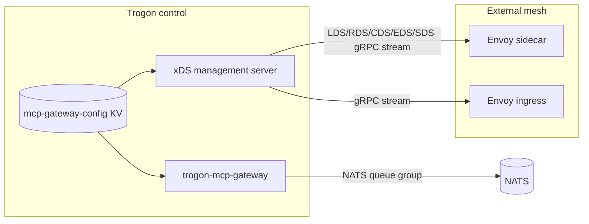
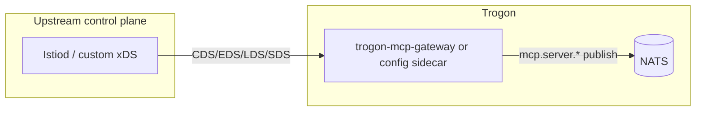
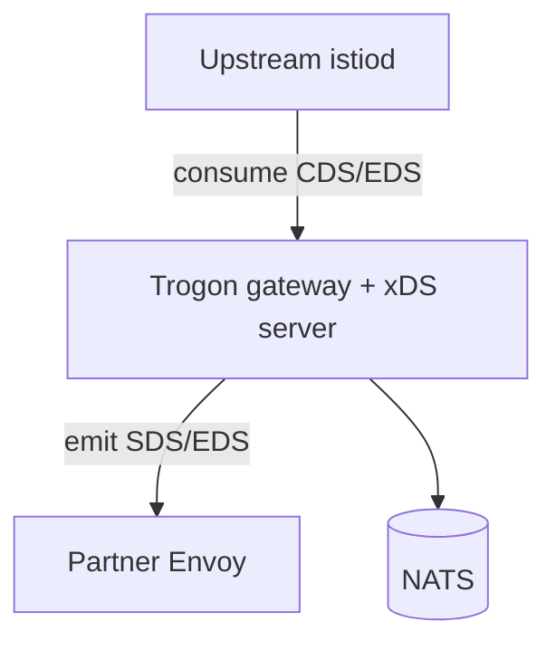

# xDS integration — design decision

**Status:** Diátaxis explanation + decision record (2026-05-28). Block G paper item — no implementation.

**Related:** [integration-touchpoints.md](integration-touchpoints.md) · [mcp-gateway-operator-overview.md](mcp-gateway-operator-overview.md) · [k8s-controller.md](k8s-controller.md) *(forward-ref)* · [on-bus-vs-hybrid.md](on-bus-vs-hybrid.md) *(forward-ref)* · [MCP_GATEWAY_PLAN.md](../../MCP_GATEWAY_PLAN.md) Block G · [overview.md](overview.md) · [reference-subject-grammar.md](reference-subject-grammar.md)

**Audience:** Platform engineers who operate Envoy, Istio, or Cilium and want to know whether the Trogon MCP gateway will ever participate in an xDS control plane — and, if so, in which role.

---

## 1. xDS primer

**xDS** (historically "Envoy Discovery Service") is the family of APIs Envoy and compatible proxies use to receive **dynamic configuration** from a control plane. The data plane (Envoy, istio-proxy, Cilium Envoy sidecar, etc.) opens a long-lived **gRPC streaming** connection to a management server; the server pushes versioned resource snapshots and incremental updates. Operators do not restart proxies when routes, clusters, listeners, or certificates change — the control plane pushes new `DiscoveryResponse` messages and the proxy applies them atomically per resource type (with optional ADS ordering).

### 1.1 Resource types (the letters)

| API | Resource | What it configures |
|---|---|---|
| **LDS** | `Listener` | Inbound sockets, TLS context, filter chains, downstream routing entry |
| **RDS** | `RouteConfiguration` | HTTP/gRPC route tables: match rules, rewrites, weighted clusters |
| **CDS** | `Cluster` | Upstream logical services: connection settings, LB policy, health checks |
| **EDS** | `ClusterLoadAssignment` | Concrete endpoints (IP:port, locality, weights) for a cluster |
| **SDS** | `Secret` | TLS certs, private keys, validation contexts (often tied to SPIFFE/SPIRE rotation) |

Other xDS variants exist (ECDS for extension config, RTDS for runtime, SRDS for scoped routes, etc.). For MCP gateway planning, **LDS/RDS/CDS/EDS/SDS** are sufficient.

### 1.2 ADS (Aggregated Discovery Service)

Without ADS, a proxy may open **separate streams** per type (LDS, RDS, …). **ADS** multiplexes multiple resource types on **one** bidirectional gRPC stream (`AggregatedDiscoveryService`), which lets the control plane enforce **push ordering** (for example: Cluster before ClusterLoadAssignment before Route referencing that cluster). Istio's istiod and many commercial control planes default to ADS for sidecars.

### 1.3 Transport and versioning

- **Transport:** gRPC (`envoy.service.discovery.v3` and related packages). Delta xDS (per-resource subscribe/ack) reduces churn at scale; state-of-the-world (SotW) snapshots remain common on smaller deployments.
- **Versioning:** Each `DiscoveryResponse` carries a `version_info` string; the proxy ACKs or NACKs. NACKs surface misconfiguration without silent drift.
- **Node identity:** The proxy sends a `Node` descriptor (cluster, id, metadata) so the server can scope config (per-workload in Istio, per-gateway in Envoy Gateway).

xDS is **not** a user-facing routing protocol. It is the **contract between a control plane and a proxy-shaped data plane**. Trogon's MCP gateway is **not** a proxy in that sense (see §8).

---

## 2. Three integration shapes

Three distinct architectures appear in every mesh product evaluation. Each is listed with a Trogon-specific reading.

### 2.1 Shape A — Gateway as xDS server

The MCP gateway (or a sibling process in the same deployment) runs an **xDS management server**. External Envoy-based sidecars — Istio ingress, Cilium host proxy, standalone Envoy in front of HTTP MCP bridges — **subscribe** and receive:

- Listener/route/cluster/secret resources derived from gateway policy state, registry projections, or KV watches.

**Mental model:** Trogon becomes **istiod-like for MCP-adjacent concerns only** — not for the whole mesh.



### 2.2 Shape B — Gateway as xDS client

The gateway (or a dedicated config sidecar) **consumes** xDS from an **upstream** control plane — Istio, Google Cloud Service Mesh, Anthos, a custom go-control-plane deployment, etc. It applies received **Cluster** / **ClusterLoadAssignment** / **Listener** resources to:

- Local outbound connection targets (hybrid mode: HTTP MCP servers behind pod sidecars).
- Optional local TLS material from SDS.

**Mental model:** Trogon is **just another xDS subscriber** that maps mesh endpoint discovery onto MCP backend selection — analogous to how an app sidecar learns `outbound|8080||reviews.default.svc.cluster.local`.



### 2.3 Shape C — Both (split horizon)

Trogon **pulls** upstream mesh routing for hybrid HTTP backends (Shape B) while **serving** xDS to a smaller set of internal or partner Envoys that need Trogon-issued secrets or gateway replica endpoints (Shape A).

**Mental model:** Dual control-plane — common in large enterprises (central mesh team + product-team gateway). Highest operational and failure-domain complexity.



---

## 3. Pros and cons by shape

Evaluation criteria: **implementation complexity**, **operator surface area**, **fit with Kubernetes controllers**, and **fit with Trogon's queue-group / NATS-bus model**.

### 3.1 Shape A — Gateway as xDS server

| Dimension | Assessment |
|---|---|
| **Complexity** | High. Requires gRPC management server, resource caching, versioning, ACK/NACK handling, and translation from Trogon config (KV, registry) into valid Envoy protos. Must stay compatible with at least one consumer (Istio agent, raw Envoy, or Cilium) — each has subtly different expectations. |
| **Operator surface** | Increases. Operators now run **two** config pipelines: NATS KV (authoritative for MCP policy) **and** xDS streams (derived view for mesh). Drift between KV revision and xDS `version_info` becomes a new failure mode. |
| **K8s controller fit** | Complements a **proposed** `trogon-mcp-gateway-controller` that projects Gateway API CRDs into KV ([MCP_GATEWAY_PLAN.md](../../MCP_GATEWAY_PLAN.md) Block G). That controller would need a **second projection path** (CRD → xDS) or an xDS emitter watching the same KV — duplicated logic unless carefully factored. |
| **Queue-group / NATS fit** | **Poor for MCP routing.** MCP ingress is `mcp.gateway.request.{server_id}.{method}` → `mcp.server.{server_id}.{method}` ([mcp-gateway-operator-overview.md](mcp-gateway-operator-overview.md)). NATS queue groups load-balance **messages**, not TCP connections. Envoy RDS (path/host/header matching) does not map to subject grammar; there is no `:authority` on the bus. xDS-as-server helps **adjacent** HTTP entry (hybrid) or **secrets/endpoints**, not core MCP JSON-RPC routing. |
| **When it helps** | External Envoys must trust Trogon-issued SPIFFE bundles (SDS). External L7 load balancers need **EDS** for gateway HTTP listeners without adopting NATS. Multi-team meshes that forbid NATS on the edge but allow xDS consumption. |

**Pros**

- Meets operator expectation: "drop Trogon into Istio without NATS on the client path."
- SDS can unify SPIFFE trust distribution for workloads that already use Envoy SDS hooks.
- EDS gives standard HA discovery for gateway **HTTP** replicas (if hybrid HTTP ingress ships).

**Cons**

- Second control plane API to document, secure, test, and support.
- Risk of duplicating `mcp-gateway-config` semantics in RDS — two sources of truth unless RDS is strictly derived from KV.
- NACK storms from malformed Envoy resources can block mesh teams unrelated to MCP.

### 3.2 Shape B — Gateway as xDS client

| Dimension | Assessment |
|---|---|
| **Complexity** | Medium–high. Client must implement ADS or multi-stream subscribe, handle restarts, and map **Cluster** / **ClusterLoadAssignment** to MCP `server_id` backend tables. Less surface than serving full LDS/RDS. |
| **Operator surface** | Lower than Shape A for Trogon operators (reuse existing istiod). **Higher coupling** to mesh team's upgrade cadence and Istio API stability. |
| **K8s controller fit** | **Good in hybrid mode only.** When MCP servers run as normal pods behind sidecars, endpoint discovery is already on EDS; Trogon could consume the same assignments instead of maintaining parallel endpoint lists in KV. |
| **Queue-group / NATS fit** | **Neutral to good for hybrid.** On-bus mode has no pod endpoints for MCP backends — backends **are** NATS subscribers. xDS client adds value only when `mcp.server.*` targets HTTP bridges (`mcp-nats-stdio`, third-party HTTP MCP) whose upstream IPs live in Kubernetes **Service** endpoints. |
| **When it helps** | Hybrid topology ([on-bus-vs-hybrid.md](on-bus-vs-hybrid.md) *(forward-ref)*): HTTP MCP servers in-cluster, gateway or bridge needs dynamic upstream list without duplicating Endpoints watches in a custom controller. |

**Pros**

- Reuses mesh investment (mTLS, locality, outlier detection) for **HTTP legs** without Trogon reimplementing EndpointSlice informers.
- Avoids Trogon becoming a management server for other teams' Envoys.

**Cons**

- **No benefit in pure on-bus deployments** — the "upstream" is a NATS subject, not a ClusterLoadAssignment.
- Istio resource naming and subset labels become a **hidden dependency**; breaks if mesh team changes service naming.
- Split-brain: policy in KV says server `github` allowed, but CDS says endpoints unhealthy — need unified health semantics.

### 3.3 Shape C — Both

| Dimension | Assessment |
|---|---|
| **Complexity** | Very high (sum of A + B + coordination). |
| **Operator surface** | Worst: three config surfaces (mesh CRDs, Trogon KV, Trogon-emit xDS). |
| **K8s / NATS** | Only justified for **multi-mesh** or **federated** deployments (see §4). |

**Pros:** Maximum interoperability in regulated environments that mandate central istiod **and** product-owned secret distribution.

**Cons:** Failure modes multiply (upstream xDS stall vs downstream xDS NACK vs KV watch lag). On-call playbooks become mesh-specific.

---

## 4. Recommendation

**Decision:** Do **not** implement xDS in **v1** or **v2** unless a **paying customer** or **signed design partner** requires mesh interop on a deadline. The **on-bus model**, **JetStream KV control plane**, and the **proposed Kubernetes controller that projects CRDs into KV** ([k8s-controller.md](k8s-controller.md) *(forward-ref)*, [MCP_GATEWAY_PLAN.md](../../MCP_GATEWAY_PLAN.md) Block G) are **sufficient** for Trogon's differentiated substrate story.

### 4.1 Why NATS KV replaces xDS for Trogon

[MCP_GATEWAY_PLAN.md](../../MCP_GATEWAY_PLAN.md) § "Config Distribution" states the deliberate swap: agentgateway's `K8s CRD → controller → xDS → proxy` collapses to **`KV write → gateway watcher fires`**. That is not a temporary shortcut — it is the product wedge:

| agentgateway / Envoy stack | Trogon MCP gateway |
|---|---|
| xDS snapshot + ACK/NACK | KV revision + watch notification |
| RDS path/host routing | `{prefix}.gateway.request.{server_id}.{method}` subject grammar |
| CDS/EDS upstream discovery | `mcp.server.{server_id}.*` subscribers + registry/KV backend tables |
| SDS certificate rotation | `mcp-trust-bundles` KV for SPIFFE anchors (STS); mesh JWT via `mcp-jwks` **(proposed)** |
| Horizontal scale via xDS sync | Queue groups on gateway and STS ([mcp-gateway-operator-overview.md](mcp-gateway-operator-overview.md) §4) |

Queue groups already provide **stateless horizontal scale** without endpoint propagation to external proxies. Session stickiness is **not** required for Phase 1 HA ([mcp-session-model.md](mcp-session-model.md)); shared state belongs in `mcp-sessions` KV, not in EDS locality hints.

### 4.2 What would **force** xDS later

Treat these as **triggers**, not roadmap commitments:

1. **Multi-mesh / multi-org federation** — Two autonomous Istio roots (or cloud vendor meshes) must exchange trust and backend discovery without sharing NATS accounts. KV does not cross mesh boundaries; xDS (or something like it) is the lingua franca those teams already operate.

2. **Mandatory Envoy-only edge** — Security mandates HTTP MCP ingress **only** through an existing Envoy ingress (no NATS client on laptops). Trogon must expose **EDS** for gateway HTTP replicas and possibly **SDS** for downstream mTLS — even if MCP policy stays on NATS internally.

3. **Central mesh owns all egress targets** — Platform team forbids Trogon-maintained endpoint lists; **all** outbound clusters must come from istiod CDS/EDS. Hybrid MCP servers behind sidecars then require Shape B.

4. **SPIFFE consumption only via SDS in the workload** — Some deployments disable file/volume bundle mounts and require SDS for **every** cert rotation. If STS cannot push trust material another way, **SDS server** (Shape A) becomes the least-friction adapter — still scoped to secrets, not full RDS.

5. **Acquisition / compliance narrative** — Prospect's RFP checklist explicitly requires "xDS-compatible control plane." Business trigger, not technical.

Absent those triggers, xDS is **negative ROI**: large proto surface, compatibility matrix, and 24/7 on-call category for marginal gain over KV + optional K8s projector.

### 4.3 v1 / v2 scope statement

| Release | xDS |
|---|---|
| **v1** | **Out of scope** — no server, no client, no `xds` crate dependency. |
| **v2** | **Out of scope by default** — same unless customer trigger in §4.2 fires. Block G checklist item remains unchecked intentionally ([MCP_GATEWAY_PLAN.md](../../MCP_GATEWAY_PLAN.md) Block G). |
| **v3+** | Revisit **narrowly** (likely SDS-first, then EDS, then CDS) per §5–6. |

---

## 5. If/when we add xDS as a server (Shape A)

Prefer a **standalone** `trogon-mcp-xds` (or controller sidecar) that **watches the same KV** as the gateway and emits derived Envoy resources — **not** embedding gRPC management inside the hot MCP request path.

### 5.1 SDS — SPIFFE / trust material (first likely integration)

**Why first:** Trust bundles already exist as PEM bytes in NATS KV `mcp-trust-bundles/<trust-domain>` ([integration-touchpoints.md](integration-touchpoints.md) §7, `trogon_sts::TRUST_BUNDLES_KV_BUCKET`). STS watches and hot-reloads; gateway does **not** read this bucket today. External Envoys and some mesh gateways already consume **SDS** for rotation.

**Proposed emission:**

- `Secret` resources named by trust domain (e.g. `trogon_trust_acme_local`) containing:
  - `validation_context` with trusted CA bundle from KV value.
  - Optional inline SDS for gateway's own server cert if hybrid HTTP terminates on Envoy.

**Source of truth:** KV remains authoritative; xDS server is a **read-only projector**. Revision bumps on KV key change → new SDS version.

**Cross-ref:** [sts-exchange.md](sts-exchange.md), [bootstrap-day-zero.md](bootstrap-day-zero.md) Step a, [reference-subject-grammar.md](reference-subject-grammar.md) §7.1.

### 5.2 EDS — Gateway replica discovery (hybrid HTTP only)

**When:** [on-bus-vs-hybrid.md](on-bus-vs-hybrid.md) *(forward-ref)* documents HTTP ingress to `trogon-mcp-gateway` replicas (Streamable HTTP or bridge) where **external** Envoy must load-balance TCP to pods.

**Proposed emission:**

- `Cluster` `trogon_mcp_gateway` with type `EDS`.
- `ClusterLoadAssignment` listing pod IPs/ports from Kubernetes Endpoints or EndpointSlice informer (controller-owned), **not** from NATS.

**Not used for:** NATS queue group members — NATS clients discover gateways via subject subscription, not IP endpoints.

### 5.3 RDS — MCP-aware HTTP routes (conditional)

**Only if** Trogon exposes **HTTP** route matching where Envoy must select upstream by path/header tied to MCP semantics (for example `/mcp/github/tools` → specific gateway pool).

**Default:** **Do not emit RDS** for on-bus MCP. Subject routing makes RDS redundant and dangerous (dual routing logic).

If emitted: routes should be **thin** — TLS/SNI and path prefix to gateway Service — with **no** JSON-RPC method matching in Envoy (that stays in gateway CEL/SpiceDB).

### 5.4 LDS / CDS as server

**LDS:** Only with RDS/EDS above — listener binds 443, TLS context references SDS secrets, forwards to `trogon_mcp_gateway` cluster.

**CDS:** Static or EDS-backed cluster definitions for gateway and **optional** registered HTTP MCP backends if hybrid catalog lists them in KV.

**Explicit non-goal:** Emitting full filter chains (ext_authz, wasm, lua) — see §8.

### 5.5 ADS ordering (if server ships)

Recommended push order when using ADS:

1. SDS / ECDS (trust material)
2. CDS (clusters)
3. EDS (assignments)
4. LDS + RDS (if HTTP ingress enabled)

---

## 6. If/when we add xDS as a client (Shape B)

### 6.1 CDS — Upstream MCP server endpoints (hybrid)

**Consume:** `Cluster` and associated `ClusterLoadAssignment` for Kubernetes Services fronting third-party HTTP MCP servers (pods with sidecars).

**Map to:** Gateway backend table entries keyed by `server_id` — the same logical names used in `mcp.gateway.request.{server_id}.*` ([reference-subject-grammar.md](reference-subject-grammar.md)). Mapping from Istio's `outbound|port||svc.ns.svc.cluster.local` to `server_id` must be **configuration**, not convention magic **(proposed)** `mcp-gateway-config` key `hybrid/backends/{server_id}` with `istio_service_host` field.

**Health:** Respect Envoy/istio health status or implement parallel NATS probe — document fail-closed vs fail-open in hybrid doc.

### 6.2 EDS — As client

Typically arrives bundled with CDS via ADS. Separate EDS-only subscribe is unnecessary if ADS is supported.

### 6.3 SDS — As client

**Optional:** If gateway process terminates TLS to HTTP MCP upstreams using mesh-issued certs, consume SDS for client TLS context. On-bus NATS path does not need this.

### 6.4 RDS / LDS — As client

**Do not consume** for general L7 routing (§8). Exception: if gateway embeds a local Envoy (not planned), which would be a different product shape.

---

## 7. Comparison to proposed K8s controller

Block G lists an **optional K8s controller** projecting Gateway API CRDs into NATS KV ([MCP_GATEWAY_PLAN.md](../../MCP_GATEWAY_PLAN.md) Block G). That controller and xDS interact as follows:

| Approach | Config enters Trogon via | Best for |
|---|---|---|
| **KV watcher only** | CI/CD, `agctl`, GitOps writing KV | Standalone NATS, no Kubernetes |
| **K8s → KV controller** | CRDs → `mcp-gateway-config` | Teams wanting Gateway API ergonomics without Envoy |
| **K8s → xDS server** | CRDs → Envoy resources | Teams with existing Envoy ingress only |
| **K8s → KV + xDS projector** | CRDs → KV (authoritative) → xDS (derived) | Avoiding dual truth |

**Recommendation:** If Kubernetes integration ships, **CRD → KV** is the primary path ([k8s-controller.md](k8s-controller.md) *(forward-ref)*). Add **KV → xDS** projection only when §4.2 triggers fire — never CRD → xDS **without** KV for MCP policy.

---

## 8. Out-of-scope clarifications

These boundaries prevent scope creep and mistaken "Envoy replacement" narratives.

| Statement | Rationale |
|---|---|
| The MCP gateway is **not** an Envoy replacement. | It does not terminate generic HTTP/gRPC front doors for arbitrary microservices; it enforces MCP JSON-RPC on NATS subjects. |
| We will **not** implement HTTP **filter chains** (ext_authz, ext_proc, wasm filters, CORS filters, etc.). | MCP policy runs in `trogon-mcp-gateway` phases (CEL, SpiceDB, WASM **components** on the Trogon engine — not Envoy WASM filters). |
| We will **not** consume **RDS** for non-MCP routing. | No cluster-ingress path routing for arbitrary services; no copying Istio VirtualService into gateway logic. |
| We will **not** emit **RDS** that encodes `tools/call` vs `resources/read` matching. | Method semantics belong in gateway + SpiceDB, not Envoy `route.match`. |
| xDS is **not** the audit or config bus. | JetStream `MCP_AUDIT` and KV buckets remain ([integration-touchpoints.md](integration-touchpoints.md)). |
| No new NATS subjects or KV bucket names for xDS in v1/v2. | If an xDS projector ships later, it reads existing buckets (`mcp-gateway-config`, `mcp-trust-bundles`) — any dedicated xDS cache is process-local **(proposed)**. |

---

## 9. Operational and security notes (future xDS)

If xDS is ever implemented, these constraints apply regardless of shape:

- **mTLS** on gRPC management channel — mesh practices expect client cert on the proxy side.
- **AuthZ** on xDS gRPC — node metadata must map to Trogon tenant/mesh identity; prevent cross-tenant secret leak via SDS.
- **Observability** — `version_info`, ACK/NACK rate, resource count, push latency as metrics ([MCP_GATEWAY_PLAN.md](../../MCP_GATEWAY_PLAN.md) Block G OTel item).
- **Failure modes** — xDS stall must not block NATS MCP path; SDS outage must not block on-bus MCP (only hybrid TLS legs).

---

## 10. Decision summary

| Question | Answer |
|---|---|
| v1 xDS? | **No** |
| v2 xDS? | **No** unless customer trigger (§4.2) |
| Default control plane? | **NATS KV + JetStream** |
| First xDS resource if ever? | **SDS** (trust bundles from `mcp-trust-bundles`) |
| Second? | **EDS** (gateway HTTP replicas in hybrid mode) |
| Client consume? | **CDS/EDS** for hybrid HTTP MCP upstreams only |
| RDS? | **Avoid**; MCP routing stays on NATS subjects + gateway policy |

---

## 11. Cross-reference index

| Document | Relevance |
|---|---|
| [integration-touchpoints.md](integration-touchpoints.md) | Wire contracts; KV `mcp-trust-bundles`; no xDS row today |
| [mcp-gateway-operator-overview.md](mcp-gateway-operator-overview.md) | On-bus topology, queue groups, KV buckets |
| [mcp-session-model.md](mcp-session-model.md) | Why HA does not need EDS stickiness |
| [reference-subject-grammar.md](reference-subject-grammar.md) | Subject routing vs Envoy RDS |
| [k8s-controller.md](k8s-controller.md) | *(forward-ref)* CRD → KV projection |
| [on-bus-vs-hybrid.md](on-bus-vs-hybrid.md) | *(forward-ref)* When CDS/EDS client matters |
| [MCP_GATEWAY_PLAN.md](../../MCP_GATEWAY_PLAN.md) Block G | Checklist: xDS interop v2+; K8s controller; latency baseline |
| [MCP_GATEWAY_PLAN.md](../../MCP_GATEWAY_PLAN.md) § agentgateway Deep Dive | xDS → KV equivalence table |
| [sts-exchange.md](sts-exchange.md) | SPIFFE attestation; trust bundle source |
| [failure-mode-matrix.md](failure-mode-matrix.md) | Trust bundle missing (row 15) — orthogonal to xDS until SDS projection |

---

## Appendix A — Glossary

| Term | Meaning |
|---|---|
| **ADS** | Aggregated Discovery Service — multiplexed xDS stream |
| **SotW** | State of the world — full snapshot per response |
| **Delta xDS** | Incremental per-resource subscribe/unsubscribe |
| **Control plane** | Component pushing xDS (istiod, go-control-plane, Trogon projector) |
| **Data plane** | Proxy consuming xDS (Envoy, istio-proxy) |
| **On-bus** | MCP clients and servers as NATS principals; gateway on queue group |
| **Hybrid** | HTTP MCP legs + NATS policy core *(see forward-ref doc)* |

## Appendix B — agentgateway `xds` crate (informative)

[MCP_GATEWAY_PLAN.md](../../MCP_GATEWAY_PLAN.md) notes agentgateway's `xds` crate for interop. Trogon explicitly maps that crate to **none** — NATS KV watcher replaces it for config distribution. Reintroducing xDS would be a **business-driven exception**, not parity for parity's sake.

## Appendix C — Worked example: why RDS does not map

Client publishes to:

```
mcp.gateway.request.github.tools.call
```

Gateway authorizes, then publishes to:

```
mcp.server.github.tools.call
```

An Envoy RDS rule might look like: `prefix: /github/` → cluster `github`. That does not see JSON-RPC `method`, `params`, SpiceDB resource type, or `act_chain`. Duplicating partial matches in RDS would **fork** policy evaluation. The gateway already owns the correct layer ([hierarchical-policy-merge.md](hierarchical-policy-merge.md)).

---

*End of document.*
