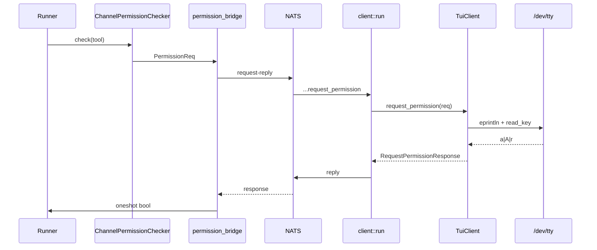
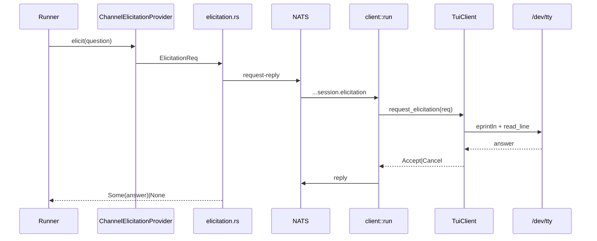

# Permission UI Design — Stage 1.0 Gate

**Status:** Design gate (PR 0) — required before PR 4 (`TuiClient` + `client::run`)  
**Related:** [`terminal-agent-definitive-plan.md`](terminal-agent-definitive-plan.md) §1.0–1.2

---

## 1. Summary

The Trogon REPL is synchronous between turns (`rustyline::Editor::readline`) while the ACP client layer is async (`acp_nats::client::run` in a `LocalSet`). Tool permission and elicitation prompts must be answered **during active agent turns** without touching the shared `Editor`.

**v1 decision:** `TuiClient` reads user input from **`/dev/tty`** via **crossterm** (preferred) or raw **termios**. Prompts go to **stderr**; agent text stays on stdout.

---

## 2. Problem: sync rustyline vs async permission handler

| Component | Location | Terminal use |
|-----------|----------|--------------|
| REPL prompt | `repl.rs:162` — `rl.readline("> ")` | Blocks between turns; owns stdin via rustyline |
| ACP client | `acp_nats::client::run` — `spawn_local` | Async; handles NATS `request_permission` / `session.elicitation` |

```text
loop {
    match rl.readline("> ") {          // sync; Editor holds terminal
        Ok(line) => {
            session.prompt(line).await;
            loop {
                tokio::select! {       // repl.rs:322 — active turn
                    ctrl_c => cancel,
                    event = rx.recv() => stream text / tool lines,
                }
            }
        }
    }
}
```

`TuiClient::request_permission` runs in the **client task**, not inside the REPL `select!`. It cannot call `Editor::readline` — rustyline is not re-entrant, and the Editor may be blocked on the next `>`.

**Permission path today:**

```text
Agent loop → ChannelPermissionChecker [permission.rs]
  → mpsc PermissionReq → handle_permission_request_nats [permission_bridge.rs]
  → NatsClientProxy::request_permission → NATS request-reply
  → (missing) TuiClient::request_permission  ← Stage 1
  → oneshot bool (60s timeout → deny)
```

Without a client subscriber on `{prefix}.session.*.client.*`, requests hang ~60s and deny (**B1**).

**Why `/dev/tty`:** controlling terminal even when stdin is piped; no fight with rustyline during an active turn; stderr keeps stdout stream clean.

---

## 3. When permissions fire

| Phase | REPL state | Handler |
|-------|------------|---------|
| Idle at `> ` | Blocked in `readline` | Does not run |
| Active turn | Inner `tokio::select!` (`repl.rs:322+`) | **Runs** — tools dispatch, checker sends `PermissionReq` |
| `--print` | No REPL | Runs only if mode requires approval (see §8) |

Permissions are **turn-scoped**, typically after `StreamEvent::ToolCall` (`┆ name` on stderr). Handler is a **separate `spawn_local` task** from the REPL.

**UI rule:** clear live tool line (`\r\x1b[2K` on stderr) before prompting, matching `repl.rs:334–337`.

---

## 4. Rejected options

| Option | Why not v1 |
|--------|------------|
| **Rustyline for permission prompt** | Editor blocked at `readline` between turns; re-entrant use unsafe; cross-task sharing races |
| **Channel to REPL inner loop only** | Still needs raw tty read; doesn't unify idle edge cases |
| **Auto-deny + TROGON.md only** | Not Claude Code parity; no one-off bash/MCP approval |

---

## 5. Chosen: Option A — `/dev/tty` in `TuiClient`

**Create:** `rsworkspace/crates/trogon-cli/src/tui_client.rs`

| ACP method | v1 | Notes |
|------------|----|-------|
| `request_permission` | ✅ | Single-key menu on `/dev/tty` |
| `request_elicitation` | ✅ | Line-based form on `/dev/tty` |
| `terminal/*`, `read_text_file`, `write_text_file` | ❌ | Runner uses in-process tools / wasm-runtime |

**Tty helpers:** `open_dev_tty()`, `read_key()` (crossterm `KeyCode`), `read_line()` for elicitation. Add `crossterm` to `trogon-cli/Cargo.toml`; fall back to `libc` termios only if deps block.

### Standard tool prompt

1. Parse tool title + `raw_input` snippet from `RequestPermissionRequest`.
2. `eprintln!` on stderr:
   ```text
   ┆ Bash  command: cargo test -p trogon-cli
   [a]llow  [A]lways allow  [r]eject
   ```
3. Read **one key** from `/dev/tty` (case-sensitive for `a` vs `A`).

| Key | `option_id` | Effect |
|-----|-------------|--------|
| `a` | `allow` | Allow once |
| `A` | `allow_always` | Allow + persist `allowed_tools` (runner KV) |
| `r` / other | `reject` | Deny |
| Ctrl+C / EOF | `Cancelled` | Deny |

Mirror parsing in `trogon-acp/src/main.rs:305–312`. Runner persists `allow_always` (`permission_bridge.rs:96–104`).

### Elicitation

Same tty path; **line-based** for form fields (`ElicitationMode::Form`). Return `Accept` with content map or `Cancel`. Reference: `trogon-acp-runner/src/elicitation.rs`.

---

## 6. Flow diagrams

### `request_permission`



### Elicitation



---

## 7. ExitPlanMode special case

Not allow/deny — a **mode picker** when leaving plan mode. Port UI from `trogon-acp/src/main.rs:329–377`. NATS `permission_bridge.rs` lacks ExitPlanMode today; extend bridge or let `TuiClient` return selected mode id for runner persistence.

**Options** (`exit_plan_mode_options`, `main.rs:268–292`):

| `option_id` | Label | When shown |
|-------------|-------|------------|
| `bypassPermissions` | Yes, and bypass permissions | `allow_bypass()` only (not root/sudo) |
| `acceptEdits` | Yes, and auto-accept edits | Always |
| `default` | Yes, and manually approve edits | Always |
| `plan` | No, keep planning | Always (reject) |

**Parsing** (`parse_exit_plan_mode_outcome`, `main.rs:295–302`): `plan` → deny, no mode change; any other id → allow + `new_mode = Some(id)`; cancelled/error → deny.

**TUI:** numbered menu on `/dev/tty` (multi-key), mapping to the same `option_id` strings.

---

## 8. Non-interactive `--print` behavior

`print.rs` has no REPL and no tty prompts — one shot, stream, exit.

| Stage | Behavior |
|-------|----------|
| **Stage 1–3** (until `--dangerously-skip-permissions`, Stage 4) | Call `session.set_mode("bypassPermissions")` before prompt (same as `/init` at `repl.rs:241`) |
| **Stage 4+** | `--dangerously-skip-permissions` opts in explicitly; default print stays non-bypass |

`TROGON_MODE=bypassPermissions` overrides via runner session mode. If print shares `runtime.rs` with interactive mode, auto-bypass is mandatory until Stage 4 — print cannot block on tty.

---

## 9. Cross-runner prefix rebind (PR 6)

`client::run` subscribes once: `{prefix}.session.*.client.>` (`acp-nats/src/client/mod.rs:68`, `AllClientSubject`). Cross-runner `/model` (`repl.rs:197–204`) changes `prefix` (e.g. `acp.claude` → `acp.grok`). Updating `ActiveClientState.prefix` alone does **not** move the subscription.

**v1 decision: restart client task on prefix change**

| Approach | Verdict |
|----------|---------|
| Restart `client::run` | **Chosen** — no `acp-nats` API change; matches single-prefix `Bridge` |
| Multi-prefix wildcard | Deferred — needs new subscription type in `acp-nats` |

**PR 6 procedure** (`runtime.rs`):

1. Update `ActiveClientState { prefix, session_id }` from REPL.
2. Abort/join current `client_task` (`acp-nats-stdio/src/main.rs:145–148`).
3. Rebuild `Bridge`/`Config` with new `AcpPrefix` if needed.
4. `spawn_local(client::run(...))` with new prefix.
5. In-flight requests during restart → 60s timeout → deny (acceptable edge).

**Same-prefix** `/model` — no restart. Test: Claude → Grok → tool → prompt within 5s.

---

## 10. Wire-in checklist (PR 4)

```rust
// runtime.rs — inside LocalSet
let bridge = Rc::new(Bridge::new(..., config.clone(), notif_tx));
let client = Rc::new(TuiClient::new(active_state.clone()));
tokio::task::spawn_local(client::run(nats, client, bridge, StdJsonSerialize));
```

```rust
struct ActiveClientState {
    session_id: Option<String>,
    prefix: String,
    allowed_tools: Vec<String>,  // UI hint cache; runner KV is source of truth
}
```

Update from `repl.rs` on: session create, `/clear`, cross-runner `/model`, exit.

---

## 11. Reference implementations

| Concern | Path |
|---------|------|
| REPL readline + active turn | `rsworkspace/crates/trogon-cli/src/repl.rs` (~162, ~322) |
| Permission parsing (allow/deny) | `rsworkspace/crates/trogon-acp/src/main.rs` (305–406) |
| ExitPlanMode options + parsing | `rsworkspace/crates/trogon-acp/src/main.rs` (268–302, 329–377) |
| NATS permission bridge | `rsworkspace/crates/trogon-acp-runner/src/permission_bridge.rs` |
| Permission channel + 60s timeout | `rsworkspace/crates/trogon-runner-tools/src/permission.rs` |
| NATS client dispatch | `rsworkspace/crates/acp-nats/src/client/request_permission.rs` |
| NATS client subscription loop | `rsworkspace/crates/acp-nats/src/client/mod.rs` (`run`, ~56–96) |
| Stdio bridge spawn/abort | `rsworkspace/crates/acp-nats-stdio/src/main.rs` (106–111, 145–148) |
| Elicitation bridge | `rsworkspace/crates/trogon-acp-runner/src/elicitation.rs` |
| Elicitation NATS handler | `rsworkspace/crates/acp-nats/src/client/session_elicitation.rs` |
| Non-interactive print | `rsworkspace/crates/trogon-cli/src/print.rs` |

---

## 12. Future: Stage 6 async readline (Option C)

Long-term polish (definitive plan Stage 6, low priority):

- Replace sync `Editor::readline` with **`tokio-rustyline`** or cancelable **`spawn_blocking`** readline for the whole REPL.
- Single input subsystem for `>` prompts and permission menus with shared history/completion.
- **Not v1** — large `repl.rs` refactor; `/dev/tty` unblocks Stage 1.

Revisit if prompt ordering bugs, lost history on permission lines, or Windows console issues exceed crossterm-on-tty fixes.

---

## 13. Acceptance criteria (Stage 1 exit test)

`TROGON_MODE=default` tool prompt <1s; `allow_always` skips re-prompt; ExitPlanMode menu works; elicitation reaches agent; cross-runner permission after PR 6 restart; `--print` completes via bypass until Stage 4.
