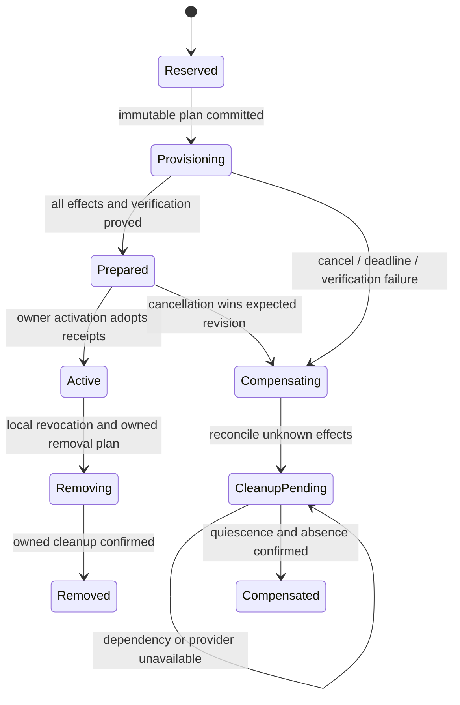

# Secret and integration event contracts

This reference describes the durable protobufs accompanying
[ADR#0066](../adr/0066-secret-service-and-connection-boundaries.md),
[ADR#0067](../adr/0067-webhook-ingress-and-delivery.md) and
[ADR#0068](../adr/0068-provisioning-sagas-and-owned-resource-cleanup.md).
The custody/connection and webhook decisions are accepted. The provisioning
decision remains draft pending its separate maintainer signoff under
[ADR#0000](../adr/0000-adr-process.md). The deliverable contains event schemas
and supporting values only. It includes no command, query, RPC, material
exchange schema, generated Rust bindings or runtime implementation.

## Package boundaries

All packages use protobuf edition 2024 and the `v1alpha1` namespace.

| Directory under `proto/trogonai/` | Durable facts and supporting values |
| --- | --- |
| `provisioning/v1alpha1` | Planned effects, attempts, receipts, quiescence, commit, compensation and cleanup |
| `secrets/v1alpha1` | Vault and credential lifecycle, material-version metadata, verification, ownership, audit and scoped leases |
| `connections/v1alpha1` | Connector catalog, immutable connection configuration, purpose bindings, provisioning and grant lifecycle |
| `webhooks/v1alpha1` | Endpoint/subscription lifecycle, receipt admission, immutable payload adoption, delivery attempts and recovery |

The domain envelope and its embedded provisioning envelope describe one append
in the same authoritative aggregate stream. Their identities, revision, project
and timestamp must agree. A projection, job queue or idempotency cache can be
rebuilt from these events; it does not decide lifecycle transitions.

## Resource and authority map

| Value | Meaning | Authority boundary |
| --- | --- | --- |
| `SecretRef` | Stable opaque identity across rotation | Possession does not authorize material access |
| `SecretVersionRef` | Exact custody version | Audit/recovery identity, not old-version read permission |
| `ProvisioningRef` | Immutable project and operation identity | Correlation, not worker or cleanup authority |
| `ResourceRef` | Typed metadata resource identity | No provider URL, token or backend path |
| `ResourceReceiptRef` | Exact creator, prepared receipt and resource | Parent activation decides adoption |
| `EventRef` | Immutable stream fact and revision | Read from authoritative stream, not a cached status |
| Connection configuration | Pinned adapter, public endpoint and account | Account/destination changes require replacement |
| Credential binding | Stable ref assigned to a purpose and role | Borrowed credentials cannot be destroyed by the binding |
| Grant or secret lease | Workload/attempt-scoped authorization fact | No bearer token or transferable child-session authority |
| Inbound endpoint | Provider verification and acceptance policy | Receiving does not authorize provider calls |
| Outbound subscription | Approved event disclosure and signing policy | Sending does not authorize incoming traffic |

## Provisioning transitions

`ProvisioningCommitted` acknowledges the owner domain's activation/removal fact.
It does not create another transaction boundary. A child cannot be swept merely
because its transfer acknowledgement is missing: the parent activation is the
ownership decision. If that decision cannot be read, cleanup waits.

| Shared event | Required evidence |
| --- | --- |
| `ProvisioningStarted` | Reserved owner, immutable acyclic plan, fixed ownership and adapter recovery capability |
| `EffectAttemptStarted` | Current revision, increasing fence, same effect key; cleanup ID for compensation |
| `EffectObserved` | Matching attempt; applied receipt, verified borrowed dependency, observed absence or explicit uncertainty |
| `EffectQuiescenceConfirmed` | Every possible late attempt settled by provider fence, proven bound or closed conditional write |
| `ProvisioningPrepared` | All planned prerequisites and trusted domain verification facts |
| `ProvisioningCommitted` | Exact owner activation/removal fact; adopted receipts where applicable |
| `ProvisioningCompensationStarted` | Uncommitted operation; activation permanently closed |
| `CleanupRequired` | Ownership-derived obligation and cleanup dependency order |
| `CleanupConfirmed` | Exact owned object absent after quiescence; irreversible destruction when required |
| `CleanupDeferred` | Typed obstacle and retry time; obligation remains open |
| `ProvisioningCompensated` | Every possible owned effect settled; every cleanup obligation confirmed |

A worker crash before `CleanupRequired` does not erase debt. The immutable plan
and observed effects determine the required cleanup set. A timeout is an unknown
outcome, never proof of external absence. A cleanup retry limit cannot manufacture
a completed state. Evidence and tombstones remain after operational material is
removed so delayed delivery cannot resurrect resources.

## Custody and persistence

Only the secrets service accesses OpenBao. It stores material with operation
attribution atomically in a private KV v2 data envelope. Events contain opaque
identities, typed results, account/endpoint identity proofs and backend version
numbers. They never contain secret material, secret-derived hashes, provider
response bodies, authentication headers, OAuth authorization codes or protected
callback URLs. Provider paths and token-bearing lease identifiers stay private.

Initial writes reserve a non-secret marker before material. Conditional writes
and cancellation fences prevent late writers from reviving candidates. Whole-path
metadata purge also requires proof that late initial marker creation cannot
succeed. Failed rotation destroys only the candidate; active material and its
metadata remain. Successful rotation records retirement of old material, with an
explicit bounded webhook overlap when authorized. Soft deletion is insufficient.

Agents use declared connections through trusted executors. Tool/MCP credentials,
OAuth tokens and short-lived provider credentials compose the same purpose-bound
credential, binding and provisioning types. Workload lease metadata does not
contain a value. Non-exportable signing/encryption keys remain under the separate
KeyManagement boundary from [ADR#0023](../adr/0023-secret-management-and-key-custody-direction.md).

## Webhook persistence

Inbound verification uses the original bytes transiently. The gateway reserves
receipt ownership before extracting recognized secrets or writing a sanitized
artifact. Acceptance adopts those receipts and records an outbox obligation.
Unknown payload schemas reject instead of persisting an unexamined provider body.
A pending duplicate is not an accepted delivery. Acknowledgement follows durable
acceptance/publication as required by the pinned adapter.

Outgoing enqueue similarly adopts an immutable payload artifact. Attempts retain
the delivery ID, exact body, destination and event identity. Each retry gets a new
attempt ID and fence; signatures and response bodies are never durable. Unknown
remote outcomes remain distinguishable from definite rejection. Expired artifacts
are removed through tracked ownership while delivery outcomes remain available.

## Contract bounds

| Concern | Contract |
| --- | --- |
| Secret cache and authorization staleness | At most 330 seconds from authoritative observation; cache hits do not renew it |
| Normal revocation objective | Per-replica p99 at most five seconds |
| Connection grant and workload lease | At most five minutes; revocation and current policy still apply |
| Webhook rotation overlap | Explicit, default absent, at most 24 hours; revocation overrides |
| Outgoing delivery default | 72 hours, at most 30 attempts, 30-second request timeout |
| Retry backoff | Full jitter, five-second initial delay, six-hour cap, bounded by delivery deadline |
| Redirects | Rejected before any follow-up request |
| Payload replay | Only while the originally retained bytes remain available and authorized |
| Cleanup lifetime | Until confirmed absence; no TTL or retry exhaustion discards outstanding debt |

## Verification boundary

`buf format`, `buf lint`, `buf build` and `buf breaking` cover these schemas.
`buf.gen.yaml` excludes all new packages and their dependency closure from Rust
generation. Annotations express field and message constraints under
[ADR#0064](../adr/0064-schema-constraints-as-documentation.md); they do not
implement authorization, cross-stream transitions, provider fencing or cleanup.

Runtime acceptance must later exercise every failure window in
[ADR#0068](../adr/0068-provisioning-sagas-and-owned-resource-cleanup.md),
including lost provider responses, delayed workers after cancellation, adoption
before child acknowledgement, expired idempotency windows, failed token refresh,
retirement scheduling crashes and prolonged cleanup outages. Hosted and
self-hosted deployments need separate operational evidence. Schema checks alone
do not prove that external resources are actually removed.
