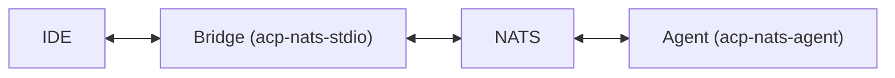

# acp-nats-agent

Server-side framework for building [ACP](https://agentclientprotocol.com/) agents over NATS.

## Architecture



## Usage

```rust
use acp_nats::AcpPrefix;
use acp_nats_agent::AgentSideNatsConnection;
use agent_client_protocol::*;

struct MyAgent;

#[async_trait::async_trait(?Send)]
impl Agent for MyAgent {
    async fn initialize(&self, args: InitializeRequest) -> Result<InitializeResponse> {
        Ok(InitializeResponse::new(ProtocolVersion::V0))
    }

    async fn new_session(&self, args: NewSessionRequest) -> Result<NewSessionResponse> {
        Ok(NewSessionResponse::new("session-123"))
    }

    async fn prompt(&self, args: PromptRequest) -> Result<PromptResponse> {
        Ok(PromptResponse::new(StopReason::EndTurn))
    }
}

#[tokio::main]
async fn main() {
    let nats = async_nats::connect("localhost:4222").await.unwrap();

    let (connection, io_task) = AgentSideNatsConnection::new(
        MyAgent,
        nats,
        AcpPrefix::new("acp").unwrap(),
        |fut| { tokio::task::spawn_local(fut); },
    );

    let local = tokio::task::LocalSet::new();
    local.run_until(io_task).await.unwrap();
}
```
