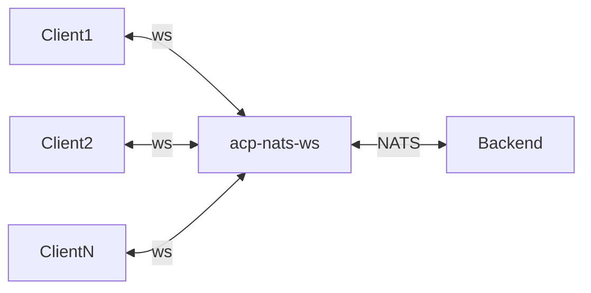

# ACP NATS WebSocket

Translates [Agent Client Protocol](https://agentclientprotocol.com) (ACP) messages between WebSocket connections and [NATS](https://nats.io), letting browser-based UIs and remote clients talk to distributed agent backends over a standard WebSocket endpoint.

For managed NATS infrastructure in production, we recommend <a href="https://synadia.com"> Synadia</a>.



## Features

- Multiple concurrent WebSocket connections, each with its own ACP session
- Bidirectional ACP bridge with request forwarding
- OpenTelemetry integration (logs, metrics, traces)
- Graceful shutdown (SIGINT/SIGTERM) with per-connection drain
- Custom prefix support for multi-tenancy

## Quick Start

```bash
docker run -p 4222:4222 nats:latest

cargo build --release -p acp-nats-ws

./target/release/acp-nats-ws
```

Connect with any WebSocket client:

```bash
websocat ws://127.0.0.1:8080/ws
```

## Configuration

### WebSocket Server

| Variable | CLI Flag | Description | Default |
|----------|----------|-------------|---------|
| `ACP_WS_HOST` | `--host` | Listen address | `127.0.0.1` |
| `ACP_WS_PORT` | `--port` | Listen port | `8080` |

### ACP

| Variable | Description | Default |
|----------|-------------|---------|
| `ACP_PREFIX` | Subject prefix for multi-tenancy | `acp` |
| `ACP_OPERATION_TIMEOUT_SECS` | Timeout for NATS request/reply operations | built-in default |
| `ACP_PROMPT_TIMEOUT_SECS` | Timeout for prompt round-trips | built-in default |
| `ACP_NATS_CONNECT_TIMEOUT_SECS` | NATS connection timeout | `10` |

CLI flag `--acp-prefix` overrides `ACP_PREFIX`.

### NATS

| Variable | Description | Default |
|----------|-------------|---------|
| `NATS_URL` | Server URL(s), comma-separated for failover | `localhost:4222` |

### NATS Authentication

Resolved in priority order — the first match wins:

| Priority | Variable(s) | Method |
|----------|-------------|--------|
| 1 | `NATS_CREDS` | Credentials file path |
| 2 | `NATS_NKEY` | NKey seed |
| 3 | `NATS_USER` + `NATS_PASSWORD` | Username/password |
| 4 | `NATS_TOKEN` | Token |

If none are set, the connection is unauthenticated.

### Observability

| Variable | Description |
|----------|-------------|
| `RUST_LOG` | Tracing filter directive (default: `info`) |
| `ACP_LOG_DIR` | Directory for file-based logging |

### OpenTelemetry

Traces, metrics, and logs are exported over HTTP. The following [OTLP environment variables](https://opentelemetry.io/docs/specs/otel/protocol/exporter/) are supported:

| Variable | Description |
|----------|-------------|
| `OTEL_EXPORTER_OTLP_ENDPOINT` | Collector base URL (e.g. `http://localhost:4318`) |
| `OTEL_EXPORTER_OTLP_HEADERS` | Custom headers, comma-separated `key=value` pairs (e.g. auth tokens) |
| `OTEL_EXPORTER_OTLP_TIMEOUT` | Export timeout in milliseconds (default: `10000`) |
| `OTEL_RESOURCE_ATTRIBUTES` | Additional resource attributes, comma-separated `key=value` pairs |

`OTEL_SERVICE_NAME` is hardcoded to `acp-nats-ws` and cannot be overridden.
