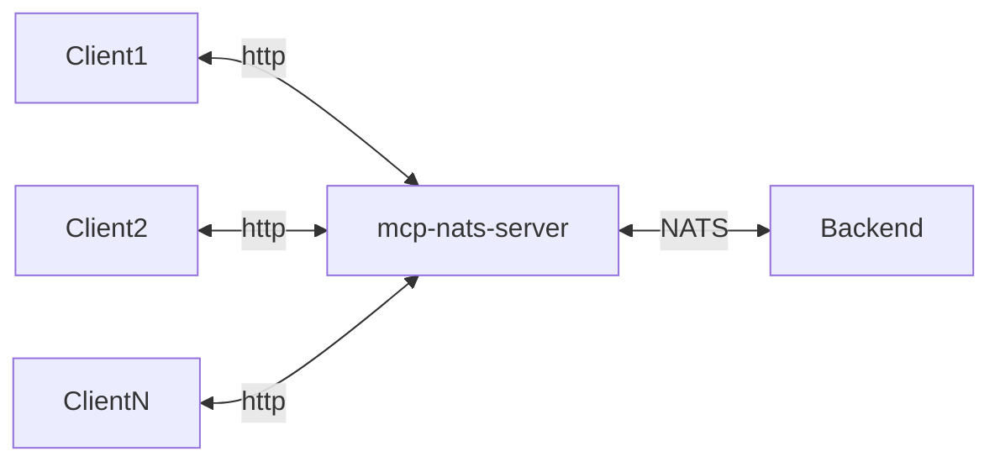

# MCP NATS Streamable HTTP

Translates [Model Context Protocol](https://modelcontextprotocol.io) (MCP)
messages between [NATS](https://nats.io) and Streamable HTTP served on `/mcp`.

For managed NATS infrastructure in production, we recommend <a href="https://synadia.com"> Synadia</a>.



## Features

- Streamable HTTP transport on `/mcp`
- Multiple concurrent MCP HTTP sessions sharing the same NATS bridge
- Graceful shutdown (SIGINT/SIGTERM)
- Custom prefix support for multi-tenancy
- Configurable generated HTTP peer ID prefix

## Quick Start

```bash
docker run -d --name nats -p 4222:4222 nats:latest

cargo build --release -p mcp-nats-server

./target/release/mcp-nats-server --server-id filesystem
```

Remove the local NATS container with `docker rm -f nats` when done.

Use Streamable HTTP:

```bash
curl -i \
  -H 'Content-Type: application/json' \
  -H 'Accept: application/json, text/event-stream' \
  -d '{"jsonrpc":"2.0","id":1,"method":"initialize","params":{"protocolVersion":"2025-06-18","capabilities":{},"clientInfo":{"name":"curl","version":"1.0.0"}}}' \
  http://127.0.0.1:8081/mcp
```

Follow-up requests for the same MCP session must include the `Mcp-Session-Id`
header returned by `initialize`.

## Configuration

### Server

| Variable | CLI Flag | Description | Default |
|----------|----------|-------------|---------|
| `MCP_HTTP_HOST` | `--host` | Listen address | `127.0.0.1` |
| `MCP_HTTP_PORT` | `--port` | Listen port | `8081` |
| `MCP_HTTP_PATH` | `--path` | Streamable HTTP route | `/mcp` |
| | `--allowed-host` | Allowed host for Streamable HTTP validation | RMCP default |

### MCP

| Variable | Description | Default |
|----------|-------------|---------|
| `MCP_PREFIX` | Subject prefix for multi-tenancy | `mcp` |
| `MCP_CLIENT_ID_PREFIX` | Prefix for generated HTTP session peer IDs | `http` |
| `MCP_SERVER_ID` | Remote server peer ID for NATS server-bound messages | `default` |
| `MCP_OPERATION_TIMEOUT_SECS` | Timeout for NATS request/reply operations | `30` |
| `MCP_NATS_CONNECT_TIMEOUT_SECS` | NATS connection timeout | `10` |

CLI flags `--mcp-prefix`, `--client-id-prefix`, and `--server-id` override the
matching environment variables.

### NATS

| Variable | Description | Default |
|----------|-------------|---------|
| `NATS_URL` | Server URL(s), comma-separated for failover | `localhost:4222` |

### NATS Authentication

Resolved in priority order — the first match wins:

| Priority | Variable(s) | Method |
|----------|-------------|--------|
| 1 | `NATS_CREDS` | Credentials file path |
| 2 | `NATS_NKEY` | NKey seed |
| 3 | `NATS_USER` + `NATS_PASSWORD` | Username/password |
| 4 | `NATS_TOKEN` | Token |

If none are set, the connection is unauthenticated.

### Observability

| Variable | Description |
|----------|-------------|
| `RUST_LOG` | Tracing filter directive (default: `info`) |
