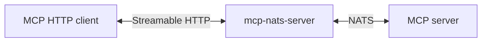

# mcp-nats-server

Bridges Model Context Protocol Streamable HTTP to NATS. The binary acts as an
MCP server over HTTP for local and remote MCP clients, and as an MCP client over
NATS for a remote MCP server.



## Quick Start

```bash
docker run -p 4222:4222 nats:latest

cargo build --release -p mcp-nats-server

./target/release/mcp-nats-server --server-id filesystem
```

Connect with any MCP Streamable HTTP client at:

```text
http://127.0.0.1:8081/mcp
```

## Configuration

| Variable | CLI Flag | Description | Default |
| --- | --- | --- | --- |
| `MCP_PREFIX` | `--mcp-prefix` | NATS subject prefix | `mcp` |
| `MCP_CLIENT_ID_PREFIX` | `--client-id-prefix` | Prefix for generated HTTP session peer IDs | `http` |
| `MCP_SERVER_ID` | `--server-id` | Remote server peer ID for NATS server-bound messages | `default` |
| `MCP_HTTP_HOST` | `--host` | Listen address | `127.0.0.1` |
| `MCP_HTTP_PORT` | `--port` | Listen port | `8081` |
| `MCP_HTTP_PATH` | `--path` | Streamable HTTP route | `/mcp` |
| `MCP_OPERATION_TIMEOUT_SECS` | | Timeout for NATS request/reply operations | `30` |
| `MCP_NATS_CONNECT_TIMEOUT_SECS` | | NATS connection timeout | `10` |
| `NATS_URL` | | NATS server URL(s), comma-separated for failover | `localhost:4222` |
| `RUST_LOG` | | Tracing filter directive | `info` |

Use repeated `--allowed-host` flags to override the RMCP Streamable HTTP
allowed-host validation list.

NATS authentication is loaded through [`trogon-nats`](../trogon-nats/README.md)
using the same environment variables as the rest of the workspace.

## Testing

```sh
mise exec -- cargo test -p mcp-nats-server
mise exec -- cargo clippy -p mcp-nats-server --all-targets
```
